Project: Reaction and Diffusion in an Antibody Detection Device
===============================================================

* View this page as a fully interactive Jupyter notebook: <https://drive.google.com/file/d/1M2FilTkyrUw-_ELs3YARXhi5q5Z-cz5x/view?usp=drive_link>_

* There are **7 tasks** in this project that you need to complete. These tasks are integrated throughout this page. Please read carefully because some tasks have coding and reflection components.

Introduction to antibody detection to establish viral exposure
--------------------------------------------------------------

As many of you have heard, the current health crisis around SARS-CoV-2
and the resulting illness COVID-19 has suffered some setbacks due to
limitations in testing. There are currently two broad testing approaches
available: molecular and serological tests (`Tang et al
2020 <https://jcm.asm.org/content/early/2020/04/03/JCM.00512-20.long>`__).

Molecular tests look for viral genetic material and mainly identifies
current infection. Serological tests look for antibodies generated
against the virus, and are therefore better suited to identify past
exposure to the virus.

Serological tests work as outlined in the diagram below. The device is
coated in a detection area with a capture protein (orange pentagon).
This capture protein resembles some viral protein which the patient’s
antibodies would recognize if they had been exposed to SARS-CoV-2. The
patient’s sample is then flowed over this detection area allowing any
antibodies (red) to bind to the capture protein. The next step flows a
reporter antibody (blue) across this area, and this reporter antibody
can be detected using some colorimetric readout (like in a pregnancy
test) or other fluorescent detection method.

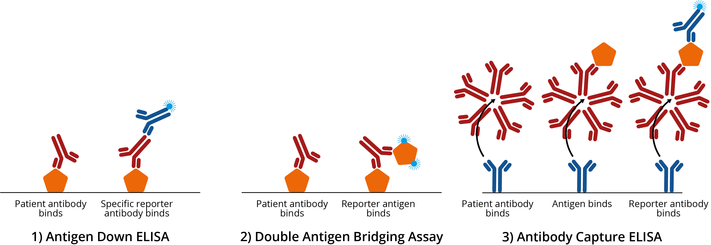
   
Source for Elisa: `Image
source <https://thenativeantigencompany.com/why-we-need-antigen-and-antibody-tests-for-covid-19/>`__

| 

The device consists of a sample well, where the patient sample is
loaded, then the sample flows across the detection area (e.g. T1) which
is located in a specific area of the device.

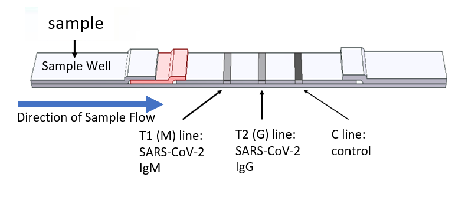

Source for device schematic: `Image
source <https://www.nirmidas.com/rapid-test-for-covid-19-sars-cov-2-igmigg-antibody-detection-kit>`__

Your antibody detector assignment
---------------------------------

You have been commissioned by a biotech company to define the operating
procedures for their serological test. Specifically, you need to develop
a computational model of their detector and use this model to determine:

1. What is the limit of detection of their device? I.e. what is the
   lowest concentration of patient antibody that this device can detect.
2. How long after loading a sample should you wait before reading the
   result?

The tasks in this project walk you through the steps toward answering
these questions.

System specifications
---------------------

-  You can represent the spatial dimension of the device on a 1
   dimensional line representing the length of the device.
-  Device length: 10 cm (from start of sample well to end of device)
-  The sample well is 2 cm long and is located on the left edge of the
   device.
-  The detection area is 2 cm wide and is located at 6-8 cm along the
   length of the device
-  The company has indicated that they have an excellent reporter
   antibody and detection system that can detect all patient antibodies
   in the detection area with great accuracy. Therefore, your
   simulations need only include the patient antibody step of the
   analysis.
-  Note for future reference: The devices actually use capillary flow to
   move the sample along the device, so there’s a more advective term
   too. But for the sake of this assignment our focus will be on the
   diffusion component.

Diagram of the serological test you will be simulating:

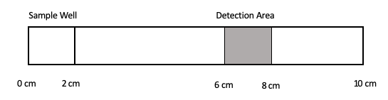

Simulating diffusion of patient antibodies through the device
-------------------------------------------------------------

The first step in building your model is to construct a simulation of
patient antibodies diffusing through the device (in the absence of any
detection area).

Task 1
------

Let :math:`C_A(x,t)` represent the concentration of patient antibody at
position x in the device at time t. Assuming that the initial
concentration of anti-viral antibody in your patient sample is
:math:`C_{A0}`. Write the initial conditions for your system.

Initial conditions:

$C_A(x, t=0) = $

Task 2
------

In the code block below fill in the blanks to simulate diffusion through
the device over time, and plot the concentration of antibody along the
length of the device for various time points, assuming that
:math:`C_{A0}=1 mg/ml`. Choose time points that illustrate initial
conditions, at least two intermediate time points, and one time point at
(or close to) steady state.

.. code:: 

    nx = 100          # number of nodes in space
    nt = 10000        # number of nodes in time
    Lx = ??           # spatial length of model (cm) ??? Enter the length
    Lt = ??           # duration of model (min) ??? Enter the time to simulate, you will need to change this value to be able to obtain different behaviors
    dx = Lx/nx        # step size in space
    dt = Lt/nt        # step size in time
    x = np.linspace(0,Lx,nx) # vector for the space the model is solved over
    t = np.linspace(0,Lt,nt) # vector for the time the model is solver over
    
    D_sub = 2      # diffusivity of the substrate (constant) (cm^2/min)
    
    Cu = np.zeros((nx,nt)) # initialize concentration of u - here u represents CA: the concentration of patient antibody (mg/ml)
    Cu[??,0] = ?? # inital conditions for u. ??? Enter the initial conditions based on what you defined above. 
    
    # Here we use a for-loop for time, however we do not have the loop for space, and instead use vector indexing.
    # Reminder: in Python vector[0] refers to the first point, while vector[-1] refrences the very last point
    for n in range(0,nt-1):
        # Update for boundary points
        Cu[0,n+1] = ??                # ??? Write the FDM1 expressions for these boundaries assuming no flux boundary conditions
        Cu[-1,n+1] = ??               # ??? Write the FDM1 expressions for these boundaries assuming no flux boundary conditions
    
        # Update for interior points
        Cu[1:-1,n+1] = Cu[1:-1,n] + dt*(D_sub*(Cu[2:,n]-2*Cu[1:-1,n]+Cu[:-2,n])/dx**2)
        
    # Here plot all of space for a few time points that you need to specify
    # Use the commented lines to add any plots that you want to show
    fig = plt.figure(1, figsize = (6,4))
    
    # Use these lines
    # plt.plot(x,Cu[:,?timeIndex?],'red',label='?? min')
    # plt.plot(x,Cu[:,?timeIndex?],'darkorange',label='?? min')
    # plt.plot(x,Cu[:,?timeIndex?],'yellow',label='?? min')
    # plt.plot(x,Cu[:,?timeIndex?],'green',label='?? min')
    
    
    plt.legend(loc='best')
    plt.xlabel('Distance (cm)')
    plt.ylabel('Concentration of Antibody')
    plt.show;
    

::

      File "<ipython-input-2-9a53c97a57af>", line 3
        Lx = ??           # spatial length of model (cm) ??? Enter the length
             ^
    SyntaxError: invalid syntax
    

Example solution:

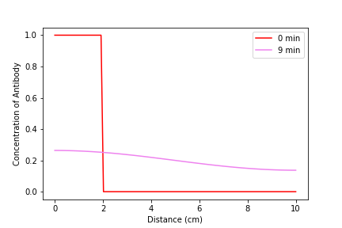

Task 3
------

Another way to visualize two-dimensional data is to use a contour plot.
In the code block below, use a contour plot to visualize the data above
in time and space.

.. code:: 

    
    # contourf plots are great too
    # for more information visit:
    # https://jakevdp.github.io/PythonDataScienceHandbook/04.04-density-and-contour-plots.html
    fig = plt.figure(2, figsize = (6,4))
    plt.contourf(??,??,??,cmap='jet')           #??? Enter appropriate time, space and concentration inputs to the contourf function to generate the contour plot
    plt.xlabel('Time (min)')
    plt.ylabel('Distance (cm)')
    plt.title('Concentration of A')
    plt.show();
    

::

      File "<ipython-input-3-bad1a96caf60>", line 2
        plt.contourf(??,??,??,cmap='jet')           #??? Enter appropriate time, space and concentration inputs to the contourf function to generate the contour plot
                     ^
    SyntaxError: invalid syntax
    

Example solution:

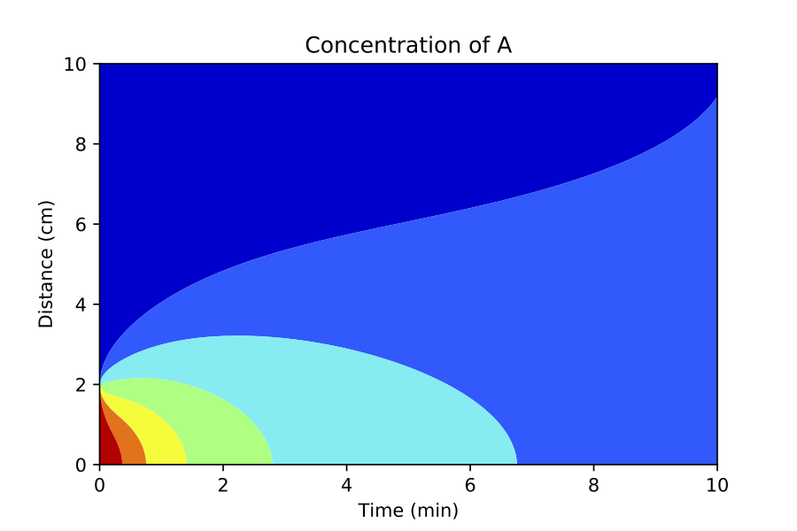

Simulating diffusion and binding of patient antibodies in the device
--------------------------------------------------------------------

Now that you have satisfied yourself that your code accurately reflects
diffusion of antibody down the length of the device, you need to add the
binding reaction to your simulation.

In this system the antibody (A) binds to the capture protein (B) forming
complex C that can be detected. The reaction is reversible and the
forward and reverse rate constants are :math:`k_{on}` and
:math:`k_{off}` respectively. Additionally, the company has observed
that the patient antibodies degrade in the device at a rate of
:math:`k_{deg}`.

For this system, the forward Euler expressions can be written as:

$ C_A^{n+1} = C_A^{n} + dt*[koff\ *C_C^n - kon*\ C_A\ :sup:`n\ C_B^n -
k\_{deg}\ C_A`\ n]$

$ C_B^{n+1} = C_B^{n} + dt*[koff\ *C_C^n - kon*\ C_A^n*C_B^n]$

$ C_C^{n+1} = C_C^{n} + dt*[kon*C_A\ :sup:`n\ C_B^n - koff\ C_C`\ n]$

Task 4
------

For this task write the initial conditions for :math:`C_B` and
:math:`C_C` assuming that the initial concentration of capture protein
is :math:`C_{B0}`.

Initial conditions:

:math:`C_B(x, t=0) = ??`

:math:`C_C(x, t=0) = ??`

Task 5
------

In the code block below (and using your code above), fill in the blanks
to add reaction to your diffusion code from above. Remember that only
the antibody (A) is diffusing.

To show your results make the following plots:

-  Plot :math:`C_A`, :math:`C_B` and :math:`C_C` for all of space for a
   few time points that you need to specify to show qualitatively
   different concentration profiles.
-  Plot :math:`C_A`, :math:`C_B` and :math:`C_C` as a contour plot to
   show evolution in space and time
-  Choose one time point and plot :math:`C_A`, :math:`C_B` and
   :math:`C_C` for all space at this time point on one graph. Choose a
   time point that shows the balance and transition between the three
   components.

The initial concentration of capture protein in the detection area is
0.02 mg/ml.

.. code:: 

    nx = 100                  # number of nodes in space
    nt = 10000                # number of nodes in time
    Lx = ??                   # spatial length of model   From Task 2
    Lt = ??                   # duration of model (min)   You will need to find qualitatively different time points
    dx = Lx/nx                # step size in space
    dt = Lt/nt                # step size in time
    x = np.linspace(0,Lx,nx)  # vector for the space the model is solved over
    t = np.linspace(0,Lt,nt)  # vector for the time the model is solver over
    
    D_sub = 2                 # diffusivity of the substrate (constant)
    kon = 100                 # binding rate (per (mg/ml) per min)
    koff = 0.001              # dissociation rate (per min)
    kdeg = 0.1                # degradation rate for patient antibodies (per min)
    
    Ca = np.zeros((nx,nt))    #initialize concentration A
    Cb = np.zeros((nx,nt))    #initialize concentration B
    Cc = np.zeros((nx,nt))    #initialize concentration C
    
    Ca[??,0] = 0.1            # inital conditions for a.  (mg/ml)    From Task 2
    Cb[??,0] = ??             # initial condition for b.  (mg/ml)            ??? Add initial conditions for B (mg/ml)
    Cc[??,0] = ??             # initial condition for c.  (mg/ml)            ??? Add initial conditions for C (mg/ml)
    
    # Here we use a for-loop for time, however we do not have the loop for space, and instead use vector indexing.
    # Reminder: in Python vector[0] refers to the first point, while vector[-1] refrences the very last point
    for n in range(0,nt-1):
    
        #??? In the next three lines write the combined FDM1 and EE1 expressions to solve for the concentration of A
        # Hint: in Task 2 you already did the diffusion part so now bring that over and just add the reations expressions
    
        Ca[0,n+1] = ?? Diffusion from Task 2 ?? + ?? Reaction ??
        Ca[-1,n+1] = ?? Diffusion from Task 2 ?? + ?? Reaction ??
            
        Ca[1:-1,n+1] = Ca[1:-1,n] + dt*(D_sub*(Ca[2:,n]-2*Ca[1:-1,n]+Ca[:-2,n])/dx**2) + ?? Reaction ??
    
    
        #??? In the next two lines add the appropriate expressions for B and C
        Cb[:,n+1] = ??
        Cc[:,n+1] = ??
        
        
    # Here plot all of space for time points that you need to specify
    # Use the commented lines below
    fig = plt.figure(1, figsize = (12,4))
    
    # Concentrations of A
    plt.subplot(131)
    
    # Use these lines
    # plt.plot(x,??[:,?timeIndex?],'red',label='?? min')
    # plt.plot(x,??[:,?timeIndex?],'darkorange',label='?? min')
    # plt.plot(x,??[:,?timeIndex?],'yellow',label='?? min')
    # plt.plot(x,??[:,?timeIndex?],'green',label='?? min')
    
    plt.title('Patient antibody (A)')
    plt.xlabel('Distance (cm)')
    plt.ylabel('Concentration of A')
    plt.legend(loc='best')
    
    # Concentrations of B
    plt.subplot(132)
    
    # Use these lines
    # plt.plot(x,??[:,?timeIndex?],'red',label='?? min')
    # plt.plot(x,??[:,?timeIndex?],'darkorange',label='?? min')
    # plt.plot(x,??[:,?timeIndex?],'yellow',label='?? min')
    # plt.plot(x,??[:,?timeIndex?],'green',label='?? min')
    
    plt.title('Unbound Receptor (B)')
    plt.legend(loc='best')
    plt.xlabel('Distance (cm)')
    plt.ylabel('Concentration of B')
    plt.show
    
    # Concentrations of C
    plt.subplot(133)
    
    # Use these lines
    # plt.plot(x,??[:,?timeIndex?],'red',label='?? min')
    # plt.plot(x,??[:,?timeIndex?],'darkorange',label='?? min')
    # plt.plot(x,??[:,?timeIndex?],'yellow',label='?? min')
    # plt.plot(x,??[:,?timeIndex?],'green',label='?? min')
    
    plt.title('Detectable complex (C)')
    plt.legend(loc='best')
    plt.xlabel('Distance (cm)')
    plt.ylabel('Concentration of C')
    
    
    # Here do contour plots for each component over space and time
    fig = plt.figure(2, figsize = (12,4))
    plt.subplot(131)
    plt.contourf(t,x,??,cmap='jet')       # Specify the vector to plot
    plt.xlabel('Time (min)')
    plt.ylabel('Distance (cm)')
    plt.title('Patient antibody (A)')
    
    plt.subplot(132)
    plt.contourf(t,x,??,cmap='jet')      # Specify the vector to plot
    plt.xlabel('Time (min)')
    plt.ylabel('Distance (cm)')
    plt.title('Unbound receptor (B)')
    
    plt.subplot(133)
    plt.contourf(t,x,??,cmap='jet')      # Specify the vector to plot
    plt.xlabel('Time (min)')
    plt.ylabel('Distance (cm)')
    plt.title('Detectable complex (C)')
    
    # Finally plot the concentrations of A, B and C for a single time point (that you need to define)
    fig = plt.figure(3, figsize = (12,4))
    plt.subplot(131)
    
    plotpt = ??;
    # plt.plot(x,??[:,int(plotpt/Lt*nt)],'black',label='A')
    # plt.plot(x,??[:,int(plotpt/Lt*nt)],'red',label='B')
    # plt.plot(x,??[:,int(plotpt/Lt*nt)],'green',label='C')
    
    plt.xlabel('Distance (cm)')
    plt.ylabel('Concentration')
    plt.legend(loc='best')
    
    plt.title('');
    

Example solution:

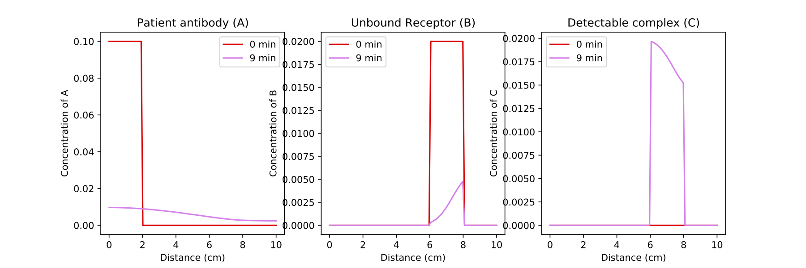

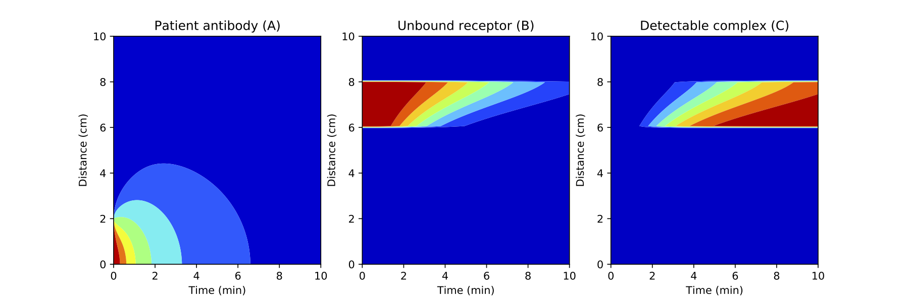

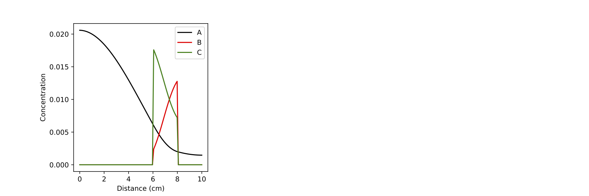

Task 6
------

Now that you have a representative simulation (and we will assume that
you validated this simulation against their experimental data with
control samples). The next step is to identify the limit of detection
for this test.

The company has communicated to you that 1. their sensors can detect a
positive signal if the concentration of the bound complex C exceeds 0.01
mg/ml in at least half of the detection area, and 2. their desired wait
time to detect a result is 10 minutes.

You need to determine what concentration of patient antibody
(:math:`C_A`) is required in the serum sample to achieve this level of
bound complex in the detection area within 10 minutes. I.e. determine
the limit of detection for this device.

In the code block below duplicate your code from above, but include a
for loop to iterate over increasing initial concentrations of A (patient
antibody). You will need to code the evaluation criteria to see if your
simulation predicts detectable signal within 10 minutes.

You need to generate two plots: 1. Concentration of each component over
space, and plot one line for each value of :math:`C_{A0}`. 2. Fraction
of detection area above the detection threshold as a function of
:math:`C_{A0}`.

.. code:: 

    nx = 100                      # number of nodes in space
    nt = 10000                    # number of nodes in time
    Lx = ??                       # spatial length of model
    Lt = 10                       # duration of model (min)
    dx = Lx/nx                    # step size in space
    dt = Lt/nt                    # step size in time
    x = np.linspace(0,Lx,nx)      # vector for the space the model is solved over
    t = np.linspace(0,Lt,nt)      # vector for the time the model is solver over
    
    D_sub = 2                     # diffusivity of the substrate (constant)
    kon = 100                     # binding rate (per (mg/ml) per min)
    koff = 0.001                  # dissociation rate (per min)
    kdeg = 0.1                    # degradation rate for patient antibodies
    
    detectThreshold = ??          # ??? Add the detection threshold
    detectInd = np.arange(int(0.6*nx),int(0.8*nx))            # Spacial indices in Cc that correspond to the detection area
    nrInd = np.size(detectInd)                                # Number of indices that fall in the detection area
    
    nic = ??                       # ??? number of initial conditions for Ca to evaluate. Hint: start small, you need to solve expensive PDEs for each value of Ca0, 
                                                                                        # but make sure you scale up to enough points to make an accurate statement
    icmin = ??                     # ??? min of range of initial conditions for Ca to evaluate
    icmax = ??                     # ??? max of range of initial conditions for Ca to evaluate
    
    Ca0 = np.linspace(icmin,icmax,nic)    # vector for the initial conditions
    CcAboveThreshold = np.zeros((???,1))  # vector for storing the fraction of detection area above Cc threshold for each Ca0
    
    # Initialize figures
    fig1 = plt.figure(1,  figsize = (18,4))
    ax1 = plt.subplot(131)
    plt.title('Patient antibody (A)')
    plt.xlabel('Distance (cm)')
    plt.ylabel('Concentration of A')
    
    ax2 = plt.subplot(132)
    plt.title('Unbound Receptor (B)')
    plt.xlabel('Distance (cm)')
    plt.ylabel('Concentration of B')
    
    ax3 = plt.subplot(133)
    plt.title('Detectable complex (C)')
    plt.xlabel('Distance (cm)')
    plt.ylabel('Concentration of C')
    
    fig2 = plt.figure(2, figsize = (6,4))
    
    # Here start the loop over the initial conditions
    for k in range(0,???):
    
        initCa = Ca0[k]     # Set the initial condition for this value of k
            
        Ca = np.zeros((nx,nt)) #initialize concentration A
        Cb = np.zeros((nx,nt)) #initialize concentration B
        Cc = np.zeros((nx,nt)) #initialize concentration C
    
        Ca[??,0] = ??             # inital conditions for a.  (mg/ml)            ??? Add initial conditions for A (mg/ml)
        Cb[??,0] = ??             # initial condition for b.  (mg/ml)            ??? Add initial conditions for B (mg/ml)
        Cc[??,0] = ??             # initial condition for c.  (mg/ml)            ??? Add initial conditions for C (mg/ml)
    
        # Loop through time to solve the PDEs for this initial condition
        # Here we use a for-loop for time, however we do not have the loop for space, and instead use vector indexing.
        # Reminder: in Python vector[0] refers to the first point, while vector[-1] refrences the very last point
        for n in range(0,nt-1):
    
            # ??? In this section copy your code from the last coding task including reaction, and diffusion (where appropriate)
            # It should include updates for A, B and C
    
            
        # Calculate the fraction of the detection area that has Cc above the detection threshold
        isAboveThreshold = (Cc[???,-1] > detectThreshold)   # Check which values of Cc are above the threshold. ??? Specify which indices to use to evaluate Cc
        nrAboveThreshold = np.sum(isAboveThreshold)               # Count the number of true values that are above the threshold
        fracAboveThreshold = nrAboveThreshold / nrInd             # Calculate the fraction above the threshold
        CcAboveThreshold[k] = fracAboveThreshold
        print(initCa,CcAboveThreshold[k])
    
        # Plot the concentration profiles of A, B and C at the final time point for this initial condition 
     
        ax1.plot(x,Ca[:,??],label=initCa)
        ax1.legend(loc='best')   
    
        ax2.plot(x,Cb[:,??],label=initCa)
        ax2.legend(loc='best')   
    
        ax3.plot(x,Cc[:,??],label=initCa)
        ax3.legend(loc='best')   
    
    
    # Plot fraction of detection area above Cc threshold as a function of Ca0
    plt.figure(2)
    plt.plot(???,???);        # ??? Provide the appropriate inputs
    plt.xlabel('Ca0')
    plt.ylabel('Fraction of detection area above threshold')
    
    
    

Example solution:

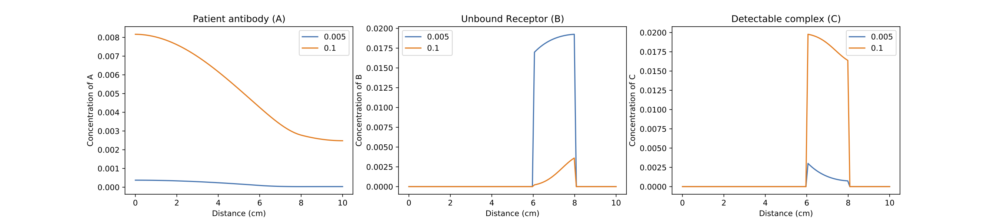

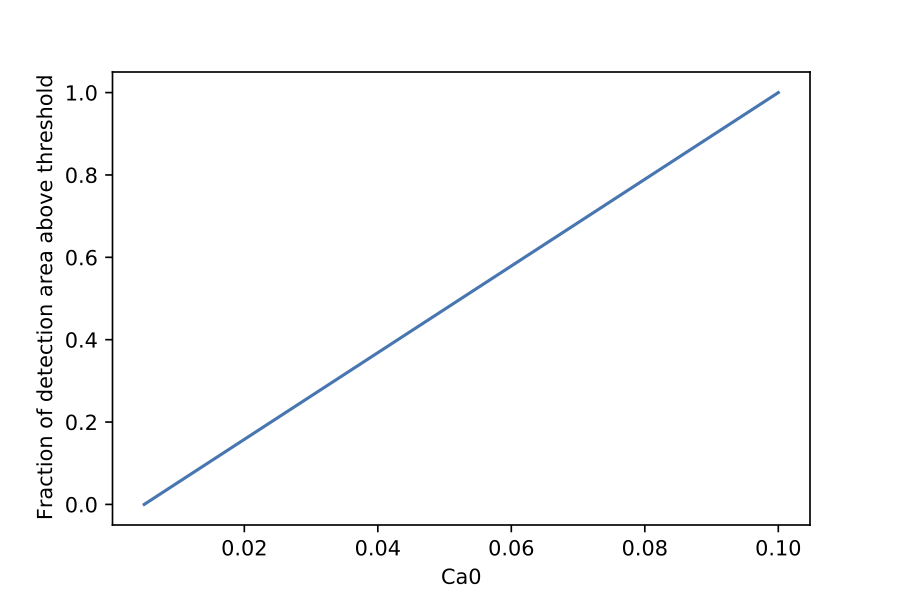

The limit of detection for an incubation period of 10 minutes (based on
the last figure and the print statements) is:

Task 7
------

As you may have noticed in the previous task, the level of detectable
complex C after 10 minutes does not appear to be saturated, especially
for lower levels of initial patient antibody (Ca0). This makes you
wonder **if the limit of detection could be improved if the company can
be convinced to extend their wait times for a result, so that more
patient antibody has a chance to bind in the detection area.**

To answer this question, you need to evaluate the fraction of detection
area above the threshold as a function of time, for a range of intitial
conditions.

Using the code you developed in Task 6, generate an additional plot to
evaluate this outcome.

Hint: - you will have to change the **shape** and **location** of your
CcAboveThreshold array.

.. code:: 

    nx = 100 # number of nodes in space
    nt = 30000 # number of nodes in time
    Lx = ?? # spatial length of model
    Lt = ?? # duration of model (min)
    dx = Lx/nx # step size in space
    dt = Lt/nt # step size in time
    x = np.linspace(0,Lx,nx) # vector for the space the model is solved over
    t = np.linspace(0,Lt,nt) # vector for the time the model is solver over
    
    D_sub = 2 # diffusivity of the substrate (constant)
    kon = 100 #binding rate (per (mg/ml) per min)
    koff = 0.001 #dissociation rate (per min)
    kdeg = 0.1   # degradation rate for patient antibodies
    
    detectThreshold = ??    # From Task 6
    detectInd = np.arange(int(0.6*nx),int(0.8*nx))            # Spacial indices in Cc that correspond to the detection area
    nrInd = np.size(detectInd)                                # Number of indices that fall in the detection area
    
    nic = ??        # number of initial conditions for Ca to evaluate.   
    icmin = ??      # min of range of initial conditions for Ca to evaluate
    icmax = ??      # max of range of initial conditions for Ca to evaluate
    
    Ca0 = np.linspace(icmin,icmax,nic)  # vector for the initial conditions
    CcAboveThreshold = np.zeros((???,???))  # vector for storing the fraction of detection area above Cc threshold for each Ca0. 
           #??? specify the dimension of this vector to be able to store values for various initial conditions and time points
    
    # Set up figures
    fig1 = plt.figure(1,  figsize = (18,4))
    ax1 = plt.subplot(131)
    plt.title('Patient antibody (A)')
    plt.xlabel('Distance (cm)')
    plt.ylabel('Concentration of A')
    
    ax2 = plt.subplot(132)
    plt.title('Unbound Receptor (B)')
    plt.xlabel('Distance (cm)')
    plt.ylabel('Concentration of B')
    
    ax3 = plt.subplot(133)
    plt.title('Detectable complex (C)')
    plt.xlabel('Distance (cm)')
    plt.ylabel('Concentration of C')
    
    fig2 = plt.figure(2, figsize = (6,4))
    
    for k in range(0,nic):
    
        initCa = Ca0[k]     # Set the initial condition for this value of k
            
        Ca = np.zeros((nx,nt)) #initialize concentration A
        Cb = np.zeros((nx,nt)) #initialize concentration B
        Cc = np.zeros((nx,nt)) #initialize concentration C
    
        Ca[??,0] = ??             # inital conditions for a.  (mg/ml)            ??? Add initial conditions for A (mg/ml) from Task 6
        Cb[??,0] = ??             # initial condition for b.  (mg/ml)            ??? Add initial conditions for B (mg/ml) from Task 6
        Cc[??,0] = ??             # initial condition for c.  (mg/ml)            ??? Add initial conditions for C (mg/ml) from Task 6
    
        # Loop through time to solve the PDEs for this initial condition
        # Here we use a for-loop for time, however we do not have the loop for space, and instead use vector indexing.
        # Reminder: in Python vector[0] refers to the first point, while vector[-1] refrences the very last point
        for n in range(0,nt-1):
    
            # ??? In this section copy your code from the last section including reaction, and diffusion (where appropriate)
            # It should include updates for A, B and C - copy from Task 6
            
    # ??? Here enter the calculation of the fraction of the detection area that has Cc above the detection threshold
    # Hint: Start from the code in Task 6 and update CcAboveThreshold accordingly
    
    
        print(initCa,???)                     # ??? Print CcAboveThreshold at the final time point, with appropriate indexing for this initial condition
        # Plot the concentration profiles of A, B and C at the final time point for this initial condition
        # From Task 6
        ax1.plot(x,Ca[:,??],label=initCa)
        ax1.legend(loc='best')   
    
        ax2.plot(x,Cb[:,??],label=initCa)
        ax2.legend(loc='best')   
    
        ax3.plot(x,Cc[:,??],label=initCa)
        ax3.legend(loc='best')  
    
    # Plot fraction of detection area above Cc threshold as a function of Ca0
    plt.figure(2)
    plt.plot(Ca0,???);                      # ??? Enter appropriate components of CcAboveThreshold 
    plt.xlabel('Ca0')
    plt.ylabel('Fraction of detection area above threshold')
    
    # Plot fraction of detection area above Cc threshold as a function of time for each initial condition
    fig3 = plt.figure(3)
    plt.plot(t,np.transpose(???))      # ??? Enter appropriate components of CcAboveThreshold 
    plt.xlabel('Time (min)')
    plt.ylabel('Fraction of detection area above threshold')
    plt.legend(Ca0);
    

Example solution:

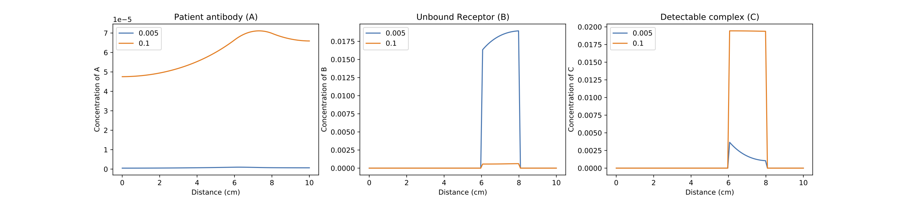

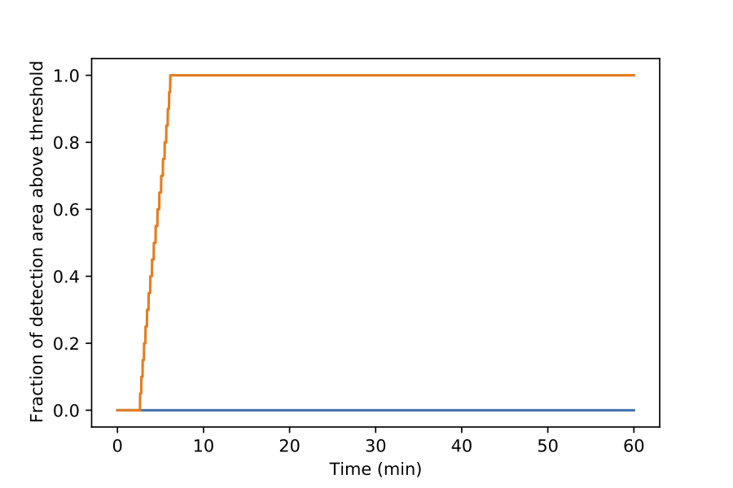

Can the sensitivity of the test be significantly improved by allowing
extra time for the antibody to bind?

