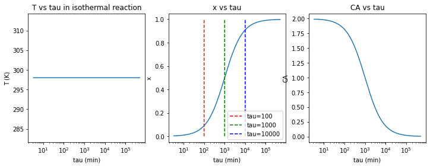

Chemical Reactor Stability and Sensitivity
==========================================

Deliverables For this project:

-  There are **SEVEN** tasks that you need to complete. These tasks are    integrated throughout this collaboratory. Please read carefully    because some tasks have coding and reflection components.
-  There are two types of tasks: 1) equation derivation tasks, and 2) coding tasks.
-  For equation derivation tasks: if you are not able to type your equations into the collaboratory notebook you can write, scan and upload your solutions in separate documents. However, you must    indicate in the collaboratory that you have uploaded separate documents.
- Please upload your complete and executable google collaboratory (.ipynb file) to Blackboard
-  **Include your name at the top of the notebook**

Introduction
------------

This project will introduce ideas related to the kinetics of a steady state, constantly stirred tank reactor. The approach to solving the equations is the same as we apply to other problems, namely- Mass Balance and Energy Balance and Entropy balance as needed. This one is predominately driven by Mass and Energy, however there are derivations of what is called the Arrhenius equation that rely on activation energy and some derivations this is related to the Gibb’s Free energy. Gibb’s free energy, if you’ll remember, is the useful energy for systems at Contant T and P. 

You will be asked to answer questions, derive formulas, and implement code to demonstrate your understanding of the concepts. Please show all your work below each of the problems listed, and clearly comment your code so we can understand what is happening. Good luck!

For this module and the discussion of stability and sensitivity we will be focused on a continuously stirred tank reactor (CSTR), with a simple reaction of reactant A forming product B.

:math:`A-->B`

This reaction occurs at a rate :math:`k` and as you will see shortly, :math:`k` depends on the temperature in the tank, meaning :math:`k\approx k(T)`.

Reactant A is added at the flow rate of the feed into the reactor :math:`\large (\dot{q_f})`. The concentration of A in the feed flow is :math:`\large C_{Af}`. The volume of the reactor is :math:`\large V_r`.

The products of the bioreactor are removed through a flow rate :math:`\large \dot{q}` out of the reactor. The concentration of the reactant A in the tank is :math:`\large C_A`, and the concentration of the product B in the tank is :math:`\large C_B`.

.. figure::
   https://drive.google.com/uc?id=1VIPOxHYgiC7OmMp39k-pb9ycb-e0r03z

With chemical reactions it often becomes important to monitor the steady state conversion of the reaction as well as the reactor temperature. The conversion and temperature depend on the heat   exchange in the reactor, the reactions itself- endothermic or exothermic and the reactor control variables. For instance, if you are working in a plant, you will have control over feed flow rates, perhaps feed concentrations, properties of the heat exchanger, etc. that control the reactor properties.

This assignment therefore brings together the chemical reaction approaches we covered in the mass balance classes, with the energy balance approaches we have so far only applied to single component systems.

To approach this problem we will first examine and reduce the mass balance equations and energy balance equations using a series of assumptions about the reactor. We will then utilize computational resources to solve these reduced equations as a function of time as conditions change, as well as at steady state. This approach is broken up into seven tasks throughout this project.

Task 1
------

Using the information given above, write down and reduce the mass balance equation for A in the reactor, SHOW THAT: :math:`0 = C_{Af} - (1+kτ)C_A` at steady-state.

Hints
~~~~~

Denote the mass of reactant A in the tank as :math:`M_A` - Express the change of mass for reactant A :math:`\left(\frac{dM_A}{dt}\right)` in terms of flow rates and concentrations. - Residence time (:math:`\tau`), is equivalent to the Volume of the reactor :math:`(V_r)` divided by the feed flow rate :math:`(\dot{q_f})` (verify for yourself that the units reflect this relationship). :math:`\tau = \frac{V_r}{\dot{q_f}}`

Solution for Task 1
~~~~~~~~~~~~~~~~~~~

Here write down the steps in your derivation and reduction of the mass balance equation. Start with:

:math:`\frac{d(M_A)}{dt} =`

Tau and Mass Balance
~~~~~~~~~~~~~~~~~~~~

:math:`\tau` is an important control variable. This mass balance   equation brings up an important method for controlling the end product   of a reaction. The overall amount of reactants being converted into   products depends on the combination of two things: 1) the kinetic rate   of the reaction :math:`k(T)` and, 2) the length of time the reaction   takes place. One way to achieve this is through manipulation of the   feed flowrate- this directly impacts the new variable that you haven’t   seen before: :math:`\tau`. :math:`\tau` is the residence time- how   long the molecules are lingering in the reactor. Typically, the longer   they stick around in the reactor, the more time the have to react- the more reactants will be turned into products. :math:`\tau` is easily controllable by changing the flow-rate of the reactants into the reactor. For plotting and understanding what is happing in the reactor, it is often done with :math:`\tau` on the x-axis. To understand the reactor behavior- it becomes very useful to see how much conversion takes place (the y-axis) as :math:`\tau` changes from a low value to a high value. For reactions that are coupled with heat exchange, etc, it becomes convenient to see how all these other variables change with respect to :math:`\tau` as well.

Arrhenius Equation
~~~~~~~~~~~~~~~~~~

Due to the fluctuations in reactor temperature, the Arrhenius equation
can be used to take into account the temperature dependency of the
chemical reaction rate, :math:`k`.

:math:`k(T) = k_me^{-\frac{E}{R}\left(\frac{1}{T}-\frac{1}{T_m}\right)}`

Where :math:`k_m` is the reaction rate constant, E is the activation
energy of the reaction, T is the termperature of the reactor, and
:math:`T_m` is the mean temperature of the reactor.

We hope that you notice that this reaction rate dependence on temperature provides the link that we need between the chemical reaction process and the energy balance within the system. This is the link that brings together the chemical reaction approaches we covered in the mass balance classes, with the energy balance approaches we have so far only applied to single component systems.

.. raw:: html
    
    <iframe
        width="400"
        height="300"
        src="https://www.youtube.com/embed/Lwlamg5rYME"
        frameborder="0"
        allowfullscreen
    ></iframe>

Now that we have a simplified form of the mass balance equation:
:math:`(0 = C_{Af} - (1+kτ)C_A)`, we move on to the energy balance
equations. As we continue to build our representation of the system, we
start by considering the isothermal case.

Energy balance in the isothermal case
-------------------------------------

Recall the full energy balance equation is:

:math:`\frac{d}{dt}\left(U+M(\frac{v^2}{2}+\psi)\right) = \sum_{k=1}^{K}\dot{M}_k\left(\hat{H}+\frac{v^2}{2}+\psi\right)_k + \dot{Q} + \dot{W_s} + \dot{W}`

Task 2
------

Write down and reduce the energy balance equation, to SHOW THAT:

:math:`0 = -kC_AΔH_r + \frac{C_{ps}}{τ}(T_f-T)`

where,

* :math:`\Delta H_r`: heat of reaction for the chemical reaction
* :math:`\rho`: density of the fluid in the tank
* :math:`\rho_f`: density of the fluid in the feed flow (assume equal to :math:`\rho`)
* :math:`C_{ps}`: :math:`\hat{C}_p\rho` (specific heat capacity times density)
* :math:`T_f`: temperature in the feed flow
* :math:`T`: temperature in the reactor

Assumptions
~~~~~~~~~~~

You can make the following assumptions about the system:

* Steady state
* Rigid, constant volume vessel :math:`\left(\large\frac{dV}{dt}=0\right)`
* U=H-PV
* Constant heat capacity of liquid: Cp(Tf-T)
* Single phase
* Incompressible fluid/constant pressure

.. raw:: html

   <iframe
      width="400"
      height="300"
      src="https://www.youtube.com/embed/YBefc-0b8Uo"
      frameborder="0"
      allowfullscreen
   ></iframe>

Solution for Task 2
~~~~~~~~~~~~~~~~~~~

Here write down the steps in your derivation and reduction of the energy balance equation. Start with:

:math:`\frac{dU}{dt} =`

Steady-state mass and energy balance equations for reactor 
----------------------------------------------------------

Now that we have derived our equations we will use python to solve them so that we can see how the system steady state changes as a function of both temperature and reactant concentration.

We began with the balance of mass and the balance of energy, and now we have two equations:

:math:`0 = C_{Af} - (1+kτ)C_A` 
:math:`0 = -kC_AΔH_r + \frac{Cp_s}{τ}(T_f-T)`

With two unknowns:

* The concentration of reactant A (:math:`C_A`) in the reactor, and
* The temperature of the reactor (:math:`T`)

These two equations are highly non-linear and difficult to solve analytically. We therefore turn to numerical tools in the form of a function called fsolve. fsolve is a python roots finder. It finds the values of a variable you are interesting as long as the equation is equal to zero. It solves nonlinear and linear equations. We will introduce fsolve in the following code and then later on discuss why it makes sense to set up the equations in the code as we did.

Task 3
------

Part 1
~~~~~~

Using the simplified mass balance and energy balance equations derived in tasks 1 and 2: 

:math:`0 = C_{Af} - (1+kτ)C_A` 
:math:`0 = -kC_AΔH_r + \frac{Cp_s}{τ}(T_f-T)`

Follow the steps below to analyze the system for the case where the reaction is neither endothermic or exothermic (:math:`\Delta H_r = 0`). (NOTE- in this system with :math:`\Delta H_r = 0`, T is not CHANGING at steady-state due to reactions and the equations become algebraically decoupled), however you can still solve these and generate a simple script with the fsolve function that is loaded from scipy. For more information about fsolve, visit: https://docs.scipy.org/doc/scipy-0.14.0/reference/generated/scipy.optimize.fsolve.html

This is a system of 2 equations with two unknowns :math:`\left(C_A,T\right)`, however, as you will find later, this system of two equations can lead to surprising and unexpected results. The way to solve this here and for the remainder of this worksheet is to solve for :math:`\tau` as a function of :math:`C_A`, and for temperature :math:`T` as a function of :math:`C_A`. NOTE: fsolve can only find one solution at a time and not more than one…. so…. see the directions below for solving in terms of :math:`\tau` where :math:`C_A` and :math:`T` are the independent variables! It might make not sense now to do it this way, but it will later on. So just trust us on this one… ;-)

Modify the code below on the lines marked with question marks to solve the two equations (simplified mass balance and energy balance) in Python.

Hint:
~~~~~

Instead of solving: :math:`C_A(\tau)` and :math:`T(\tau)`, for :math:`\tau` varying from :math:`0\;\le\;\tau\;\le\;1000\;min`

Solve for: :math:`\tau(C_A)` and :math:`T(C_A)`, for :math:`C_A` varying from :math:`0\;\le\;C_A\;\le\;C_{Af}`

It does not matter which way we solve it here, and in the end we will still plot: :math:`C_A(\tau)\;and\; T(\tau)`

.. code:: 

    ################################################################################
    # Edit this code at the question marks to solve the mass balance and energy balance
    # equations 
    ################################################################################
    
    import numpy as np 
    import matplotlib.pyplot as plt
    from scipy.optimize import fsolve
    import math
    import scipy.optimize as opt
    from scipy.integrate import odeint
    from numpy import exp
    # parameter value specifications go here
    Tf = 298 #feed temp
    Tm = 298 #reference mean temp for reaction rate 
    Cp = 4 #specific heat capacity
    CAf = 2 #feed concentration
    km =0.001 #reaction rate at mean temp of 298
    E = 8*10**3 # activation energy for reaction
    rho = 10**3 #density
    Uo = 0
    rhof = rho
    
    Cps = rhof *Cp
    
    
    dHr = 0 #heat of reaction
    
    size = 10000
    
    x = np.zeros(size)
    k = np.zeros(size)
    T_T = np.zeros(size)
    tau_T = np.zeros(size)
    CA_T = np.linspace(0.995*CAf,0.002*CAf,size) 
    
    x0 = (0.00001,Tf)
    
    for t in range(0,size):
        #st1 = timeit.default_timer()
        
        def f(variables) :
            (tau,T) = variables
            CA = CA_T[t]
    
            first_eq = ??          # Input mass balance equation
            second_eq = ??       # Input energy balance equation
            return [first_eq, second_eq]
        
        solution = opt.fsolve(f, x0 )
        x0 = solution
        
        T_T[t] = solution[1]
        tau_T[t] = solution[0]
    

.. code:: 

    solution

Part 2
~~~~~~

b) Plot T as a function of :math:`\tau`

c) Plot of :math:`C_A` as a function of :math:`\tau`

d) A useful metric in problems like this is conversion :math:`(x)` which defines the % of material A converted:

:math:`\large x=\frac{C_{A\_Init} - C_A}{C_{A\_Init}}`

where :math:`C_{A\_Init}` is the initial concentration of A in the reactor. Conversion is similar to the molar extent of reaction in that it shows how much of your reactant has been converted. In this case, SHOW THAT the conversion (:math:`x`) can be written as:

:math:`x = \frac{k\tau}{1+k\tau}`

Plot conversion :math:`(x)` as a function of residence time (:math:`\tau`).

.. code:: 

    ################################################################################
    # Edit this code at the question marks to make the plots described in 
    # Task 3 b), c) and d)
    ################################################################################
    
    
    # Plot T as a function of tau using variables calculated as part of Task 3a)
    fig = plt.figure(2,figsize=(12,4))
    plt.subplot(131)
    plt.semilogx(??,??)
    plt.xlabel('tau (min)')
    plt.ylabel('T (K)')
    plt.title('T vs tau in isothermal reaction')
    
    # Calculate k using the Arrhenius equation given above
    k = 
    
    # Calculate x using the equation for % conversion given above
    x = 
    
    # Plot x as a function of tau using the vector variable x you just calculated 
    plt.subplot(132)
    plt.semilogx(??,??)
    plt.xlabel('tau (min)')
    plt.ylabel('x')
    plt.title('x vs tau')
    plt.plot(100*np.ones(2*size-2),np.linspace(0,1,2*size-2),'r--',label='tau=100')
    plt.plot(1000*np.ones(2*size-2),np.linspace(0,1,2*size-2),'g--',label='tau=1000')
    plt.plot(10000*np.ones(2*size-2),np.linspace(0,1,2*size-2),'b--',label='tau=10000')
    plt.legend(loc='best')
    
    # Plot CA as a function of tau using variables calculated as part of Task 3a)
    plt.subplot(133)
    plt.semilogx(??,??)
    plt.xlabel('tau (min)')
    plt.ylabel('CA')
    plt.title('CA vs tau')
    

Your results from Task 3a-d should look like this:

.. image:: https://drive.google.com/uc?id=1lsfCFBJh_R5Nz3c4kO6WDodOQQwD5llr

Part 2
~~~~~~

Reflect on your results by answering the following questions:

1) Why can we expect the output of the first graph to look like this
   based on the assumptions we made before calculating?

2) Decribe the shape of the curve or relationship between
   :math:`\large \tau` and :math:`\large x`?

3) What would a graph of the concentration of product B vs residence
   time look like?

Examining the plot of conversion :math:`(x)` vs residence time (:math:`\tau`), you can see that there is a single steady-state solution for each value of :math:`\large \tau`. This means for any value of residence time (:math:`\tau`) set by the operators of an isothermal reactor, the system should go to a single steady state, and this steady state depends on the value of (:math:`\tau`). However, this is not always the case as we will see in the next few examples looking at systems that are not isothermal.

This also becomes more intuitive when looking at the transient solutions (e.g. how the conversion (:math:`x`) changes with time) when examining different residence times (:math:`\tau`).

Dynamic plots of reactor startup
~~~~~~~~~~~~~~~~~~~~~~~~~~~~~~~~

Solve the equations with time dependence. Go back to the equtions and remove the steady state assumption. Plot x, and T as a function of time for residence times of 100, 1000, and 10000.

.. code:: 

    import numpy as np 
    import matplotlib.pyplot as plt
    from scipy.optimize import fsolve
    import math
    import scipy.optimize as opt
    from scipy.integrate import odeint
    from numpy import exp
    
    size = 10000
    
    Tf = 298
    Tm = 298
    Cp = 4
    CAf = 2
    km = 0.001
    E = 8*10**3
    rho = 10**3
    Uo = 0
    rhof = rho
    
    Cps = rhof *Cp
    
    dHr = 0*10**5
    tau = 1000
    tf = 10000
    
    Ta = 298
    t = np.linspace(0,tf,size)
    x = np.zeros(size)
    k = np.zeros(size)
    
    
    Uo = 0
    Vr = 1
    rhof = rho
    
    CA0 = 1.0*CAf
    T0 = 400
    
    
    Cps = rhof *Cp
    
    def model(CA_T_trans,t):
        CA,T = CA_T_trans
      
        dCAdt =      # Input differential mass balance equation
        dTdt =       # Input differential energy balance equation
        
        return dCAdt, dTdt
    
    init_states = [CA0,T0]
    
    CA_T_trans = odeint(model,init_states,t)
    
    outputVar = (CA_T_trans[:,:])
    
    k[:] = km*np.exp(-E*(1/outputVar[:,1]-1/Tm))
    x[:] = (k*tau)/(1+k[:]*tau)
    
    fig , ax1 = plt.subplots()
    ax1.set_xlabel('time (min)')
    plt.xlim([0,tf])
    ax1.plot(t,outputVar[:,1],'red',label='T(K)')
    ax1.tick_params(axis='y')
    plt.ylim([280,400])
    ax1.set_ylabel('T (K)')
    plt.legend(loc='lower right')
    
    ax2 = ax1.twinx()
    ax2.set_ylabel('x')
    ax2.plot(t,x,'green',label='x')
    plt.ylim([0,1])
    plt.legend(loc='center right')
    
    

Exothermic reactions and Multiple Steady States
-----------------------------------------------

Now we will look at the non-isothermal case, where the reaction is exothermic. Exothermic reactions produce heat and have negative values of :math:`\Delta H_r`.

Task 4 Part 1
~~~~~~~~~~~~~

To see how :math:`\Delta Hr` affects the steady state behavior of our reactor, we will repeat our analysis from above but now vary :math:`\Delta Hr`.

The code below is the same as the code you developed for Task 3. That means you will need to transfer the following from the Task 3 code that you developed: 1. your mass and energy balance questions, 2. your equations for k and x, and 3. your plotting lines

Once you have filled in those question marks, vary :math:`\Delta Hr` in a wide range of negative values (e.g. -320000 to -50000) by changing the parameter ‘dHr’ in the code.

.. code:: 

    import numpy as np 
    import matplotlib.pyplot as plt
    from scipy.optimize import fsolve
    import math
    import scipy.optimize as opt
    from scipy.integrate import odeint
    from numpy import exp
    
    ###########################################
    dHr = ? #Use a wide range of negative values (e.g. -320000 to -50000)
    ###########################################
    
    Tf = 298
    Tm = 298
    Cp = 4
    CAf = 2
    km =0.001
    E = 8*10**3
    rho = 10**3
    Uo = 0
    rhof = rho
    
    Cps = rhof *Cp
    size = 10000
    
    x = np.zeros(size)
    k = np.zeros(size)
    T_T = np.zeros(size)
    tau_T = np.zeros(size)
    CA_T = np.linspace(0.995*CAf,0.002*CAf,size)
    
    x0 = (0.00001,Tf)
    
    for t in range(0,size):
        #st1 = timeit.default_timer()
        
        def f(variables) :
            (tau,T) = variables
            CA = CA_T[t]
            
            first_eq = ?          # Input mass balance equation
            second_eq = ?         # Input energy balance equation
            return [first_eq, second_eq]
        
        solution = opt.fsolve(f, x0 )
        x0 = solution
        
        T_T[t] = solution[1]
        tau_T[t] = solution[0]
        
    k = ??
    x = ??
    
    fig = plt.figure(2,figsize=(12,4))
    plt.subplot(131)
    
    plt.plot(??,??)
    plt.xlabel('tau (min)')
    plt.ylabel('T (K)')
    plt.title('Temperature vs tau')
    
    plt.subplot(132)
    
    plt.plot(??,??)
    plt.xlabel('tau (min)')
    plt.ylabel('CA')
    plt.title('Concentration of A vs tau')
    
    plt.subplot(133)
    
    plt.plot(??,??)
    plt.xlabel('tau (min)')
    plt.ylabel('x')
    plt.title('conversion vs tau')

Your results should look similar to this. This example shows results for dHr = -240000.

.. figure::
   https://drive.google.com/uc?id=1RPivcex5_hZKNdqwAK7vJWNoHzuzxnna

Task 4 Part 2:
~~~~~~~~~~~~~~

What is up with those S-shaped curves? Have you seen anything like them before? These occur in systems that have multiple solutions for a given state. For instance, draw a vertical line up on any of the graphs from a value of about 30. You’ll notice that it crosses the Temperature, or concentration, or conversion line 3 times! This is interesting. Thie means that for a residence time in a certain region, the output of your reactor could be a very low, intermediate (not stable- will describe later), or high level of conversion! Other values of :math:`\tau` above about 45 only have one value for temperature, conversion, or concentration. This is an example of a system with multiple steady-states. The state that the system evolves to actually depends on the past- on where the systems started. This actually occured in a reactor system and technicians would come in on differnt days and the reactor would be operating at completely different temperatures with completely different outputs of product concentration! This weird S-shaped curve is also why we SUGGESTED to solve for :math:`\tau` in terms of :math:`C_A` and :math:`T`- then there’s only one value of :math:`\tau` for each value of :math:`C_A` and :math:`T` and the fsolve function will not quit on the job…. fsolve:“you solve this on your own…” 

Reflect on your results by answering the following questions:

1) What happens to the steady states when :math:`\Delta Hr` has a large negative value in the graphs above?

2) Why can this be a problem for large scale industrial reactor systems?

When we considered the isothermal problem, we had a single steady state solution, however for the exothermic problem above we can see many steady states, especially for a residence time between 2.5 and 30.9 minutes. To gain a better understanding of how these multiple steady states will affect our reactor, let’s look at how initial conditions will influence the final steady state of the reactor.

Task 5 (Part 1)
~~~~~~~~~~~~~~~

For this task we will fix our system parameters to certain values and only change the initial conditions of the system.

Assume: \* :math:`\Delta H_r` = -300000 \* :math:`\tau` = 10

Now we will solve the non-isothermal equations numerically using Euler’s method to see how :math:`C_A`, :math:`x` and :math:`T` change with time.

Your task is to: \* comment the code below to indicate what each section of code does, and \* vary the initial concentration of A (:math:`C_A0`) and the initial temperature (:math:`T_0`) in the code cell below to try to get a variety of results.

Hint: based on your results in Task 4, which steady states would you expect your numerical solutions to approach?

.. code:: 

    import numpy as np 
    import matplotlib.pyplot as plt
    from scipy.optimize import fsolve
    import math
    import scipy.optimize as opt
    from scipy.integrate import odeint
    from numpy import exp
    
    Tf = 298
    Tm = 298
    Cp = 4
    CAf = 2
    km =0.001
    E = 8*10**3
    rho = 10**3
    Uo = 0
    rhof = rho
    
    Cps = rhof *Cp
    
    dHr = -3*10**5
    
    
    size = 10000
    tau = 10
    
    Ta = 298
    tf = 15*tau*10
    t = np.linspace(0,tf,size)
    x = np.zeros(size)
    k = np.zeros(size)
    
    
    Uo = 0
    Vr = 1
    rhof = rho
    
    CA0 = ?     #Change values for CA0 here 
    T0 = ?      #Change values for T0 here
    
    
    Cps = rhof *Cp
    
    def model(CA_T_trans,t):
        CA,T = CA_T_trans
        k = km*np.e**(-E*(1/T-1/Tm))
      
        dCAdt = (CAf - CA)/tau - k*CA       # This is the mass balance equation for the non-isothermal case
        dTdt = (Uo/Cps)*(Ta-T) + (Tf-T)/tau - (dHr/Cps)*k*CA.  # This is the energy balance equation for the non-isothermal case
        
        
        return dCAdt, dTdt
    
    init_states = [CA0,T0]
    
    CA_T_trans = odeint(model,init_states,t)
    
    outputVar = (CA_T_trans[:,:])
    
    k[:] = km*np.exp(-E*(1/outputVar[:,1]-1/Tm))
    x[:] = (k*tau)/(1+k[:]*tau)
    
    fig = plt.figure(1,figsize=(15,4))
    
    plt.subplot(131)
    plt.plot(t,outputVar[:,1])
    plt.ylabel('T')
    plt.title('T over time')
    plt.xlabel('Time (min)')
    
    plt.subplot(132)
    plt.plot(t,x)
    plt.ylabel('x')
    plt.title('x over time')
    plt.xlabel('Time (min)')
    
    plt.subplot(133)
    plt.plot(t,outputVar[:,0])
    plt.ylabel('CA')
    plt.title('Concentration CA vs tau')
    plt.xlabel('Time (min)')
    

Your results should look similar to this example for :math:`C_{A0}` = 0.3 and :math:`T_{0} = 440`

.. figure::
   https://drive.google.com/uc?id=1PTgaSmugXqcNUtVDqop8D7YLW-tiGyXH

Task 5 (Part 2)
~~~~~~~~~~~~~~~

Reflect on your results by answering the following questions:

1) is it possible to get a stable conversion of 50%? Why or why not?

2) Identify the conditions for x, tau, and T where the reactor “ignites”

3) Identify the conditions for x and tau where the reactor “extincts”

4) What does this behavior imply for industrial application?

Extinction/Ignition and Van Heerden
-----------------------------------

To evaluate the behavior of the system above we will examine Van Heerden diagrams for varying residence times (:math:`\tau`). Van Heerden diagrams are steady-state plots of heat generation and removal in the reactor. The heat removal curve is linear because it is removed by the flow of material into and out of the reactor, while the heat generation curve is caused by the exothermic checical reaction. The peaks of the curves represent potential stable points, while the region between is highly unstable. Intersections represent steady-state operating points, and an exothermic reaction can have multiple steady-state points (multiplicity).

Producing the Van Heerden diagrams is very similar to producing the steady state plots for :math:`T`, :math:`x` and :math:`C_A` that you produced in Tasks 3 and 4. But instead of plotting the steady state values for :math:`T`, :math:`x` and :math:`C_A`, you plot the steady state rate of heat generation in the reactor (:math:`\dot{Q}_g`) and the steady state rate of heat removal from the reactor (:math:`\dot{Q}_r`).

To define equations :math:`\dot{Q}_g` and :math:`\dot{Q}_r` we start by substituting the steady state mass balance of :math:`C_A` into the energy balance to obtain:

:math:`0 = \frac{-k}{1+k\tau}C_{Af}ΔH_r + \frac{Cp_s}{\tau}(T_f-T)`

The first term is the heat generation rate (:math:`\dot{Q}_g`)

The second term is the heat-removal rate (:math:`\dot{Q}_r`)

A Van Heerden plot shows these two terms separately. Steady state is obtained when these rates are equivalent (i.e. :math:`\dot{Q}_g` = :math:`\dot{Q}_r`).

Task 6 (Part 1)
~~~~~~~~~~~~~~~

* Add the equations for :math:`\dot{Q}_g` and :math:`\dot{Q}_r` in the code below (where indicated with question marks).
* Plot the Van Heerden diagram for our reactor for varying values of :math:`\tau`.
* Comment the code to show how the plot is generated.

Hint: \* As you vary :math:`\tau` pay close attention to what happens when :math:`\tau` = 1.79.

.. code:: 

    Tf = 298
    Tm = 298
    Cp = 4
    CAf = 2
    km =0.001
    E = 8*10**3
    rho = 10**3
    DHr = -3*10**5
    Uo = 0
    rhof = rho
    
    Cps = rhof *Cp
    
    tau = ? # Here vary the values of tau
    
    import numpy as np 
    import matplotlib.pyplot as plt
    
    Qg = np.zeros((1000))
    Qr = np.zeros(1000)
    T = np.zeros(1000)
    k =np.zeros(1000)
    CA =np.zeros(1000)
    x =np.zeros(1000)
    
    T = np.linspace((250),(500),1000)
    time = np.linspace(0,tau,1000)
    k = km*np.e**(-E*(1/T[:]-1/Tm))
    
    CA = CAf/(1+k[:]*tau)
    x = (k[:] *tau)/(1+k[:]*tau)
    Qg[:] = ?         #Input heat-generation term
    Qr[:] = ?         #Input heat-removal term
    
    fig = plt.figure(5,figsize=(5,4))
    plt.plot(T,Qg,'green',label='generation')
    plt.plot(T,Qr,'red',label='removal')
    plt.legend(loc='upper left')
    plt.xlabel('T(K)')
    plt.ylabel('Heat (kJ/m^3*min)');
    plt.title('Van Heerden Diagram( Heat vs Temperature)')

This is the Van Heerden diagram corresponding to the graph in Task 5, showing the heat removal line corresponding to :math:`\tau`\ =1.79.

Task 6 (Part 2)
~~~~~~~~~~~~~~~

Reflect on your results by answering the following questions:

1) What is the significance of the intesection points of the heat removal and the heat generation curve?

2) What is the relationship of residence time to this plot? What happens when it is decreased (by increasing volumetric flow through reactor)?

Task 7 (Part 1)
~~~~~~~~~~~~~~~

This is the final coding portion of the project. You must demonstrate your understanding of the CSTR kinetics by inputing the equations you have derived thus far to create a working model of the system operating under given conditions. You will graph your own Van Heerden plot and a second plot showing the effect of intial reactor temperature on the heat of the system. See the code itself for the temperatures. The outputs are 1. a Van Heerden plot showing the intesections of the heat generation and the heat removal terms. Then construct an equilibrium diagram to identify the ignition and extinction temperatures. It should look like the pictures of the graphs at the bottom of the code block.

.. code:: 

    import numpy as np 
    import matplotlib.pyplot as plt
    
    Tf = [288,297.961,308,318,328,337.366,348] #evaluation temperatures
    Tm = 298
    Cp = 4
    CAf = 2
    km =0.001
    E = 8*10**3
    rho = 10**3
    DHr = -3*10**5    #initializing values of heat equation
    Uo = 0
    rhof = rho
    Cps = rhof *Cp
    tau = 1.79         #residence-time variable
    
    size = 10000
    Qg = np.zeros(size)
    Qr = np.zeros((size,7))
    Tr = np.zeros(size)
    
    k = np.zeros(size)
    CA =np.zeros(size)
    x =np.zeros(size)
    
    T = np.linspace((250),(500),size)
    time = np.linspace(0,tau,size)
    
    k = ?  
    CA = ?
    x = ?   #heat equation calculations
    
    Qg[:] = ?  # heat generation calculation
    
    for i in range (0,7):
      for j in range (0,size):
        Qr[j][i] = ? Heat-removal calculation
    
    Ta = np.zeros((size,7))
    Tb = np.zeros((size,7))
    
    area = 30
    
    for i in range (0,7):
      for j in range(0,size):
        if abs(Qg[j] - Qr[j][i]) < area:
          Ta[j][i] = T[j]
          Tb[j][i] = ((Cps/tau)*(Ta[j][i]-Tf[i]))
               
    for i in range (0,size):
      Tb[i] = Tb[i].astype('float')
      Tb[i][Tb[i] == 0] = 'nan'
      Ta[i] = Ta[i].astype('float')
      Ta[i][Ta[i] == 0] = 'nan'
    
    Qr = Qr.transpose()
    Ta = Ta.transpose()
    Tb = Tb.transpose()
    
    #Van Heerden Plot
    fig, ax = plt.subplots(figsize=(14,10))
    plt.plot(T,Qg,'green',label='generation')
    plt.plot(T,Qr[0],'red',label='consumption')
    
    for i in range (0,7):
        plt.plot(T,Qr[i],'red')
        plt.plot(Ta[i],Tb[i],'bo')
    
    plt.axis = ([260,400,-100000,500000]) 
    plt.legend(loc='upper left')
    plt.title('Steady States with Varying initial T -- Generation vs Consumption')
    plt.xlabel('T(K)')
    plt.ylabel('Heat (kJ/m^3*min)')
    
    
    Tc = np.zeros((7,size))
    for i in range (0,7):
      Tc[i][:] = np.ones(len(Tb[i][:]))*Tf[i]
    
    #Initial Temp vs Heat Plot
    fig = plt.figure(2, figsize=(16,8))   
    for i in range (0,7):
      plt.plot(Tc[i][:],Tb[i][:],'bo')
    
    plt.title('Ignition/ Extinction Curve')
    plt.xlabel('To')
    plt.ylabel('Heat')
    
    
    #Add vertical lines to graph, indicating ignition and extinction points 
    #example of a line input:   plt.plot(5*np.ones(size),np.linspace(0,100,size),'k--')
    
    #You can use the points below to label the points and identify the reaction progression
    #Identify which points exist in an unstable steady state, and which points indicate ignition/extinction
    
    #plt.text(287,25000,'1')
    #plt.text(296,25000,'2')
    #plt.text(307,25000,'3')
    #plt.text(318,25000,'4')
    #plt.text(328,28000,'5')
    #plt.text(339,33000,'6')
    #plt.text(328,130000,'7')
    #plt.text(318,170000,'8')              
    #plt.text(307,210000,'9')
    #plt.text(296,280000,'10')
    #plt.text(307,330000,'11')
    #plt.text(318,340000,'12')
    #plt.text(328,350000,'13')
    #plt.text(339,350000,'14')
    #plt.text(349,350000,'15')
