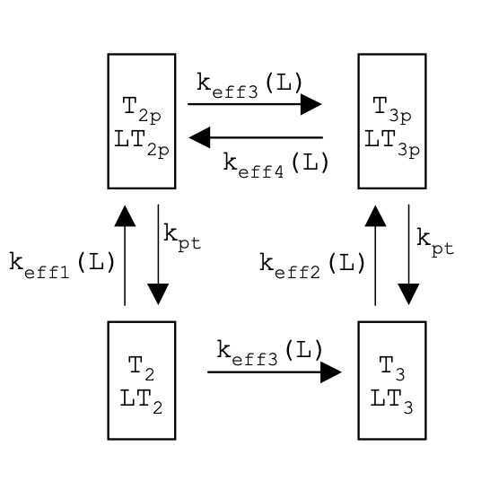
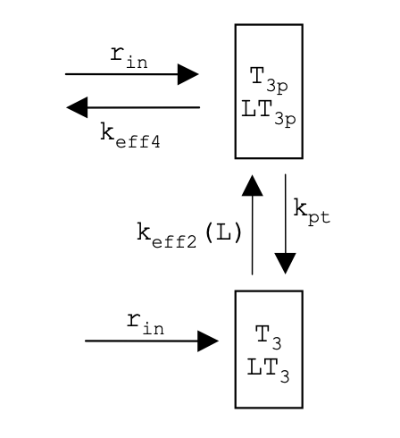
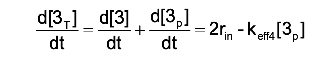
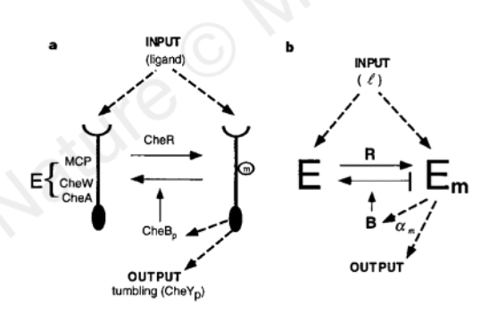
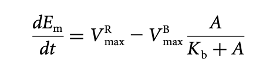
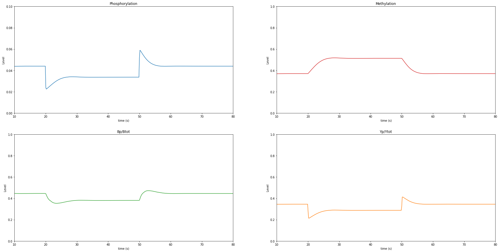

Project: Chemotaxis Adaptation
==============================

* For this project, there are 6 tasks that you need to complete. These tasks are integrated throughout this collaboratory. You can use the navigation bar on the right to view each task.
* View this page as an interactive Jupyter Notebook: `click here <https://drive.google.com/file/d/1xI0nQLrC0ZHTV3PLaa3ueB47Tre3Zj3S/view?usp=sharing>`_
* **[DEVNOTE: Figures 1–3 & 5 are missing from original notebook.]**

Introduction to Papers
----------------------

Why is it that bacteria seem to know how to survive in a chemically changing environment? The answer may lie in how precisely the interactive protein networks – like those involved in survival mechanisms – are able to coordinate the responses of the living cell to react to environmental stimuli. Such preciseness in biology raises the question of how sensitive the biochemistry of these protein networks is. First, in two accompanying Nature papers, Uri Alon and N. Barkai took on the challenge to address this both experimentally and quantitatively using the *Escherichia* *coli* chemotaxis network, an ideal and well-characterized model of sensory systems at the time, published in their papers titled “Robustness in bacterial chemotaxis” (1) and “Robustness in simple biochemical networks” (2). Their work found striking results that exact adaptation is maintained in the bacteria, even with variations (increase, decrease, or mutations) of network-protein concentrations in the chemotaxis system. Another paper, “A model of excitation and adaptation in bacterial chemotaxis”(3), Spiro proposes another mathematical model that describes chemotaxis based on the kinetic properties of Tar, a key player of the network, and makes use of the methylation states which help achieve adaptation for survival. All together, these papers give intitial quantitative insights into the chemotaxis network that propelled future studies to model this simple, yet precise signaling network.

**What is Chemotaxis?**

|image1| Comic by Noemie Matthey

|image2|

**Figure 1. Chemotaxis Network (Alon et al.)**

Bacterial chemotaxis is defined as the movement of bacteria in response to chemical stimuli in the environment. Examples of such response include moving to a higher concentration of food source (glucose) or fleeing from toxins (phenol) (3). The movement associated with the cell’s swimming direction involves controlling the flagella and the frequent, abrupt changes in direction, known as tumbles. Bacteria chemotaxis also is known for being exact in adapting to changes in the environment. For example, a change in concentration of a chemical in the bacteria’s environment induces rapid changes in the tumbling frequency, enabling the bacteria to swim either away from the chemical (repellent) or towards it (attractant). Chemotaxis has been a widely studied system by scientists due to its remarkably sensitivity to small, relative changes in the concentrations of multiple chemical signals over a broad range of ambient concentrations.

|image3|

Task 1: The Basics of the Chemotaxis Network
--------------------------------------------
Label the chemotaxis system with the appropriate protein names and describe their main functions. Also, define the main biochemical interactions in the signaling pathway.

* Methylation:
* Phosphorylation:
* Tar:
* CheA:
* CheW:
* CheY:
* CheZ:
* CheR:
* CheB:

| ANSWER: Methylation: Addition of a methyl group on a substrate
| Phosphorylation: Addition of a phosphate group to a molecule

Membrane-spanning chemoreceptors (aspartate receptor Tar) transduce signals into the cells upon activation. These consist of protein kinases CheA and CheW. CheA phosphorylates itself and transfers phosphoryl ground to a messenger protein, CheY. Upon phosphorylation, active CheY interacts with the flagellar motors and induces tumbling, and thus cellular movement. To slow down movement, CheY is dephosphorylated by CheZ. Methylation of the chemoreceptors influences the adaption changes the cell undergoes by increasing the rate of CheY phosphorylation. Methyl groups are modified by enzymes CheR and CheB.

Task 2: The Spiro Model
-----------------------

|image4|

**Figure 3. The Spiro Model (Spiro et al.)**

The Spiro model describes a mathematical model based on known kinetic properties of Tar and the phosphorelay signaling components. It also makes use of the multiple methylation states to achieve adaptation.

List assumptions of the Spiro Model:

* Tar receptor always forms a complex with CheA and CheW
* CheW functions as an adapter (scaffolding) protein and has no enzymatic function
* The complex has two phosphorylation states, three methylation states, and ligand bound or unbound state
* Operate at low concentrations of external ligand so that only the low methylation states will be relevant
* Only have to consider two methylation states

Below is a framework of a simplified version of Spiro’s model (4). Using the definitions of rate constants listed in Table 3 from the   paper, fill in the missing sections using the following terms:

* T2p
* LT2p
* T3p
* LT3p
* T3
* LT3
* keff1
* keff2
* keff3
* keff4
* kpt

ANSWER: |image5|

**Figure 4. Simplified version of Spiro’s model**

Task 3: The Barkai Model
------------------------

|image6|

**Figure 5. The Barkai Model (The two-state model of chemotaxis) (Barkai
et al.)**

There are three main assumptions of the Barkai Model that differ from
the Spiro. What are these?

1. Assumption 1:
2. Assumption 2:
3. Assumption 3:

ANSWER:
1. CheB only demethylates phosphorylated (‘active’) receptors
2. methylation rates operate at saturation since [CheR] is much smaller than the concentration of receptors 
3. demethylation is independent of ligand binding

Below is a framework of a simplified version of Barkai’s model (4). Using the assumptions above, fill in the missing sections using the following terms: 

* T2p
* LT2p
* T3p
* LT3p
* T3
* LT3
* keff1
* keff2
* keff3
* keff4
* kpt

ANSWER:

Using the assumption stated by Barkai about enzyme kinetics in saturation, fill in the missing sections of an even further simplified model using the following terms:

* rin
* kpt
* T3p
* LT3p

ANSWER:

What is r\ :sub:`in`?

ANSWER: the saturated methylation rate that is independent of [2] and [2p]

Derive the equations for :math:`\frac{d3p}{dt}`, :math:`\frac{d3}{dt}`, and :math:`\frac{d3T}{dt}`:

:math:`\frac{d3p}{dt} = \text{ ?}`

:math:`\frac{d3}{dt} = \text{ ?}`

:math:`\frac{d3T}{dt} = \text{ ?}`

ANSWER:

Task 4: Robustness and Perfect Adaptation
-----------------------------------------

Barkai argued that a few key features of chemotaxis network are robust, meaning that they are insensitive to the precise values of the biochemical parameters.

Adaptation in chemotaxis means that the bacteria can “adapt back” to the pre-stimulus tumbling frequency value, regardless of how much the concentration of the chemical stimulant changed. This is really handy for the bacteria, as it allows them to either rapidly swim away from the repellent, or swim toward the attractant, and go back to continiuing to survive in this fashion.

Perfect adaption refers to the dependence between number of phosphorylated receptors and the ligand concentration in steady state. More specifically, the number of phosphorylated receptors is independent of the ligand concentration.

Barkai’s model can be modified to show robust adaptation mechanism in the figure below. It also does not require tine-tuning to obtain perfet adaptation. (Note that the rate of reverse modification does not depend on the concentration of Em)

**Figure 6. The Barkai Model of Robust Mechanism (Barkai et al.)**

Derive an equation for :math:`\frac{dEm}{dt}` (the rate of change of the reverse-modification reaction) as a function of the activity, A, from the model in (b). Use the following hints:

* The system is adaptive when its steady-state activity, Ast, is independent of l
* A mechanism for robust adaptation can be obtained when the rates of the modification and the reverse-modification reactions depend on the system activity, A, not on the concentrations Em and E
* Enzyme R catalyses the modification reaction E → Em and works at saturation
* Enzyme B catalyses the reverse-modification reaction Em → E and can only bind to active enzymes
* Modification rate is constant at all times
* Assume Michaelis-Menten kinetics

ANSWER:

Task 5: Coding the Chemotaxis Model
-----------------------------------

Complete a Python script for the Chemotaxis Model. It has been partially completed for you. Use the comments as a guide for completing the missing parts.

.. |image1| image:: https://drive.google.com/uc?/export=view&id=1OpbRZLUeRU4fBxjkpGJl0Dxb72VdL34z
.. |image2| image:: https://drive.google.com/uc?/export=view&id=1UBJE0F9SsstNfLhiXLvncYjL9XLx-yuD
.. |image3| image:: https://drive.google.com/uc?/export=view&id=1aJ4wjtdiIYtOeKuWLcYGjXrGgMp7Mycf
.. |image4| image:: https://drive.google.com/uc?/export=view&id=1L_4rF3vb6ECpUR82ZRxXBZt0mcCz7inn
.. |image5| image:: https://drive.google.com/uc?/export=view&id=1s_7TbIBX2fdqmegrPNxTzDF3IwBQGhpo
.. |image6| image:: https://drive.google.com/uc?/export=view&id=1tPngkmaVepngVe9_Owh28G4_AGI52KCi
.. |image7| image:: https://drive.google.com/uc?/export=view&id=1Z2FsIKd8W8x59GX1AvWWpy5jb1af71b5
.. |image8| image:: https://drive.google.com/uc?/export=view&id=12fE0jteW-wvX-rLGHxeIUGp70WlHm9dV
.. |image9| image:: https://drive.google.com/uc?/export=view&id=125rVX-OZM6F_TS67HLlt6Tg6hzfokyHn
.. |image10| image:: https://drive.google.com/uc?/export=view&id=1-MZqYsCnBtuJpCvPE_FJ5kDrNWMblxGd
.. |image11| image:: https://drive.google.com/uc?/export=view&id=1Mam38Ufx4LGz6aKcKwt1zAfoQg0A0esS
.. |image12| image:: https://drive.google.com/uc?/export=view&id=1qBwyJna037hWyNp69orRCzydpFyvQtQh

.. code:: 

    ################################################################################
    # Project Title: Chemotaxis Network
    # Author: 
    # Description: This code uses the initial conditions and kinetic rates
    #to calculate the methylation and phosphorylation levels of a chemotaxis model by Spiro et al.
    ################################################################################
    
    import numpy as np                  # import data structuring
    from scipy.integrate import odeint  # import ODE integrating function
    import matplotlib.pyplot as plt     # import plotting libraries
    import math as m                    # import math operations
    
    ################################################################################
    
    #Define constants from Table 3 (Spiro et al.)
    #Use units: M (molar concentration), s (seconds)
    k1c         = 0.17                  #1/s
    k3c         = 30 * k1c              #1/s
    ratiok1bk1a = 1.7e-6 
    ratiok3ck3a = 1.7e-6
    k_1         = 4e5                   #1/(Ms)
    k_3         = k_1                   #1/(Ms)
    k8          = 15                    #1/s
    k9          = 3 * k8                #1/s
    k11         = 0                     #1/s
    #k12=1.1*k8                         #1/s
    k12         = 30
    kb          = 8e5                   #1/(Ms)
    ky          = 3e7                   #1/(Ms)
    k_b         = 0.35                  #1/s
    k_y         = 5e5                   #1/(Ms)
    Kbind       = 1e6                   #1/M association constant for ligand binding (Kb)
    Yo          = 20e-6                 #M
    Bo          = 1.7e-6                #M
    To          = 8e-6                  #M
    Ro          = 0.3e-6                #M
    Zo          = 40e-6                 #M
    t           = np.linspace(0,80,500)
    cligand    = 1e-6                  #ligand concentration (L)
    
    
    
    #From Simplified Model:
    #[T2]+[LT2] = y[0] 
    #[T3]+[LT3] = y[1] 
    #[T2p]+[LT2p] = y[2] 
    #[Bp] = y[3]
    #[Yp] = y[4]
    
    
    #Define initial conditions 
    To = 8e-6 
    Yo = 20e-6        #initial concentration of CheY
    Bo = 1.7e-6       #initial concentration of CheB
    y0 = [4e-6, 4e-6, 0e-6, 0.5e-6, 10e-6]
    
    Vmaxunbound = k1c * Ro #maximum turnover rate (MM kinetics) for unbound receptors 
    Vmaxbound = k3c * Ro #maximum turnover rate (MM kinetics) for bound receptors 
    KR = ratiok1bk1a #Michaelis constant
    fb = Kbind * cligand / (1 + Kbind * cligand) #fraction receptors bound to ligand
    fu = 1 - fb #fraction receptors not bound to ligand
    
    #def model(y,t,ky,k8,k9,fu,k_3,Vmaxunbound,Vmaxbound,KR,fb,To,Bo,k1c,k3c,ratiok1bk1a,ratiok3ck3a,k_1,k11,k12,kb,k_b,k_y,Kbind,Yo,Ro,Zo,cligand):  #define model for differential equations
    def model(y,t,ky,k8,k9,fu,k_3,Vmaxunbound,Vmaxbound,KR,fb,To,Bo,cligand):
     
     if t > 20:
      cligand = 1e-3
     if t > 50:
      cligand = 1e-6
    
    
     Vmaxunbound = k1c * Ro #maximum turnover rate (MM kinetics) for unbound receptors 
     Vmaxbound = k3c * Ro #maximum turnover rate (MM kinetics) for bound receptors 
     KR = ratiok1bk1a #Michaelis constant
     fb = Kbind * cligand / (1 + Kbind * cligand) #fraction receptors bound to ligand
     fu = 1 - fb #fraction receptors not bound to ligand
    
     kpt   = ky * (Yo - y[4]) + kb * (Bo - y[3])
     ydot1 = (-k8 * fu - k11 * fb) * y[0] + kpt * y[2] + (k_1 * fu + k_3 * fb) * y[1] * y[3] - Vmaxunbound * y[0] * fu / (KR + y[0] * fu) - Vmaxbound * y[0] * fb / (KR + y[0] * fb)
     ydot2 = (-k9 * fu - k12 * fb) * y[1] + kpt * (To - y[0] - y[1] - y[2]) - (k_1 * fu + k_3 * fb) * y[1] * y[3] + Vmaxunbound * y[0] * fu / (KR + y[0] * fu) + Vmaxbound * y[0] * fb / (KR + y[0] * fb) 
     ydot3 = (k8 * fu + k11 * fb) * y[0] - kpt * y[2] + (k_1 * fu + k_3 * fb) * (To - y[0] - y[1] - y[2]) * y[3] - Vmaxunbound * y[2] * fu / (KR + y[2] * fu) + Vmaxbound * y[2] * fb / (KR + y[2] * fb) 
     ydot4 = kb * (To - y[0] - y[1]) * (Bo - y[3]) - k_b * y[3]
     ydot5 = ky * (To - y[0] - y[1]) * (Yo - y[4]) - k_y * y[4] * Zo
    
     return [ydot1, ydot2, ydot3, ydot4, ydot5]    
    
    #Solve differential equations with odeint function
    soln = odeint(model,y0,t,args=(ky,k8,k9,fu,k_3,Vmaxunbound,Vmaxbound,KR,fb,To,Bo,cligand))
    
    
    #Calculate results for graphs
    Ptot = To - soln[:, 0] - soln[:, 1]             #total phosphorylation level
    Bp = soln[:, 3]                                 #CheB phosphorylation
    Yp = soln[:, 4]                                 #CheY phosphorylation
    metlevel = 1 - (soln[:, 0] + soln[:, 2]) / To   #Methylation level
    phoslevel = 1 - (soln[:, 0] + soln[:, 1]) / To  #Phosphorylation level
    
    
    #Graphs for output
    
    fig, axes = plt.subplots(2, 2, figsize=(30,15))
    
    axes[0, 0].plot(t, phoslevel, 'tab:blue')
    axes[0, 0].set_title('Phosphorylation')
    axes[0, 0].set_xlim([10, 80])
    axes[0, 0].set_ylim([0, 0.1])
    
    axes[0, 1].plot(t, metlevel, 'tab:red')
    axes[0, 1].set_title('Methylation')
    axes[0, 1].set_xlim([10, 80])
    axes[0, 1].set_ylim([0, 1])
    
    axes[1, 0].plot(t, Bp/Bo, 'tab:green')
    axes[1, 0].set_title('Bp/Btot')
    axes[1, 0].set_xlim([10, 80])
    axes[1, 0].set_ylim([0, 1])
    
    axes[1, 1].plot(t,Yp/Yo, 'tab:orange')
    axes[1, 1].set_title('Yp/Ytot')
    axes[1, 1].set_xlim([10, 80])
    axes[1, 1].set_ylim([0, 1])
    
    for ax in axes.flat:
        ax.set(xlabel='time (s)', ylabel='Level')
    
    

Task 6: Modeling Perfect Adaptation
-----------------------------------

Vary the values of k11 and k9 and write down the observations you see in the graphical outputs. What happens to phosphorylation and methylation when k11 > k9? When k11 < k9?

Conclusions
-----------

Write down your conclusions from the notebook.

BONUS: Describe any advancements from these papers that more recent studies on the chemotaxis system have discovered.

References
----------
#. Alon, U., Surette, M., Barkai, N. et al. Robustness in bacterial    168–1chemotaxis. Nature 397, 168–171 (1999). `<https://doi.org/10.1038/16483>`_
#. Barkai, N., Leibler, S. Robustness in simple biochemical networks.    Nature 387, 913–917 (1997). `<https://doi.org/10.1038/43199>`_
#. Spiro, P. A., Parkinson, J. S., & Othmer, H. G. (1997). A model of    excitation and adaptation in bacterial chemotaxis. Proceedings of the    National Academy of Sciences of the United States of America, 94(14), 7263–7268. `<https://doi.org/10.1073/pnas.94.14.7263>`_
#. Oudenaarden, A. V. (2009, October). VIII Modeling Escherichia coli    chemotaxis. Lecture. Retrieved November, 2020, from `<http://web.mit.edu/biophysics/sbio/PDFs/L11_notes.pdf>`_

Other recommended sources:

* Bren, A., & Eisenbach, M. (2000). How signals are heard during bacterial chemotaxis: protein-protein interactions in sensory signal propagation. Journal of bacteriology, 182(24), 6865–6873. `<https://doi.org/10.1128/jb.182.24.6865-6873.2000>`_

* Falke, J. J., Bass, R. B., Butler, S. L., Chervitz, S. A., & Danielson, M. A. (1997). The two-component signaling pathway of bacterial chemotaxis: a molecular view of signal transduction by receptors, kinases, and adaptation enzymes. Annual review of cell and developmental biology, 13, 457–512. `<https://doi.org/10.1146/annurev.cellbio.13.1.457>`_

* Alon, U., Camarena, L., Surette, M. G., Aguera y Arcas, B., Liu, Y., Leibler, S., & Stock, J. B. (1998). Response regulator output in bacterial chemotaxis. The EMBO journal, 17(15), 4238–4248. `<https://doi.org/10.1093/emboj/17.15.4238>`_

* Staropoli JF, Alon U. Computerized analysis of chemotaxis at different stages of bacterial growth. Biophys J. 2000 Jan;78(1):513-9. doi: 10.1016/S0006-3495(00)76613-6. PMID: 10620314; PMCID: PMC1300658.

