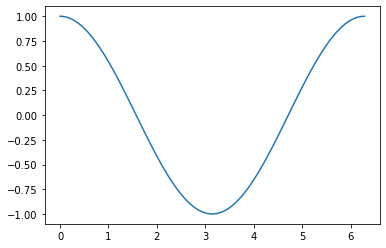

Module 0: Introduction to Scientific Computing
==============================================

This section will provide the necessary background in Python programming needed to complete the rest of this course. While most models can be implemented using a number of different possible programming languages, we will be using Python as our language of choice throughout this course. Python is a widely used, open-source programming language with a wide variety of community-built packages for scientific use (numerical methods, data analysis, plotting and visualization, etc.)

0.1 Mathematical Operations, Defining Variables, and Plotting
-------------------------------------------------------------

* Adapted from Mark Bakker Delft University of Technology
* View this section as an executable Jupyter Notebook: `<https://tinyurl.com/y5s5ypvm>`_

The google collaboratory environment provides you with a cloud-hosted
jupyter notebook environment. This enables you to use and run python
code that we provide. We know that this is not a programming course so
we keep the coding burden very light. We make extensive use of text
fields like this to ‘scaffold’ the upcoming exercise.

Note: Please use google chrome to make all the functions work!

Python acts very similarly to MatLab. Today we are going to go over the
basics of defining variables and plotting things. If you think back to
what you learned in ENGR 132, you will see that python is very similar
to matlab. For example you can use python as a simple calculator.

**As we work through the following examples please use code commenting
to take notes on what the different parts of each command do. You can
save this notebook to your own google drive and always have this as a
reference for the rest of the course.**

Position your cursor in the code cell below and hit [shift][enter]. The
output should be 12 (-:

.. code:: ipython3

    6 * 2

Python is not fussy about spaces. Look at the code in the following
cell…even though the 6 and the 2 are much further apart, if you click
within it and hit [shift][enter] you will see it still runs

.. code:: ipython3

    6   *                        2

Double click on the text here and you will see that you can edit this
text. This allows you to take notes for your understanding directly in
the text.

If you want to write down a snippet of code that you don’t want to run
you can do that by setting it off with a triple backticks (the button
next to the tilde to the left of the number 1) like below:

::

   # This is formatted as code

You can also add comments directly in the code if you want to add some
details to what that line of code does. In the example below you can see
a comment line that does not affect the code but it just to help
understand the code. Good commenting is good coding practice!

.. code:: ipython3

    # This line calculates the product of 6 and 2
    6 * 2

**Defining Variables.**

To do scientific computing we will need to store the values within
variables. look at the cell below. It can not run because there is a
question-mark where the value for ``b`` should be.

We will often use this approach as a fill-in-the-blank exercise to help
get you started with a code. However, most of the problems we give are a
little bit harder than this.

Modify the code below to assign a value of 2 to the variable ``b``

.. code:: ipython3

    a = 6
    b = 2
    a * b

Both ``a`` and ``b`` are now variables. Each variable has a type. In
this case, they are both integers (whole numbers). To write the value of
a variable to the screen, use the ``print`` function (the last statement
of a code cell is automatically printed to the screen if it is not
stored in a variable, as was shown above)

.. code:: ipython3

    print(a)
    print(b)
    print(a * b)
    print(a / b)

You can add some text to the ``print`` function by putting the text
between quotes (either single or double quotes work as long as you use
the same at the beginning and end), and separate the text string and the
variable by a comma

.. code:: ipython3

    print('the value of a is', a)

A variable can be raised to a power by using ``**`` (a hat ``^``, as
used in some other languages, doesn’t work).

.. code:: ipython3

    a ** b

Exercise 0.1.1a: First Python code
~~~~~~~~~~~~~~~~~~~~~~~~~~~~~~~~~~

Compute the value of the polynomial :math:`y=ax^2+bx+c` at :math:`x=-2`,
:math:`x=0`, and :math:`x=2.1` using :math:`a=1`, :math:`b=1`,
:math:`c=-6` and print the results to the screen.

Division
~~~~~~~~

Division works as well

.. code:: ipython3

    print('1/3 gives', 1 / 3)

(Note for Python 2 users: ``1/3`` gives zero in Python 2, as the
division of two integers returned an integer in Python 2). The above
print statement looks pretty ugly with 16 values of 3 in a row. A better
and more readable way to print both text and the value of variable to
the screen is to use what are called f-strings. f-strings allow you to
insert the value of a variable anywhere in the text by surrounding it
with braces ``{}``. The entire text string needs to be between quotes
and be preceded by the letter ``f``

.. code:: ipython3

    a = 1
    b = 3
    c = a / b
    print(f'{a} divided by {b} gives {c}')

The complete syntax between braces is ``{variable:width.precision}``.
When ``width`` and ``precision`` are not specified, Python will use all
digits and figure out the width for you. If you want a floating point
number with 3 decimals, you specify the number of digits (``3``)
followed by the letter ``f`` for floating point (you can still let
Python figure out the width by not specifying it). If you prefer
exponent (scientific) notation, replace the ``f`` by an ``e``. The text
after the ``#`` is a comment in the code. Any text on the line after the
``#`` is ignored by Python.

.. code:: ipython3

    print(f'{a} divided by {b} gives {c:.3f}') # three decimal places
    print(f'{a} divided by {b} gives {c:10.3f}') # width 10 and three decimal places
    print(f'{a} divided by {b} gives {c:.3e}') # three decimal places scientific notation

Exercise 0.1.1b:First Python code using f-strings
~~~~~~~~~~~~~~~~~~~~~~~~~~~~~~~~~~~~~~~~~~~~~~~~~

Compute the value of the polynomial :math:`y=ax^2+bx+c` at :math:`x=-2`,
:math:`x=0`, and :math:`x=2.1` using :math:`a=1`, :math:`b=1`,
:math:`c=-6` and print the results to the screen using f-strings and 2
decimal places.

More on variables
~~~~~~~~~~~~~~~~~

Once you have created a variable in a Python session, it will remain in
memory, so you can use it in other cells as well. For example, the
variables ``a`` and ``b``, which were defined two code cells above in
this Notebook, still exist.

.. code:: ipython3

    print(f'the value of a is: {a}')
    print(f'the value of b is: {b}')

The user (in this case: you!) decides the order in which code blocks are
executed. For example, ``In [6]`` means that it is the sixth execution
of a code block. If you change the same code block and run it again, it
will get number 7. If you define the variable ``a`` in code block 7, it
will overwrite the value of ``a`` defined in a previous code block.

Variable names may be as long as you like (you gotta do the typing
though). Selecting descriptive names aids in understanding the code.
Variable names cannot have spaces, nor can they start with a number. And
variable names are case sensitive. So the variable ``myvariable`` is not
the same as the variable ``MyVariable``. The name of a variable may be
anything you want, except for reserved words in the Python language. For
example, it is not possible to create a variable ``for = 7``, as ``for``
is a reserved word. You will learn many of the reserved words when we
continue; they are colored bold green when you type them in the
Notebook.

Basic plotting and a first array
~~~~~~~~~~~~~~~~~~~~~~~~~~~~~~~~

Plotting is not part of standard Python, but a nice package exist to
create pretty graphics (and ugly ones, if you want). A package is a
library of functions for a specific set of tasks. There are many Python
packages and we will use several of them. The graphics package we use is
called ``matplotlib``. To be able to use the plotting functions in
``matplotlib`` we have to import it. We will learn several different
ways of importing packages. For now, we import the plotting part of
``matplotlib`` and call it ``plt``. Before we import ``matplotlib``, we
tell the Jupyter Notebook to show any graphs inside this Notebook and
not in a separate window (more on these commands later).

.. code:: ipython3

    %matplotlib inline
    import matplotlib.pyplot as plt

Packages only have to be imported once in a Python session. After the
above import statement, any plotting function may be called from any
code cell as ``plt.function``. For example

.. code:: ipython3

    plt.plot([1, 2, 4, 2])

Let’s try to plot :math:`y` vs :math:`x` for :math:`x` going from
:math:`-4` to :math:`+4` for the polynomial :math:`y=ax^2+bx+c` with
:math:`a=1`, :math:`b=1`, :math:`c=-6`. To do that, we need to evaluate
:math:`y` at a bunch of points. A sequence of values of the same type is
called an array (for example an array of integers or floats). Array
functionality is available in the package ``numpy``. Let’s import
``numpy`` and call it ``np``, so that any function in the ``numpy``
package may be called as ``np.function``.

.. code:: ipython3

    import numpy as np

To create an array ``x`` consisting of, for example, 5 equally spaced
points between ``-4`` and ``4``, use the ``linspace`` command

.. code:: ipython3

    x = np.linspace(-4, 4, 5)
    print(x)

In the above cell, ``x`` is an array of 5 floats (``-4.`` is a float,
``-4`` is an integer). If you type ``np.linspace`` and then an opening
parenthesis like:

``np.linspace(``

and then hit [shift-tab] a little help box pops up to explain the input
arguments of the function. When you click on the + sign, you can scroll
through all the documentation of the ``linspace`` function. Click on the
x sign to remove the help box. Let’s plot :math:`y` using 100 :math:`x`
values from :math:`-4` to :math:`+4`.

.. code:: ipython3

    a = 1
    b = 1
    c = -6
    x = np.linspace(-4, 4, 100)
    y = a * x ** 2 + b * x + c  # Compute y for all x values
    plt.plot(x, y);
    

Note that *one hundred* ``y`` values are computed in the simple line
``y = a * x ** 2 + b * x + c``. Python treats arrays in the same fashion
as it treats regular variables when you perform mathematical operations.
The math is simply applied to every value in the array (and it runs much
faster than when you would do every calculation separately).

You may wonder what the statement
``[<matplotlib.lines.Line2D at 0x30990b0>]`` is (the numbers on your
machine may look different). This is actually a handle to the line that
is created with the last command in the code block (in this case
``plt.plot(x, y)``). Remember: the result of the last line in a code
cell is printed to the screen, unless it is stored in a variable. You
can tell the Notebook not to print this to the screen by putting a
semicolon after the last command in the code block (so type
``plot(x, y);``). We will learn later on that it may also be useful to
store this handle in a variable.

The ``plot`` function can take many arguments. Looking at the help box
of the ``plot`` function, by typing ``plt.plot(`` and then shift-tab,
gives you a lot of help. Typing ``plt.plot?`` gives a new scrollable
subwindow at the bottom of the notebook, showing the documentation on
``plot``. Click the x in the upper right hand corner to close the
subwindow again.

In short, ``plot`` can be used with one argument as ``plot(y)``, which
plots ``y`` values along the vertical axis and enumerates the horizontal
axis starting at 0. ``plot(x, y)`` plots ``y`` vs ``x``, and
``plot(x, y, formatstring)`` plots ``y`` vs ``x`` using colors and
markers defined in ``formatstring``, which can be a lot of things. It
can be used to define the color, for example ``'b'`` for blue, ``'r'``
for red, and ``'g'`` for green. Or it can be used to define the linetype
``'-'`` for line, ``'--'`` for dashed, ``':'`` for dots. Or you can
define markers, for example ``'o'`` for circles and ``'s'`` for squares.
You can even combine them: ``'r--'`` gives a red dashed line, while
``'go'`` gives green circular markers.

If that isn’t enough, ``plot`` takes a large number of keyword
arguments. A keyword argument is an optional argument that may be added
to a function. The syntax is
``function(keyword1=value1, keyword2=value2)``, etc. For example, to
plot a line with width 6 (the default is 1), type

.. code:: ipython3

    
    plt.plot([1, 2, 3], [2, 4, 3], linewidth=6);

Keyword arguments should come after regular arguments.
``plot(linewidth=6, [1, 2, 3], [2, 4, 3])`` gives an error.

Names may be added along the axes with the ``xlabel`` and ``ylabel``
functions, e.g., ``plt.xlabel('this is the x-axis')``. Note that both
functions take a string as argument. A title can be added to the figure
with the ``plt.title`` command. Multiple curves can be added to the same
figure by giving multiple plotting commands in the same code cell. They
are automatically added to the same figure.

New figure and figure size
~~~~~~~~~~~~~~~~~~~~~~~~~~

Whenever you give a plotting statement in a code cell, a figure with a
default size is automatically created, and all subsequent plotting
statements in the code cell are added to the same figure. If you want a
different size of the figure, you can create a figure first with the
desired figure size using the ``plt.figure(figsize=(width, height))``
syntax. Any subsequent plotting statement in the code cell is then added
to the figure. You can even create a second figure (or third or
fourth…).

.. code:: ipython3

    plt.figure(figsize=(10, 3))
    plt.plot([1, 2, 3], [2, 4, 3], linewidth=6)
    plt.title('very wide figure')
    plt.figure()  # new figure of default size
    plt.plot([1, 2, 3], [1, 3, 1], 'r')
    plt.title('second figure');

Exercise 0.1.2a: First graph
~~~~~~~~~~~~~~~~~~~~~~~~~~~~

Plot :math:`y=(x+2)(x-1)(x-2)` for :math:`x` going from :math:`-3` to
:math:`+3` using a dashed red line. On the same figure, plot a blue
circle for every point where :math:`y` equals zero. Set the size of the
markers to 10 (you may need to read the help of ``plt.plot`` to find out
how to do that). Label the axes as ‘x-axis’ and ‘y-axis’. Add the title
‘First nice Python figure of Your Name’, where you enter your own name.

Style
~~~~~

As was already mentioned above, good coding style is important. It makes
the code easier to read so that it is much easier to find errors and
bugs. For example, consider the code below, which recreates the graph we
produced earlier (with a wider line), but now there are no additional
spaces inserted

.. code:: ipython3

    a=1
    b=1
    c=-6
    x=np.linspace(-4,4,100)
    y=a*x**2+b*x+c#Compute y for all x values
    plt.plot(x,y,linewidth=3)

The code in the previous code cell is difficult to read. Good style
includes at least the following: \* spaces around every mathematical
symbol (``=``, ``+``, ``-``, ``*``, ``/``), but not needed around ``**``
\* spaces between arguments of a function \* no spaces around an equal
sign for a keyword argument (so ``linewidth=3`` is correct) \* one space
after every comma \* one space after each ``#`` \* two spaces before a
``#`` when it follows a Python statement \* no space between the
function name and the list of arguments. So ``plt.plot(x, y)`` is good
style, and ``plt.plot (x, y)`` is not good style.

These rules are (a very small part of) the official Python style guide
called PEP8. When these rules are applied, the code is as follows:

.. code:: ipython3

    a = 1
    b = 1
    c = -6
    x = np.linspace(-4, 4, 100)
    y = a * x**2 + b * x + c  # Compute y for all x values
    plt.plot(x, y, linewidth=3)

Exercise 0.1.2b: First graph revisited
~~~~~~~~~~~~~~~~~~~~~~~~~~~~~~~~~~~~~~

Go back to your Exercise 2 and apply correct style.

Loading data files
~~~~~~~~~~~~~~~~~~

Numerical data can be loaded from a data file using the ``loadtxt``
function of ``numpy``; i.e., the command is ``np.loadtxt``. You need to
make sure the file is in the same directory as your notebook, or provide
the full path. The filename (or path plus filename) needs to be between
quotes.

Exercise 0.1.3, Loading data and adding a legend
~~~~~~~~~~~~~~~~~~~~~~~~~~~~~~~~~~~~~~~~~~~~~~~~

You are provided with the data files containing the mean montly
temperature of Holland, New York City, and Beijing. The Dutch data is
stored in ``holland_temperature.dat``, and the other filenames are
similar. Plot the temperature for each location against the number of
the month (starting with 1 for January) all in a single graph. Add a
legend by using the function ``plt.legend(['line1','line2'])``, etc.,
but then with more descriptive names. Find out about the ``legend``
command using ``plt.legend?``. Place the legend in an appropriate spot
(the upper left-hand corner may be nice, or let Python figure out the
best place).

.. code:: ipython3

                 
    ! git clone https://github.com/akmadamanchi/ThermoData.git
    
    ### if you get the error "fatal: destination path 'ThermoData' already exists and is not an empty directory."
    ### you can handle this by 1) opening up the menu on the left side of the screen to bring up the table of cotents. 
    ### 2) chose the Files tab in Table of contents.  3) NOTE THIS IS NOT THE File menu at the top of the screen. 
    ### 4) see if there is a folder named ThermoData. 
    ### If there is you can uncomment and run the 'rm -rf ThermoData/' command in the following cell
    

.. code:: ipython3

    #rm -rf ThermoData/ 

.. code:: ipython3

    holland = np.loadtxt('/content/ThermoData/holland_temperature.dat')
    newyork= np.loadtxt('/content/ThermoData/newyork_temperature.dat')
    beijing = np.loadtxt('/content/ThermoData/beijing_temperature.dat')
    plt.plot(np.linspace(1, 12, 12), holland)
    plt.plot(np.linspace(1, 12, 12), newyork)
    plt.plot(np.linspace(1, 12, 12), beijing)
    plt.xlabel('Number of the month')
    plt.ylabel('Mean monthly temperature (Celcius)')
    plt.xticks(np.linspace(1, 12, 12))
    plt.legend(['Holland','New York','Beijing'], loc='best');

Exercise 0.1.4, Subplots and fancy tick markers
~~~~~~~~~~~~~~~~~~~~~~~~~~~~~~~~~~~~~~~~~~~~~~~

Load the average monthly air temperature and seawater temperature for
Holland. Create one plot with two graphs above each other using the
subplot command (use ``plt.subplot?`` to find out how). On the top
graph, plot the air and sea temperature. Label the ticks on the
horizontal axis as ‘jan’, ‘feb’, ‘mar’, etc., rather than 0,1,2,etc. Use
``plt.xticks?`` to find out how. In the bottom graph, plot the
difference between the air and seawater temperature. Add legends, axes
labels, the whole shebang.

Colors
~~~~~~

If you don’t specify a color for a plotting statement, ``matplotlib``
will use its default colors. The first three default colors are special
shades of blue, orange and green. The names of the default colors are a
capital ``C`` followed by the number, starting with number ``0``. For
example

.. code:: ipython3

    plt.plot([0, 1], [0, 1], 'C0')
    plt.plot([0, 1], [1, 2], 'C1')
    plt.plot([0, 1], [2, 3], 'C2')
    plt.legend(['default blue', 'default orange', 'default green']);

There are five different ways to specify your own colors in matplotlib
plotting; you may read about them
`here <http://matplotlib.org/examples/pylab_examples/color_demo.html>`__.
A useful way is to use the html color names. The html codes may be
found, for example, `here <http://en.wikipedia.org/wiki/Web_colors>`__.

.. code:: ipython3

    color1 = 'fuchsia'
    color2 = 'lime'
    color3 = 'DodgerBlue'
    plt.plot([0, 1], [0, 1], color1)
    plt.plot([0, 1], [1, 2], color2)
    plt.plot([0, 1], [2, 3], color3)
    plt.legend([color1, color2, color3]);

The coolest (and nerdiest) way is probably to use the xkcd names, which
need to be prefaced by the ``xkcd:``. The xkcd list of color names is
given by `xkcd <https://xkcd.com/color/rgb/>`__ and includes favorites
such as ‘baby puke green’ and a number of brown colors vary from ``poo``
to ``poop brown`` and ``baby poop brown``. Try it out:

.. code:: ipython3

    plt.plot([1, 2, 3], [4, 5, 2], 'xkcd:baby puke green');
    plt.title('xkcd color baby puke green');

Gallery of graphs
~~~~~~~~~~~~~~~~~

The plotting package ``matplotlib`` allows you to make very fancy
graphs. Check out the matplotlib gallery to get an overview of many of
the options. The following exercises use several of the matplotlib
options.

Exercise 0.1.5, Pie Chart
~~~~~~~~~~~~~~~~~~~~~~~~~

At the 2012 London Olympics, the top ten countries (plus the rest)
receiving gold medals were
``['USA', 'CHN', 'GBR', 'RUS', 'KOR', 'GER', 'FRA', 'ITA', 'HUN', 'AUS', 'OTHER']``.
They received ``[46, 38, 29, 24, 13, 11, 11, 8, 8, 7, 107]`` gold
medals, respectively. Make a pie chart (use ``plt.pie?`` or go to the
pie charts in the matplotlib gallery) of the top 10 gold medal winners
plus the others at the London Olympics. Try some of the keyword
arguments to make the plot look nice. You may want to give the command
``plt.axis('equal')`` to make the scales along the horizontal and
vertical axes equal so that the pie actually looks like a circle rather
than an ellipse. Use the ``colors`` keyword in your pie chart to specify
a sequence of colors. The sequence must be between square brackets, each
color must be between quotes preserving upper and lower cases, and they
must be separated by comma’s like
``['MediumBlue','SpringGreen','BlueViolet']``; the sequence is repeated
if it is not long enough.

Exercise 0.1.6, Fill between
~~~~~~~~~~~~~~~~~~~~~~~~~~~~

Load the air and sea temperature, as used in Exercise 4, but this time
make one plot of temperature vs the number of the month and use the
``plt.fill_between`` command to fill the space between the curve and the
horizontal axis. Specify the ``alpha`` keyword, which defines the
transparancy. Some experimentation will give you a good value for alpha
(stay between 0 and 1). Note that you need to specify the color using
the ``color`` keyword argument.

Iterative Computing: For Loops
------------------------------

* Adapted from Mark Bakker Delft University of Technology
* View this section as an executable Jupyter Notebook: `<https://tinyurl.com/r64mryn>`_

In scientific computing we rely on the following packages so lets import
them by running the following commands

.. code:: 

    import numpy as np
    import matplotlib.pyplot as plt
    

**For Loops** in python are very similar to for loops in other
languages.

Execute the following command to see how the variable ``i`` is updated
each time the command ‘loops’ through.

Also note that the ``for`` comand ends with a ``:`` and the commands
inside the loop are indented.

**As we work through the following examples please use code commenting
to take notes on what the different parts of each command do. You can
save this notebook to your own google drive and always have this as a
reference for the rest of the course.**

.. code:: 

    for i in [0, 1, 2, 3, 4]:
        print('Hello world, the value of i is', i)

.. parsed-literal::

    Hello world, the value of i is 0
    Hello world, the value of i is 1
    Hello world, the value of i is 2
    Hello world, the value of i is 3
    Hello world, the value of i is 4
    

You can use multiple commands inside the loop as long as they are all
indented. Commands that are not indented will be executed after the
conclusion of the loop as in the example below

.. code:: 

    for x in [0, 1, 2, 3]: 
        xsquared = x ** 2
        print('x, xsquare', x, xsquared)
    print('We are done with the loop')

.. parsed-literal::

    x, xsquare 0 0
    x, xsquare 1 1
    x, xsquare 2 4
    x, xsquare 3 9
    We are done with the loop
    

To save the effort of listing each variable value for your looped
variable you can use the ``range`` argument to generate the values. Note
that in python you typically start counting from ``0`` not from ``1`` so
``range(7)`` produces a list of 7 numbers from ``0`` to ``6``

.. code:: 

    for i in range(7):
        print('the value of i is:', i)

.. parsed-literal::

    the value of i is: 0
    the value of i is: 1
    the value of i is: 2
    the value of i is: 3
    the value of i is: 4
    the value of i is: 5
    the value of i is: 6
    

For loops can be useful for conducting a set of calculations that you
might use in a graph. Examine the following example

.. code:: 

    x = np.linspace(0, 2 * np.pi, 100)
    y = np.zeros_like(x)  # similar to zeros(shape(x))
    for i in range(len(x)):
        y[i] = np.cos(x[i])
    plt.plot(x, y);

Note, that the variables in a for loop do not have to be numbers, they
can be calculated values. They can even be names. Execute the following
commands to see how to use text variables.

.. code:: 

    
    for x in ['Dr. Umulis', 'Dr. Pienaar']:
      print('One of my favorite professors is '+str(x))

.. parsed-literal::

    One of my favorite professors is Dr. Umulis
    One of my favorite professors is Dr. Pienaar
    

Also note that you can use your index variable to communicate multiple
values to your for loop. This can be useful in solving complex systems
of equations. Explore the following example with your group

.. code:: 

    months = ['January', 'February', 'March', 'April',\
              'May','June', 'July', 'August', 'September',\
              'October', 'November', 'December']
    days = [31, 28, 31, 30, 31, 30, 31, 31, 30, 31, 30, 31]
    for i in range(12):
        print('The number of days in '+str(months[i])+' is ' +str(days[i]))

**Exercises**

Exercise 0.2.1: Printing with Loops
~~~~~~~~~~~~~~~~~~~~~~~~~~~~~~~~~~~

Using the above examples, build a loop that prints the names of your five favorite bands. Click the "Begin" button below to try it yourself.

**[Interactive Functionality coming soon]**

Making Reusable Code: Defining Functions
----------------------------------------

* Adapted from Mark Bakker Delft University of Technology
* View this section as an executable Jupyter Notebook: `<https://tinyurl.com/rvhzpuq>`_

In scientific computing we rely on the following packages so lets import
them by running the following commands

.. code:: 

    import numpy as np
    import matplotlib.pyplot as plt
    

**Defining Functions** in python is once again very similar to MatLab.

Defining a function is useful because it saves you from having to
rewrite large loops over and over again.

To define a new function, use the command ``def`` followed by the name
of your function and then parentheses sorrounding the arguments or
inputs into the function. T as follows:

::

   def function_name(Argument1, Argument2):

After the colon the commands within the function are indented (just as
in for loops). The final command of the function should be ``return``
followed by the output variable.

Examine the example below.

**Reminder: As we work through the following examples please use code
commenting to take notes on what the different parts of each command do.
You can save this notebook to your own google drive and always have this
as a reference for the rest of the course.**

.. code:: 

    def MyFirstFunction(a, b, c):
      Output = a**2 + b**3 - c**.5
      return Output
    
    # Remember that exponents in python are defined by ** not by the ^ symbol
    

Note that simply defining the function does not result in any output. We
have to call the function and supply the input arguments (in this case,
a, b and c)

.. code:: 

    MyFirstFunction(6,2,8)
    MyFirstFunction(5,2,1)

.. parsed-literal::

    32.0

Note that only the most recent call of the function is returned here. To
see the output of each time you call the function we need to explicitly
capture the output and ask the notebook to print the function, as shown
below

.. code:: 

    CaptureOuput1 = MyFirstFunction(1,5,3)
    print('The Output of the first function call is '+str(CaptureOuput1))
    CaptureOuput2 = MyFirstFunction(3,6,11)
    print('The Output of the second function call is '+str(CaptureOuput2))
    

.. parsed-literal::

    The Output of the first function call is 124.26794919243112
    The Output of the second function call is 221.6833752096446
    

Note that you can have functions that return multiple values

.. code:: 

    def testfunction(a, b):
      hypotenus = (a**2 + b**2)**.5
      perimeter = a + b + hypotenus
      return (hypotenus, perimeter)
    z = 6;
    w = 8;
    CaptureOutput = testfunction(z,w)
    print('a right triangle with sides of '+str(z)+", and "+str(w)+", will have a hypotenus of "+str(CaptureOutput[0])+ ", and a perimeter of "+str(CaptureOutput[1]))

.. parsed-literal::

    a right triangle with sides of 6, and 8, will have a hypotenus of 10.0, and a perimeter of 24.0
    

Exercise 0.3.1: Calling Custom Functions
~~~~~~~~~~~~~~~~~~~~~~~~~~~~~~~~~~~~~~~~

Using the examples above, define a function for the following equation

f(x)=3^α \* cos(x)

and then call the function with input arguments α = 4 and x = 8

Note: you need to google the numpy command for calculating cos

the expected answer is ``-11.785502738497696``

.. code:: 

    import numpy as np
    def exercise(a, x):
      

**advanced** can write a function that includes a for loop.

Answers for the exercises
-------------------------

Answer to Exercise 0.1.1a:

.. code:: ipython3

    a = 1
    b = 1
    c = -6
    x = -2
    y = a * x ** 2 + b * x + c
    print('y evaluated at x = -2 is', y)
    x = 0 
    y = a * x ** 2 + b * x + c
    print('y evaluated at x = 0 is', y)
    x = 2.1
    y = a * x ** 2 + b * x + c
    print('y evaluated at x = 2 is', y)

.. code:: ipython3

    # Errored Code
    a = 1
    b = 1
    c = -6
    x = -2
    y = a * x ** 2 + b * x + c
    print('y evaluated at x = -2 is', y)
    x = 0 
    a = 2
    y = a * x ** 2 + b * x + c
    print('y evaluated at x = 0 is', y)
    x = 2.1
    y = a * x ** 2 + b * x + c
    print('y evaluated at x = 2 is', y)

Back to Exercise 1a

Answer to Exercise 0.1.1b:

.. code:: ipython3

    a = 1
    b = 1
    c = -6
    x = -2
    y = a * x ** 2 + b * x + c
    print(f'y evaluated at x = {x} is {y}')
    x = 0 
    y = a * x ** 2 + b * x + c
    print(f'y evaluated at x = {x} is {y}')
    x = 2.1
    y = a * x ** 2 + b * x + c
    print(f'y evaluated at x = {x} is {y:.2f}')

Back to Exercise 1b

Answer to Exercise 0.1.2

.. code:: ipython3

    x = np.linspace(-3, 3, 100)
    y = (x + 2) * (x - 1) * (x - 2)
    plt.plot(x, y, 'r--')
    plt.plot([-2, 1, 2], [0, 0, 0], 'bo', markersize=10)
    plt.xlabel('x-axis')
    plt.ylabel('y-axis')
    plt.title('First Python Figure of Mark Bakker');

Back to Exercise 0.1.2

Answer to Exercise 0.1.3

.. code:: ipython3

    holland = np.loadtxt('/content/ThermoData/holland_temperature.dat')
    newyork= np.loadtxt('/content/ThermoData/newyork_temperature.dat')
    beijing = np.loadtxt('/content/ThermoData/beijing_temperature.dat')
    plt.plot(np.linspace(1, 12, 12), holland)
    plt.plot(np.linspace(1, 12, 12), newyork)
    plt.plot(np.linspace(1, 12, 12), beijing)
    plt.xlabel('Number of the month')
    plt.ylabel('Mean monthly temperature (Celcius)')
    plt.xticks(np.linspace(1, 12, 12))
    plt.legend(['Holland','New York','Beijing'], loc='best');

.. code:: ipython3

    # Errored Code
    holland = np.loadtxt('/content/ThermoData/holland_temperature.dat')
    newyork= np.loadtxt('/content/ThermoData/newyork_temperature.dat')
    beijing = np.loadtxt('/content/ThermoData/beijing_temperature.dat')
    plt.plot(np.linspace(1, 10, 10), holland)
    plt.plot(np.linspace(1, 10, 10), newyork)
    plt.plot(np.linspace(1, 12, 12), beijing)
    plt.xlabel('Number of the month')
    plt.ylabel('Mean monthly temperature (Celcius)')
    plt.xticks(np.linspace(1, 10, 10))
    plt.legend(['Holland','New York'], loc='best');

Back to Exercise 0.1.3

Answer to Exercise 0.1.4

.. code:: ipython3

    air = np.loadtxt('/content/ThermoData/holland_temperature.dat') 
    sea = np.loadtxt('/content/ThermoData/holland_seawater.dat')
    plt.subplot(211)
    plt.plot(air, 'b', label='air temp')
    plt.plot(sea, 'r', label='sea temp')
    plt.legend(loc='best')
    plt.ylabel('temp (Celcius)')
    plt.xlim(0, 11)
    plt.xticks([])
    plt.subplot(212)
    plt.plot(air-sea, 'ko')
    plt.xticks(np.linspace(0, 11, 12),
               ['jan','feb','mar','apr','may','jun','jul','aug','sep','oct','nov','dec'])
    plt.xlim(0, 11)
    plt.ylabel('air - sea temp (Celcius)');

Back to Exercise 0.1.4

Answer to Exercise 0.1.5

.. code:: ipython3

    gold = [46, 38, 29, 24, 13, 11, 11, 8, 8, 7, 107]
    countries = ['USA', 'CHN', 'GBR', 'RUS', 'KOR', 'GER', 'FRA', 'ITA', 'HUN', 'AUS', 'OTHER']
    plt.pie(gold, labels = countries, colors = ['Gold', 'MediumBlue', 'SpringGreen', 'BlueViolet'])
    plt.axis('equal');

.. code:: ipython3

    gold = [46, 38, 29, 24, 13, 11, 11, 8, 8, 7, 107]
    countries = ['USA', 'CHN', 'GBR', 'RUS', 'KOR', 'GER', 'FRA', 'ITA', 'HUN', 'AUS', 'Other']
    plt.pie(gold, labels = countries, colors = ['Gold', 'MediumBlue', 'SpringGreen', 'BlueViolet'])
    plt.legend('USA', 'CHN')
    plt.axis('equal');

Back to Exercise 0.1.5

Answer to Exercise 0.1.6

.. code:: ipython3

    air = np.loadtxt('/content/ThermoData/holland_temperature.dat') 
    sea = np.loadtxt('/content/ThermoData/holland_seawater.dat')
    plt.fill_between(range(1, 13), air, color='b', alpha=0.3)
    plt.fill_between(range(1, 13), sea, color='r', alpha=0.3)
    plt.xticks(np.linspace(0, 11, 12), ['jan', 'feb', 'mar', 'apr',\
               'may', 'jun', 'jul', 'aug', 'sep', ' oct', 'nov', 'dec'])
    plt.xlim(1, 12)
    plt.ylim(0, 20)
    plt.xlabel('Month')
    plt.ylabel('Temperature (Celcius)');

Back to Exercise 0.1.6