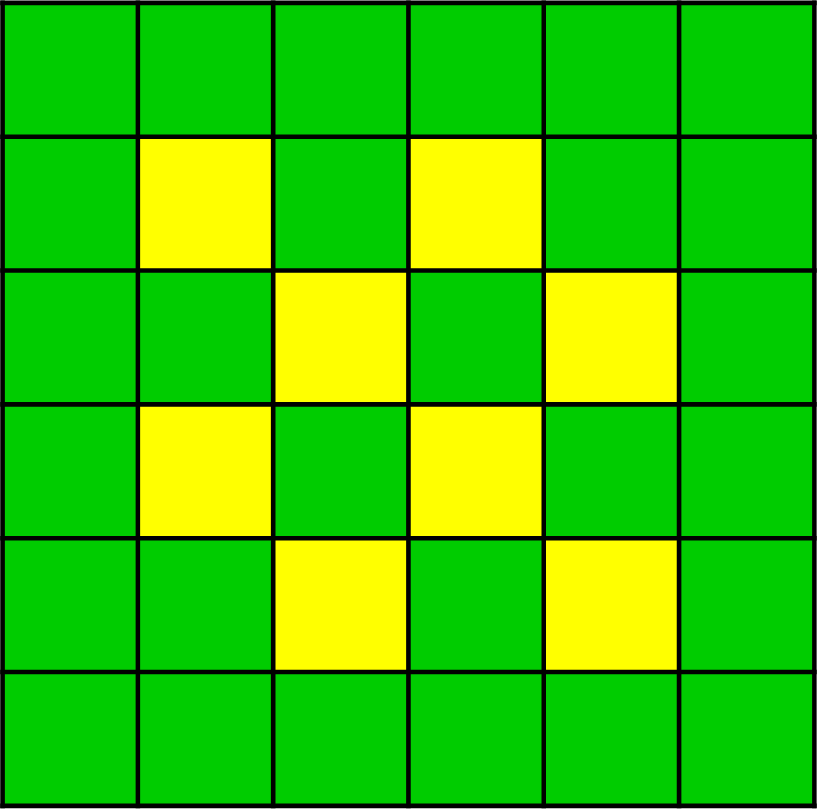

Module 1: Introduction to Biological Modeling
=============================================

This Module will provide an introduction to the process of biological modeling, from identifying a problem of study to creating a model of the system that can be simulated computationally. By the end of this module, you should be able to:

#. Identify the key steps of the biological modeling process
#. Generate meaningful questions and hypothesis about a biological problem of interest
#. Create a qualitative model to represent the biological system

1.1 The Biological Modeling Workflow
------------------------------------

Developing useful mechanism-based computational biology models requires discipline and progression through a series of logical steps. Typically, one starts from biological observations and gradually develop mechanism-based understanding that explain the biological system in a way that provides new insights in the normal and abnormal operation of the biological system. 

By necessity, computational biology models leave out a great deal of complexity and therefore represent simplifications of reality. However, if a model includes the key components of the biological system, it can be both predictive and useful. Furthermore, identifying the key elements that govern the system greatly simplifies the knowledge needed to construct a model and provides critical insight into the controlling mechanisms in a biological process.

A critical aspect of developing useful computational biology models is to use a well-defined process that progresses from biological observation and understanding, through the development of physical and mathematical definitions of the key components and processes in the system, leading finally to a computational instantiation of that conceptualization. Many of the problems encountered in developing useful computational biology models arise from trying to short circuit these steps. In addition, to apply a computational modeling in, for example, a clinical domain requires that the model is credible in terms of both the biology represented and the computational implementation. What is often overlooked (or undervalued) is the need to document the entire trajectory of the model development process.
 
1.1.1: Model Representations
~~~~~~~~~~~~~~~~~~~~~~~~~~~~

People often devote a great deal of effort to building mathematical models and implementing them in computer code without spending enough effort in defining what biological concepts and processes those equations or code represent or what the end goal of the simulation is. It is critically important that sufficient time is spent in defining and understanding the biology and goals of the modeling project. Only after that understanding and scoping has been completed should the modeler move on writing computer code and running and analyzing the simulations. We will present this model development workflow as a linear process, but in practice modelers will iteratively refine their models, revisiting, revising and improving their descriptions at each level of abstraction as they proceed.

Our basic workflow is outlined in Figure 1, below. The workflow develops three levels of model; a biological model, a mathematical model and a computational model. Within each of these model levels there is a recommended set of steps for developing the model at that level. We start with a description of the three model levels.

   
   Figure 1: The modeling workflow for developing the biological, mathematical, and computational model of a given system.
   
Each of these steps requires significant consideration in the planning of a model. We will delve into each of these three categories of model development later in this module. As a brief overview, here are three quick descriptions of each model type:

* **The Biological Model:** This model, also known as a “conceptual model”, is often created with the help of a domain expert such as a biologist or a clinician. This model is an attempt to explain an observable reality. It should include the parts of the reality that we know about filtered by what we (and the domain expert) believe are relevant to a particular question. This description will include physical objects (cells, enzymes, tissues, …) and processes (cell proliferation, enzyme reaction, …). In addition, this description may include spatial and temporal information. Besides this list of objects and processes the biological model should also include a list of measurables and outcomes. For example, which of the physical objects are measurable in terms of count, or volume or concentration? Which of the processes are measurable such as in a time course? Finally, the biological model should identify outcomes of interest.
* **The Mathematical Model:** The mathematical model is a mathematical description of the biological model. Here we create mathematical definitions, based on physics, chemical, or other physical models, of the objects and processes. Often the creation of the mathematical model requires making significant assumptions about the underlying mechanisms of the biological system. For example, when modeling transfer of a small molecule into a cell is the process simple diffusion (that can be modelled as a reversible first order ordinary differential equation (ODE)) or is the process transporter mediated that may become saturated at high small molecule concentration? This process of converting a biological model into a computational model is the first point where the modeling process adds value to our understanding of the biological system. The mathematical model requires a level of understanding and specification that is rarely present in biological models. The modeler, often with the help of the domain expert, must coerce the available biological knowledge into a numeric framework and in that process decide how the available data can be used to select from a multitude of possible mathematical instantiations. At this stage it often becomes clear that certain aspects of the biological system that are measurable have indeed never been measured. Often, at this stage the modeler also encounters the problem that quantities required in the mathematical model are not directly measurable in the biological assays. This situation may require reformulating the mathematical model to avoid dependence on intrinsically unmeasurable quantities. On the other hand, at this point the mathematical model can also begin to offer new insights into the biological model. Quantities that are not directly measurable may instead by calculable by the model. This capability is one of the most attractive aspects of a mathematical model. A key aspect of the creation of the mathematical models is that it is the point where the model moves from a biological point of view to a chemical or physics-based description. This allows the modeler to use standard mathematical forms developed in those domains to define the model for the biological domain.
* **The Computational Model:** The computational model is an instantiation of the mathematical model in a computing system. In some cases, this instantiation can introduce implementation dependent parameters in a model. For example, if time or space is discretized in the computer simulation then that adds implementation-specific parameters that are not part of the biological system being modelled. At his point in the model development process the model, which has already moved from the biological to the mathematical/chemical/physics domains, moves again into the computational domain. Issues such as computability, simulation run time, memory and disk storage requirements become practical issues that must be considered.

These three "types" of model can be thought of as different **representations** of the same system. These three representations can be used together to provide us with a level of understanding of a system that can't be reached by investigating a single model in isolation. Exploring, tracking, and documenting these interactions between system representations can be thought of as the core job of the modeler. While tasks and skills like creating informative biological diagrams and developing computer simulations are also important modeling jobs, the larger act of "modeling" can be thought of as the work entailed in bringing these three representations into useful harmony.

|

   
   Figure 2: The model representations diagram. The three types of models help a modeler understand the system of study through distinct processes of abstraction, implementation, and meaning-making between model types.

|

The rest of this module will discuss the steps of the modeling process for each of the three model types in more detail. Some aspects of this process will be overviewed briefly in this module, as they are covered in more detail in later modules. For now, the focus is on understanding the entire process before we start getting into the details of how to dig into each step.
   
1.1.2 The Biological (Conceptual) Model
~~~~~~~~~~~~~~~~~~~~~~~~~~~~~~~~~~~~~~~

The biological (i.e., conceptual) model for our system can be constructed in three primary steps: (1) listing our biological observations of interest, (2) generating meaningful questions and hypotheses that we want to investigate with our model, and (3) constructing a qualitative model. This section will provide details on how to get started with refining a conceptual model of your system of interest.

Biological observations
+++++++++++++++++++++++

The key starting point for our biological/conceptual model is to begin by writing down a list of the key biological observations you wish to explore. Often the best starting point for a multi-cell scale model are the cartoons biologists use to describe a tissue or organ. For example, the major cell types in the liver and a representation of the VEGF driven angiogenesis signaling pathway are described as cartoons in Figure # below. This simple viewpoint is used by biologists to graphically represent the key players and the key understanding of a biological process. This layout concisely lists the major components of the system.

   
   Figure 3: A typical biological cartoons for a tissue and a signaling pathway. `Left: <http://www.eclinpath.com/chemistry/liver/liver-structure-and-function/liverlobule/>`_ Shown is a small section of the liver showing the major cell types (hepatocyte, endothelial cell, …), the sinusoidal blood vessel lumen, and a greatly simplified representation of the spatial relationships among the key components (not to scale). `Right: <http://www.genecopoeia.com/product/search/pathway/h_vegfPathway.php>`_ The VEGF signaling pathway leading to angiogenesis (new blood vessel formation).

Using the simple cartoon showing the key objects, define the key experimental observations you wish to explain. For example:

* What processes are the objects involved in? 
* Do the cells proliferate, carry out some key biological process such as metabolism, or die? 
* Under what conditions do those processes occur? 
* What key experiments and publications describe both the basic tissue structure as well as the (possibly abnormal) processes you are interested in? 
* What are the core concepts discussed in the literature and how do those concepts contribute to the normal or abnormal behavior of the tissue? 
* Can you can identify any observations that appear critical to the phenomena you are exploring? Can you identify any that seem irrelevant to your phenomena of interest?
 
While developing this initial list of objects and processes, it is useful to consider what is visible and what is measurable in an experiment. A cell expresses thousands of different proteins and is simultaneously carrying out a huge number of processes. All that information cannot be included in the model. So how do you decide what to include at this stage of the modeling development process? One approach is to only include those things that are directly visible or that can be directly linked to a biological behavior. For example, in a multi-cell model cells are directly visible and measurable. Cells typically appear to be adhesive to each other suggesting the need for an adhesion process. If the cells are observed to grow or die, then those processes should be included. If those processes are not observed then they are not, and should not, be included. Subcellular processes are generally not directly visible and should not be included unless there is some direct measurable quantity (which might be at the cell or tissue level) that can be directly linked to the unmeasurable subcellular process.
 
Building this initial model description will often raise new questions and require new biological background as the process progresses. Therefore, as you proceed through the model building process it is expected that additional material will be added to this section in the form of new sources, new observations, etc. In addition, it is possible that components included initially will later be deemed less important and can be relegated to background material.

Questions and Hypotheses
++++++++++++++++++++++++

Defining the initial questions and hypotheses is the most important step in the model development process and yet it is the step most often treated superficially. What are the main questions you wish to answer? Can the questions be described precisely and succinctly? For example, in cancer biology it is known that lack of nutrients in a tumor can lead to tumor cell death. Cells receive most of their nutrients from the blood supply, suggesting the importance of blood flow in and around the tumor. Based on that assumption, a hypothesis might be that “increased blood supply reduces tumor cell starvation resulting in increased tumor size”. Overall this is a selection step in which you must decide what parts of the Biological Observations will be included in the model.

A model takes a set of Objects with their Behaviors and/or processes and predicts how the State will change given a specific set of Initial and Boundary Conditions. 

With this structure in mind, you will typically ask whether a specific set of model elements are sufficient to reproduce an observed system behavior. Many questions you might ask may not be addressable by a model, so you will need to frame your question in a way that will allow your model to answer the question. What are specific hypotheses concerning how model elements determine the macroscopic result(s) of interest that you could test? Your models will only be useful if they begin with experimentally measurable states, and/or states inferable from experiment or a limited number of hypothetical alternatives and then predict experimentally measurable states. If we try to build a model that requires us to know the position of every atom in an organism or if we predict something we could never verify experimentally we will not be doing useful science.

Remember that a model can usually only show the sufficiency (or insufficiency) of your hypothesized elements to explain an observation. The probability exists that a different set of model elements could explain the same observation equally well or better.

Express your initial questions as a brief list. Each question should connect an experimentally measurable model element to an observable result. Ideally, express these questions in the form of assertions (hypotheses), though you may initially want them to have an exploratory structure. You should also begin to think about how you might compare model outputs to experimental results to check if the model reproduces the phenomenon of interest. What are the observables we want our model to reproduce? Sometimes we may need to invoke “hidden observables,” states that we must infer indirectly from directly observable quantities.

Based on your reading and hypotheses, generate an initial set of hypotheses concerning model elements. Hypotheses can define either model structure (e.g. the nature and type of interactions) or the values of parameters for a given model structure. Express this in the form of a list about Objects, Behaviors, and Interactions. Some examples of good, model-testable hypotheses are provided below.

* “Access to blood borne nutrients is needed for healthy cells.”
* “Hepatocytes seem to be crucial players.” 
* “Organization into epithelia seems to determine the rate of metastasis.” 
* “Apoptosis driven by contact signaling seems important.” 
* “The amount of growth factor in the medium seems critical.” 
* “Initial cell density determines if the cells differentiate into bone or neuron."

Qualitative Model
+++++++++++++++++

Once you have your hypotheses defined, the next step is to spend some time building a formal structure describing the model elements. This qualitative model should capture the domain-specific knowledge that you have identified as significant to your problem. The Qualitative Model embodies your hypotheses about the needed Model Elements and their relationships that lead to the phenomenon of interest. This is the second most important step in model building and (again) is often neglected. 

Based on the general observations in the previous step, define the Objects you will initially include in your model (you can always come back to this later and add or eliminate them). Put these Objects into a table and assign them the Properties that you think are clearly going to be important. Remember that nothing exists in your model until you assert it! If you assert an Object, it does not have qualities like position or volume unless you say it does!

In the following, begin by focusing on the names and identities of the Objects, Behaviors and Interactions, then think through the Properties to characterize them. Don’t worry too much if initially the identity and names of the Parameters are not so clear. These are often implementation dependent and can be refined later.

In the following, begin by focusing on the names and identities of the Objects, Behaviors and Interactions, then think through the Properties to characterize them. Don’t worry too much if initially the identity and names of the Parameters are not so clear. These are often implementation dependent and can be refined later.

+-------------+----------------+----------------+
| Object      | Properties     |  Property Type |
+=============+================+================+
| Environment | Spatial-extent | Parameter      |
+-------------+----------------+----------------+
| Cell        | Position       | Variable       |
+-------------+----------------+----------------+

Now, based on your analysis of the biology of the problem, begin to define the Behaviors (processes) and Interaction for your Objects. For Behaviors, list the Objects they affect and the Object Properties that they involve.

+----------+--------+-----------------+
| Behavior | Object | Properties      |
+==========+========+=================+
| Movement | Cell   | Object Velocity |
+----------+--------+-----------------+

Each time you include a Behavior, you will likely find that you need to add additional Properties to the appropriate Object definition so that the model is self-consistent.

+-------------+----------------+---------------+
| Object      | Properties     | Property Type |
+=============+================+===============+
| Environment | Spatial-extent | Parameter     |
+-------------+----------------+---------------+
| Cell        | Position       | Variable      |
|             +----------------+---------------+
|             | Velocity       | Variable      |
+-------------+----------------+---------------+

For Interactions (or processes), list the participating Objects and the relevant properties that affect the interaction

+--------------------+---------------------+----------------+---------------+
| Interaction        | Participant Objects | Properties     | Property Type |
+====================+=====================+================+===============+
| Cell-Cell Adhesion | Cell 1              | Cadherin Level | Parameter     |
|                    +---------------------+----------------+---------------+
|                    | Cell 2              | Cadherin Level | Parameter     |
+--------------------+---------------------+----------------+---------------+
| Oxygen Uptake      | Cell                | Uptake Rate    | Parameter     |
|                    +---------------------+----------------+---------------+
|                    | Oxygen Field        | Concentration  | Variable      |
+--------------------+---------------------+----------------+---------------+

Note that we now need to go back and define the Oxygen Concentration Field Object

+--------------+-------------------+---------------+
| Object       | Properties        | Property Type |
+==============+===================+===============+
| Environment  | Spatial-extent    | Parameter     |
+--------------+-------------------+---------------+
| Cell         | Position          | Variable      |
|              +-------------------+---------------+
|              | Velocity          | Variable      |
+--------------+-------------------+---------------+
| Oxygen Field | Concentration     | Variable      |
|              +-------------------+---------------+
|              |Diffusion Constant | Parameter     |
+--------------+-------------------+---------------+

If we have an Oxygen Field, we know that the supply of Oxygen available to the cells will depend on the diffusion rate of Oxygen, so we need to add the Diffusion Behavior to the Field object.

+-----------+--------------------+------------------------+
| Behavior  | Participant Object | Properties             |
+===========+====================+========================+
| Diffusion | Oxygen Field       | Diffucsion Coefficient |
+-----------+--------------------+------------------------+

Now we need to define the dynamics. In general, discrete objects move based on their current velocity and the forces applied to them, and Fields evolve due to diffusion.

+-----------+----------------------------+------------------------+--------------------------+
| Dynamics  | Participant Objects        | Participant            | Property Affected        |
|           |                            | Behaviors/Interactions |                          |
+===========+============================+========================+==========================+
| Movement  | Cell                       | Movement (Velocity)    | Position                 |
+-----------+----------------------------+------------------------+--------------------------+
| Diffusion | Oxygen Field               | Cell (Positions),      | Field (Concentration),   |
| & Uptake  |                            | Diffusion              | Cells (Amount of Oxygen) |
+-----------+----------------------------+------------------------+--------------------------+

We should review our qualitative verbal model a few times to make sure it is consistent and complete and anything we call for in one place is defined somewhere in the model.
The above set of tables and descriptions defines a Model template. To convert it into something that can describe a biological situation, we will need to create a Model Instance, that specifies our initial and boundary conditions. We can do that now, if we are comfortable with it, otherwise we can come back to them as we continue to develop our model.

You can write a paragraph defining where the objects are initially, what their states are and what the boundary conditions are. For example, we need to specify the number, location and size of the cells. What the initial Oxygen concentration is everywhere. What happens at the boundary of the Environment when it is encountered by cells (rigid wall, absorbing, periodic) or Oxygen (absorbing, impermeable, source…). Are there any events or processes that add or remove objects such as cells or Oxygen?

1.1.3 The Mathematical Model
~~~~~~~~~~~~~~~~~~~~~~~~~~~~

Selection
+++++++++

As in the selection step for the Biological Model, we must decide which components of the Biological Model can and will be included in the Mathematical Model. In general, it is unlikely that everything in the Biological Model will be representable in the Mathematical Model. It is likely that simplification will need to be made, or perhaps multiple concepts in the Biological Model will be aggregated in the Mathematical Model. In any case this selection step decides which components will propagate into the Mathematical Model.

Quantitative Model
++++++++++++++++++

In the next stage of model building, we refine the Qualitative Model into a specific mathematical representation, our Quantitative Model. We need to represent all the concepts we have defined in our qualitative model. We define the level of detail of our description and which specific aspects of processes we will include in our model. In making these choices, we decide what numeric formulism and parameters we will use in the model. In the case of a chemical reaction, we would decide if a reaction rate obeyed Mass-Action, Michaelis-Menten, Hill or some other rate law. For spatial objects, if we are describing a cell Object, a model might specify its position and volume, but not its specific shape, or might define an elliptical cell with specific major and minor axes, but arbitrary orientation, or might specify a cell with a specific volume and membrane area, or a detailed but static shape for a complex cell like a neuron. A chemical in a Field might be present everywhere and its changes in concentration depend only on diffusion (in which case we would need to define a diffusion constant) or it might be carried (advected) by flow of the fluid, and/or the movement of cells. Diffusion might be uniform everywhere (in which case we would have a single diffusion constant) or it might be reduced at cell membranes or inside cells. If the diffusion occurs in extracellular matrix, it might differ in rate depending on the orientation of the matrix fibers. For cell motility, we might decide if the motion is directed or random (and if so, how we will describe the velocity profile). Usually, we will start with the simplest, most generic assumptions, and add complexity only when a simpler model fails to reproduce our observations or if we have specific experimental evidence of the importance of a complex microscopic mechanism. In the latter case, we should always compare the consequences of the more complex mechanism with a simpler one.

At the end of this step of model building, the quantitative model should be fully defined and should have no missing information or parameters. In addition, the application of this quantitative model should be mathematically precise—that is, anyone implementing the model should be able to obtain the same model outputs.

These decisions are properly the domain of mathematical chemistry, biology and biophysics, and in a mathematical biology course, we would spend a good deal of time discussing the specific choices and tradeoffs that specific mathematical representations entail. Here, to begin with, we will accept the choices of mathematical representation that CompuCell3D makes and revisit them as we become more comfortable with the methodologies and the practice of developing multiscale models.

Model Dependent Parameters
++++++++++++++++++++++++++

Now that we know what parameters we need to specify in our quantitative model, we should look to see which parameter values are known in the literature.  Examples of such parameters might be the typical cell diameter in microns, the time between cell divisions, the speed of movement of a cell, the diffusion rate of a molecule in water (or in a biological material in the rare cases it is known), or the compressibility or viscosity of material components, etc. If possible, we should provide ranges for these values, references to their sources and the units. In some cases, the specific quantities needed are not available (or cannot be found). In these cases, attempt to assign a reasonable range for the parameter based similar quantities and basic physical considerations. 

In rare instances when we can analyze the equations in a Quantitative Model analytically, determine the predictions of our Quantitative Model for a specific set of parameters, and Initial and boundary conditions. More generally though we must translate the mathematical description in the Quantitative Model into a numerical approximation that can be solved on a computer. We face the same problem when we do numerical approximation of a definite integral in calculus or solve a set of ordinary differential equations (ODEs) numerically. Sometimes these choices can produce radical differences in results (e.g., in chemical reactions choosing between deterministic ordinary differential equation solvers or stochastic Gillespie solvers). Often these numerical implementations will require us to define additional parameters beyond those required by the Quantitative Model that specify details of the numerics (e.g. the integration time step) or which require us to translate a concept in the Mathematical model into the representation of the numerical approach.

We are now at a point in the model development process where we need to move from the biological and mathematical domains into the third model domain, the computational domain. As mentioned earlier, it is best if we make this transition into an existing code base suitable for the class of problem we are working on. Custom code can be written, and in some cases that is the only option, but in general our model development processes will be easier and more robust if we use an existing code base. 

1.1.4 The Computational Model
~~~~~~~~~~~~~~~~~~~~~~~~~~~~~

Selection
+++++++++

As in the two previous selection steps, we must decide which components of the Mathematical Model will be included in the Computational Model. At this step we must map mathematical concepts into a computing framework. In general, it is possible that some aspects in the Mathematical Model will be not be directly representable in the Computational Model. It is likely that simplification will need to be made, or perhaps multiple concepts in the Mathematical Model will be aggregated in the Computational Model. In any case this selection step decides which components will propagate into the Computational Model. In addition, this step directly influences the next step where we decide upon a computational modality. If we can reduce the model to a set of ODE’s than that directly impacts our choice of computational modality. Alternatively, if our selection includes spatial characteristics then our choice for a computational modality is different than it would be for a set of ODE’s.

Computational Modality
++++++++++++++++++++++

There are many different ways to represent cells computationally—popular representations include lattice-based cellular automata (which represent cells as single voxels in a lattice), lattice-free center models that represent the cell as the positions of their centers, with a potential field around their centers, lattice-free subcellular element models (which represent cells as clouds of center-model blobs), lattice-free vertex models (which represent cells only by  the points at where three or more cells touch), lattice-free finite element models (which apply the technology of finite-element materials modeling to describe the boundaries of cells by triangulation meshes and/or their volumes by tetrahedralization meshes) and the lattice-based Glazier-Graner-Hogeweg (GGH)/Cellular Potts model (CPM) models (which represent cells as sets of lattice sites). Each of these methodologies requires different translations of biological and mathematical concepts and adds different Methodology-Dependent parameters. E.g., lattice-based methods, require the specification of the lattice while lattice-free methods do not; cells in a center-model do not have well-defined volumes or surfaces; finite-element methods require rules for mesh updating as the cell configuration changes, etc.

In this course, we will generally use CompuCell3D and its GGH/CPM spatial representation of cells. As we will see, the GGH/CPM representation has its specific set of advantages, disadvantages and complications. Because it is a lattice method, with a fixed lattice size, we will need to specify the size of the lattice unit (voxel) (in microns), the size of the modeled Environment (in voxels), the lattice type (square vs. hexagonal) and the lattice interaction range. All these parameters reflect the numerical solution method and not any reality of the biology. In addition, GGH/CPM specifies many properties and behaviors in terms of constraints, which mean that we must specify a target and constraint strength, for each. For example, instead of specifying the volume of a Cell, we will specify its target volume and inverse compressibility. If we select these Methodology-Dependent parameters appropriately, and if the translation of Quantitative Model parameters to Methodology-specific parameters is correct, then our model predictions should usually be independent of the translation. E.g., if we change the lattice unit from 0.25 microns to 0.5 microns and correctly rescale my other parameters, the simulation results should be essentially unchanged.

While the ideal prediction of a quantitative model is unambiguous, the approximations we obtain for different numerical approaches may differ. These differences are artifacts of the numerical method and do not reflect the underlying behavior of the quantitative model. In an ideal world, we would be able to use different numerical solution methods of the same quantitative model to check for these artifacts. Unfortunately, we do not have general multimethod tools available to do so.

As with our previous model development steps, we should define the method and method dependent parameters of our particular instantiation of the computational model.

Model Dependent Parameters
++++++++++++++++++++++++++

Once we have defined the solver methodologies and selected the Methodology-Dependent parameters, we need to write the simulation code that will run on a computer. For the GGH/CPM methodology, there are multiple software packages that implement the same numerical methods (including CompuCell3D, CHASTE, Tissue Simulation Toolkit, Morpheus and others). Each one of these will require the model to be implemented using different syntax, just the way you would need to write different code to solve the same problem using MatLab versus Mathematica.

In CompuCell3D (CC3D) we define the static properties of the model (cell types, behaviors, interactions,) and parameters that apply to all members of a given Object category, and complex dynamics (like cell growth and division and differentiation) as well as events and parameters that are unique to each instance of an Object. CC3D uses Python scripting to define initial conditions and to track, plot and log simulation results.

Simulation Results
++++++++++++++++++

Once a computable model is ready we proceed to calibrating the model based on experimental data. In general, the model will contain parameters for which no value is available, and we will need to determine those parameters based on fitting the model to experimental data. Even though we did not have initial values for these parameters they still should have been listed in our model description and should have been assigned an expected value range. 

In many cases, because tissue evolution and our model are stochastic, we will need to run the same simulation multiple times for a given set of parameters, or we will run many simulations with different parameters to explore the parameters’ effects on the results, or we may run related simulations embodying different choices of hypotheses.  

We have now reached a point in the modeling workflow where there are two key issues; First we should revisit the entire model development workflow and second, we should determine if the computable model can answer our initial hypothesis and questions. 

For the first question, we should revisit the entire workflow processes and review any assumptions we have made. Are the assumptions made during the early part of the model development process still viable in the final model? Has the final model raised critical issues such as unobtainable parameters or poorly defined initial, boundary or final condition? Each of the three model levels has its own set of issues that should be revisited. Working backwards through the development process we should consider:

*Computational Model and Implementation dependence:*

* Effect of discretization step size in both time and space
* Implementation specific parameter reliability and sensitivity

*Quantitative model:*

* Are the time scales for the various processes comparable? Is a time scale separation possible that would simplify the model?
* Are the quantitative model parameters obtainable or calculable?

*Biological Model:*

* Are there missing or extraneous components in the model?

For the second question we should determine if the computable model is capable of answering or initial hypothesis. Note that here we are not asking if the model does answer the question, instead we are just asking if it can answer the question. We should examine the model outputs and determine if they are comparable to some experimentally observed data. If there are no model outputs that can be directly mapped to experimental data, then we have no way to verify the basic functioning of the model.

1.2: Worked Example : Cell Sorting
----------------------------------

In order to better understand the modeling process that we’ve been describing so far, we need to walk through an example of an actual biological problem that we can use computational methods to simulate. For our first example, we will demonstrate how to think through each step of the process using the context of cells sorting. Cell sorting is a common developmental phenomenon in which random aggregates of cells form organized layers due to differential adhesion properties.
Biological Observations

First, we begin by asking: How do different cell types form ordered layered structures in developing embryos? Cells reorganize during early development, then maintain spatial relationships, forming coherent ordered layers of different cell types, as shown in Figure [#].

   
   Figure #: Diagram of cells forming cohesive layers during development.
   
This sorting phenomenon can be studied in vitro by making random aggregates of two embryonic cell types and seeing how they behave.

.. figure:: images/introToModeling_files/cellSortImaging2.png
   :figwidth: 70%
   :align: center
   :alt: image of cells sorting during embryonic development experiments
   
   Figure #: Experimental imaging of cells sorting from a random aggregate.

In a randomly mixed aggregate of two embryonic cell types, cells of the same type form clusters, which gradually merge together until one cell type forms a sphere in the center of the aggregate, with the other type surrounding it. We call this phenomenon cell sorting and say that the outer cell type “engulfs” the inner cell type. Mixtures of the same pairs of cell types consistently put the same type to the center. If cell type A engulfs cell type B, and cell type B engulfs cell type C, then cell type A engulfs cell type C.

   
   Figure #: Laboratory imaging of cell engulfment heirarchy.

Cell ahesion in the "real world" is thought to be due to interactions between specialized adhesion molecules that sit on the surface of the cell membrane. The cell adhesion molecules (CAMs) that reside on the surface of each cell interact differently with the CAMs of other cells depending on their type. This results in differences in cell adhesion affinities across cell types, as cells "want" to interact with some CAMs more than others. A common result of these interactions is that cells prefer to adhere to other cells of the same type (i.e., how tissues are formed).

This cell adhesion molecule phenomenon is quite complex, and creating a one-to-one model that included every component of the CAM interactions would require excessive amounts of setup and computational time. Fortunately, modeling this behavior is not necessary for addressing the questions that we are trying to answer with our model. Remember, our question is to see how the relative differences in adhesion affect the outcomes of the sorting process. So for our example, we want to abstract the interactions of CAMs between different cells in a way that makes the simulation setup and run time less prohibitive without sacrificing the usefulness of the model. 

The late Malcolm Steinberg of Princeton University proposed the Differential Adhesion Hypothesis to explain cell sorting. This hypothesis suggests that cells of different types have a cell-type-dependent contact energy per unit surface area. When cells are placed in an aggregate, the pattern rearranges to minimize the total contact energy between cells (thus maximizing the adhesion between cells). We can use this as a starting point for defining our hypothesis for our own model. In essence, we can functionalize the CAM interactions at cell membrane contact points as a single relative adhesion value between each unique cell type.  We call this adhesion property *contact energy*. For our example with two cells and a medium, we end up with six total contact energy (J) values:

#. J\ :sub:`cell1-cell1`
#. J\ :sub:`cell1-cell2`
#. J\ :sub:`cell2-cell2`
#. J\ :sub:`cell1-medium`
#. J\ :sub:`cell2-medium`
#. J\ :sub:`medium-medium`

With this simplification, we still end up with behavior similar to what we see in experiment, indicating that our assumptions do not affect to overall validity of our results. We will further discuss methods for validating models in later modules, but for now comparison to experimentally observed outcomes will suffice as a starting metric. We will show examples of this simulation in action (implemented in CompuCell3D) at the end of this section. 

Section 1.2.1: Defining Initial Hypotheses
~~~~~~~~~~~~~~~~~~~~~~~~~~~~~~~~~~~~~~~~~~

For our cell sorting example, we can start with the following assertion: Cells rearrange to minimize their total contact energy with their neighbors. This hypothesis includes several important assumptions:

* Cell types have a consistent hierarchy of contact energies per unit surface area when they come into contact with their own and other cell types
* The cell’s adhesivity (contact energy) depends on the number and type of cell adhesion molecules in its membrane
* Cells fluctuate randomly within an aggregate
* Cells don’t grow or change their properties during sorting
* Less adhesive cell types engulf more adhesive cell types

With this hypothesis and these assumptions in mind, we can set our goals for how we want to explore our hypothesis with our model. In this case, one goal might be to:

“Model the evolution of a randomly mixed aggregate of two mesenchymal cell types due to Differential Adhesion and random cell motility.”

This goal can be investigated by pursuing several specific questions:

#. How does the outcome (configuration, rate of change of pattern) depend on the relative contact energies between the cell types and between the cells and medium? 
#. Can Differential Adhesion and Random Cell Motility explain the qualitative patterns and rates observed in cell sorting experiments?

Section 1.2.2: Defining Conceptual Model
~~~~~~~~~~~~~~~~~~~~~~~~~~~~~~~~~~~~~~~~

Once we have our hypothesis, our goals, and our specific questions in mind, the next step is to develop a conceptual model of the system under study. As discussed above in Section #.#.#, a conceptual model is a description of our system in terms of the components that we believe are relevant to answering our specific questions. Selecting which components are relevant is one of the key skills of the biological/computational modeler, and the specifics will always vary depending on your particular context. These components are broken into four categories: (1) Objects, (2) Properties and Interactions, (3) Initial and Boundary Conditions, and (4) Dynamics and Events. We will identify the relevant components for our cell sorting example.

Objects
+++++++

For the cell sorting model, there are two primary objects in the system:

#. Multiple Cells of two Cell Types (Call them Dark and Light as in the image)
#. Surrounding fluid Medium

This could be further broken down into three objects if we consider each of the cells as separate object types. However, in our example, both types of cells will have the same base properties and can be considered as one larger object type of “cell.” If our cells had differing properties, shapes, or imposed behaviors, it could be more useful to consider them as separate objects.

Object properties & Interactions
++++++++++++++++++++++++++++++++

We can make several assumptions (or assertions) about our objects and how they interact with each other in the model:

#. Cells do not grow, shrink, divide or die, i.e. they have fixed volumes and surface areas
#. Cells try to extend and retract their membranes
#. No Medium is added or removed
#. Cells appear isotopic or unpolarized, i.e. no internal structure, uniform surface properties 
#. All Dark Cells behave the same
#. All Light Cells behave the same
#. Medium doesn’t “do” anything

There could be more or fewer assumptions about the model, depending on your questions. For example, if your questions want to investigate cell sorting with more complex cell behavior like division or growth, we obviously cannot assume that cells do not divide or grow! These behaviors must be included in the setup of our model if we want valid output that addresses our questions of interest. The seven assumptions listed above are the assumptions that we will be using in the construction of our example model.

Initial Conditions
++++++++++++++++++

Our initial conditions for this simulation are relatively straightforward:

* A randomly mixed sphere of Cells of the two Types, surrounded by Medium

The boundary conditions for this model are not critical at this stage. For now we will neglect boundaries, but we will discuss how boundary conditions affect simulation output in later modules.

Dynamics & Events
+++++++++++++++++

We have two primary dynamics in our system.

#. Cells undergo random amoeboid movements by protruding and retracting their membrane. The net cell movement depends on the forces on the cell.
#. Medium responds passively to cell movements.

An event is a change in state, conditions, or rules within a system that is imposed either at a certain time or when certain conditions are met during the simulation. For now, our example simulation will not include any events.

Conceptual Model Summary
++++++++++++++++++++++++

With the details listed in the previous section, we can construct a simple visual representation of our conceptual model so far.

.. image:: images/introToModeling_files/cellSortConceptualModel.png
   :scale: 70
   :align: center
   :alt: model elements diagram

We can further specify our objects in the simulation by assigning properties to them that we need to track throughout our simulation (i.e., the properties that impact the behavior of the system). We can also define some preliminary behaviors and interactions of objects within the system.

+---------------+-----------------+---------------+
| Object        | Properties      | Property Type |
+===============+=================+===============+
| Environment   | X-extent        | Parameter     |
|               +-----------------+---------------+
|               | Y-extent        | Parameter     |
+---------------+-----------------+---------------+
| Cells         | Position        | Variable      |
|               +-----------------+---------------+
|               | Mass            | Parameter     |
|               +-----------------+---------------+
|               | Volume          | Parameter     |
|               +-----------------+---------------+
|               | Surface Tension | Parameter     |
+---------------+-----------------+---------------+
| Medium        | Volume          | Variable      |
+---------------+-----------------+---------------+

+--------+----------+
| Object | Type     |
+========+==========+
| Cell   | Endoderm |
|        +----------+
|        | Mesoderm |
+--------+----------+
| Medium | Medium   |
+--------+----------+

+----------+---------------------+-----------------+
| Behavior | Participant Objects | Properties      |
+==========+=====================+=================+
| Movement | Cells               | Random movement |
+----------+---------------------+-----------------+

+----------------------+---------------------------+-------------------+---------------+
| Interaction          | Participant Objects       | Properties        | Property Type |
+======================+===========================+===================+===============+
| Separation           | Cell 1                    | Volume exclusion  | Variable      |
|                      +---------------------------+-------------------+---------------+
|                      | Cell 2 adjacent to Cell 1 |                   |               |
+----------------------+---------------------------+-------------------+---------------+
| Cell-Cell Adhesion   | Cell 1                    | Adhesion Strength | Variable      |
|                      +---------------------------+-------------------+---------------+
|                      | Cell 2 adjacent to Cell 1 |                   |               |
+----------------------+---------------------------+-------------------+---------------+
| Cell-Medium Adhesion | Cell 1                    | Adhesion Strength | Variable      |
|                      +---------------------------+-------------------+---------------+
|                      | External Medium           |                   |               |
+----------------------+---------------------------+-------------------+---------------+

+-------------+----------+-----------+-------------+
| Object      | Property | Position  | Arrangement |
+=============+==========+===========+=============+
| Environment | X-extent | –         |             |
|             +----------+-----------+-------------+
|             | Y-extent | –         |             |
+-------------+----------+-----------+-------------+
| Endoderm    | number   | Cluster 1 | Random      |
+-------------+----------+-----------+-------------+
| Ectoderm    | number   | Cluster 1 | Random      |
+-------------+----------+-----------+-------------+

Next, we should start to think about our overall model structure and make some initial mental predictions about how it might behave during a simulation run. In our model, cells of different types have a cell-type-dependent contact energy per unit surface area. The pattern rearranges to minimize the total contact energy (maximize the adhesion between cells).

**Think about the following as we continue to the next section:** If you change the contact energies between cells, how should the final configuration of the cells in the experiment change?

Section 1.2.3: Adhesion and Contact Energy
~~~~~~~~~~~~~~~~~~~~~~~~~~~~~~~~~~~~~~~~~~

Now that we have our conceptual model in place, let's get a little bit more specific about the behaviors that we might expect from the model output, given certain starting values.

First, let's consider a single cell type surrounded by medium.

In this case, we have two contact energies:

#. J\ :sub:`cell-cell`
#. J\ :sub:`cell-medium`

We can ignore the implied medium-medium contact energy value, as our earlier assumptions state that medium does not "do" anything (i.e., it does not interact with itself in meaningful ways in our system).

In a checkerboard, each cell contacts the medium on all four sides, so we can calculate the total contact energy as:

.. math:: H_\text{contact(checker)} = 4 \times 8 \times J_\text{cell-medium} = 32 \times J_\text{cell-medium}

This is the most possible contact area between the cells and the medium. If the contact energy between cells and medium is higher than the energy between cells, then this would result in the highest possible energy value for the system. This configuration would not be stable in nature, as cell systems like this seek to minimize their overall energy. Let's consider another configuration.

.. image:: images/introToModeling_files/contact_compact.png
   :scale: 50
   :align: center
   :alt: single cell compact contact diagram

If the same number cells are arranged in a compact square (with a notch), they contact the medium as little as possible, and the total contact energy is:

.. math:: H_\text{contact(compact)} = 12 \times J_\text{cell-medium} + 10 \times J_\text{cell-cell}

With the same energy value assumptions discussed above, this would have the lowest possible system contact energy, as it minimizes contact between the cells and the medium. All other configurations of the system have some intermediate energy between these two states. 

An important detail to note here is that in our model, the "preferred" configuration of the system is determined by how we define our contact energies. Although in nature we would expect to see the compact configuration, our model only behaves that way because we have chosen values that create that behavior. If we reverse our contact energy assignments (i.e., making the contact energy between cells and medium **lower** than the contact energy between cells and cells), the checkerboard configuration would be preferred, as that would minimize the overall contact energy in that case. So it is very important when setting up our models that we have a good understanding of our physical observations of the system and how our modeled values represent those observations.

1.3: Exercises
--------------

This section will include several model conceptualization exercises. 

Content in progress. Update scheduled for Version 1.0 release.