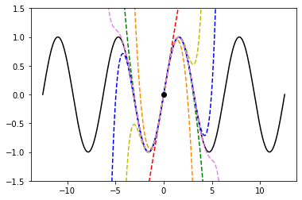
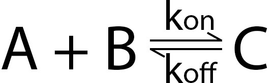
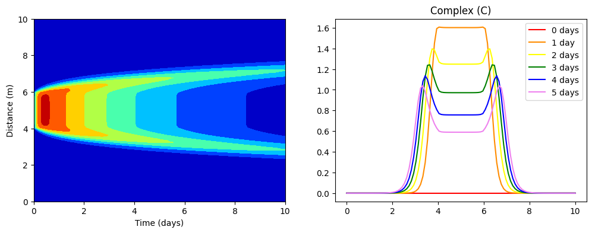

.. role:: raw-html(raw)
   :format: html

Module 2: Building Mathematical Models
======================================

This section will introduce you to the basics of mathematical modeling in biological contexts using differential equations. We will also cover numerical methods for how to utilize these equations in computational practice, as well as some common equation templates that you may be able to modify and apply to model your own systems of interest.

2.1: Modeling with Differential Equations
-----------------------------------------

One of the most common types of equations found in engineering and scientific modeling is the *differential equation*, a type of equation that models change by relating changing quantities within the system. Differential equations relate an unknown function to it's own derivatives. These equations can get quite complex, and we will not cover all of the nuances of solving these equations in this book. Please see our resources section if you would like to learn more about them on your own. However, it *is* critical for our purposes to discuss how to construct these sorts of equations, as well as how to use them computationally.

Many of the systems that we will be looking at in this book can be modeled using a type of equation known as the ordinary differential equation. Ordinary differential equations (ODE) are equations where the derivatives are taken with respect to only one variable. That is, there is only one independent variable. Partial differential equations (PDE), on the other hand, are equations that depend on partial derivatives of several variables. That is, there are several independent variables. 

**Some examples of ordinary differential equations:**

* Exponential growth: :math:`\dfrac{d C}{d t} = kC`
* Mechanical Vibration: :math:`m\dfrac{d^2 x}{d t}+c\dfrac{d x}{d t}+kx = f(t)`

**Some examples of partial differential equations:**

* Transport equation: :math:`\dfrac{\partial C}{\partial t} + \dfrac{\partial J}{\partial x} = 0`
* Diffusion reaction: :math:`\dfrac{\partial C}{\partial t} = D\dfrac{\partial C^2}{\partial x^2} + R_c`

To the non-mathematician, these equations can seem very complicated at face value, and some of them certainly can be! However, the process by which these equations are constructed is fairly intuitive once you've seen it a few times. So let's go over a couple of examples.

Population Dynamics
~~~~~~~~~~~~~~~~~~~

As discussed above, differential equations are used to model the time rate of change of a quantity (or quantities) when the value of the quantity itself determines the rate of change. The time rate of change of a variable can be represented with the following notation:

:math:`\dfrac{dX}{dt} = \text{...}`

Where :math:`X` is the quantity of interest and :math:`t` is time. The :math:`d` in front represents that this is a derivative of :math:`X` with respect to time (:math:`t`). Note that the value in the denominator does not necessarily have to be time. In many cases it will be, but the :math:`dx \text{/} dy` format can be used to represent the value of the derivative of any x with relation to any y. Setting up an equation this way essentially defines it as a differential equation. The right hand side of the equation will include :math:`X` somewhere. The easiest way to make sense of the idea here is to look at a specific example. 

One of the most classic examples of the differential equation formula is population dynamics modeling. In population growth, for example, the rate of growth of the population depends on the number of people (or other reproducing entities) at any given time. If the population is small, the rate of growth will be small. If the population is large, the rate of growth will be large. Therefore, if the population starts small and becomes large, the rate of change will increase with the population. The rate of change at a given time is dependent on the population *at that time*. Let's set up an equation to represent this. Like our general example above, our time rate of change of population (:math:`P`) can be defined as:

:math:`\dfrac{dP}{dt} = \text{...}`

In many simple population models, we consider the growth rate of the population as proportional to the population itself by some constant value (which usually must be determined through observational and/or experimental data). With the addition of this "rate constant," our equation becomes:

:math:`\dfrac{dP}{dt} = kP`

where :math:`P` is the population and :math:`k` represents the constant growth rate (i.e., constant of proportionality). This is a very simple model, but the important thing to remember is that as the population increases, so does the time rate of change of the population. So the relationship is ultimately non-linear. To find the population at a given time, this equation can be solved analytically by using known values (from measurement data) to find the value of :math:`k`. The population can then be predicted at a chosen time using the complete equation. However, the purpose of this course is to teach you how to use computer models to work with these equations as differential models (i.e., without always having to solve them directly). The next several sections of this module will introduce a method for using differential equations without having to solve for their exact forms first. But before we move on, let's look at one more quick example.

Newton's Law of Cooling
~~~~~~~~~~~~~~~~~~~~~~~

Newton's Law of Cooling, as originally proposed by Sir Issac Newton in his Scala Graduum Caloris, states that the rate of cooling (temperature decrease) of a warmed object is proportional to the difference between the temperature of the object and the temperature of the surrounding environment. In other words, as the object cools, the time rate of change of the object's temperature slows. Like our population example, we'll start with our time rate of change of the cooling object. 

:math:`\dfrac{dT}{dt} = \text{...}`

Where :math:`T` is the temperature of the cooling object. For the right hand side, we use a similar approach to the population example. We have a constant of proportionality (rate constant), :math:`k`, and our difference in temperature :math:`(T-T_\text{env})`.

:math:`\dfrac{dT}{dt} = k(T-T_\text{env})`

Since we are using this equation to represent cooling (i.e., the object is warmer than the surroundings), we need our rate constant to reflect a decrasing time rate of change of temperature. One way to do this by simply remembering to use a negative value for the rate constant. However, to better represent the observed behavior in the equation itself, we can simply make :math:`k` negative in the general form.

:math:`\dfrac{dT}{dt} = -k(T-T_\text{env})`

This way, we can maintain the convention of rate constants being positive and we (or anyone else using the equation) don't have to remember that k is negative. Note that with this formulation, the equation still works as expected if the object is cooler than the environment, as :math:`T-T_\text{env}` will result in a negative value, resulting in a positive when multiplied by :math:`k`, thus representing increasing temperature change.

This equation can also be solved analytically to predict the temperature at a certain time. For a walkthrough of how to do that, please reference these two videos: `How to Solve <https://youtu.be/IICR-w1jYcA?si=2YBiCyh7aku9qMXz>`_ and `Example application <https://youtu.be/jH5qflAe3C8?si=ZgLvwAxIoE18Ki_7>`_.

These are two fairly simple equations of first-order differential equations, but hopefully it gives some insight into how these types of equation models are constructed. Next, let's look at one more example of a second order differential equation and how it is derived. 

**[Mechanical Vibration example coming 02/24/25]**

Again, we are not going to spend much time on the technicalities of *solving* differential equations in this module. While knowing how to solve these equations can be useful, many can be very difficult and time consuming to solve by hand. Luckily, there are numerical methods that can be used to circumvent the exact solutions of many differential equations and allow them to be applied in their differentiated state. Module 3 will show you how to use the finite difference method in combination with computational tools to approximate solutions to very complex systems of equations that either do not have analytical solutions or are too complicated to solve by hand. Next, we will discuss a bit about partial differential equations, followed by an introduction of the Finite Difference Method for approximating solutions to unsolved differential equations.

2.2: Partial Differential Equations
-----------------------------------

* This section contains a number of programming activities that can be done in tandem with the content. To view this section as a fully interactive Jupyter notebook, `click here <https://drive.google.com/file/d/1nS54t9ZGx-v2EFugSC7V-1gEIEEjdpPI/view?usp=sharing>`_

Often mathematical models require the evaluation of complex partial differential equation (PDE) which will not necessarily have an analytical solution. A prime example of this is fluid flow, which can only be solved analyticaly in a few extremely restricted cases. We approximate the continuous, analytical solution with a discrete, numerical solution, in which we solve the PDEs over a series of discrete points related by the governing PDEs.

This is analogous to how we used Euler's method (a discrete, numerical method) to approximate the continuous solutions to ODEs.
    
For example, if we wanted to evaluate the transport of a drug in a large artery it would be nearly impossible to evaluate an analytical solution, especially if using a detailed geometry. Instead, we can find a numerical solution by discretizing the simple rectangular geometry into an array of nodes, Fig 1A. 

Then we define the mathematical model that will be solved over this discretized space, and the boundary/initial conditions. For the below model the mathematical model is a variation of the Navier-Stokes equations, while the inital condition is that the fluid is at rest (no fluid flow). The boundary condition on the left side is a pulsatile horizontal velocity, and on the right boundary there is a free flow boundary.

The solution for the horizontal fluid velocity is shown in Fig 1B and the drug in Fig 1C.

   
   Figure 1A: Array of nodes discritizing the rectangular geometry with length 20 and width 2.
   
.. figure:: images/numericalSolutionPDE_files/fig1b.gif
   :figwidth: 100%
   :align: center
   :alt: node grid
   
   Figure 1B: Horizontal fluid velocity.
   
.. figure:: images/numericalSolutionPDE_files/fig1c.gif
   :figwidth: 100%
   :align: center
   :alt: node grid
   
   Figure 1C: Drug concentration.  

Reactive-diffusive Transport
~~~~~~~~~~~~~~~~~~~~~~~~~~~~

To develop our skills in numerical solutions of PDEs, we will begin by examining the equation describing reactive-diffusive transport. However, the numerical methods described in this collaboratory are also applicable to other PDEs arising from biological systems.

The equation describing the diffusion and reaction of a substance can be written as:

.. math:: \frac{\partial C}{\partial t} = (D\frac{\partial C^2}{\partial x^2}) + R_C
   
where:
   * :math:`C` **:** concentration
   * :math:`D` **:** diffusion coefficient
   * :math:`x` **:** spatial location
   * :math:`t` **:** time
   * :math:`R_C` **:** change in concentration due to reaction
   
First, let's explore what each term represents. Based on the concept that a dissolved particle will move from a region of high to low concentraton at a rate proportional to the concentration we derive Fick's First Law:

.. math:: J = -D\frac{d C}{d x}

Where J is the diffusion flux, C is the concentrion of a diffusing particle, and D is the diffusion coefficient (Fig 2A).

We then need to apply continuity for one spatial dimension (Fig 2B):

.. math:: \frac{\partial C}{\partial t} +  \frac{\partial J}{\partial x} = R_c
    
Substituting in the equation for Ficks First law we have:

.. math:: \frac{\partial C}{\partial t} - \frac{\partial}{\partial x}(D\frac{\partial C}{\partial x}) = R_c \qquad or \qquad \frac{\partial C}{\partial t} =  \frac{\partial}{\partial x}(D\frac{\partial C}{\partial x}) + R_c
    
If we know that the diffusivity of the material is constant then we can reduce the equation to:

.. math:: \frac{\partial C}{\partial t} = D\frac{\partial C^2}{\partial x^2} + R_c

   
   Figure 2: Flux as a function of concentration and distance.
   
Now that we have the governing differential equation we need to develop a numerical model for evaluating it over space and time given a set of initial conditions (:math:`C[x,t=0]`) and boundary conditions (:math:`C[0,t]`).

This means we need a way to write discretized forms of both differentials in our reaction-diffusion equation above: :math:`\large\frac{\partial C}{\partial t}` and :math:`\large\frac{\partial C^2}{\partial x^2}`. The next section will show us in detail how to do that.

2.3: The Finite Difference Method
---------------------------------

One of the oldest and well developed numerical methods is the finite difference method (FDM). For simplicity we will start with one spatial dimension :math:`x` and one temporal dimension :math:`t`, and describe concentration as  :math:`C(x,t)`. The discritized space will be indexed by :math:`i`, and time with :math:`n`.

We will first obtain a difference expression for the first order time differential :math:`\large\frac{\partial C}{\partial t}`.
    
Let's consider an unknown function :math:`u(x,t)` discritized over time, :math:`t`, Fig 3.

      
   Figure 3: Time differential of u

For now let's focus only on the time dimension, so assume that we are looking at the value of :math:`u` at a single spatial point :math:`x_i`, and simply write :math:`u(t)` for this section. 

Taylor Series is an approximation of a function by the sum of an infinite series of differential terms. So for our function :math:`u(t)`, we could approximate the value of u(t), where t is near some reference time :math:`a`, as:
    
.. math: u(t) = u(a) + u'(a)(t-a)+\frac{u"(a)}{2!}(t-a)^2+\frac{u^{(3)}(a)}{3!}(t-a)^{3}+...+\frac{u^{(n)}(a)}{n!}(t-a)^n+...

Where :math:`u'(a)` represents :math:`\large\frac{\partial u}{\partial t}`, :math:`u''(a)` represents :math:`\large\frac{\partial^2 u}{\partial t^2}`, etc.

To understand the above equation fully, let's look at an example:

If we examine the function :math:`u(t) = sin(t)` with the differential terms centered around a = 0, we can reduce the above general equation to:

.. math:: u(t) = t - \frac{t^3}{3!} + \frac{t^5}{5!} - \frac{t^7}{7!} + \frac{t^9}{9!} - \frac{t^{11}}{11!}.....

As we increase the number of terms the approximation becomes closer to the actual function as shown in the plot below.

.. code-block:: python
   
   # example for increasing number of Taylor series terms to show how it affects accuracy
   import numpy as np
   import matplotlib.pyplot as plt
   import math as ma
   
   t = np.linspace(-4*np.pi,4*np.pi,1000)
   f1 = t 
   f2 = t - (t**3)/(ma.factorial(3))
   f3 = t - (t**3)/(ma.factorial(3)) + (t**5)/(ma.factorial(5))
   f4 = t - (t**3)/(ma.factorial(3)) + (t**5)/(ma.factorial(5)) - (t**7)/(ma.factorial(7))
   f5 = t - (t**3)/(ma.factorial(3)) + (t**5)/(ma.factorial(5)) - (t**7)/(ma.factorial(7)) + (t**9)/(ma.factorial(9))
   f6 = t - (t**3)/(ma.factorial(3)) + (t**5)/(ma.factorial(5)) - (t**7)/(ma.factorial(7)) + (t**9)/(ma.factorial(9)) - (t**11)/(ma.factorial(11))
   
   plt.plot(t,np.sin(t),'k')
   plt.plot(t,f1,'r--')
   plt.plot(t,f2,color='darkorange',linestyle='--')
   plt.plot(t,f3,'y--')
   plt.plot(t,f4,'g--')
   plt.plot(t,f5,'b--')
   plt.plot(t,f6,color='violet',linestyle='--')
   plt.plot(0,0,'ok')
   plt.ylim(-1.5,1.5)
   

This form of approximation requires a lot of information about the function, typically more than we know. Therefore we will need to truncate all but one of the differential terms and then iterate the function across a domain.

Let's return to our first order differential, :math:`\frac{\partial u}{\partial t}` that we are trying to approximate numerically. Using the definition of the Taylor series expansion given above, and remember that we decided to index time with :math:`n`, the function :math:`u(t)` can be approximated by:

1. Setting :math:`a` equal to time :math:`n`, and :math:`t` equal to time :math:`n+1` to get expression T1 below, and
2. Setting :math:`a` equal to time :math:`n`, and :math:`t` equal to time :math:`n-1` to get expression T2 below.
    

Show for yourself that these series expansions give:

**T1**: 

.. math:: \large u_{n+1} = u_n + \Delta t \frac{\partial u}{\partial t} +  \frac{(\Delta t)^2}{2} \frac{\partial ^2 u}{\partial t^2}+  \frac{(\Delta t)^3}{6} \frac{\partial ^3 u}{\partial t^3} + (...)

**T2**: 

.. math:: \large u_{n-1} = u_n - \Delta t \frac{\partial u}{\partial t} +  \frac{(\Delta t)^2}{2} \frac{\partial ^2 u}{\partial t^2}-  \frac{(\Delta t)^3}{6} \frac{\partial ^3 u}{\partial t^3} + (...)

Finite difference method for first order derivatives (reaction)
~~~~~~~~~~~~~~~~~~~~~~~~~~~~~~~~~~~~~~~~~~~~~~~~~~~~~~~~~~~~~~~

Now looking at expressions T1 and T2 above, you should see that we have some terms that contain differentials (:math:`\frac{\partial u}{\partial t}`, :math:`\frac{\partial ^2 u}{\partial t^2}`, etc), and some terms representing function values at discrete intervals (:math:`u_n`, :math:`u_{n+1}`, etc.). So we are getting closer to finding a discrete representation for our differentials. In this section we will use expressions T1 and T2 to obtain **3 finite difference schemes** for first order differentials.

* Forward Euler, a.k.a. Explicit Euler (this should look very familiar)
* Backward Euler, a.k.a. Implicit Euler
* 1st Order Central method

If we truncate T1 and T2 to remove all terms with differentials higher than first order. 

T1: 

.. math:: \large u_{n+1} = u_n + \Delta t \frac{\partial u}{\partial t} + O(\Delta t)

T2: 

.. math:: \large u_{n-1} = u_n - \Delta t \frac{\partial u}{\partial t} + O(\Delta t)

It is important to note that this introduces a truncation error :math:`O(\Delta t)`

If you now rearrange T1 and T2 to solve for the first order differential terms, you will obtain the forward and backward Euler method, respectively:

.. math::
   \large \text{Forward Euler Method:} \quad \frac{\partial u}{\partial t} = \frac{u_{n+1}-u_n}{\Delta t}

   \large \text{Backward Euler Method:} \quad \frac{\partial u}{\partial t} = \frac{u_{n}-u_{n-1}}{\Delta t} 

Show for yourself, that if you leave the truncation error terms in while rearranging the equation, then as the the step size :math:`\Delta t` approaches zero so does the truncation error: :math:`\frac{O(\Delta t)}{\Delta t}`.

The Forward and Backward Euler Methods can be visualized as:

   
   **Figure 4:** Visualization of Forward/Backward Euler Methods
   
Now that we've seen how the forward and backward Euler method can be derived using Taylor expansions, there is one more finite difference scheme we can derive. 

If we reduce T1 by T2 (i.e. take T1 - T2) we obtain the 1st order central difference method, which has a second order truncation error :math:`O(\Delta t^2)`. 

.. math:: \text{1st Order Central Method} \frac{\partial u}{\partial t} = \frac{u_{n+1}-u_{n-1}}{2\Delta t} 

Now we have walked through three different ways you can discretize a first order differential term whenever you encounter it in any equation representing your biological system of interest. 

**Important**: Please note that we derived these approaches for a function :math:`u(x,t)` discretized over time. However, the same schemes also apply for :math:`u(x,t)` discritized over space, i.e., :math:`\frac{\partial u}{\partial x}`. You would simply replace the time index :math:`n` by the space index :math:`i`, and the time increment :math:`\Delta t` with the space increment :math:`\Delta x`.

Finite difference method for first order derivatives (reaction) - In practice
~~~~~~~~~~~~~~~~~~~~~~~~~~~~~~~~~~~~~~~~~~~~~~~~~~~~~~~~~~~~~~~~~~~~~~~~~~~~~

Solving ODEs: Protein Binding Reaction

Now that we have developed a few numerical schemes for numerical solution let's put them to use, and solve a system of ODEs. In this system protein A binds to receptor B forming protein-receptor complex C. The reaction is reversible and the forward and reverse rate constants are :math:`k_{on}` and :math:`k_{off}` respectively.

   
We can write a system of ODEs to represent the above reaction:

.. math::

   \large\frac{d A}{d t} =  k_{off} [C] - k_{on} [A] [B]

   \large\frac{d B}{d t} =  k_{off} [C] - k_{on} [A] [B]

   \large\frac{d C}{d t} =  k_{on} [A] [B] - k_{off} [C]

Note: You can review the Mass Balance Collaboratory notebook for more on how these equations are constructed.
  
To solve these ODEs we rewrite each equation by substituting our Forward Euler Method for the derivatives on the left side of the equations and then rewriting them so that all the future (n+1) concentrations are on the left side of the equation, while all the past (n) terms are on the right side. Putting this in to a loop for iterating through time we have:

**EE1**:

.. math::

   A^{n+1} = A^{n} + dt*[koff*C^n - kon*A^n*B^n]

   B^{n+1} = B^{n} + dt*[koff*C^n - kon*A^n*B^n]

   C^{n+1} = C^{n} + dt*[kon*A^n*B^n - koff*C^n]

**Extra practice**: To get more comfortable with these approaches, write the analogous relationships using the Backward Euler as well as the 1st order central method. How do they differ?

**Extra, extra practice**: Code all three finite difference methods (forward Euler (given), backward Euler and 1st order central method). How do the results differ for a given time step :math:`\Delta t`?

Now let's bring the mathematics to life by solving them computationally. We first need to define initial condition otherwise our equations are underdetermined with six unknowns(:math:`u^{n+1}` and :math:`u^n`) and three equations. The intial condition gives us a starting point reducing the unknowns to three (:math:`u^{n+1}`) so we can propagate the solution through time.

Given the code below add your equations for :math:`A^{n+1}`, :math:`B^{n+1}` and :math:`C^{n+1}` into the for loop which interates from 0 to nt-1 (final time point) and solve!

.. code-block:: python
   
   nt = 10 #number of time points
   Lt = 1 #time the model runs for

   # Python function linspace(a,b,c) is used to create a linear array with initial point a, final point b, 
   # and total number of points,c.
   # for example np.linspace(0,10,5) = [0,2.5,5,7.5,10]
   t = np.linspace(0,Lt,nt) #the model is solved over the time vector t
   dt = Lt/nt # step size through time
   kon = 1 #binding rate
   koff = 0.001 #dissociation rate

   Ca = np.zeros(nt) #initialize concentration A
   Cb = np.zeros(nt) #initialize concentration B
   Cc = np.zeros(nt) #initialize concentration C

   Ca[0] = 1 #initial condition (A starts time with a concentration of 1)
   Cb[0] = 5 #initial condition
   Cc[0] = 0 #initial condition

   # Now we can create the model, we will iterate through time with the index n
   # Python for construct iterates integer values from a to b given range(a,b) 
   for n in range(0,nt-1):

Now that you have your solution, let's plot it!

.. code-block:: python

   # Now we are plotting our solution to learn more go to:
   # https://matplotlib.org/users/pyplot_tutorial.html
   fig = plt.figure(1, figsize = (6,4))
   plt.plot(t,Ca,'bo-',label='[A]')
   plt.plot(t,Cb,'yo-',label='[B]')
   plt.plot(t,Cc,'go-',label='[C]')
   plt.title('Forward Euler Method: Simple Reaction')
   plt.legend(loc='best')
   plt.show()

You should get a figure that looks like this:

   
It is important to note that the solution is stable for small number of points, however later this will not be the case and we will revisit the subject of stablilty and the importance of selecting the correct numerical scheme.

Finite difference method for second order derivatives (diffusion)
~~~~~~~~~~~~~~~~~~~~~~~~~~~~~~~~~~~~~~~~~~~~~~~~~~~~~~~~~~~~~~~~~

As we transition to the next phase, please take a look back at the section above titled "Reactive-diffusive transport". There we introduced the PDE that we need to solve for a system where biological molecules are diffusing and reacting at the same time. 

.. math:: \frac{\partial C}{\partial t} = D\frac{\partial C^2}{\partial x^2} + R_c

Up until now we've dealt with how to approximate the first order time derivative :math:`(\frac{\partial C}{\partial t})` and how to incorporate any reaction terms :math:`(R_c)`. In this section we will figure out how to approximate the second order spatial derivative :math:`(\frac{\partial C^2}{\partial x^2})` that describes diffusive mass transport.

For a homogeneous material we can use the Taylor Expansion, or for a nonhomogeneous material we could take the spatial derivative of the 1st order central equation to conserve the change in the diffusivity of the material with respect to space.

As we did for the first order differential above, we will create an expression for the second order derivative by relating T1 and T2, however, this time we want to keep the second order differential and lose the first order differential. Start by writing T1 and T2 in terms of spatial discretization, :math:`\Delta x` with spatial indices :math:`i`. 

**T1**: 

.. math:: \large u_{i+1} = u_i + \Delta x \frac{\partial u}{\partial x} +  \frac{(\Delta x)^2}{2} \frac{\partial ^2 u}{\partial x^2}+  \frac{(\Delta x)^3}{6} \frac{\partial ^3 u}{\partial x^3} + (...)

**T2**: 

.. math:: \large u_{i-1} = u_i - \Delta x \frac{\partial u}{\partial x} +  \frac{(\Delta x)^2}{2} \frac{\partial ^2 u}{\partial x^2}-  \frac{(\Delta x)^3}{6} \frac{\partial ^3 u}{\partial x^3} + (...)

Next, as we did before remove all terms with differentials higher than **second** order. We obtain:

**T1**: 

.. math:: \large u_{i+1} = u_i + \Delta x \frac{\partial u}{\partial x} +  \frac{(\Delta x)^2}{2} \frac{\partial ^2 u}{\partial x^2} +  O(\Delta x^2)

**T2**: 

.. math:: \large u_{i-1} = u_i - \Delta x \frac{\partial u}{\partial x} +  \frac{(\Delta x)^2}{2} \frac{\partial ^2 u}{\partial x^2} +  O(\Delta x^2)

Show for yourself, that if we add **T1** and **T2**, and rearrange the terms so that the spatial derivative is on the left side we obtain:

.. math:: \large\frac{\partial u^2}{\partial x^2} = \frac{u_{i+1}- 2u_i + u_{i-1}}{\Delta x^2} \quad \text{2nd Order Central Method}
  
So now that we have a way to numerically resolve first and second order differentials, let's ignore reaction for a moment and consider the non-conserverd diffusion equation:

.. math:: \frac{\partial u}{\partial t} = D\frac{\partial^2 u}{\partial x^2}
    
where :math:`u` is the concentration of a diffusible protein, and :math:`D` is the homogeneous diffusivity coefficient.

We will start with using the Explicit (Forward) Euler Scheme to resolve time and the 2nd Order Central Method to resolve the spatial differential. Substituting the approximations for these two methods into our PDE, we obtain the following finite difference method:

.. math:: \text{FDM1:} \quad \frac{u^{n+1}_i-u^n_i}{\Delta t} = D\frac{u^n_{i+1}- 2u^n_i + u^n_{i-1}}{\Delta x^2}

Note: Make sure that you understand where these substitutions are coming from in preceding parts of this notebook.

Finite difference method for second order derivatives (diffusion) - In Practice
~~~~~~~~~~~~~~~~~~~~~~~~~~~~~~~~~~~~~~~~~~~~~~~~~~~~~~~~~~~~~~~~~~~~~~~~~~~~~~~

The algorithm we developed to solve a system of ODEs can be modified to consider two dimensions. The algorithm from the first order derivatives will be used to consider iterations through time, see the stencils below.

   
To evaluate the spatial differential we will combine the above stencils with our 2nd Order Central Method for space to get the stencils below. Note that another name for the Forward Euler is the Explicit Euler (EE) and the Backward Euler is known as the Implicit Euler (IE) method.

   
To solve the first order Explicit Euler (EE-1), and second order central method (CM-2) simultaneously, we use the following algorithm:

#. advance time
#. iterate through space
#. repeat

In the diagrams above, this equates to moving up one step, then iterating left to right through space, and repeating.

Begin by rewriting the equation FDM1 so that all the future :math:`n+1` terms (unknowns) are on the left, and all the past :math:`n` terms (known) are on the right, to obtain:

.. math:: u^{n+1}_i = u^n_i +   \frac{D \Delta t}{\Delta x^2} (u^n_{i+1}- 2u^n_i + u^n_{i-1})

Now we need to decide on boundary and initial conditions in order to evaluate the system.

We set our boundary conditions so that there is no flux out of the system. By solving the first point as:

.. math:: u^{n+1}_i = u^n_i + \frac{D \Delta t}{\Delta x^2} (u^n_{i+1}- u^n_i )

or 

.. math:: u^{n+1}_0 = u^n_0 + \frac{D \Delta t}{\Delta x^2} (u^n_{1}- u^n_0 )

and the last point as:

.. math:: u^{n+1}_i = u^n_i + \frac{D \Delta t}{\Delta x^2} (-u^n_i + u^n_{i-1})

or

.. math:: u^{n+1}_{nx} = u^n_{nx} + \frac{D \Delta t}{\Delta x^2} (-u^n_{nx} + u^n_{nx-1})

**Practice:** Show for yourself, how these equations arise from the general one given above. 

In the cell below we code the algorithms outlined above for a system where a fixed concentration :math:`(1 \mu M)` of our substance :math:`u` is added in the center of a thin channel of length 10. The code solves the diffusion equation to determine the concentraiton of :math:`u` at each location along the length of the channel over time.

**Important**: confirm for yourself where each of equations within the for loops come from in the notes above.

.. code-block:: python

   import numpy as np
   import matplotlib.pyplot as plt
   import math as ma
   
   nx = 100 
   nt = 10000 # number of nodes in time
   Lx = 10 # spatial length of model
   Lt = 10 # duration of model
   dx = Lx/nx # step size in space
   dt = Lt/nt # step size in time
   x = np.linspace(0,Lx,nx) # vector for the space the model is solved over
   t = np.linspace(0,Lt,nt) # vector for the time the model is solver over
   
   D_sub = 1e-1 # diffusivity of the substrate (constant)
   
   Cu = np.zeros((nx,nt)) # initialize concentration of u
   Cu[int(0.4*nx):int(0.6*nx),0] = 1 # inital conditions for u
   
   # iterate through time with n
   for n in range(0,nt-1):
   #   iterate through space with i
       for i in range(1,nx-2):
   #       Boundary Conditions for model
           Cu[0,n+1] = Cu[0,n] + dt*(D_sub*(Cu[0,n]-2*Cu[0,n]+Cu[1,n])/dx**2)
           Cu[nx-1,n+1] = Cu[nx-1,n] + dt*(D_sub*(Cu[nx-2,n]-2*Cu[nx-1,n]+Cu[nx-1,n])/dx**2)
   #       iterateing through interior nodes 
           Cu[i,n+1] = Cu[i,n] + dt*(D_sub*(Cu[i+1,n]-2*Cu[i,n]+Cu[i-1,n])/dx**2)
   
   # let's plot all of space for days 0,1,2,3,4, and 5
   fig = plt.figure(1, figsize = (6,4))
   plt.plot(x,Cu[:,0],'red',label='0 days')
   plt.plot(x,Cu[:,int(1/Lt*nt)],'darkorange',label='1 day')
   plt.plot(x,Cu[:,int(2/Lt*nt)],'yellow',label='2 days')
   plt.plot(x,Cu[:,int(3/Lt*nt)],'green',label='3 days')
   plt.plot(x,Cu[:,int(4/Lt*nt)],'blue',label='4 days')
   plt.plot(x,Cu[:,int(5/Lt*nt)],'violet',label='5 days')
   plt.legend(loc='best')
   plt.show
   
   # contour plots are great too
   # for more information visit:
   # https://jakevdp.github.io/PythonDataScienceHandbook/04.04-density-and-contour-plots.html
   fig = plt.figure(2, figsize = (6,4))
   plt.contourf(t,x,Cu,cmap='jet')
   plt.xlabel('Time (days)')
   plt.ylabel('Distance (m)')
   plt.show()
   

.. image:: images/numericalSolutionPDE_files/numericalSolutionOfPDE_51_1.png

When developing computational simulations one is always looking for ways to speed up the model without sacrificing accuracy, one way to is vectorize the above model to get rid of the spatial for loop construct. Python syntax may make this tricky, so lets do some simple exercises using vectorized indexing. Let's look at the array A = [1,2,3,4,5], note that in Python the indexing starts at 0 so A[0] = 1 and A[4] = 5.

If we want to select the second to last value INCLUDING THE LAST VALUE we will write: A[1:]

However, if we don't want to include the last term try: A[1:-1] this is all of our interior points.

If we want the first value up to the last point we will write A[:-1]

.. code:: 

    A = [1,2,3,4,5];
    A[1:],A[1:-1],A[:-1]

.. parsed-literal::

    ([2, 3, 4, 5], [2, 3, 4], [1, 2, 3, 4])
   
Using vector notation replace the for loop that iterates through space. Instead we define BCs, then calculate the interior nodes with Cu[1:-1,n+1] = ...). Note: for interior nodes think about the first index, what are the values of the neighboring point, what about the last?) How does this effect the outcome?

.. code-block:: python

   import numpy as np
   import matplotlib.pyplot as plt
   import math as ma
   
   nx = 100 # number of nodes in space
   nt = 10000 # number of nodes in time
   Lx = 10 # spatial length of model
   Lt = 10 # duration of model
   dx = Lx/nx # step size in space
   dt = Lt/nt # step size in time
   x = np.linspace(0,Lx,nx) # vector for the space the model is solved over
   t = np.linspace(0,Lt,nt) # vector for the time the model is solver over
   
   D_sub = 1e-1 # diffusivity of the substrate (constant)
   
   Cu = np.zeros((nx,nt)) # initialize concentration of u
   Cu[int(0.4*nx):int(0.6*nx),0] = 1 # inital conditions for u
   
   # We will keep the for construct for time, however we are now getting rid of the loop for space
   # in Python vector[0] refers to the first point, while vector[-1] refrences the very last point
   for n in range(0,nt-1):
       Cu[0,n+1] = Cu[0,n] + dt*(D_sub*(Cu[0,n]-2*Cu[0,n]+Cu[1,n])/dx**2)
       Cu[-1,n+1] = Cu[nx-1,n] + dt*(D_sub*(Cu[nx-2,n]-2*Cu[nx-1,n]+Cu[nx-1,n])/dx**2)
   # to iterate through the spatial points we will start with the first non BC node which is 1 and iterate to the second to last node 
   # this looks like vector[1:-1]
   # what is tricky about this syntax is Python iterates UP TO THE last point but does not include it, for example given:
   # A = [1,2,3,4,5]
   # A[1:-1] = [2,3,4]
   # which is all the interior nodes
   # for each of these nodes we need to consider the node to the left, which looks like vector[2:], and the node to the 
   # right , vector[:-2]. For example:
   # A[2:] = [3,4,5]
   # A[:-2] = [1,2,3]
   # So no our problem looks like:
       Cu[1:-1,n+1] = Cu[1:-1,n] + dt*(D_sub*(Cu[2:,n]-2*Cu[1:-1,n]+Cu[:-2,n])/dx**2)
       
   # let's plot all of space for days 0,1,2,3,4, and 5
   fig = plt.figure(1, figsize = (6,4))
   plt.plot(x,Cu[:,0],'red',label='0 days')
   plt.plot(x,Cu[:,int(1/Lt*nt)],'darkorange',label='1 day')
   plt.plot(x,Cu[:,int(2/Lt*nt)],'yellow',label='2 days')
   plt.plot(x,Cu[:,int(3/Lt*nt)],'green',label='3 days')
   plt.plot(x,Cu[:,int(4/Lt*nt)],'blue',label='4 days')
   plt.plot(x,Cu[:,int(5/Lt*nt)],'violet',label='5 days')
   plt.legend(loc='best')
   plt.show
   
   # contourf plots are great too
   # for more information visit:
   # https://jakevdp.github.io/PythonDataScienceHandbook/04.04-density-and-contour-plots.html
   fig = plt.figure(2, figsize = (6,4))
   plt.contourf(t,x,Cu,cmap='jet')
   plt.xlabel('Time (days)')
   plt.ylabel('Distance (m)')
   plt.show()
   

   
Finite difference method for PDEs - Combining reaction and diffusion
~~~~~~~~~~~~~~~~~~~~~~~~~~~~~~~~~~~~~~~~~~~~~~~~~~~~~~~~~~~~~~~~~~~~

Now that we have looked at reaction and diffusion individually, we have the tools to approach the problem:

.. math:: \frac{\partial u}{\partial t} = (D\frac{\partial u^2}{\partial x^2}) + R_c

where represents some protein of interest.
    
Let's consider the reaction term to be:

.. math::

   \frac{d A}{d t} =  k_{off} [C] - k_{on} [A] [B]
   
   \frac{d B}{d t} =  k_{off} [C] - k_{on} [A] [B]
   
   \frac{d C}{d t} =  k_{on} [A] [B] - k_{off} [C] - k_{deg}[C]

And A is the only protein that is diffusing.

These equations have been used to model the formation of morphogen (A) gradients through tissue as the morphogens bind to unbound receptors (B). These bound receptors (C) are then often internalized or degraded by the cell.

Combine the numerical reaction (EE1) and diffusion equations (FDM1), and rewrite them so that the unknowns are isolated.

.. math::

   A^{n+1}_i = A^{n}_i + \frac{D \Delta t}{\Delta x^2} (A^n_{i+1}- 2A^n_i + A^n_{i-1}) + \Delta t(k_{off}C^n_i - k_{on}A^n_iB^n_i)
   
   B^{n+1}_i = B^{n}_i + \Delta t(k_{off}C^n_i - k_{on}A^n_iB^n_i)
   
   C^{n+1}_i = C^{n}_i + \Delta t(k_{on}A^n_iB^n_i - k_{off}C^n_i - k_{deg}C^n_i)
   
In the cell below we code the solution algorithm solving the diffusion and reaction PDE. In this case a fixed concentration (10) of A is added to the center of a thin channel of length 10. The channel is coated with cells that express receptor B, and that internalize and degrade bound receptor complexes C.

**Important:** Make sure you understand what each term in the for loop statements represent (diffusion, binding, degradation etc.).

.. code-block:: python

   import numpy as np
   import matplotlib.pyplot as plt
   import math as ma

   nx = 100 # number of nodes in space
   nt = 10000 # number of nodes in time
   Lx = 10 # spatial length of model
   Lt = 10 # duration of model
   dx = Lx/nx # step size in space
   dt = Lt/nt # step size in time
   x = np.linspace(0,Lx,nx) # vector for the space the model is solved over
   t = np.linspace(0,Lt,nt) # vector for the time the model is solver over
   
   D_sub = 1e-1 # diffusivity of the substrate (constant)
   kon = 1 #binding rate
   koff = 0.001 #dissociation rate
   kdeg = 0.25 #degradation rate of bound receptor
   
   Ca = np.zeros((nx,nt)) #initialize concentration A
   Cb = np.zeros((nx,nt)) #initialize concentration B
   Cc = np.zeros((nx,nt)) #initialize concentration C
   
   Ca[int(0.4*nx):int(0.6*nx),0] = 10 # inital conditions for u
   Cb[:,0] = 2 #initial condition
   Cc[:,0] = 0 #initial condition
   
   # We will keep the for construct for time, however we are now getting rid of the loop for space
   # in Python vector[0] refers to the first point, while vector[-1] refrences the very last point
   for n in range(0,nt-1):
       Ca[0,n+1] = Ca[0,n] + dt*(D_sub*(Ca[0,n]-2*Ca[0,n]+Ca[1,n])/dx**2) + dt*(koff*Cc[0,n] - kon*Ca[0,n]*Cb[0,n])
       Ca[-1,n+1] = Ca[nx-1,n] + dt*(D_sub*(Ca[nx-2,n]-2*Ca[nx-1,n]+Ca[nx-1,n])/dx**2) + dt*(koff*Cc[nx-1,n] - kon*Ca[nx-1,n]*Cb[nx-1,n])
       
       Ca[1:-1,n+1] = Ca[1:-1,n] + dt*(D_sub*(Ca[2:,n]-2*Ca[1:-1,n]+Ca[:-2,n])/dx**2) + dt*(koff*Cc[1:-1,n] - kon*Ca[1:-1,n]*Cb[1:-1,n])
       Cb[:,n+1] = Cb[:,n] + dt*(koff*Cc[:,n] - kon*Ca[:,n]*Cb[:,n])
       Cc[:,n+1] = Cc[:,n] + dt*(kon*Ca[:,n]*Cb[:,n] - koff*Cc[:,n] - kdeg*Cc[:,n])
       
       
   # let's plot all of space for days 0,1,2,3,4, and 5
   fig = plt.figure(1, figsize = (12,4))
   plt.subplot(121)
   plt.plot(x,Ca[:,0],'red',label='0 days')
   plt.plot(x,Ca[:,int(1/Lt*nt)],'darkorange',label='1 day')
   plt.plot(x,Ca[:,int(2/Lt*nt)],'yellow',label='2 days')
   plt.plot(x,Ca[:,int(3/Lt*nt)],'green',label='3 days')
   plt.plot(x,Ca[:,int(4/Lt*nt)],'blue',label='4 days')
   plt.plot(x,Ca[:,int(5/Lt*nt)],'violet',label='5 days')
   plt.title('Morphogen (A)')
   plt.legend(loc='best')
   plt.subplot(122)
   plt.plot(x,Cb[:,0],'red',label='0 days')
   plt.plot(x,Cb[:,int(1/Lt*nt)],'darkorange',label='1 day')
   plt.plot(x,Cb[:,int(2/Lt*nt)],'yellow',label='2 days')
   plt.plot(x,Cb[:,int(3/Lt*nt)],'green',label='3 days')
   plt.plot(x,Cb[:,int(4/Lt*nt)],'blue',label='4 days')
   plt.plot(x,Cb[:,int(5/Lt*nt)],'violet',label='5 days')
   plt.title('Unbound Receptor (B)')
   plt.legend(loc='best')
   plt.show
   
   # contour plots are great too
   # for more information visit:
   # https://jakevdp.github.io/PythonDataScienceHandbook/04.04-density-and-contour-plots.html
   fig = plt.figure(2, figsize = (12,4))
   plt.subplot(121)
   plt.contourf(t,x,Cc,cmap='jet')
   plt.xlabel('Time (days)')
   plt.ylabel('Distance (m)')
   plt.subplot(122)
   plt.plot(x,Cc[:,0],'red',label='0 days')
   plt.plot(x,Cc[:,int(1/Lt*nt)],'darkorange',label='1 day')
   plt.plot(x,Cc[:,int(2/Lt*nt)],'yellow',label='2 days')
   plt.plot(x,Cc[:,int(3/Lt*nt)],'green',label='3 days')
   plt.plot(x,Cc[:,int(4/Lt*nt)],'blue',label='4 days')
   plt.plot(x,Cc[:,int(5/Lt*nt)],'violet',label='5 days')
   plt.title('Complex (C)')
   plt.legend(loc='best')
   

   
Further tools to accelerate computation of finite difference methods
~~~~~~~~~~~~~~~~~~~~~~~~~~~~~~~~~~~~~~~~~~~~~~~~~~~~~~~~~~~~~~~~~~~~

In this final section, we return to the example code that tracks diffusion in the absence of reaction in order to illustrate some further strategies for simplifying and accelerating computation of finite difference schemes. Our previous approach of vector indexing made the code way quicker! But you have may noticed how we rearranged the equations so that the unknowns and knowns were on opposite sides of the equation, and that we can easily use linear algebra and matrix manipulation to solve the system:

.. math:: \text{[A]} {u^{n+1}} = \text{[B]} {u^n}

where [A] and [B] are operator matrices derived from the diffusion equation, see figure below.

For the EE-1, CM-2:

The spatial operator B is a tridiagonal matrix of size nx by nx, the diagonals are defined as :math:`b_{i-1}`, :math:`b_i`, and  :math:`b_{i+1}`.
While the operator A is a monodiagonal matrix of size nx by nx, the diagonals are defined as :math:`a_i`, see figure below

Matrix A and B can are derived from the numerical stencil that we previously solved. Now lets look at the right side panel below. This should look familiar, because this is what we have been solving above. We just need to rewrite it into the form [A]{:math:`u^{n+1}`} = [B]{:math:`u^n`}.

Start by rewriting the numerical diffusion in the left panel in terms of the unknowns on the left side and the known on the right. Next isolate each of the index function to its own term, see the last line in the right panel. Each term represents a diagnonal.

   
.. code-block:: python

   import numpy as np
   import matplotlib.pyplot as plt
   import math as ma

   nx = 100 # number of nodes in space
   nt = 10000 # number of nodes in time
   Lx = 10 # spatial length of model
   Lt = 10 # duration of model
   dx = Lx/nx # step size in space
   dt = Lt/nt # step size in time
   x = np.linspace(0,Lx,nx) # vector for the space the model is solved over
   t = np.linspace(0,Lt,nt) # vector for the time the model is solver over

   D_sub = 1e-1 # diffusivity of the substrate (constant)

   Cu = np.zeros((nx,nt)) # initialize concentration of u
   Cu[int(0.4*nx):int(0.6*nx),0] = 1 # inital conditions for u

   sig_R = np.zeros(nx) # right diagonal for [B]
   sig_L = np.zeros(nx) # left diagonal for [B]
   sig_C = np.zeros(nx) # central diagonal for [B]

   A = np.zeros((nx,nx)) # initialize A
   B = np.zeros((nx,nx)) # initialize B

   Cu_past = np.zeros((nx,nt)) #inital array for known terms, right side of the equation or B*C^n

   # interior nodes
   sig_R[1:] = (dt/dx**2)*D_sub
   sig_C[1:-1] = 1 - 2*(dt/dx**2)*D_sub
   sig_L[:-1] = (dt/dx**2)*D_sub
   # boundary conditions
   sig_C[0] = 1 -(dt/dx**2)*D_sub
   sig_C[-1] = 1 -(dt/dx**2)*D_sub

   # to build A and B we can use Pythons diag function
   # np.diag(a,b) vector a is diagonalized into an matix of the len(a)X len(a)
   # each diagonal is offset by b, so for the central diagonal b=0, for right b=1, for left b = -1
   A = np.diag(np.ones(nx),0)
   B = np.diag(sig_L[:-1],-1) + np.diag(sig_C[:],0) + np.diag(sig_R[1:],1)
      
   # now we iterate through time with index n
   for n in range(0,nt-1):
   #   we take the dot product of B*Cu^n using Python dot function
      Cu_past = B.dot(Cu[:,n])
   #   we solve the equation [A]u^n+1 = Cu_past by inverting A on both sides
   #   this is done with the Python linalg.solve
      Cu[:,n+1] = np.linalg.solve(A,Cu_past)
      
   # let's plot all of space for days 0,1,2,3,4, and 5
   fig = plt.figure(1, figsize = (6,4))
   plt.plot(x,Cu[:,0],'red',label='0 days')
   plt.plot(x,Cu[:,int(1/Lt*nt)],'darkorange',label='1 day')
   plt.plot(x,Cu[:,int(2/Lt*nt)],'yellow',label='2 days')
   plt.plot(x,Cu[:,int(3/Lt*nt)],'green',label='3 days')
   plt.plot(x,Cu[:,int(4/Lt*nt)],'blue',label='4 days')
   plt.plot(x,Cu[:,int(5/Lt*nt)],'violet',label='5 days')
   plt.legend(loc='best')
   plt.show

   # contour plots are great too
   # for more information visit:
   # https://jakevdp.github.io/PythonDataScienceHandbook/04.04-density-and-contour-plots.html
   fig = plt.figure(2, figsize = (6,4))
   plt.contourf(t,x,Cu,cmap='jet')
   plt.xlabel('Time (days)')
   plt.ylabel('Distance (m)')
   plt.show()

   # We can look at our opperator space by splotting the spy, every block that is black contains
   # a value while white is empty
   fig = plt.figure(3, figsize = (10,4))
   plt.subplot(121)
   plt.spy(A[0:10,0:10])
   plt.title('spy of Matrix A')
   plt.subplot(122)
   plt.spy(B[0:10,0:10])
   plt.title('spy of Matrix B')

.. image:: images/numericalSolutionPDE_files/numericalSolutionOfPDE_62_0.png

.. image:: images/numericalSolutionPDE_files/numericalSolutionOfPDE_62_1.png

Linear algebra also allows us to solve diffusion implicitly, by solving for the spatial differential in the future and solve simultaneously for all future points. This makes the solution unconditionaly stable!

.. math::

   \color{green}{\frac{-D \Delta t}{\Delta x^2}} \color{red}{u^{n+1}_{i+1}} \color{black}{+} \color{green}{(1 + 2 \frac{D \Delta t}{\Delta x^2})} \color{red}{u^{n+1}_{i}} \color{black}{+} \color{green}{\frac{-D \Delta t}{\Delta x^2}} \color{red}{u^{n+1}_{i-1}} \color{black}{=} \color{green}{u^n_i}

.. centered:: *Note:* :raw-html:`<i>Known Unknown</i>`

.. code-block:: python
   
   import numpy as np
   import matplotlib.pyplot as plt
   import math as ma
   
   # =============================================================================
   # Uniform Mesh
   # =============================================================================
   nx = 100
   nt = 10000
   Lx = 10
   Lt = 10
   dx = Lx/nx
   dt = Lt/nt
   D_sub = 1e-1
   r_a0 = 1
   r_b0 = 1
   x = np.linspace(0,Lx,nx)
   t = np.linspace(0,Lt,nt)

   Ca = np.zeros((nx,nt))
   Cb = np.zeros((nx,nt))
   D = np.zeros(nx)

   sig_R = np.zeros(nx)
   sig_L = np.zeros(nx)
   sig_C = np.zeros(nx)

   A = np.zeros((nx,nx))
   B = np.zeros((nx,nx))

   Ca_past = np.zeros((nx,nt))
   Cb_past = np.zeros((nx,nt))

   D[:] = D_sub
   Ca[int(0.4*nx):int(0.6*nx),0] = r_a0

   Ca[0] = 0
   Ca[nx-1] = 0
   Cb[0] = 0
   Cb[nx-1] = 0
      
   # interior nodes
   sig_R[1:] = -(dt/dx**2)*D_sub
   sig_C[1:-1] = 1 + 2*(dt/dx**2)*D_sub
   sig_L[:-1] = -(dt/dx**2)*D_sub
   # boundary conditions
   sig_C[0] = 1 +(dt/dx**2)*D_sub
   sig_C[-1] = 1 +(dt/dx**2)*D_sub

   B = np.diag(np.ones(nx),0)
   A = np.diag(sig_L[:-1],-1) + np.diag(sig_C[:],0) + np.diag(sig_L[1:],1)

   for n in range(0,nt-1):
      Ca_past = B.dot(Ca[:,n])
      Ca[:,n+1] = np.linalg.solve(A,Ca_past)

   # let's plot all of space for days 0,1,2,3,4, and 5
   fig = plt.figure(1, figsize = (6,4))
   plt.plot(x,Ca[:,0],'red',label='0 days')
   plt.plot(x,Ca[:,int(1/Lt*nt)],'darkorange',label='1 day')
   plt.plot(x,Ca[:,int(2/Lt*nt)],'yellow',label='2 days')
   plt.plot(x,Ca[:,int(3/Lt*nt)],'green',label='3 days')
   plt.plot(x,Ca[:,int(4/Lt*nt)],'blue',label='4 days')
   plt.plot(x,Ca[:,int(5/Lt*nt)],'violet',label='5 days')
   plt.legend(loc='best')
   plt.show

   # contourf plots are great too
   # for more information visit:
   # https://jakevdp.github.io/PythonDataScienceHandbook/04.04-density-and-contour-plots.html
   fig = plt.figure(2, figsize = (6,4))
   plt.contourf(t,x,Ca,cmap='jet')
   plt.xlabel('Time (days)')
   plt.ylabel('Distance (m)')
   plt.show()

   # We can look at our opperator space by splotting the spy, every block that is black contains
   # a value while white is empty
   fig = plt.figure(3, figsize = (10,4))
   plt.subplot(121)
   plt.spy(A[0:10,0:10])
   plt.title('spy of Matrix A')
   plt.subplot(122)
   plt.spy(B[0:10,0:10])
   plt.title('spy of Matrix B')

