Module 3: Implementing Simulations
==================================

In the previous module, we discussed how to take our conceptual models and use them to create mathematical representations of the system. The next step in using our models is to import them into a framework that allows us to study them with simulations. Often, the terms "model and "simulation" are used somewhat interchangeably in discussion of computational methods. However, it is important to distinguish between the two, as there are important differences. Everything that we have discussed up to this point has been with regard to the creation of biological models. As discussed in Module 1, a model is a representation of a real-world system which captures how certain inputs affect/produce specific outputs. This module will show how to build computer simulations out of your models.

A simulation, then, is a construct that allows you to run a model with given inputs in order to make predictions about the expected output(s). A simulation implements a model, allowing the model to generate data and/or other information about the system under study.

For the purposes of this module, all of our simulations will be implemented directly in Python code. We will discuss some other more complex and more purpose-built simulation frameworks in later modules.

As we discussed in Module 1, the most common method of running a simulation is through iterative code, or the loops of a program as introduced in Section 0.3. By translating our equations into computer code and nesting them into an algorithm that represents the model, we can "run" the model by iteratively executing the code. In almost all cases, the variable being "iterated over" is time, as most of our scientific questions will be centered around how a system behaves over time. 

3.1: Executing Equations (Running Models)
-----------------------------------------

To show what this process of iterative model running looks like, let's consider an example. In the last module, we discussed how to model a simple bacterial population growth with differential equations. Our basic differetial equation was: 

.. math:: \dfrac{dP}{dt} = kP

To set up the first part of our example, let's approach modeling this in its difference equation form:

.. math:: dP = kP(dt)

With this form, we can write a short Python program to run a finite difference estimation of our model (as discussed in Module 2.3). To do this, we can start with a simple while loop program that will "run" the difference equations until the simulation hits a specified time.

.. literalinclude:: code/module3/populationGrowth1.py
   :language: python

When run with the parameters listed above, the output should look like this:

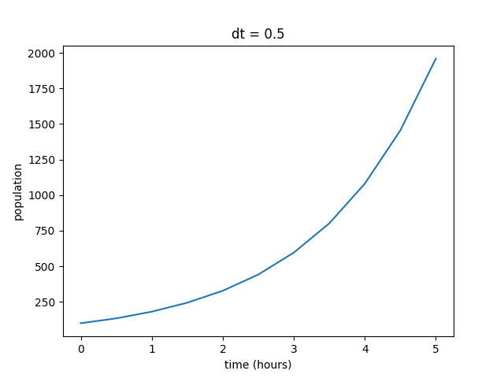

You can see that the output does exhibit the exponential growth that we expected from the model. As the population increases, there are more organisms to reproduce, hence the increasing rate. However, even though the behavior of the function is what we predicted, we can't be sure if these values are realistic without some sort of external reference. For this example, we have the luxury of a relatively straightfoward solved version of the equation to compare the estimated version against. As a reminder, our differential equation for simple population growth has the solution set:

.. math:: P(t) = Ce^{kt}

In Module 2.1, we solved the equation for a bacterial colony that started at 100 cells and had doubled in population after 1 hour, giving the exact solution of:

.. math:: P(t) = 100*e^{0.693147(t)}

Using the exact form calculated from our hypothetical bacterial colony, we can plot the values using the same loop as before. We can then plot them alongside our estimated values for comparison.

.. literalinclude:: code/module3/populationGrowth2.py

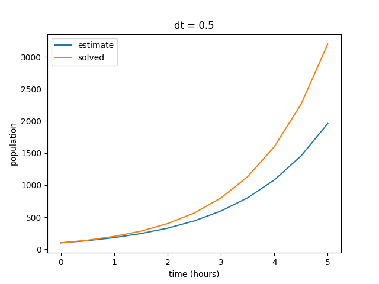

When compared to our solved values, we can see that our estimate is not exactly what we expect from the model. Our estimated values skew low, although they exhibit the same general behavior. Remember that our finite difference estimate is constructed by calculating the instantaneous slope at each point in the plot and projecting out the next point, rather than plotting a collection of solved points. In other words, each point in the estimated curve is calculated based on the previous value, so small inaccuracies in the model become amplified over time. In this case, the end result is a signficantly lower final value after the elapsed time of five hours.

Several factors can affect the accuracy of our estimates, but one of the most common ways to improve the accuracy of our models is to shorten the time step (:math:`dt`). In general, smaller time steps will increase the accuracy of any simulation (assuming that your math is correct, of course). Right now, our time step is pretty large at 0.5 hours per step. We are effectively only estimating our change in value ten times over the course of five hours. So let's test some different time steps and see how it changes the simulation. First, we can start by decreasing :math:`dt` to 0.1, resulting in 50 total steps.

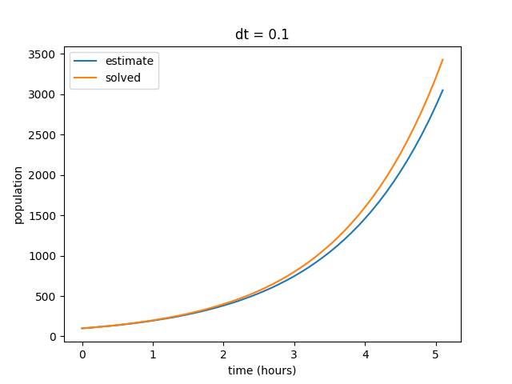

Notice that as we decrease our time step, the curves begin to align. Also note that our final value for the solved data set does not change, but the final value for our estimates curve does. **[EDITOR'S NOTE: Bug in code logic is causing images not to reflect this statement; will be fixed by next update.]** We can repeat this by decreasing the time step value even further to show that our estimate increasingly reflects the solved curve at smaller values of :math:`dt`.

.. image:: images/module3_files/populationGrowth2_output3.png

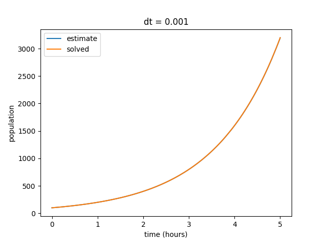

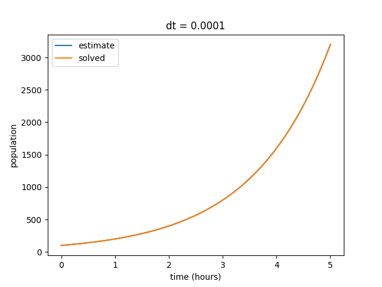

We also observe that as our :math:`dt` gets smaller, the discrepency in final estimated value also becomes much smaller. Eventually our estimated and solved curves are virtually identical.

.. csv-table:: Final Output Values
   :file: code/module3/populationGrowth_outputValues.csv
   :widths: 50 50 50 50
   :header-rows: 1

This general format of program is how we will model many phenomenon using computation. The exact methods for how the calculations at each step are performed may differ across simulations, but the core process of repeating a set of calculations across a series of time steps will remain the same.

3.2: Model Specification and Parameterization
---------------------------------------------

In the previous section, we briefly discussed how important it is to start with good initial values for your problem. However, one of the ever-present challenges of computational modeling is determining what "good" starting values are. This process of identifying which values to use to initialize your simulation is known as "parameterization." This section will introduce some methods for selecting parameters, some approaches to optimizing your chosen parameters, and some discussion of fitting parameters to existing data.

3.2.1: Parameterization
~~~~~~~~~~~~~~~~~~~~~~~

A model has a structure (see Section 2.2) and a set of parameters. It's predictive output (and usefulness) depends on both. For a given model structure, the behavior of a biochemical or regulatory networks is determined by the value of its parameters. We’ve seen how these parameters determine the quantitative/qualitative behavior of the model. Next, we need to start asking how "good" our model is when compared to real-world data? Does it adequately describe known behavior of the system? Can the model be used to make predictions that align with real-world observations?

Parameter Fitting is used to answer questions about the adequacy of our model:

* How can we determine the values of unknown parameters from experimental data? (parameter identification)
* How well does the model reproduce the data? (goodness of fit)
* How much confidence should we have in our estimated parameter values (uncertainty quantification)?
* How good is the model for making predictions (validity)?

"Fitting" a model means adjusting parameters until its behavior matches(?) known experimental data. A model predicts a set of metrics based on experimentally measurable variables of behaviors from a set of experimentally controllable (or naturally varying, or inferable) parameters and a model structure

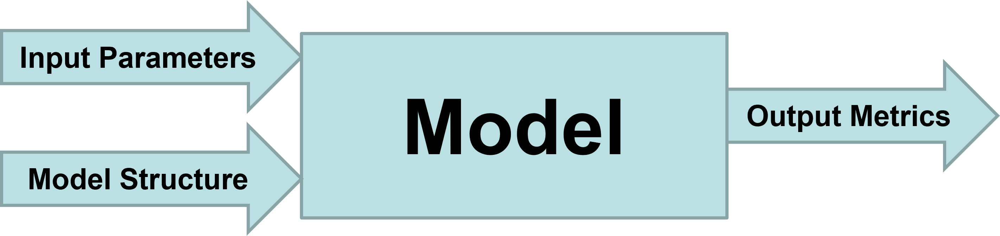

Classical optimization assumes we know the model structure but don’t know the parameters, but in biology we often don’t know the model structure. In many cases, we may need to use ensembles of models. For now, we will just focus on single models with single parameter sets.

3.2.2: Selecting Parameters
~~~~~~~~~~~~~~~~~~~~~~~~~~~

**[Updating: 04/21/25]**

3.2.3: Assessing "Goodness"
~~~~~~~~~~~~~~~~~~~~~~~~~~~

**[Updating: 04/21/25]**

3.2.4: Parameter Fitting & Optimization
~~~~~~~~~~~~~~~~~~~~~~~~~~~~~~~~~~~~~~~

For a particular model structure, we want to know which parameters values make the model predictions agree best with observed data. For this best set of parameters, how well does the model fit the data? To do this fitting, we need: model, data, decision about what parameters will be varied, function that quantifies the difference between data and model prediction, a max tolerance for the distance between model prediction and data.

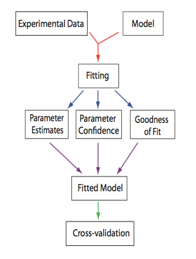
   
   From *Systems Biology: Introduction to Pathway Modeling*, H. Sauro (p. 170).

The good news is that we no longer have to do all of this optimization by hand. We can use optimization packages to help speed up the process. A numerical optimizer generates a series of parameter sets and then for each one computes the distance between the predicted and observed and eventually returns a parameter set that minimizes the distance (error is less than the tolerance). Optimizers follow different search strategies: deterministic vs stochastic, sequential vs parallel, local vs global. The basic steps of numerical optimization are as follows:

#. Read Target Data
#. Decide on the model structure
#. Decide which parameters to change in the model
#. Create a function that calculates a difference (residual/cost function) between the target data and the model predictions at the same time points for the parameters passed to it
#. Tell the optimizer which methods to use, which residual function to use, what parameters to vary and what initial values they should have and what their allowed ranges are
#. Invoke the optimizer--some do optimization in steps so you can see how the optimization is happening, some just go away and either succeed or fail

Let's work through a simple example. Suppose we have data on the concentration of chemical species :math:`S` over time. From the data and our previous knowledge, we propose a model where :math:`S` decays exponentially at a rate :math:`k_1`.

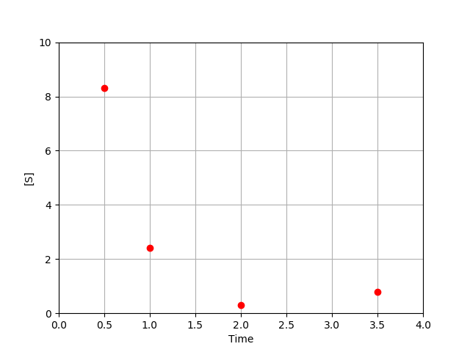

For each value of :math:`k_1`, the model predicts the concentration of :math:`S` at each time.

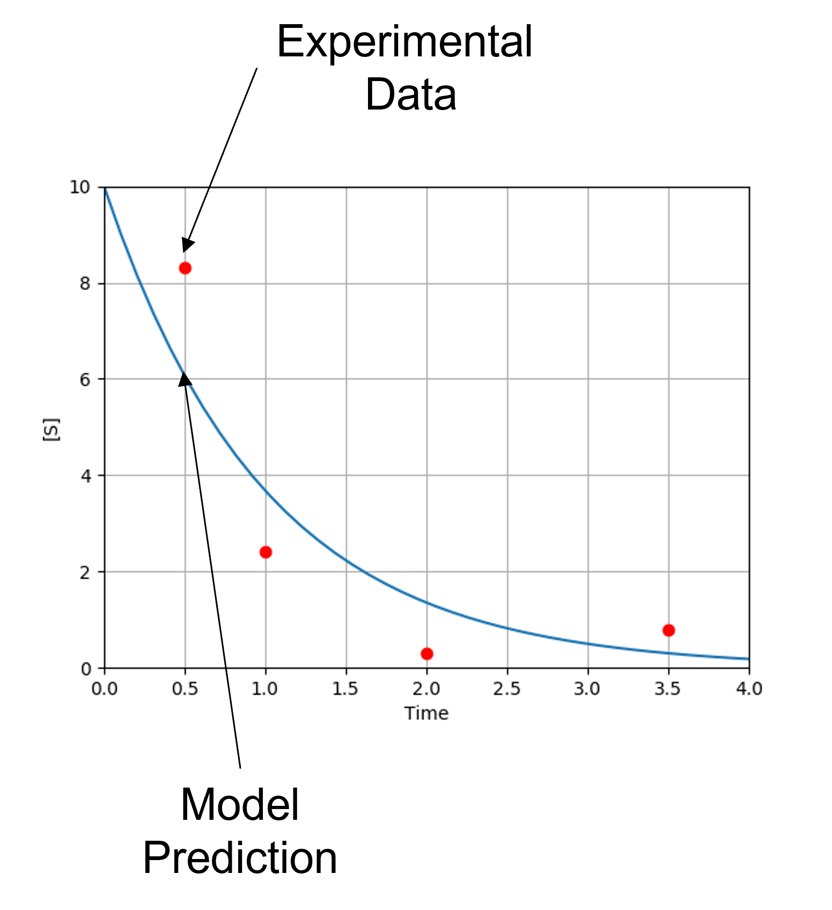

Note that our model currently predicts the overall trend of our experimental data, but does not match the observed behavior exactly. Each experimental point lies some distance from the model predictions. These distances are referred to as *residuals* (:math:`e_i`), which can be calculated for each point. Keep in mind that we often have multiple parameters, each with their own residual values.

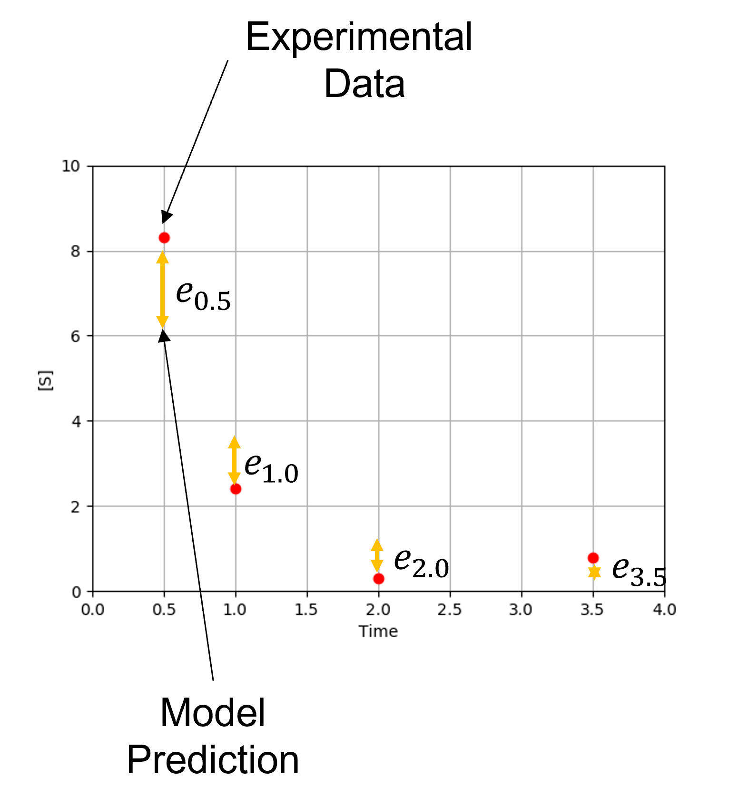

In order for our model to make more reliable predictions, we want to adjust the parameter values :math:`{k_j}` to minimize the difference between predicted and observed values. Since differences vary from point to point, we need to decide what metric to use to determine the total difference. 

*. To start, we will call our data points :math:`(x_i,y_i)` and our model :math:`f(x;{k_j})`
*. For a given value of :math:`k_1` and time :math:`x_i`, :math:`f` returns the predicted value :math:`y_i^m=f(x_i;{k_j})`
*. The difference between each data point and the prediction is: :math:`e_i=y_i−f(x_i;{k_j})`
*. An **objective function** or cost function :math:`g{e_i}` aggregates all such differences. Note that if :math:`g{e_i}` just summed the differences, positive and negative differences would cancel each other out.

The most common objective function is chi-square, the sum of squared differences.

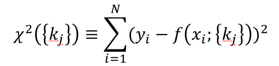

3.3: Common Simulation Methodologies (And Their Applications)
-------------------------------------------------------------

This section will introduce several different approaches to running simulations and where they are most appropriately applied. This list is not meant to be exhaustive; just to illustrate the various ways that computational methods can be used to represent different types of real-world phenomena.