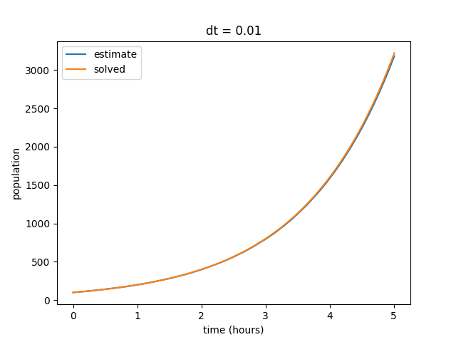
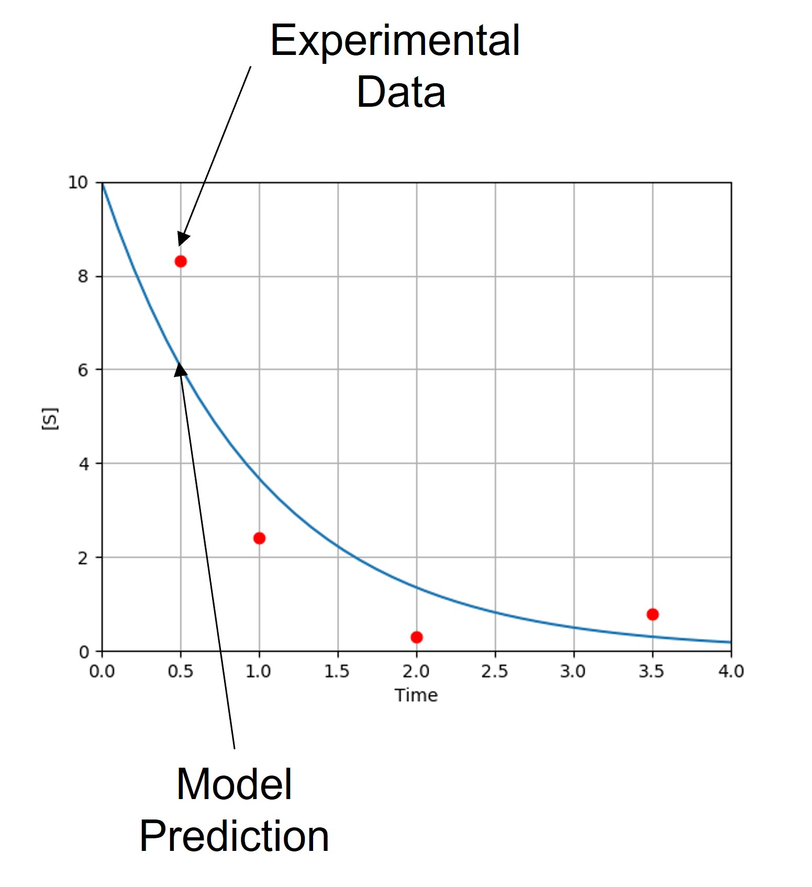
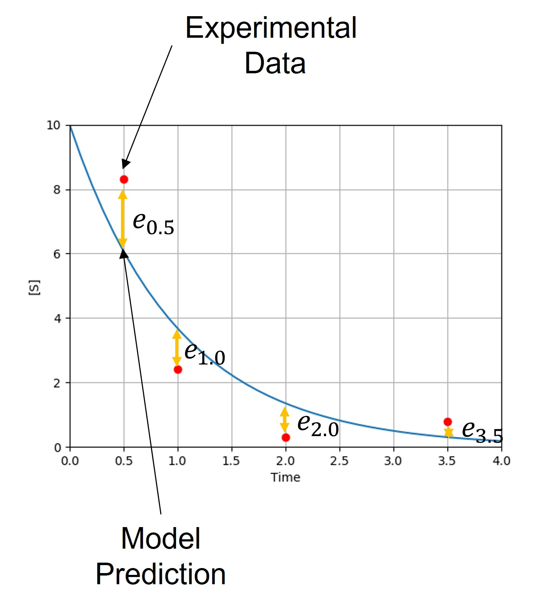
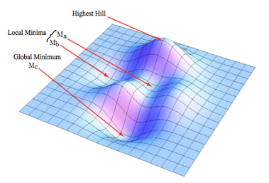
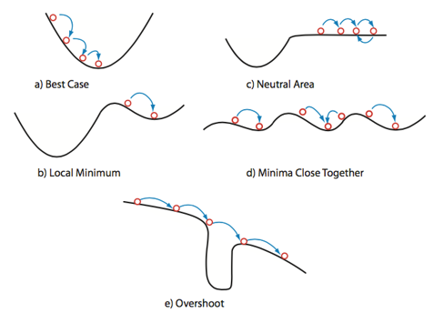
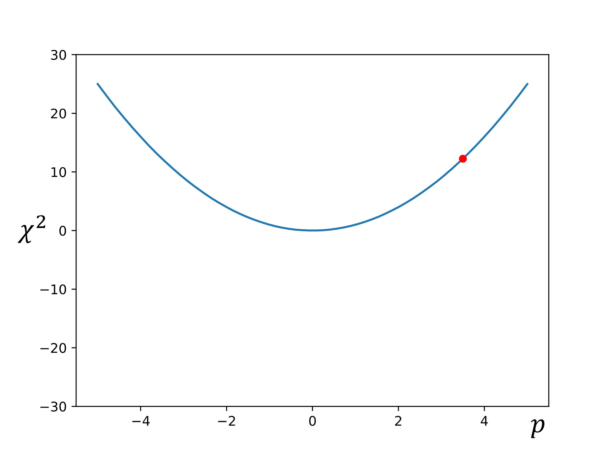
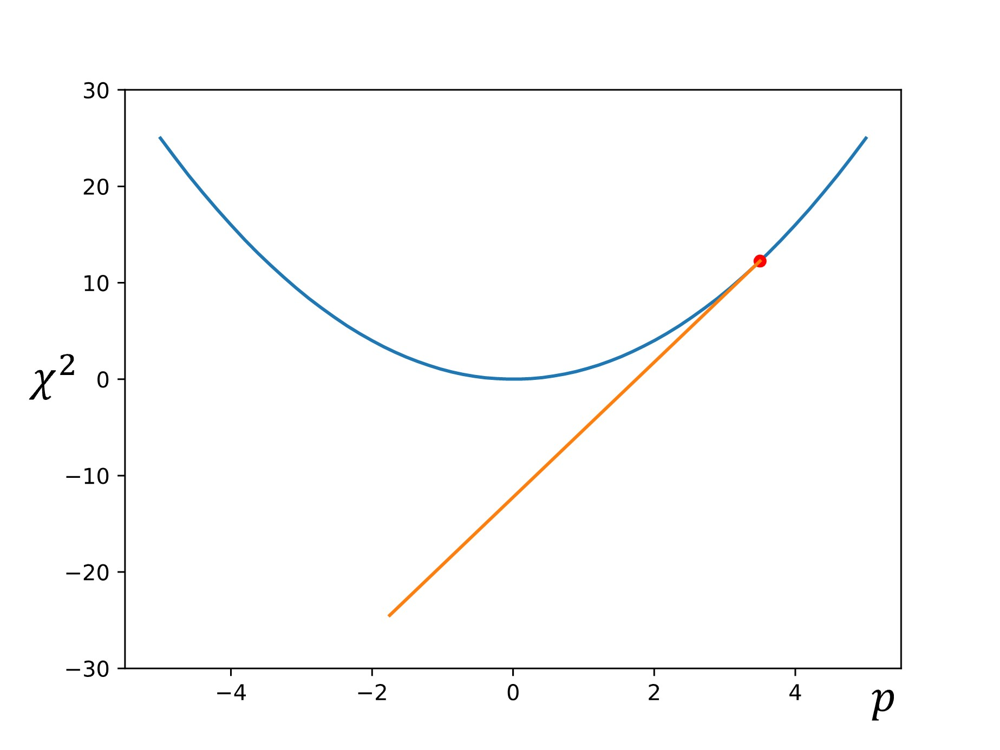
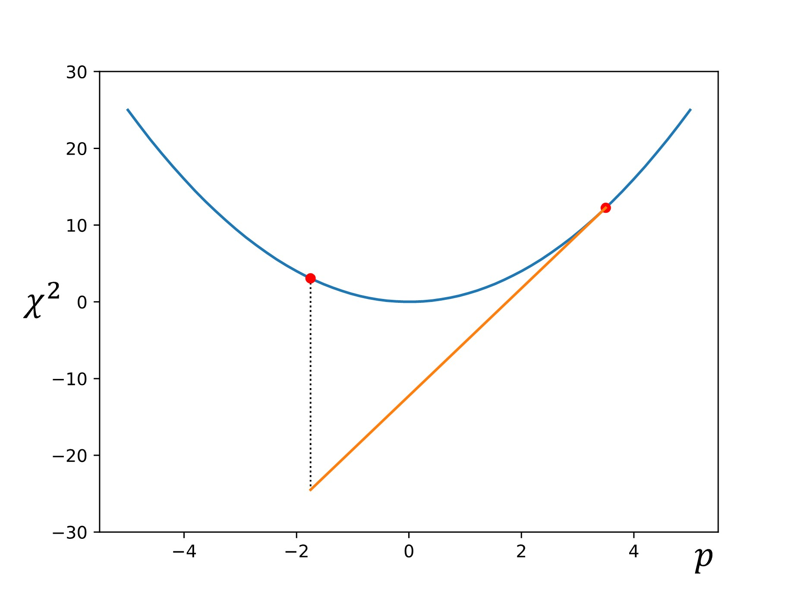
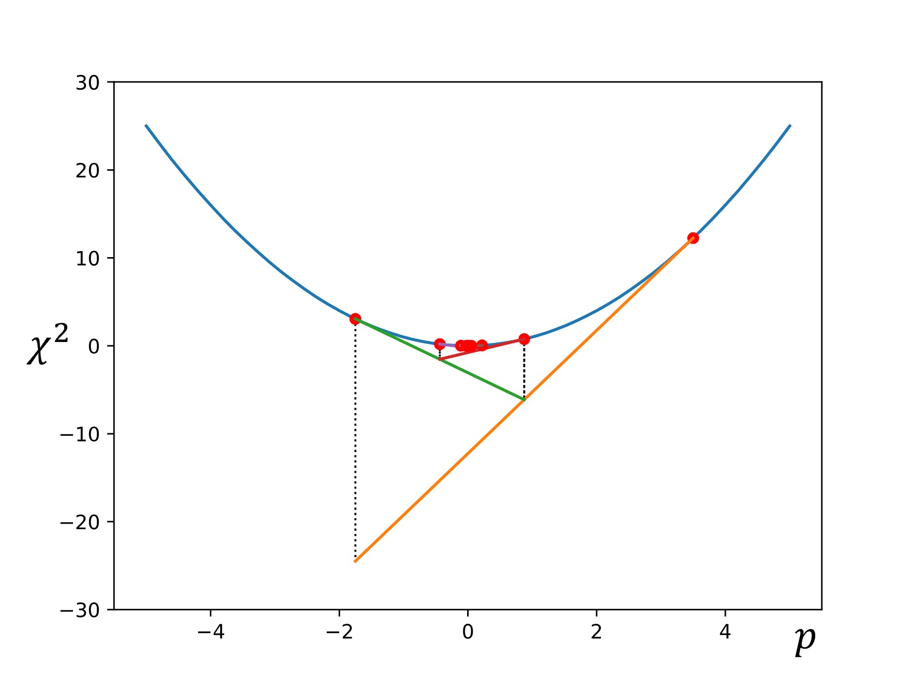
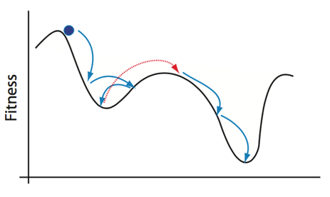

Module 3: Implementing Simulations
==================================

In the previous module, we discussed how to take our conceptual models and use them to create mathematical representations of the system. The next step in using our models is to import them into a framework that allows us to study them with simulations. Often, the terms "model and "simulation" are used somewhat interchangeably in discussion of computational methods. However, it is important to distinguish between the two, as there are important differences. Everything that we have discussed up to this point has been with regard to the creation of biological models. As discussed in Module 1, a model is a representation of a real-world system which captures how certain inputs affect/produce specific outputs. This module will show how to build computer simulations out of your models.

A simulation, then, is a construct that allows you to run a model with given inputs in order to make predictions about the expected output(s). A simulation implements a model, allowing the model to generate data and/or other information about the system under study.

For the purposes of this module, all of our simulations will be implemented directly in Python code. We will discuss some other more complex and more purpose-built simulation frameworks in later modules.

As we discussed in Module 1, the most common method of running a simulation is through iterative code execution, or the loops of a program as introduced in Section 0.3. By translating our equations into computer code and nesting them into an algorithm that represents the model, we can "run" the model by iteratively executing the code. In almost all cases, the variable being "iterated over" is time, as most of our scientific questions will be centered around how a system behaves over time. 

3.1: Executing Equations (Running Models)
-----------------------------------------

To show what this process of iterative model running looks like, let's consider an example. In the last module, we discussed how to model a simple bacterial population growth with differential equations. Our basic differetial equation was: 

.. math:: \dfrac{dP}{dt} = kP

To set up the first part of our example, let's approach modeling this in its difference equation form:

.. math:: dP = kP(dt)

With this form, we can write a short Python program to run a finite difference estimation of our model (as discussed in Module 2.3). To do this, we can start with a simple while loop program that will "run" the difference equations until the simulation hits a specified time.

.. literalinclude:: code/module3/populationGrowth1.py
   :language: python

When run with the parameters listed above, the output should look like this:

You can see that the output does exhibit the exponential growth that we expected from the model. As the population increases, there are more organisms to reproduce, hence the increasing rate. However, even though the behavior of the function is what we predicted, we can't be sure if these values are realistic without some sort of external reference. For this example, we have the luxury of a relatively straightfoward solved version of the equation to compare the estimated version against. As a reminder, our differential equation for simple population growth has the solution set:

.. math:: P(t) = Ce^{kt}

In Module 2.1, we solved the equation for a bacterial colony that started at 100 cells and had doubled in population after 1 hour, giving the exact solution of:

.. math:: P(t) = 100*e^{0.693147(t)}

Using the exact form calculated from our hypothetical bacterial colony, we can plot the values using the same loop as before. We can then plot them alongside our estimated values for comparison.

.. literalinclude:: code/module3/populationGrowth2.py

When compared to our solved values, we can see that our estimate is not exactly what we expect from the model. Our estimated values skew low, although they exhibit the same general behavior. Remember that our finite difference estimate is constructed by calculating the instantaneous slope at each point in the plot and projecting out the next point, rather than plotting a collection of solved points. In other words, each point in the estimated curve is calculated based on the previous value, so small inaccuracies in the model become amplified over time. In this case, the end result is a signficantly lower final value after the elapsed time of five hours.

Several factors can affect the accuracy of our estimates, but one of the most common ways to improve the accuracy of our models is to shorten the time step (:math:`dt`). In general, smaller time steps will increase the accuracy of any simulation (assuming that your math is correct, of course). Right now, our time step is pretty large at 0.5 hours per step. We are effectively only estimating our change in value ten times over the course of five hours. So let's test some different time steps and see how it changes the simulation. First, we can start by decreasing :math:`dt` to 0.1, resulting in 50 total steps.

Notice that as we decrease our time step, the curves begin to align. Also note that our final value for the solved data set does not change, but the final value for our estimates curve does. We can repeat this by decreasing the time step value even further to show that our estimate increasingly reflects the solved curve at smaller values of :math:`dt`.

We also observe that as our :math:`dt` gets smaller, the discrepency in final estimated value also becomes much smaller. Eventually our estimated and solved curves are virtually identical.

.. csv-table:: Final Output Values
   :file: code/module3/populationGrowth_outputValues.csv
   :widths: 50 50 50 50
   :header-rows: 1

This general format of program is how we will model many phenomenon using computation. The exact methods for how the calculations at each step are performed may differ across simulations, but the core process of repeating a set of calculations across a series of time steps will remain the same.

3.2: Model Specification and Parameterization
---------------------------------------------

In the previous section, we briefly discussed how important it is to start with good initial values for your problem. However, one of the ever-present challenges of computational modeling is determining what "good" starting values are. This process of identifying which values to use to initialize your simulation is known as "parameterization." This section will introduce some methods for selecting parameters, some approaches to optimizing your chosen parameters, and some discussion of fitting parameters to existing data.

3.2.1: Selecting Parameters
~~~~~~~~~~~~~~~~~~~~~~~~~~~

A model has a structure (see Section 2.2) and a set of parameters. It's predictive output (and usefulness) depends on both. For a given model structure, the behavior of a biochemical or regulatory networks is determined by the value of its parameters. We’ve seen how these parameters determine the quantitative/qualitative behavior of the model. Next, we need to start asking how "good" our model is when compared to real-world data? Does it adequately describe known behavior of the system? Can the model be used to make predictions that align with real-world observations?

Parameter Fitting is used to answer questions about the adequacy of our model:

* How can we determine the values of unknown parameters from experimental data? (parameter identification)
* How well does the model reproduce the data? (goodness of fit)
* How much confidence should we have in our estimated parameter values (uncertainty quantification)?
* How good is the model for making predictions (validity)?

"Fitting" a model means adjusting parameters until its behavior matches known experimental data as closely as possible. A model predicts a set of metrics based on experimentally measurable variables of behaviors from a set of experimentally controllable (or naturally varying, or inferable) parameters and a model structure.

If our model inputs and outputs closely match example data from real-world observations, we can generally conclude that the model accurately represents reality for these conditions. An important thing to keep in mind, however, is that accuracy of a model under one set of conditions does not necessarily guarantee accuracy under other sets of conditions, especially if the differences are large. We will discuss this concept of the "bounds" of a model's accuracy more in Module 5 when we discuss validity. For now, we want to focus on the process of finding parameters that provide a good fit with known results.

Classical optimization assumes we know the model structure but don’t know the parameters, but in biology we often don’t know the model structure. In many cases, we may need to use ensembles of models. For now, we will just focus on single models with single parameter sets.

3.2.2: Parameter Fitting & Optimization
~~~~~~~~~~~~~~~~~~~~~~~~~~~~~~~~~~~~~~~

For a particular model structure, we want to know which parameter values make the model predictions agree best with observed data. For this best set of parameters, how well does the model fit the data? To do this fitting, we need: model, data, decision about what parameters will be varied, function that quantifies the difference between data and model prediction, a max tolerance for the distance between model prediction and data.

   
   From *Systems Biology: Introduction to Pathway Modeling*, H. Sauro (p. 170).

The good news is that we no longer have to do all of this optimization by hand. We can use optimization packages to help speed up the process. A numerical optimizer generates a series of parameter sets and then for each one computes the distance between the predicted and observed and eventually returns a parameter set that minimizes the distance (error is less than the tolerance). Optimizers follow different search strategies: deterministic vs stochastic, sequential vs parallel, local vs global. The basic steps of numerical optimization are as follows:

#. Read Target Data
#. Decide on the model structure
#. Decide which parameters to change in the model
#. Create a function that calculates a difference (residual/cost function) between the target data and the model predictions at the same time points for the parameters passed to it
#. Tell the optimizer which methods to use, which residual function to use, what parameters to vary and what initial values they should have and what their allowed ranges are
#. Invoke the optimizer--some do optimization in steps so you can see how the optimization is happening, some just go away and either succeed or fail

Let's work through a simple example. Suppose we have data on the concentration of chemical species :math:`S` over time. From the data and our previous knowledge, we propose a model where :math:`S` decays exponentially at a rate :math:`k_1`.

For each value of :math:`k_1`, the model predicts the concentration of :math:`S` at each time.

Note that our model currently predicts the overall trend of our experimental data, but does not match the observed behavior exactly. Each experimental point lies some distance from the model predictions. These distances are referred to as *residuals* (:math:`e_i`), which can be calculated for each point. Keep in mind that we often have multiple parameters, each with their own residual values.

In order for our model to make more reliable predictions, we want to adjust the parameter values :math:`\{k_j\}` to minimize the difference between predicted and observed values. Since differences vary from point to point, we need to decide what metric to use to determine the total difference. 

* To start, we will call our data points :math:`(x_i,y_i)` and our model :math:`f(x;\{k_j\})`
* For a given value of :math:`k_1` and time :math:`x_i`, :math:`f` returns the predicted value :math:`y_i^m=f(x_i;\{k_j\})`
* The difference between each data point and the prediction is: :math:`e_i=y_i−f(x_i;\{k_j\})`
* An **objective function** or cost function :math:`g\{e_i\}` aggregates all such differences. Note that if :math:`g\{e_i\}` just summed the differences, positive and negative differences would cancel each other out.

The most common objective function is chi-square, the sum of squared differences.

Many objective functions are possible for different types of data structures (e.g., different exponents, taking the :math:`log(y_i)`, combining multiple functions with different weights, etc.).

In some cases, :math:`y_i` could be a vector (e.g., concentrations of species A, B, C and D) in which case, we need to decide how to combine the residuals for each species. Appropriate weighting is essential if they differ greatly in magnitude. We may need different functional forms for each if the structure of variation between variables differs significantly.

3.2.3: Optimization Algorithms
~~~~~~~~~~~~~~~~~~~~~~~~~~~~~~

Although there are any number of objective functions to use in your optimization, the optimization process will follow the same general structure:

#. Make an initial guess of parameters :math:`\{k_j^0\}`
#. Compute the value of the objective function :math:`g(\{e_j\}\{k_j\})`
#. Adjust the parameter values to reduce :math:`g(\{e_j\}\{k_j\})` in the next iteration
#. Repeat until :math:`g(\{e_j\}\{k_j\})` cannot be reduced any further

A couple of key questions arise from this process: (1) how do we make our initial guess at the parameters, (2) how exactly do we "adjust" our parameter values between iterations and (3) how do we determine when the error "can't" be reduced any further? This section will detail the top-level overview of several different methods for minimizing the error in a parameter set.

Global vs Local Minima
++++++++++++++++++++++

One of the common pitfalls of parameter optimization is the tendency for optimization algorithms to get "stuck" in local minima in the parameter space and falesly identify them as the global minimum. Remember that :math:`g(\{e_i\})` is a scalar function of a parameter space with dimensionality of the number of parameters. For two parameters :math:`g(\{e_j\}\{k_j\})` describes a surface, as shown below. 

Valleys represent low values of :math:`f(e_i)`, while hills represent high values. The :math:`\{k_j\}` with the lowest possible value of :math:`g(\{e_j\}\{k_j\})` is the global minimum, other :math:`\{k_j\}` with low values of :math:`g(\{e_j\}\{k_j\})` define local minima.

In addition to the local minimum pitfall, there are several other "optimization pathologies" to keep in mind when trying to optimize your parameter sets. 

In Figure #(a) we see the ideal case, where the optimization proceeds smoothly into the true global minimum. This is what we want to happen, but in complex systems of multiple/many variables, this is rare and should generally be regarded with suspiscion if it seems to occur too early in the process. Figure #(b) shows our local minimum problem discussed above. Here, the optimizer algorithm settles into a minimum "deep enough" to prevent it from exploring other areas of the parameter space. BEcause the optimizer operates on individual minimization steps and is ignorant of the space as a whole, it cannot "see" the existence of a nearby lower minimum. While it has *a* found a minimum, it has not successfully found *the* system minimum. Figure #(c) illustrates a problem known as "neutral area," in which the optimizer gets stuck moving back and forth between values similar enough to not register as minimization or maximization. Minima can be missed this way if the optimizer "times out" before reaching an area of descent. Figure #(d) depicts the "close minima" problem, in which silimarly valued minima are close enough together that it becomes difficult to determine which minimum is the true global minimum. A symptom of this issue may manifest as the optimizer returning different paramater values across multiple runs, since each close minimum is treated as a viable solution. Finally, Figure #(e) shows the "overshoot" problem, in which the step size of the optimization calculations is larger than the minimum's width. In this case, the optimizer bypasses the potential global minimum and continues along a non-minimized path. This problem can be combatted with smaller step increments.

Getting optimizers to work well requires thought about choice of parameters, initial guesses, and allowed ranges. Haphazardly selected parameters can cause optimization packages to take a very long time or even to fail to return useful results. However, for simple simulations, you can usually run the optimizers naively at first to get a sense of what the specific issues are with initialization of the optimizer that you're using.

Gradient Descent
++++++++++++++++

One of the simplest examples of parameter set optimization is the gradient descent algorithm. To start, we let :math:`\chi^2=f(p)`, and we select an initial starting point of :math:`p_1` is chosen.

Then the slope (or gradient) is calculated at that point: :math:`\nabla f=\dfrac{df}{dp}`

Next, another point is chosen down the gradient using a step size of :math:`\alpha\nabla f`:

.. math:: p_{n+1}=p_n+\alpha\nabla f

Finally, this process is repeated until the calculated gradient is below some target threshold (i.e., the slope of the line is sufficiently close to zero, indicating that we have reached the minimum).

There are some other common optimization methods, which we will discuss here briefly.

Levenberg-Marquardt
+++++++++++++++++++

The Levenberg-Marquardt optimization algorithm **[EDITOR NOTE: ADD CITATION]** is similar to the gradient descent method, but slightly more sophisticated. It follows the same procedure as the gradient method when the curvature of the function is steep (i.e., the slope is still high and therefore we are not yet near the minimum). 

However, when we pass a certain steepness threshold closer to the minima, we switch to a Newton-Gauss approximation to triangulate on the minimum faster.

* When slope is steep: :math:`p_{n+1}=p_n-\alpha\nabla f`
* When slope is minor: :math:`p_{n+1}=p_n-\nabla f H^{-1}`

.. image:: images/module3_files/levenbergMarquardt.jpg
   :align: center
   :width: 60%

This method, although more efficient than simple gradient descent, requires the calculation of derivatives at each step. This can become computationally expensive, particularly when optimizing large parameter sets.

Simplex Method
++++++++++++++

**[Simplex method to be included in update on 06/20/25]**

Simulated Annealing
+++++++++++++++++++

In contrast to the methods discussed so far, simulated annealing introduces probabilistic methodologies into the optimization process. In simulated annealing, we begin with an initial state of the system, and the energy (or other specified value) is calculated. A random second state is then selected, and it's energy is calculated. If the energy is lower, the state is accepted as the new "running minimum." However, if the energy is higher, the state is accepted with some probability. This semi-random acceptance of higher energy states allows the optimizer to avoid getting stuck in local minima, as shown below.

To reiterate:

* We start at an initial state of the system: :math:`\varepsilon_i = \chi^2_i`
* Another state :math:`\varepsilon_{i+1}` is randomly selected. The new state is accepted with a probability: :math:`P(\varepsilon_{i+1})= \text{min}(1,e^\frac{\varepsilon_𝑖−\varepsilon}{T})`, where T is temperature.
* If :math:`\varepsilon_{i+1} < \varepsilon_i` the probability is 1 and the new state is accepted
* If :math:`\varepsilon_{i+1} > \varepsilon_i` the probability is less than 1 but greater than 0
* When T is big, :math:`\frac{\varepsilon_𝑖−\varepsilon}{T} \approx 0` and the probability :math:`\approx 1`

Accepting bigger 𝜖_(𝑖+1) (going uphill) allows the algorithm to "jump" out of local minima and find the global minimum for annealing algorithms, the Temperature decreases according to an annealing schedule. In other words, the likely hood of large jumps uphill decreases the longer the algorithm searches the parameter space. Otherwise, the annealing process could simply jump around the parameter space forever, especially if the minima of your system are not especially steep. Once the optimization process has finished, the current running minimum is reported as the global minimum.

This process of randomly selecting parameter states and checking to see if it is "lower" than the running lowest value helps to avoid many of the optimization problems discussed above. However, since the optimizer is picking random states rather than following gradient calculations, annealing methods inherently often report approximations of the global minimum rather than the true local minimum state. Annealing can get very close, but the likelihood of it selecting the true global minimum value is as random as selecting any other system state. It is critical to be aware of this limitation, but for most practical purposes, the estimates from a well-tuned probabilistic algorithm are sufficient.

3.2.4: Assessing "Goodness"
~~~~~~~~~~~~~~~~~~~~~~~~~~~

i.e., how do we know when our parameter selections are good enough for our purposes?

**[Content in progress. To be included in update on 06/20/25.]**

3.3: Common Simulation Methodologies (And Their Applications)
-------------------------------------------------------------

This section will introduce several different approaches to running simulations and where they are most appropriately applied. This list is not meant to be exhaustive; just to illustrate the various ways that computational methods can be used to represent different types of real-world phenomena.

* Mechanistic vs. statistical models
* Monte Carlo methodologies
* Lattice models, center models, vertex models, etc.

**[Content in progress. To be included in update on 06/20/25.]**