Morphogen Gradients
===================

* Do Morphogen Gradients Arise by Diffusion?
* Original Work: Arthur D. Lander, Qing Nie, and Frederic Y,M, Wan (published in Developmental Cell)
* Python models built by Patrick Giolando after Original Work
* View this page as an interactive Jupyter Notebook: `Click here <https://drive.google.com/file/d/1spAwg-8JzSMUOelZM28eECvJAIdG0i_Y/view?usp=sharing>`_

Introduction
------------

Morphogen gradients have been observed in tissue and are believed to be the driving force behind patterns of cells and tissues, see Figure 1. Generaly these morphogens are produced from a localized source and are moved around to form a gradient among surrounding tissues, however the mechanism behind the formation of these stable gradients is something of a controversey.

There are generaly to theories: 1). The gradients form from a diffusion/reaction system 2). A more complex mechanism like transcytosis, or a “bucket blockade method”

Transcytosis: sequential endocytosis and exocytosis of bound ligands

“Bucket Blockade”: receptor-bound morphogens on one cell hand off morphognes to adjacent cells

There have been many arguements in favor of theories 2) including the observation of large quantities of morphogens inside a cell rather than around indicative of endocytosis of bound ligands, and a simple diffusion simulation by Kerszberg and Wolpert. Kerszberg and Wolpert concluded that if the binding of morphogens to receptors occured at a much higher rate than diffusion the result would be a “wave” of morphogens propogating from a source. As the morphogens diffuse into a new region they quickly saturate the receptors in the region before moving on. Instead they propose a “bucket brigade” method in which morphogens are passed between adjacent cells.

However, as we will show the proposed model by Kerszberg and Wolpert is over simplified and with additional complexities a stable morphogen gradient can be produced.

Three Conclusions:

1). Morphogen gradients can form in tissue given that number of receptors, kinetcs, internalization, and degradation meet the correct conditions.

2). Observed effects of endocytic blockade on morphogen transport do not imply that endocytosis must be part of the tranport process.

3). Morphogen gradients produced by nondiffusive mechanisms (transcytosis, or bucket brigade) would have to occur at implausibly fast rates.

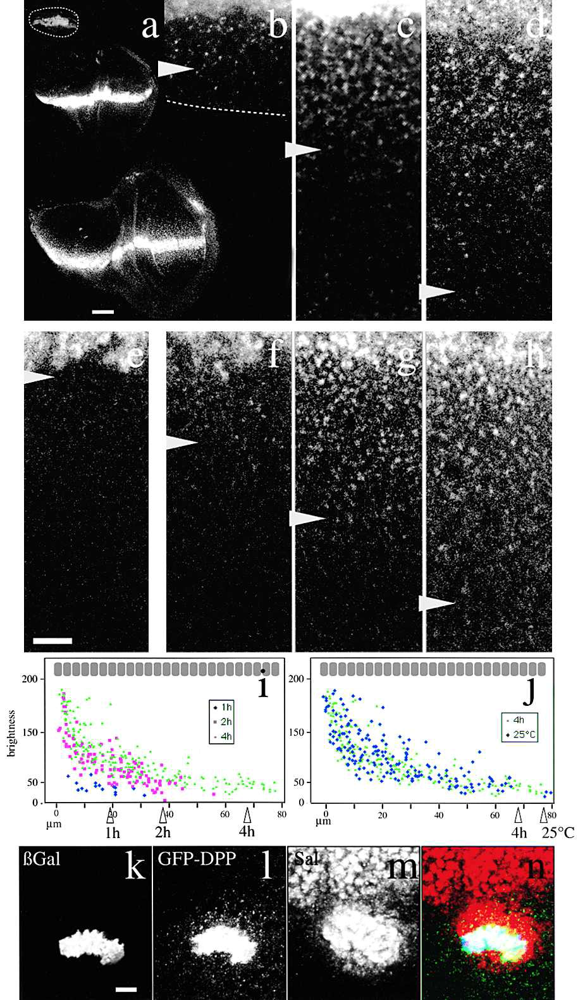

(a–d) GFP-Dpp distribution from the Dpp domain at second instar (60 hr after egg laying [AEL]; upper panel in a and b), early third instar (84 hr AEL; medium panel in a and c) and late third instar (120 hr AEL; lower panel in a and d). Dashed line: disc profile. (b–d) Magnification of the discs shown in (a). (e–h) GFP-Dpp propagation front. (e) GFP-Dpp distribution at 16°C. Note lack of GFP-Dpp in target tissue due to Gal4 thermosensitivity. A possible effect of temperature on gradient formation may take place as well. (f–h) GFP-Dpp distribution of different larvae kept at 16°C until third instar and shifted to 25°C during 1 (f), 2 (g), or 4 hr (h). Arrowheads, edge of the GFP-Dpp gradient (b–j). In (e)–(g) higher gain was applied to see dimmer GFP-Dpp. (i) Brightness versus distance to the source of punctate GFP-Dpp after 1 (blue), 2 (red) and 4 hr (green) at 25°C. (j) Brightness after 4 hr at 25°C (green) and in animals kept at 25°C (blue). (k–n) Triple labeling of a GFP-Dpp flip-out clone (see Experimental Procedures). (k) GFP-Dpp expressing cells labeled by cytosolic lacZ immunostaining. (l) GFP-Dpp. (m) Sal immunostaining. (n) Overlay. Note GFP-Dpp punctate structures and Sal around the expressing clone (l; yellow and green in n). Longer Sal activation range toward anterior is due to additive GFP-Dpp and Dpp signaling. Ten other clones showed the same behavior. Posterior: down. (b)–(h) are at the same magnification. Scale bars: 50 μm (a), 10 μm (b–h, k–n). The bar in (b)–(h) and (k)–(n) corresponds to around 3.3 cells.

Model
-----
Mathematical models can be used to evaluate possible mechanisms in complex systems that can evade intuition, in this case the development of stable gradients. A multiscale model is developed to examine diffusion of the morphogen by Fick’s second law and the receptor binding and dissociation on a finer time scale with mass action laws.

To reduce unecessary complexity the diffusion of morphogens is monitored in one spatial dimension, Figure 2. For the model a morphogen diffusivity of 10^-7 cm^2/s is used, which is 4 to 5 fold lower than predicted for a molecule of the size due to tissue tortuosity. A domain of 100 um is chosen because it is about the size of the Dpp field in the fly wing disc, also about 40 cell bodies as pictured in the figure above. Rtot is the receptor concentration per unit of extracellular space, which is used to normalize the concentrations of unbound and bound morphogen, as well as the rates.

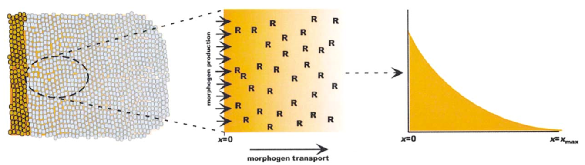

Computationaly the differential equation governing diffusion were resolved in space with a second order central method and in time with an implicit euler scheme. Initial conditions for recpetor concentration was derived from experimental data, and the initial morphogen concentration was set to zero. A source boundary condition was set on the left boundary for a source of v representing the source of morphogen production. A sink boundary condition was set on the right boundary.

Results
-------

Potential Mechanisms:

Beginning with the simplist view of the system taken after Kerszberg and Wolpers’s model, a single reaction for the morphogen binding to a receptor. This is visualized in part A of figure 2.

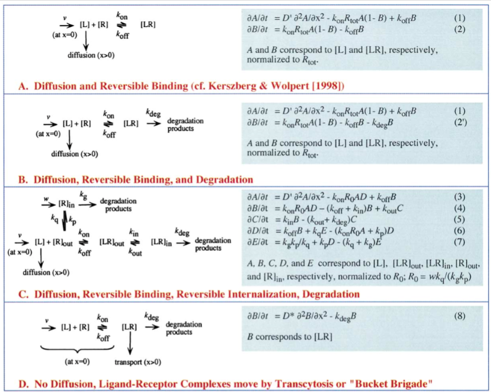

A. Diffusion and Reversible Binding

Setting parameter value of the rate of introduction of morphogens, binding rate, dissociation rate, adn diffusivity of the morphogens are varied to approximate those of Kerszberg and Wolpert.

.. code:: ipython3

    DA0 = 1e-7 #cm^2/s
    DB0 = 0
    konR = 1.32
    koff = 1e-6
    v_Rtot = 5e-4 
    
    nx = 200
    nt = 20000
    Lx = 0.01 #cm
    Lt = (2*60*60)   #s
    dx = Lx/nx   
    dt = Lt/nt
    x = np.linspace(0,Lx,nx)
    t = np.linspace(0,Lt,nt)        
    
    CA = np.zeros((nx,nt))
    CB = np.zeros((nx,nt))
    DA = np.zeros(nx)
    DB = np.zeros(nx)
    
    sig_R = np.zeros(nx)
    sig_L = np.zeros(nx)
    sig_C = np.zeros(nx)
    A = np.zeros((nx,nx))
    B = np.zeros((nx,nx))
    CA_past = np.zeros((nx,nt))
    CB_past = np.zeros((nx,nt))
    
    DA[:] = DA0
    DB[:] = DB0
    
    CA[0,:] = v_Rtot
    CA[-1,:] = 0
    
    
    
    
    def Model(CA,CB,DA,DB):
        for n in range(0,nt-1):
            CB[:,n+1] = CB[:,n] + dt*(konR*CA[:,n]*(1-CB[:,n])-koff*CB[:,n])
    
    
            sig_R[:] = (dt/dx**2)*DA[:]
        #    sig_C[:] = 1 + 2*(dt/dx**2)*DA[:]
            sig_L[:] = (dt/dx**2)*DA[:]
    
            sig_R[0] = 0
        #    sig_L[-2] = 0
    
            sig_L[-2] = 0
        #    sig_R[1] = 0
    
            sig_C[:] = 1 + sig_R[:] + sig_L[:]
            sig_C[0] = 1 + sig_R[1]
            sig_C[-1] = 1
            sig_C[-2] = 1 + sig_R[-1] + sig_L[-3]
    
            Ba = np.diag(np.ones(nx),0)
            Aa = np.diag(-sig_L[:-1],-1) + np.diag(sig_C[:],0) + -np.diag(sig_R[1:],1)
            Ca_past = Ba.dot(CA[:,n])
    
            CA[:,n+1] = np.linalg.solve(Aa,Ca_past) - dt*(konR*CA[:,n]*(1-CB[:,n])-koff*CB[:,n])
    
            CA[0,n+1] = CA[0,n] + dt*(v_Rtot - konR*CA[0,n]*(1-CB[0,n]) + koff*CB[0,n] )
        return(CA,CB)
    
    
    
    A,B = Model(CA,CB,DA,DB)

.. code:: ipython3

    fig = plt.figure(1, figsize = (12,4))
    plt.subplot(121)
    plt.plot(CA[1:,0:20000:1000])
    plt.title('Unbound/Rtot')
    plt.subplot(122)
    plt.plot(CB[1:,0:20000:1000])
    plt.title('Bound/Rtot')

.. parsed-literal::

    Text(0.5,1,'Bound/Rtot')

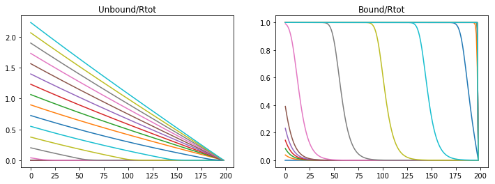

Unbound morphogens quickly disperse through the domain forming a broad gradinent, however the bound concentration of morphogen to receptors sweeps the domain in a steep wave completely saturating the receptors. Varying parameters varies the steepness of the slope and the speed of receptor saturation, however with this model a stable gradient can never form.

If the association rate is decreased the morphogen can disperse more quickly, and saturate the the receptor more quickly.

.. code:: ipython3

    konR = 0.01
    koff = 1e-6
    v_Rtot = 5e-4
    
    Lt = 2*60*60   #s
    dt = Lt/nt
    t = np.linspace(0,Lt,nt)
    CA = np.zeros((nx,nt))
    CB = np.zeros((nx,nt))
    
    A,B = Model(CA,CB,DA,DB)

.. code:: ipython3

    fig = plt.figure(1, figsize = (12,4))
    plt.subplot(121)
    plt.plot(CA[1:,0:20000:1000])
    plt.title('Unbound/Rtot')
    plt.subplot(122)
    plt.plot(CB[1:,0:20000:1000])
    plt.title('Bound/Rtot')

.. parsed-literal::

    Text(0.5,1,'Bound/Rtot')

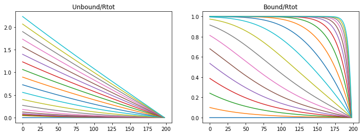

Or if the production rate is increased then the morphogen gradient propagates quicker but the saturation moves in a wave.

.. code:: ipython3

    konR = 1.32
    koff = 1e-6
    v_Rtot = 5e-5
    
    nt = 50000
    Lt = 7*60*60   #s
    dt = Lt/nt
    t = np.linspace(0,Lt,nt)
    CA = np.zeros((nx,nt))
    CB = np.zeros((nx,nt))
    
    A,B = Model(CA,CB,DA,DB)

.. code:: ipython3

    fig = plt.figure(1, figsize = (12,4))
    plt.subplot(121)
    plt.plot(CA[1:,0:nt:1000])
    plt.title('Unbound/Rtot')
    plt.subplot(122)
    plt.plot(CB[1:,0:nt:1000])
    plt.title('Bound/Rtot')

.. parsed-literal::

    Text(0.5,1,'Bound/Rtot')

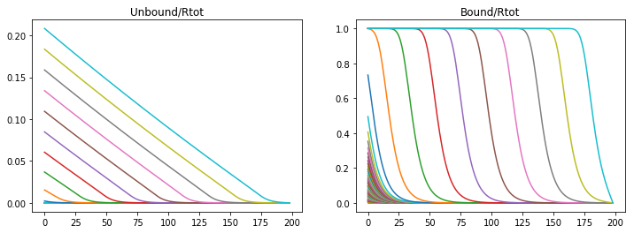

If both the association and the production rate are decreased then propagation and saturation is slower.

.. code:: ipython3

    konR = 0.01
    koff = 1e-6
    v_Rtot = 5e-5 
    
    nt = 50000
    Lt = 9*60*60   #s
    dt = Lt/nt
    t = np.linspace(0,Lt,nt)
    CA = np.zeros((nx,nt))
    CB = np.zeros((nx,nt))
    
    A,B = Model(CA,CB,DA,DB)

.. code:: ipython3

    fig = plt.figure(1, figsize = (12,4))
    plt.subplot(121)
    plt.plot(CA[1:,0:nt:1000])
    plt.title('Unbound/Rtot')
    plt.subplot(122)
    plt.plot(CB[1:,0:nt:1000])
    plt.title('Bound/Rtot')

.. parsed-literal::

    Text(0.5,1,'Bound/Rtot')

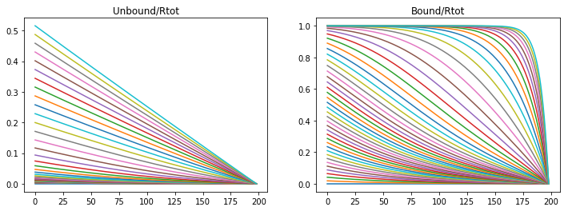

B. Diffusion, Reversible Binding, and Degradation

The result from the above model is well known in systems with inadequate means fo removing an absorbed material, in this case the morphogen. However, in living tissue morphogens degrade and morphogen bound receptors are endocyosed and degraded. Rapid turn over of Dpp has been observed (Teleman and Cohen, 2000) and therefore reasonable to include in the model.

The model complexity is increased first by adding a degradation term for the ligand bound receptor. The degradation rate is derived from obserbations that the morphogen completely degrades within 3 hours (Teleman and cohen, 2000). The bound receptor degrades with first order kinetics and a rate of 2e-4 (1/s).

If we follow the same paramter regime as the first model we first notice that if the binding rate is too high the morphogen saturates the receptors in a wave like propagation.

.. code:: ipython3

    konR = 1.32
    koff = 1e-6
    v_Rtot = 5e-4       
    kdeg = 2e-4
    
    nx = 200
    nt = 20000
    Lx = 0.01 #cm
    Lt =1*60*60   #s
    dx = Lx/nx   
    dt = Lt/nt
    
    DA0 = 1e-7 #cm^2/s
    DB0 = 0
    CA0 = 0
    CB0 = 0
    
    x = np.linspace(0,Lx,nx)
    t = np.linspace(0,Lt,nt)
    CA = np.zeros((nx,nt))
    CB = np.zeros((nx,nt))
    DA = np.zeros(nx)
    DB = np.zeros(nx)
    sig_R = np.zeros(nx)
    sig_L = np.zeros(nx)
    sig_C = np.zeros(nx)
    A = np.zeros((nx,nx))
    B = np.zeros((nx,nx))
    CA_past = np.zeros((nx,nt))
    CB_past = np.zeros((nx,nt))
    
    DA[:] = DA0
    DB[:] = DB0
    
    CA[0,:] = v_Rtot
    CA[-1,:] = 0
    
    def DegModel(CA,CB,DA,DB):
        for n in range(0,nt-1):
            CB[:,n+1] = CB[:,n] + dt*(konR*CA[:,n]*(1-CB[:,n])-koff*CB[:,n] - kdeg*CB[:,n])
    
            sig_R[:] = (dt/dx**2)*DA[:]
        #    sig_C[:] = 1 + 2*(dt/dx**2)*DA[:]
            sig_L[:] = (dt/dx**2)*DA[:]
    
            sig_R[0] = 0
        #    sig_L[-2] = 0
    
            sig_L[-2] = 0
        #    sig_R[1] = 0
    
            sig_C[:] = 1 + sig_R[:] + sig_L[:]
            sig_C[0] = 1 + sig_R[1]
            sig_C[-1] = 1
            sig_C[-2] = 1 + sig_R[-1] + sig_L[-3]
    
            Ba = np.diag(np.ones(nx),0)
            Aa = np.diag(-sig_L[:-1],-1) + np.diag(sig_C[:],0) + -np.diag(sig_R[1:],1)
    
            Ca_past = Ba.dot(CA[:,n])
    
            CA[:,n+1] = np.linalg.solve(Aa,Ca_past) - dt*(konR*CA[:,n]*(1-CB[:,n])-koff*CB[:,n])
    
            CA[0,n+1] = CA[0,n] + dt*(v_Rtot - konR*CA[0,n]*(1-CB[0,n]) + koff*CB[0,n] )
        return (CA,CB)
            
    A,B = DegModel(CA,CB,DA,DB)

.. code:: ipython3

    fig = plt.figure(1, figsize = (12,4))
    plt.subplot(121)
    plt.plot(CA[1:,0:nt:1000])
    plt.title('Unbound/Rtot')
    plt.subplot(122)
    plt.plot(CB[1:,0:nt:1000])
    plt.title('Bound/Rtot')

.. parsed-literal::

    Text(0.5,1,'Bound/Rtot')

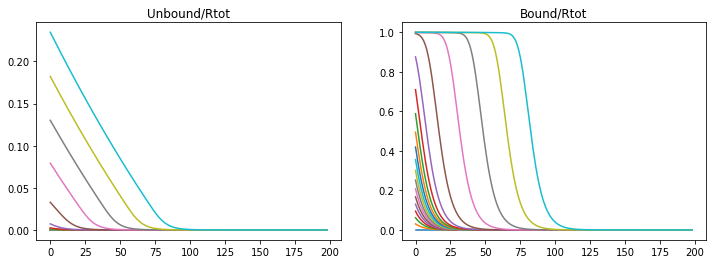

If the binding rate is too low than an unstable diffusion is produced and the saturation of the receptors.

.. code:: ipython3

    konR = 0.01
    koff = 1e-6
    v_Rtot = 5e-4       
    kdeg = 2e-4
    
    nt = 20000
    Lt =2*60*60   #s
    dt = Lt/nt
    t = np.linspace(0,Lt,nt)
    CA = np.zeros((nx,nt))
    CB = np.zeros((nx,nt))
    
    A,B = DegModel(CA,CB,DA,DB)

.. code:: ipython3

    fig = plt.figure(1, figsize = (12,4))
    plt.subplot(121)
    plt.plot(CA[1:,0:nt:1000])
    plt.title('Unbound/Rtot')
    plt.subplot(122)
    plt.plot(CB[1:,0:nt:1000])
    plt.title('Bound/Rtot')

.. parsed-literal::

    Text(0.5,1,'Bound/Rtot')

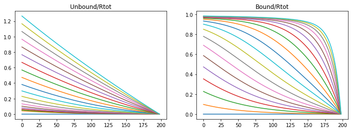

If the binding rate is high but the production rate is lowered a stable diffusion is produced, but not in a useful profile. The degradation rate prevents the morphogen from diffusing through the tissue.

.. code:: ipython3

    konR = 1.32
    koff = 1e-6
    v_Rtot = 5e-5      
    kdeg = 2e-4
    
    nt = 20000
    Lt =2*60*60   #s
    dt = Lt/nt
    t = np.linspace(0,Lt,nt)
    CA = np.zeros((nx,nt))
    CB = np.zeros((nx,nt))
    
    A,B = DegModel(CA,CB,DA,DB)

.. code:: ipython3

    fig = plt.figure(1, figsize = (12,4))
    plt.subplot(121)
    plt.plot(CA[1:,0:nt:1000])
    plt.title('Unbound/Rtot')
    plt.subplot(122)
    plt.plot(CB[1:,0:nt:1000])
    plt.plot(CB[1:,-1],color='r',linewidth='3',label='Stable Diffusion')
    plt.title('Bound/Rtot')
    plt.legend(loc='upper right')

.. parsed-literal::

    <matplotlib.legend.Legend at 0x92024135f8>

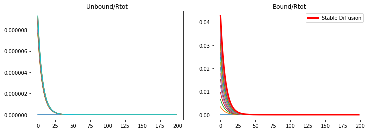

However, if the production rate and the binding rate is lowered than a stable diffusion is produced, and is representative of the observed morphogen profile in the wing disc.

.. code:: ipython3

    konR = 0.01
    koff = 1e-6
    v_Rtot = 5e-5      
    kdeg = 2e-4
    
    nt = 20000
    Lt =4*60*60   #s
    dt = Lt/nt
    
    t = np.linspace(0,Lt,nt)
    CA = np.zeros((nx,nt))
    CB = np.zeros((nx,nt))
    
    A,B = DegModel(CA,CB,DA,DB)

.. code:: ipython3

    fig = plt.figure(1, figsize = (12,4))
    plt.subplot(121)
    plt.plot(CA[1:,0:nt:1000])
    plt.title('Unbound/Rtot')
    plt.subplot(122)
    plt.plot(CB[1:,0:nt:1000])
    plt.plot(CB[1:,-1],color='r',linewidth='3',label='Stable Diffusion')
    plt.title('Bound/Rtot')
    plt.legend(loc='upper right')

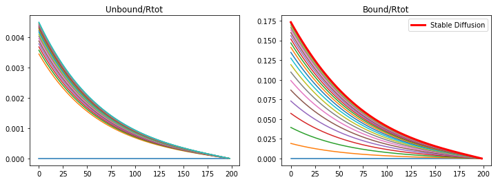

C. Diffusion, Reversible Binding, Reverisble Internalization, and
Degradation

Mophogens are often internalized and continue to participate in cell signaling therefore we include a reversible internalization of these bound receptors and a separate degradation term. This aligns with the well observed phenomenone that bound receptors increase their rate of internalization, which are modeled as C and E (refer to figure 3).

This new model requires that we monitor the concentration of receptors both internal and external, because the concentration is no longer constant as in the previous model.

The degradation rate of the internalized receptor is approximated from data collected by Teleman on the degradation of external receptors.

.. code:: ipython3

    nx = 100
    nt = 100000
    Lx = 0.01 #cm
    Lt = 24*60*60   #s
    dx = Lx/nx   
    dt = Lt/nt
    DA0 = 1e-7 #cm^2/s
    DB0 = 0
    
    CA0 = 0.1
    CB0 = 0
    CC0 = 0
    CD0 = 0
    CE0 = 0
    
    konR = 0.012
    koff = 1e-5
    v_Rtot = 8e-5        
    kdeg = 3.3e-5
    kg = 1e-4
    kin = 6e-4
    kout = 6.7e-5
    kp = 6e-4
    kq = 5e-5
    #R0 = w*kq/(kg*kp)
    
    
    kdegobs = 2e-4
    beta = 0.2
    phi = 11.36
    mu = 0.69
    
    x = np.linspace(0,Lx,nx)
    t = np.linspace(0,Lt,nt)
    
    CA = np.zeros((nx,nt))
    CB = np.zeros((nx,nt))
    CC = np.zeros((nx,nt))
    CD = np.zeros((nx,nt))
    CE = np.zeros((nx,nt))
    
    DA = np.zeros(nx)
    DB = np.zeros(nx)
    
    sig_R = np.zeros(nx)
    sig_L = np.zeros(nx)
    sig_C = np.zeros(nx)
    
    A = np.zeros((nx,nx))
    B = np.zeros((nx,nx))
    
    CA_past = np.zeros((nx,nt))
    
    DA[:] = DA0
    DB[:] = DB0
    
    CD[:,0] = 1
    CE[:,0] = kp/kq
    
    for n in range(0,nt-1):
    
        CB[:,n+1] = CB[:,n] + dt*(konR*CA[:,n]*CD[:,n] - (koff+kin)*CB[:,n] + kout*CC[:,n])
        CC[:,n+1] = CC[:,n] + dt*(kin*CB[:,n] - (kout+kdeg)*CC[:,n])
        CD[:,n+1] = CD[:,n] + dt*(koff*CB[:,n] + kq*CE[:,n] - (konR*CA[:,n]+kp)*CD[:,n])
        CE[:,n+1] = CE[:,n] + dt*(kg*kp/kq + kp*CD[:,n] - (kq+kg)*CE[:,n])
    
        sig_R[:] = (dt/dx**2)*DA[:]
    #    sig_C[:] = 1 + 2*(dt/dx**2)*DA[:]
        sig_L[:] = (dt/dx**2)*DA[:]
    
        sig_R[0] = 0
    #    sig_L[-2] = 0
        
        sig_L[-2] = 0
    #    sig_R[1] = 0
        
        sig_C[:] = 1 + sig_R[:] + sig_L[:]
        sig_C[0] = 1 + sig_R[1]
        sig_C[-1] = 1
        sig_C[-2] = 1 + sig_R[-1] + sig_L[-3]
    
        Ba = np.diag(np.ones(nx),0)
        Aa = np.diag(-sig_L[:-1],-1) + np.diag(sig_C[:],0) + -np.diag(sig_R[1:],1)
        
        Ca_past = Ba.dot(CA[:,n])
        CA[:,n+1] = np.linalg.solve(Aa,Ca_past) - dt*(konR*CA[:,n]*CD[:,n]+koff*CB[:,n])
        CA[0,n+1] = CA[0,n] + dt*(v_Rtot - konR*CA[0,n]*(1-CB[0,n]) + koff*CB[0,n] )

.. code:: ipython3

    fig = plt.figure(3, figsize = (10,4))
    plt.subplot(121)
    plt.plot(CA[1:,0:nt:5000])
    plt.plot(CA[1:,-1],color='r',linewidth='3',label='Stable Diffusion')
    plt.title('free (A)')
    plt.legend(loc='upper right')
    plt.subplot(122)
    plt.plot(CB[1:,0:nt:5000])
    plt.plot(CB[1:,-1],color='r',linewidth='3',label='Stable Diffusion')
    plt.title('surface bound (B)')
    plt.legend(loc='upper right')
    
    fig = plt.figure(4, figsize = (10,4))
    plt.subplot(121)
    plt.plot(CC[1:,0:nt:5000])
    plt.plot(CC[1:,-1],color='r',linewidth='3',label='Stable Diffusion')
    plt.title('internal bound (C)')
    plt.legend(loc='upper right')
    plt.subplot(122)
    plt.plot(CC[1:,0:nt:5000]+CB[1:,0:nt:5000])
    plt.plot((CB[1:,-1]+CC[1:,-1]),color='r',linewidth='3',label='Stable Diffusion')
    plt.title('total bound (C+B)')
    plt.legend(loc='upper right')

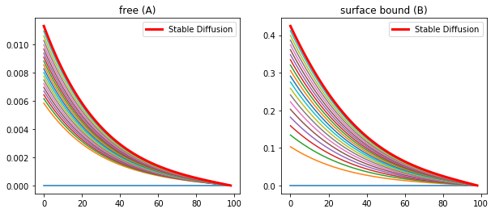

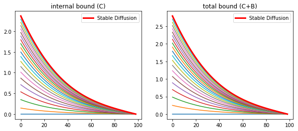

The inclusion of the internalization of morphogen bound receptors overcomes the requirement of the previous model to have a minimal number of receptors on the cell surface. As well as predicts the observations of Enchev, 2000 that a large quantity of morphogens are internalized.

A large criticism of diffusive transport comes from the observation that blocking endoccytosis causes distortion in the gradient of morphogens. Experimental data on the mutations in the shibire (dynamin) gene result in a deficency of endocytosis was collected by Chen,1991. Entchev has shown that there is a subsequent disruption of the morphogen gradient in the wing. While this is inicative of the transyctotic model, it can also be explained by the diffusive model. If endocytosis is blocked than so is the degradation of morphgens, and receptors thereby preventing the development of a stable diffusion profile.

Entechev monitored the propagation of Dpp-GFP around a shibire mutant cluster of cells and observed that not only did these cells not accumulate internalized Dpp, but they also produced a “shadow”, see figure 4. These shows were observed to eventually fill in.

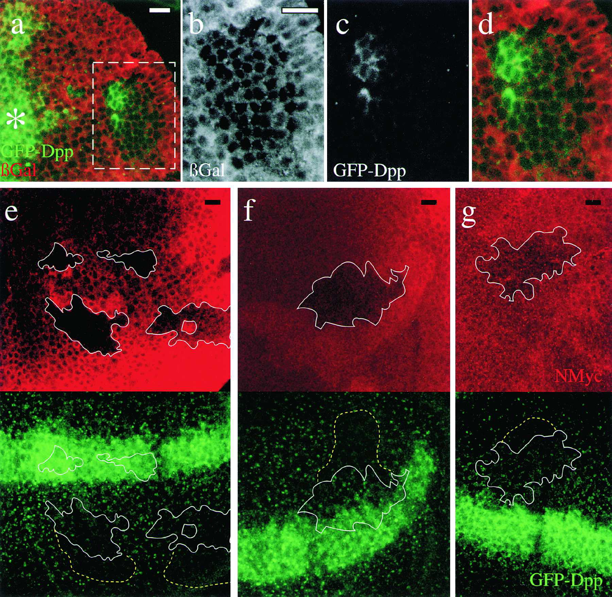

Figure 5. Thickveins and Dynamin Mutant Mosaics Impair Dpp Movement

(a) Double labeling showing GFP-Dpp (green) expressed from the Dpp domain (asterisk) and a tkv8 clone (66 cells) labeled by the absence of lacZ (red). (b)–(d) Magnification of the box in (a) showing the lacZ-lacking tkv8 clone (b), GFP-Dpp (c) and an overlay (d). Big tkv8 clones are only found far away from the source (Burke and Basler 1996). Six clones showing the same behavior were observed. (e–g) Double labelings showing three examples of shits1 clones marked by the absence of NMyc (upper panels; red) and GFP-Dpp (lower panels; green). (e) Posterior clones. (f) Anterior clone also affecting the secreting cells. (g) Anterior clone. White line: clone utline; dotted yellow lines: approximate extent of the distal shadow with dimmer or no GFP-Dpp vesicular structures. A propagation front was started (14 hr, 29°C) followed by endocytosis block above shits1 restrictive temperature for 5 hr (see Experimental Procedures). Note few GFP-Dpp containing vesicles within the shits1 clones due to GFP-Dpp internalization at 29°C (a partially permissive temperature for shits1 developing wing cells; see Experimental Procedures). 15 clones with shadows were observed. In the Tkv and shits1 clones, receptor-mediated endocytosis was blocked during different periods of time (3 days versus 5 hr) explaining why     extracellular accumulation of Dpp is not seen in the shits1 clone. Scale bars: 10 μm.

Why the free Dpp be reduced by the presence of cells that are unable to internalize and degrade the morphogen? Shouldn’t there be an increae? However, the population of receptors on the membrane surface are determined by the balance of degradation and synhesis and a reduction of the degradation rate by the blockade of endocytosis would increase the population of surface receptros. This in turn would reduce the amound of free Dpp.

Experimental data has shown that the shibire mutation in fact increases the number fo surface receptors, and we can modify the previous model to account for a region of mutated tissue.

.. code:: ipython3

    nx = 100
    nt = 100000
    Lx = 0.01 #cm
    Lt = 24*60*60   #s
    dx = Lx/nx   
    dt = Lt/nt
    DA0 = 1e-7 #cm^2/s
    DB0 = 0
    
    CA0 = 0.1
    CB0 = 0
    CC0 = 0
    CD0 = 0
    CE0 = 0
    
    konR = 0.012
    koff = 1e-5
    v_Rtot = 8e-5        
    kdeg = 3.3e-5
    kg = 1e-4
    kin0 = 6e-4
    kout = 6.7e-5
    kp0 = 6e-4
    kq = 5e-5
    #R0 = w*kq/(kg*kp)
    kp = np.zeros(nx)
    kin = np.zeros(nx)
    
    kp[:] = kp0
    kin[:] = kin0
    kp[int(0.25*nx):int(0.5*nx)] = kp0 * 0.1
    kin[int(0.25*nx):int(0.5*nx)] = kin0 * 0.1
    
    kdegobs = 2e-4
    beta = 0.2
    phi = 11.36
    mu = 0.69
    
    x = np.linspace(0,Lx,nx)
    t = np.linspace(0,Lt,nt)
    
    CAmut = np.zeros((nx,nt))
    CBmut = np.zeros((nx,nt))
    CCmut = np.zeros((nx,nt))
    CDmut = np.zeros((nx,nt))
    CEmut = np.zeros((nx,nt))
    
    DA = np.zeros(nx)
    DB = np.zeros(nx)
    
    sig_R = np.zeros(nx)
    sig_L = np.zeros(nx)
    sig_C = np.zeros(nx)
    
    A = np.zeros((nx,nx))
    B = np.zeros((nx,nx))
    
    CA_past = np.zeros((nx,nt))
    
    DA[:] = DA0
    DB[:] = DB0
    
    CDmut[:,0] = 1
    CDmut[int(0.25*nx):int(0.5*nx),0] = 10
    CEmut[:,0] = kp/kq
    
    for n in range(0,nt-1):
    
        CBmut[:,n+1] = CBmut[:,n] + dt*(konR*CAmut[:,n]*CDmut[:,n] - (koff+kin)*CBmut[:,n] + kout*CCmut[:,n])
        CCmut[:,n+1] = CCmut[:,n] + dt*(kin*CBmut[:,n] - (kout+kdeg)*CCmut[:,n])
        CDmut[:,n+1] = CDmut[:,n] + dt*(koff*CBmut[:,n] + kq*CEmut[:,n] - (konR*CAmut[:,n]+kp)*CDmut[:,n])
        CEmut[:,n+1] = CEmut[:,n] + dt*(kg*kp/kq + kp*CDmut[:,n] - (kq+kg)*CEmut[:,n])
    
        sig_R[:] = (dt/dx**2)*DA[:]
    #    sig_C[:] = 1 + 2*(dt/dx**2)*DA[:]
        sig_L[:] = (dt/dx**2)*DA[:]
    
        sig_R[0] = 0
    #    sig_L[-2] = 0
        
        sig_L[-2] = 0
    #    sig_R[1] = 0
        
        sig_C[:] = 1 + sig_R[:] + sig_L[:]
        sig_C[0] = 1 + sig_R[1]
        sig_C[-1] = 1
        sig_C[-2] = 1 + sig_R[-1] + sig_L[-3]
    
        Ba = np.diag(np.ones(nx),0)
        Aa = np.diag(-sig_L[:-1],-1) + np.diag(sig_C[:],0) + -np.diag(sig_R[1:],1)
        
        Ca_past = Ba.dot(CAmut[:,n])
        CAmut[:,n+1] = np.linalg.solve(Aa,Ca_past) - dt*(konR*CAmut[:,n]*CDmut[:,n]+koff*CBmut[:,n])
        CAmut[0,n+1] = CAmut[0,n] + dt*(v_Rtot - konR*CAmut[0,n]*(1-CBmut[0,n]) + koff*CBmut[0,n] )

.. code:: ipython3

    fig = plt.figure(1, figsize = (15,4))
    plt.subplot(131)
    plt.plot(CCmut[1:,int(5*60*60*nt/Lt)],'k', label='mutated cells')
    plt.plot(CC[1:,int(5*60*60*nt/Lt)],'r--', label='normal cells')
    plt.title('internal bound (C) 5 hours')
    plt.legend(loc='upper right')
    plt.ylabel('Bound/R0')
    plt.xlabel('Distance (um)')
    plt.subplot(132)
    plt.plot(CBmut[1:,int(5*60*60*nt/Lt)],'k')
    plt.plot(CB[1:,int(5*60*60*nt/Lt)],'r--')
    plt.title('surface bound (B) 5 hours')
    plt.subplot(133)
    plt.plot(CCmut[1:,-1],'k')
    plt.plot(CC[1:,-1],'r--')
    plt.title('internal bound (C) 24 hours')

.. parsed-literal::

    Text(0.5,1,'internal bound (C) 24 hours')

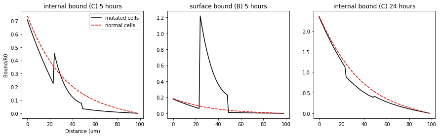

The mutated clone is defined between 25 and 50 um, roughly 10 cells. In this region the kp and kin are reduced by a magnitude and the number of surface receptors are increased by the same amount. The dashed red line is the control where the tissue is healthy. The model predicts that the internal and surface bound morphogens are lower behind the shibire clone, much like what is seen in figure 4e,f,g. Including the correct time scale! Entchev’s experiments observe the shadow at the 5 hours but it dissipates much like we see in the model above.

The procedure done by Entchev emphasized intracellular Dpp so it was likely that they missed the large increase in surface bound receptors seen in the middle plot above.

While the diffusive transport can account for
