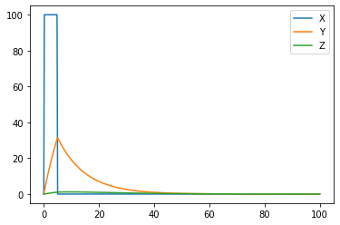
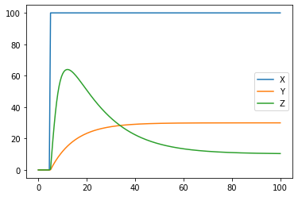

Signaling pathway dynamics
==========================

* View this page as a fully interactive Jupyter Notebook: `Click here <https://drive.google.com/file/d/1MUtvLNWbtywA02rf-dS_iIqpfbxhQBe9/view?usp=sharing>`_

In this activity, we will learn how to: 

* Write simple equations to represent signaling pathways that are common in biology 
* Use computer algorithms to solve these equations, to predict the dynamics of pathway components 
* Plot our predictions compared to data 
* Interpret our predictions 
* Use these results to develop hypotheses about the pathway
* Use the simulations to test these hypotheses and further explore the system

Section 0: Three-component networks and loops
---------------------------------------------

In the image below, X, Y, and Z represent three components of a feed-forward loop. In these loops, X regulates Y, Y regulates Z and X also regulates Z. The difference between networks are determined by the nature of the regulation interactions: upregulation (+) or downregulation (-).

When different regulatory interactions are combined we can get very interesting dynamics that serve different biological functions.

**REFLECT:** In each of these networks, if you add exogenous X, what will happen to the levels of Z? Write down your predictions, we will use it later…

Section 1: Coherent Feed Forward Loop
-------------------------------------

Writing equations to describe signaling pathways
~~~~~~~~~~~~~~~~~~~~~~~~~~~~~~~~~~~~~~~~~~~~~~~~

One tool that we can use to describe dynamics in biological systems are ordinary differential equations, or ODEs. These are equations that describe the **rate of change** of concentrations of components in our network. This rate of change depends on the other interacting components as well as parameters that describe their interaction. Let’s see what that looks like for the Coherent type 1 network from the figure above.

**Component X**

Component X in this case does not depend on any of the other components,
so we will be able to change this as an input signal.

**Component Y**

Compnent Y in this case is upregulated by X. This can be represented by
the following equation:

:math:`\frac{dY}{dt} = k_1 \frac{X^n}{K_Y^n+X^n} - \mu_Y Y`

In this equation :math:`k_1` is the maximum production rate of component
Y.

The term :math:`\frac{X^n}{K_Y^n+X^n}` generates a hill function that increases as :math:`X` increases, with a minimum value of :math:`0` and a maximum value of :math:`1`. :math:`K_Y` is a parameter that determines the concentration of :math:`X` where the production of :math:`Y` would be at exactly half of its maximum value. :math:`n` determines how steep the Hill curve is.

:math:`\mu_Y` is the degration rate constant describing how quickly Y decays.

**REFLECT:** do some thought experiments to predict what would happen to the first term if you change :math:`X`, or :math:`K_Y` or :math:`k_1`

**Component Z**

Compnent Z in this case is upregulated by both X and Y. So we need to account for concentrations of both X and Y when we construct our equation.

This can be represented by the following equation:

:math:`\frac{dZ}{dt} = k_2 \frac{X^n+Y^n}{K_Z^n+X^n+Y^n} - \mu_Z Z`

In this equation :math:`k_2` is the maximum production rate of component Z.

The term :math:`\frac{X^n+Y^n}{K_Z^n+X^n+Y^n}` generates a hill function that increases as :math:`X` and :math:`Y` increases, with a minimum value of :math:`0` and a maximum value of :math:`1`. :math:`K_Z` is a parameter that determines the concentration of :math:`X+Y` where the production of :math:`Z` would be at exactly half of its maximum value.

:math:`\mu_Z` is the degration rate constant describing how quickly Z decays.

**REFLECTION:** Think through some different potential values of X and Y and describe how the values of the hill term would change.

Solving equations to predict pathway dynamics
~~~~~~~~~~~~~~~~~~~~~~~~~~~~~~~~~~~~~~~~~~~~~

Your task for the code below is to mess around with the parameter values to see what kind of interesting dynamics you can create.

If you have a favorite system or network that you know behaves in a certain way in response to a certain stimulus, try to recreate those dynamics.

As you change parameters talk through what is happening, and why it makes sense (or not).

.. code:: 

    # Import packages and libraries
    
    import numpy as np                  # import data structuring
    from scipy.integrate import odeint  # import ODE integrating function
    import matplotlib.pyplot as plt     # import plotting libraries
    import math as m                    # import math operations
    
    # Defining parameter values
    
    k_1 = 8
    K_Y = 2
    mu_Y = 0.1
    n_Y = 2;
    
    k_2 = 0.5
    K_Z = 100
    mu_Z = 0.07
    n_Z = 1;
    
    # Select the type of stimulus you want to provide: 
    #   - constant (constant), 
    #   - single pulse (single), or 
    #   - multiple pulse (multiple)
    x_stimulus_type = 'single'
    
    
    x_max_value = 100
    
    # For single pulse
    x_start_time = 0
    x_end_time = 5
    
    # For multiple pulses
    x_pulse_duration = 5
    x_rest_duration = 20
    
    
    # Create a function that describes the values of X
    # Since X does not depend on any of the other components in this system, we can 
    # decide what this function looks like. It will depend on time (t)
    #------------------------------------------------------------------------------
    # For a single pulse of X starting and ending at a defined time
    # x_value: value of x during the pulse
    # pulse_start_time: time to start the pulse
    # pulse_end_time: time to end the pulse
    # t: current time of the simulations
    def pulse_X(x_value, pulse_start_time, pulse_end_time, t):
    
      if t > pulse_start_time and t <= pulse_end_time:
        temp_x = x_value
      else:
        temp_x = 0
    
      return temp_x
    
    #------------------------------------------------------------------------------
    # For continuous pulsing of X
    # x_value: value of x during the pulses
    # pulse_time: duration of the pulse of X
    # rest_time: duration of breaks between pulses
    # t: current time of the simulations
    
    def multpulse_x(x_value,pulse_time,rest_time,t):
    
      # total time for one cycle
      total_cycle_time = pulse_time + rest_time
    
      # get time within current cycle
      cycle_time = t % total_cycle_time;
    
      # determine the value of X at this time
      if cycle_time <= pulse_time:
        temp_x = x_value
      else:
        temp_x = 0
    
      return temp_x
    
    #------------------------------------------------------------------------------
    
    # Create a function that contains the ODEs for our system
    # 'variables' is an array that contains values of the concentrations of Y and Z
    # 't' is the time variable
    
    def coherentFFL_ODEs(variables, t):
    
      # define values for X
      if x_stimulus_type == 'constant':
        X       = x_max_value                     # This assigns a constant value to X
      elif x_stimulus_type == 'single':
        X       = pulse_X(x_max_value,x_start_time,x_end_time,t)      # assigning a single pulse to X
      elif x_stimulus_type == 'multiple':
        X       = multpulse_x(x_max_value,x_pulse_duration,x_rest_duration,t)      # assigning multiple pulses to X
    
      # pulling values out of 'variables' to make it easier to use in the ODEs
      Y       = variables[0]
      Z       = variables[1]
    
      # defining the ODEs
      dYdt = k_1 * (X**n_Y)   / (K_Y**n_Y + X**n_Y)      - mu_Y * Y
      dZdt = k_2 * (X**n_Z+Y**n_Z) / (K_Z**n_Z + X**n_Z + Y**n_Z)  - mu_Z * Z
    
      # Return an array of the increment/change values
      return [dYdt, dZdt]
    
    # ODE Solution using odeint()
    # odeint is a built-in function that solves ODEs and produces one solution array
    # for each variable in your ODEs
    
    # First we have to tell the algorithm where to start and for how long we want to solve the equations
    # Specify the initial conditions - where the system starts for each component
    Y0 = 0;
    Z0 = 0;
    
    # Create a array of all the initial conditions.
    initial_cond  = [Y0, Z0]
    
    # Define the time span and the time resolution where you want to solve your equations
    nsteps   = 500                       # Declare the number of timesteps that you want to output solutions for
    time_array   = np.linspace(0, 100.0, nsteps)   # Create time array
    
    # Call the solver algorithm, specifying which ODEs to solve, what the starting
    # conditions are and what time span you want to solve it for
    solution  = odeint(coherentFFL_ODEs, initial_cond, time_array, hmax=0.1)
    
    # Plot the solutions
    # make an array for X so we can plot it together
    X_array = np.zeros_like(time_array)
    for index in range(np.size(time_array)):
      if x_stimulus_type == 'constant':
        X_array[index]       = x_max_value                     # This assigns a constant value to X
      elif x_stimulus_type == 'single':
        X_array[index]       = pulse_X(x_max_value,x_start_time,x_end_time,time_array[index])      # assigning a single pulse to X
      elif x_stimulus_type == 'multiple':
        X_array[index]       = multpulse_x(x_max_value,x_pulse_duration,x_rest_duration,time_array[index])      # assigning multiple pulses to X
    
    plt.plot(time_array,X_array)
    plt.plot(time_array,solution)
    
    plt.legend(('X','Y','Z'))
    

Section 2: Incoherent Feed Forward Loop
---------------------------------------

Writing equations to describe signaling pathways
~~~~~~~~~~~~~~~~~~~~~~~~~~~~~~~~~~~~~~~~~~~~~~~~

Now that we’ve worked through the process of using ODEs to predict feedback loop dynamics, let’s see what that looks like for the Incoherent type 1 network from the figure above, where X activates Y and Z, but now Y down-regulates Z.

**Component X**

Component X in this case does not depend on any of the other components, so we will be able to change this as an input signal.

**Component Y**

Compnent Y in this case is upregulated by X. This can be represented by the following equation:

:math:`\frac{dY}{dt} = k_1 \frac{X^n}{K_Y^n+X^n} - \mu_Y Y`

In this equation :math:`k_1` is the maximum production rate of component Y.

The term :math:`\frac{X^n}{K_Y^n+X^n}` generates a hill function that increases as :math:`X` increases, with a minimum value of :math:`0` and a maximum value of :math:`1`. :math:`K_Y` is a parameter that determines the concentration of :math:`X` where the production of :math:`Y` would be at exactly half of its maximum value. :math:`n` determines how steep the Hill curve is.

:math:`\mu_Y` is the degration rate constant describing how quickly Y decays.

**Component Z**

Component Z in this case is upregulated by both X and Y. So we need to account for concentrations of both X and Y when we construct our equation.

This can be represented by the following equation:

:math:`\frac{dZ}{dt} = k_2   \frac{X^n}{K_{Z1}^n+X^n} \frac{1}{1 + \frac{Y^n}{K_{Z2}^n}}  - \mu_Z Z`

In this equation :math:`k_2` is the maximum production rate of component Z.

The term :math:`\frac{X+Y}{K_Z+X+Y}` generates a hill function that increases as :math:`X` and :math:`Y` increases, with a minimum value of :math:`0` and a maximum value of :math:`1`. :math:`K_Z` is a parameter that determines the concentration of :math:`X+Y` where the production of :math:`Z` would be at exactly half of its maximum value.

:math:`\mu_Z` is the degration rate constant describing how quickly Z decays.

**REFLECT:** do some thought experiments to predict what would happen to the first term if you change :math:`X`, or :math:`K_Y` or :math:`k_1`, or :math:`Y`.

Solving equations to predict pathway dynamics
~~~~~~~~~~~~~~~~~~~~~~~~~~~~~~~~~~~~~~~~~~~~~

.. code:: 

    # Import packages and libraries
    
    import pandas as pd
    import numpy as np                  # import data structuring
    from scipy.integrate import odeint  # import ODE integrating function
    import matplotlib.pyplot as plt     # import plotting libraries
    import math as m                    # import math operations
    
    # Defining parameter values
    
    k_1 = 3
    K_Y = 2
    mu_Y = 0.1
    n_Y = 2;
    
    k_2 = 20
    K_Z1 = 2
    K_Z2 = 10
    mu_Z = 0.07
    n_Z1 = 1;
    n_Z2 = 3;
    
    # Select the type of stimulus you want to provide:
    # - constant (constant),
    # - single pulse (single), or
    # - multiple pulse (multiple)
    x_stimulus_type = 'single'
    
    
    x_max_value = 100
    
    # For single pulse
    x_start_time = 5
    x_end_time = 200
    
    # For multiple pulses
    x_pulse_duration = 2
    x_rest_duration = 8
    
    # Create a function that describes the values of X
    # Since X does not depend on any of the other components in this system, we can 
    # decide what this function looks like. It will depend on time (t)
    
    #------------------------------------------------------------------------------
    # For a single pulse of X starting and ending at a defined time
    # x_value: value of x during the pulse
    # pulse_start_time: time to start the pulse
    # pulse_end_time: time to end the pulse
    # t: current time of the simulations
    def pulse_X(x_value, pulse_start_time, pulse_end_time, t):
    
      if t > pulse_start_time and t <= pulse_end_time:
        temp_x = x_value
      else:
        temp_x = 0
    
      return temp_x
    
    #------------------------------------------------------------------------------
    # For continuous pulsing of X
    # x_value: value of x during the pulses
    # pulse_time: duration of the pulse of X
    # rest_time: duration of breaks between pulses
    # t: current time of the simulations
    
    def multpulse_x(x_value,pulse_time,rest_time,t):
    
      # total time for one cycle
      total_cycle_time = pulse_time + rest_time
    
      # get time within current cycle
      cycle_time = t % total_cycle_time;
    
      # determine the value of X at this time
      if cycle_time <= pulse_time:
        temp_x = x_value
      else:
        temp_x = 0
    
      return temp_x
    
    #------------------------------------------------------------------------------
    # Create a function that contains the ODEs for our system
    # 'variables' is an array that contains values of the concentrations of Y and Z
    # 't' is the time variable
    
    def incoherentFFL_ODEs(variables, t):
      # define values for X
      if x_stimulus_type == 'constant':
        X       = x_max_value                     # This assigns a constant value to X
      elif x_stimulus_type == 'single':
        X       = pulse_X(x_max_value,x_start_time,x_end_time,t)      # assigning a single pulse to X
      elif x_stimulus_type == 'multiple':
        X       = multpulse_x(x_max_value,x_pulse_duration,x_rest_duration,t)      # assigning multiple pulses to X
    
      # pulling values out of 'variables' to make it easier to use in the ODEs
      Y       = variables[0]
      Z       = variables[1]
    
      # defining the ODEs
      dYdt = k_1 * (X**n_Y)   / (K_Y**n_Y   + X**n_Y)                                    - mu_Y * Y
      dZdt = k_2 * ((X**n_Z1) / (K_Z1**n_Z1 + X**n_Z1)) * ((1) / (1+Y**n_Z2/K_Z2**n_Z2)) - mu_Z * Z
    
      # Return an array of the increment/change values
      return [dYdt, dZdt]
    
    # ODE Solution using odeint()
    # odeint is a built-in function that solves ODEs and produces one solution array
    # for each variable in your ODEs
    
    # First we have to tell the algorithm where to start and for how long we want to solve the equations
    # Specify the initial conditions - where the system starts for each component
    Y0 = 0;
    Z0 = 0;
    
    # Create a array of all the initial conditions.
    initial_cond  = [Y0, Z0]
    
    # Define the time span and the time resolution where you want to solve your equations
    nsteps   = 200                       # Declare the number of timesteps that you want to output solutions for
    time_array   = np.linspace(0, 100.0, nsteps)   # Create time array
    
    # Call the solver algorithm, specifying which ODEs to solve, what the starting
    # conditions are and what time span you want to solve it for
    solution  = odeint(incoherentFFL_ODEs, initial_cond, time_array, hmax=0.1)
    
    # Plot the solutions
    # make an array for X so we can plot it together
    X_array = np.zeros_like(time_array)
    for index in range(np.size(time_array)):
      if x_stimulus_type == 'constant':
        X_array[index]       = x_max_value                     # This assigns a constant value to X
      elif x_stimulus_type == 'single':
        X_array[index]       = pulse_X(x_max_value,x_start_time,x_end_time,time_array[index])      # assigning a single pulse to X
      elif x_stimulus_type == 'multiple':
        X_array[index]       = multpulse_x(x_max_value,x_pulse_duration,x_rest_duration,time_array[index])      # assigning multiple pulses to X
    
    
    plt.plot(time_array,X_array)
    plt.plot(time_array,solution)
    
    plt.legend(('X','Y','Z'))
    

Section 3: Using data and logic to identify network structures
--------------------------------------------------------------

Data description
~~~~~~~~~~~~~~~~

Imagine that you are in the lab, and you have been working on a signaling pathway with components X, Y and Z. The data shown below were collected from the system under normal conditions. The stimulus you provided was: repeated pulsing with :math:`10 \mu M` of X, for 5 minutes, followed by 5 minutes washout.

Your experimental measurements in triplicate are included in two excel files in the google drive folder.

Y measurements are `here <https://docs.google.com/spreadsheets/d/1jy4dIYFIFuRdr21jW4SYrPQAvrcHoRZj-wb_evFnhkU/edit?usp=sharing>`__.

Z measurements are `here <https://docs.google.com/spreadsheets/d/1L_rGwYsRYvlT6pq8fbPKBIPghOTyoYpDVOdglAhESok/edit?usp=sharing>`__.

Once you’ve downloaded your files, you can upload them into your notebook as we described in the How to Use Google Colab tutorial, (by using the folder button on the left of the notebook screen).

The code below will load and plot your data.

**REFLECT:** Based on these results, what kind of feed forward loop do you predict this system has?

.. code:: 

    # Read data from the excel files
    
    ydata = pd.read_excel('/content/y_measurements.xlsx')
    zdata = pd.read_excel('/content/z_measurements.xlsx')
    
    # Plot results for replicate 1
    plt.plot(ydata.Time,ydata.Rep1,'bo')
    plt.plot(zdata.Time,zdata.Rep1,'ro')
    
    # Plot results for replicate 2
    plt.plot(ydata.Time, ydata.Rep2,'bo')
    plt.plot(zdata.Time, zdata.Rep2,'ro')
    
    # Plot results for replicate 3
    plt.plot(ydata.Time, ydata.Rep3,'bo')
    plt.plot(zdata.Time, zdata.Rep3,'ro')
    
    # Update figure settings
    plt.xlabel('Time (minutes)')
    plt.ylabel('Concentration')
    
    plt.legend(['Y', 'Z']);

Comparing simulations to data
~~~~~~~~~~~~~~~~~~~~~~~~~~~~~

Based on what type of feed forward loop you believe your system is, use the model from above (you can copy and paste the code) along with the data provided to estimate the parameters that drive the system. You can also copy and paste the data plotting code so that you can compare the data and simulations on one graph.

Reflect on the following:

#. What did you look at when you tried to determine if the parameters "fit" or not?
#. What experimental adjustments would have been helpful in comparing to the data?
#. What was your approach to try to match the data?
#. What could be some more efficient ways to go through this process?
#. What simulations and experiments could you do next to test your predictions of network structure and parameters?

These things that we do intuitively can be formalized into mathematical and computational tools to calibrate the models to data.
