Project: Circadian Rhythms
==========================

* View this page as a fully interactive Jupyter Notebook: <https://drive.google.com/file/d/10evGfvjidCMTfrgrKl16IlkpGiWFtH3A/view?usp=sharing>_

Introduction
------------

In their work *Toward a detailed computational model for the mammalian circadian clock*, Leloup and Goldbeter made the first attempt to mathematically model the oscillations in gene expression that occur in the mammalian brain’s circadian timekeeping circuits [1]. They cite several instances where similar models had been made for the Drosophila circadian rhythm, but only at the time of their publication had enough knowledge been collected to allow the development of a model for mammalian systems. Their model showed several interesting findings, such as the ability of circadian oscillations to be sustained in complete darkness, be retrained fairly quickly with exposure to light-dark cycles, and multiple sources of oscillatory behavior within the molecular circuitry. They did some preliminary modeling of perturbations in the model parameters that were able to recreate the clinical observations associated with conditions such as non-24h sleep-wake syndrome. In this Jupyter notebook, I intend to extend this model to a more common—though less serious—sleep condition and the step many people take to address it: insomnia, the difficulty initiating or maintaining sleep, affects 1-6% of neurotypical children (75% of children with any form of autism spectrum disorder suffer from insomnia) and as many as 40% of adults, depending upon age group [2].

As a Purdue engineer, your PI has approached you and asked for your help. They will be traveling internationally and want to know how long they will experience symptoms of jetlag after their travel. You are, of course, delighted at the challenge and the fact that your PI has finally recognized your abilities at mathematical modeling enough to trust you with this task. You have decided to use the circadian rhythm model developed by Leloup and Goldbeter to determine the effects of jetlag on the human circadian rhythm.

Feedback Loops and Oscillators
------------------------------

Before you can begin, you first must understand how a feedback loop works and how one or more feedback loops can work together to form an oscillator. Let us consider a hypothetical protein :math:`X` with maximum transcription rate :math:`k`. :math:`X` is upregulated by the presence of :math:`Y`, which is itself downregulated by the presence of :math:`Z`. We can then use develop a Hill function to map the changes in :math:`X`:

.. math:: \frac{dX} {dt} = k \frac{Y^n} {{K_A}^n + Y^n}

where :math:`n` is the cooperativity constant and :math:`K_A` is the threshold at which :math:`Y` begins to upregulate :math:`X`. The same can be calculated for :math:`Y`:

.. math:: \frac{dY} {dt} = k \frac{{K_A}^n} {{K_A}^n + Z^n}

Careful selection of the values for the constants will cause the system to oscillate periodically. This is how oscillators can be made from feedback loops. In the next section, you will apply this principle in the code.

Model Development
-----------------

This model contains a great many equations: even the simpler version of the model contains 16 differential equations. For the sake of time and your sanity, you will not be asked to derive all of these, or even most of them. However, it is instructive to look at the equations governing the transcription and translation of *Per*, the only one of the mRNA or proteins in the model to be affected by the presence of light.

First, let us consider the transcription of *Per* mRNA, which we will call :math:`M_P` and its concentration over time in the cytosol, which can be denoted as :math:`{dM_P}/{dt}`. :math:`M_P` has a maximum accumulation rate in the cytosol of :math:`v_{sP}` when not in the presence of light–light increases this rate. Referencing [1], we learn that unphosphorylated BMAL1 in the nucleus, which we will call :math:`B_N`, acts to upregulate the transcription of :math:`M_P`, but only when it is present in greater concentrations than some threshold level, which we can call :math:`K_{AP}`. Based upon this, we now know that:

.. math:: \frac{dM_P} {dt} \propto (v_{sP} + light) \frac{B_N^n} {K_{AP}^n + B_N^n}

where :math:`n` is a cooperativity constant between :math:`B_N` and :math:`K_{AP}`.

But wait. What we have so far would result in an infinite accumulation of *Per*. We must also account for the degradation of :math:`M_P`, which will have a maximum possible rate we define as :math:`v_{mP}`. mRNA degradation is governed my Michaelis-Menten kinetics, so the Michaelis constant :math:`K_{mP}` will be needed here too. Keeping in mind that degradation will occur more quickly when more mRNA is present, we can reason that:

.. math:: \frac{dM_P} {dt} \propto - v_{mP} \frac{M_P} {K_{mP} + M_P}

There will also be nonspecific breakdown of mRNA that occurs as the cell does through its natural metabolic processes, which will occur with a 1st-order rate constant of :math:`k_{dmp}`. Thus,

.. math:: \frac{dM_P} {dt} \propto - k_{dmp}M_P

Putting all three of these equations together, we can determine the overall differential equation governing the concentration of *Per* in the cytosol:

.. math:: \frac{dM_P} {dt} = (v_{sP} + light) \frac{B_N^n} {K_{AP}^n + B_N^n} - v_{mP} \frac{M_P} {K_{mP} + M_P} - k_{dmp}M_P

See if you can follow the same logical steps we used above to determine the differential equations for *Cry* and *Bmal1*.

.. math:: \frac{dM_C} {dt} = \,?

.. math:: \frac{dM_B} {dt} = \,?

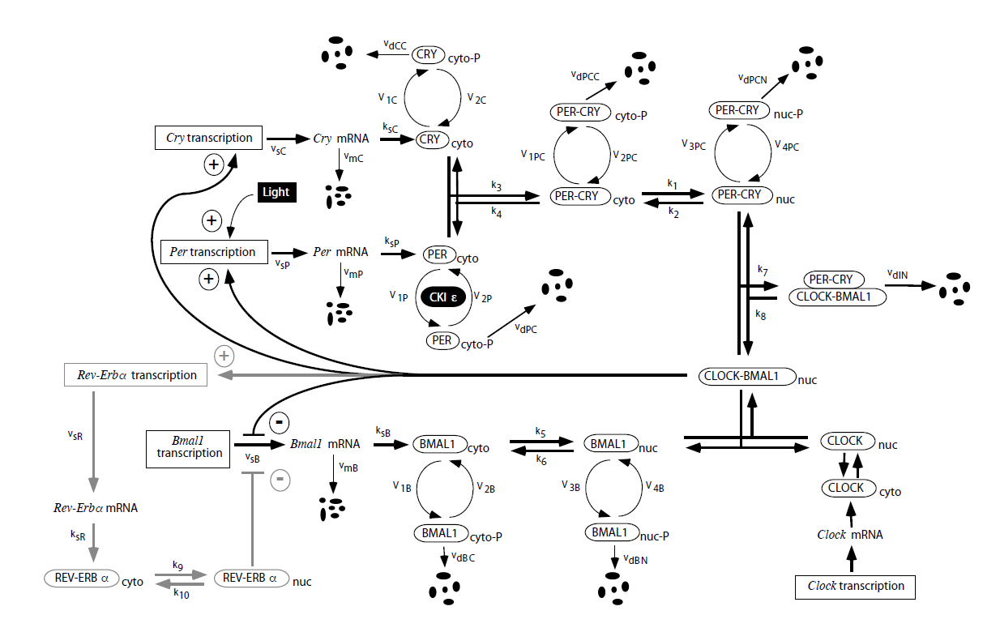

   Figure 5 from [1]: this figure illustrates the system being modeled and labels each of the reactions with the appropriate rate constant.

You can check your work here. The correct equations are:

.. math:: \frac{dM_C} {dt} = v_{sC} \frac{B_N^n} {K_{AC}^n + B_N^n} - v_{mC} \frac{M_C} {K_{mC} + M_C} - k_{dmc}M_C

where :math:`M_C` is the cytosolic concentration of *Cry*, :math:`v_{sC}` is the maximum accumulation rate of *Cry* in the cytosol, :math:`K_{AC}` is the threshold concentration of :math:`B_N` for it to begin upregulating the transcription of *Cry*, :math:`v_{mC}` is the maximum degradation rate of *Cry*, :math:`K_{mC}` is the Michaelis constant of *Cry* degradation, and :math:`k_{dmc}` is the 1st-order rate constant of non-specific *Cry* degradation.

.. math:: \frac{dM_B} {dt} = v_{sB} \frac{K_{IB}^m} {K_{IB}^m + B_N^m} - v_{mB} \frac{M_B} {K_{mB} + M_B} - k_{dmb}M_B

where :math:`M_B` is the cytosolic concentration of *Bmal1*, :math:`v_{sB}` is the maximum accumulation rate of *Bmal1* in the cytosol, :math:`K_{IB}` is the threshold concentration of CLOCK-BMAL1 complex for it to begin downregulating the transcription of *Bmal1*, :math:`v_{mB}` is the maximum degradation rate of *Bmal1*, :math:`K_{mB}` is the Michaelis constant of *Bmal1* degradation, and :math:`k_{dmb}` is the 1st-order rate constant of non-specific *Bmal1* degradation.

Phosphorylation of PER and CRY
------------------------------

Now we have developed the equations for the mRNA of the proteins involved in the circadian rhythm, but we must now track the actual proteins as the move through the pathways. Figure 5 from Leloup and Goldbeter [1] will be essential to understanding what each of the rate constants in the following equations represent, but I will summarize them here:

* :math:`k_1` –> transport of the PER-CRY complex out of the cytosol into the nucleus
* :math:`k_2` –> transport of the PER-CRY complex out of the nucleus into the cytosol
* :math:`k_3` –> association of PER and CRY proteins into a PER-CRY complex
* :math:`k_4` –> dissociation of a PER-CRY complex into PER and CRY proteins
* :math:`k_5` –> transport of BMAL1 out of the cytosol into the nucleus
* :math:`k_6` –> transport of BMAL1 out of the nucleus into the cytosol
* :math:`k_7` –> association of a PER-CRY complex and CLOCK-BMAL1 complex into a PER-CRY-CLOCK-BMAL1 complex
* :math:`k_8` –> dissociation of a PER-CRY-CLOCK-BMAL1 complex into a PER-CRY complex and CLOCK-BMAL1 complex

By studying Figure 5, all of the following equations can be logically derived following a similar process to what we did for the mRNA equations. For the sake of time, I will not walk through all of the derivations; instead, I will simply provide the equations here. Note that while I think the equations would be much more easily understandable with more spelled out variables (e.g. “:math:`PER_{cyto}`” rather than “:math:`P_C`”, I will be using the same variables as in the figure from [1] to allow the learner to easily reference the figure.

Unphosphorylated cytosolic PER:

.. math:: \frac{dP_C} {dt} = k_{sP} M_P - V_{1P} \frac{P_C} {K_p + P_C} + V_{2P} \frac{P_{CP}} {K_{dp} + P_{CP}} + k_4 (PC_C) - k_3 P_C C_C - k_{dn} P_C

Unphosphorylated cytosolic CRY:

.. math:: \frac{dC_C} {dt} = k_{sC} M_C - V_{1C} \frac{C_C} {K_p + C_C} + V_{2C} \frac{C_{CP}} {K_{dp} + C_{CP}} + k_4 (PC_C) - k_3 P_C C_C - k_{dn} C_C

Phosphorylated cytosolic PER:

.. math:: \frac{dP_{CP}} {dt} = V_{1P} \frac{P_C} {K_p + P_C} - V_{2P} \frac{P_{CP}} {K_{dp} + P_{CP}} - v_{dPC} \frac{P_{CP}} {K_d + P_{CP}} - k_{dn} P_{CP}

Phosphorylated cytosolic CRY:

.. math:: \frac{dC_{CP}} {dt} = V_{1C} \frac{C_C} {K_p + C_C} - V_{2C} \frac{C_{CP}} {K_{dp} + C_{CP}} - v_{dCC} \frac{C_{CP}} {K_d + C_{CP}} - k_{dn} C_{CP}

Unphosphorylated cytosolic PER-CRY complex:

.. math:: \frac{d(PC_C)} {dt} = -V_{1PC} \frac{(PC_C)} {K_p + (PC_C)} + V_{2PC} \frac{(PC_{CP})} {K_{dp} + (PC_{CP})} - k_4 (PC_C) + k_3 P_C C_C + k_2 (PC_N) - k_1 (PC_C) - k_{dn} (PC_C)

Unphosphorylated nuclear PER-CRY complex:

.. math:: \frac{d(PC_N)} {dt} = -V_{3PC} \frac{(PC_N)} {K_p + (PC_N)} + V_{4PC} \frac{(PC_{NP})} {K_{dp} + (PC_{NP})} - k_2 (PC_N) + k_1 (PC_C) - k_7 B_N (PC_N) + k_8 I_N - k_{dn} (PC_N)

Phosphorylated cytosolic PER-CRY complex:

.. math:: \frac{d(PC_{CP})} {dt} = V_{1PC} \frac{(PC_C)} {K_p + (PC_C)} - V_{2PC} \frac{(PC_{CP})} {K_{dp} + (PC_{CP})} - v_{dPCC} \frac{(PC_{CP})} {K_d + (PC_{CP})} - k_{dn} (PC_{CP})

Phosphorylated nuclear PER-CRY complex:

.. math:: \frac{d(PC_{NP})} {dt} = V_{3PC} \frac{(PC_N)} {K_p + (PC_N)} - V_{4PC} \frac{(PC_{NP})} {K_{dp} + (PC_{NP})} - v_{dPCN} \frac{(PC_{NP})} {K_d + (PC_{NP})} - k_{dn} (PC_{NP})

Unphosphorylated cytosolic BMAL1:

.. math:: \frac{dB_C} {dt} = k_{sB} M_B - V_{1B} \frac{B_C} {K_p + B_C} + V_{2B} \frac{B_{CP}} {K_{dp} + B_{CP}} - k_5 B_C + k_6 B_N - k_{dn} B_C

Phosphorylated cytosolic BMAL1:

.. math:: \frac{dB_{CP}} {dt} = V_{1B} \frac{B_C} {K_p + B_C} - V_{2B} \frac{B_{CP}} {K_{dp} + B_{CP}} - v_{dBC} \frac{B_{CP}} {K_d + B_{CP}} - k_{dn} B_{CP}

Unphosphorylated nuclear BMAL1:

.. math:: \frac{dB_N} {dt} = -V_{3B} \frac{B_N} {K_p + B_N} + V_{4B} \frac{B_{NP}} {K_{dp} + B_{NP}} + k_5 B_C - k_6 B_N - k_7 B_N (PC_N) + k_8 I_N - k_{dn} B_N

Phosphorylated nuclear BMAL1:

.. math:: \frac{dB_{NP}} {dt} = V_{3B} \frac{B_N} {K_p + B_N} - V_{4B} \frac{B_{NP}} {K_{dp} + B_{NP}} - v_{dBN} \frac{B_{NP}} {K_d + B_{NP}} - k_{dn} B_{NP}

Inactive complex between PER-CRY complex and CLOCK-BMAL1:

.. math:: \frac{dI_N} {dt} = -k_8 I_N + k_7 B_N (PC_N) -v_{dIN} \frac{I_N} {K_d + I_N} - k_{dn} I_N

Go ahead and try putting these equations into a functional Python code below to replicate the results from [1]. I’ve provided the values of constants and such that you’ll need, as well as labelled the location where you should place the equations.

.. code:: 

    ################################################################################
    # Project Title: Circadian Rhythm Model
    # Author: Ethan Biggs
    # Description: This code uses the initial conditions, kinetic rates, and the
    # ODEs described by LeLoup and Goldbeter to model the cyclic changes in
    # protein expression that characterize the circadian rhythm.
    ################################################################################
    import numpy as np                  # import data structuring
    from scipy.integrate import odeint  # import ODE integrating function
    import matplotlib.pyplot as plt     # import plotting libraries
    import math as m                    # import math operations
    
    #### Constants ####
    
    ## mRNA maximum accumulation rate constants (s=synthesis)
    vsp = 1.500 # max accumulation rate for Per mRNA in the cytosol
    vsc = 1.100 # max accumulation rate for Cry mRNA in the cytosol
    vsb = 1.000 # max accumulation rate for Bmal1 mRNA in the cytosol
    
    ## mRNA degradation rate constants
    vmp = 1.100 # max degradation rate for Per mRNA in the cytosol
    K_mp = 0.3100 # Michaelis constant of Per mRNA degradation
    vmc = 1.000 # max degradation rate for Cry mRNA in the cytosol
    K_mc = 0.400 # Michaelis constant of Cry mRNA degradation
    vmb = 0.800 # max degradation rate for Bmal1 mRNA in the cytosol
    K_mb = 0.400 # Michaelis constant of BMal1 mRNA degradation
    
    ## Non-specific mRNA degradation (1st order) rate constants
    k_dmp = 0.0100 # nonspecific degradation of Per mRNA
    k_dmc = 0.0100 # nonspecific degradation of Cry mRNA
    k_dmb = 0.0100 # nonspecific degradation of Bmal1 mRNA
    
    ## 1st order rate constants for translation of mRNA to respective proteins
    k_sP = 0.6000 # translation of Per mRNA to PER protein
    k_sC = 1.6000 # translation of Cry mRNA to CRY protein
    k_sB = 0.1200 # translation of Bmal1 mRNA to BMAL1 protein
    
    ## Phosphorylation rate constants
    V_per = 1.000 # max rate of phosphorylation of PER; "v1p" originally
    V_cry = 0.600 # max rate of phosphorylation of CRY; "v1c" originally
    V_bmal_cyto = 0.500 # max rate of phosphorylation of BMAL1 in cytosol; "v1b" originally
    V_pc_cyto = 1.000 # max rate of phosphorylation of PER-CRY complex in cytosol; "v1pc"
    V_bmal_nuc = 0.500 # max rate of phosphorylation of BMAL1 in nucleus; "v3b"
    V_pc_nuc = 1.000 # max rate of phosphorylation of PER-CRY complex in nucleus; "v3pc"
    K_p = 0.100 # Michaelis constant of phosphorylation
    
    ## Thresholds for activation
    K_AP = 0.700 # activation threshold for positive regulation of BMAL1 on Per transcription
    K_AC = 0.600 # activation threshold for positive regulation of BMAL1 on Cry transcription
    K_IB = 2.200 # activation threshold for negative regulation of CLOCK-BMAL1 on Bmal1 transcription
    vphos = 0.400 # effect of phosphorylation
    
    ## Dephosphorylation rate constants
    R_per = 0.300 # max rate of dephosphorylation of PER; "v2p"
    R_cry = 0.100 # max rate of dephosphorylation of CRY; "v2c"
    R_bmal_cyto = 0.100 # max rate of dephosphorylation of BMAL1 in cytosol; "v2b"
    R_pc_cyto = 0.100 # max rate of dephosphorylation of PER-CRY complex in cytosol; "v2pc"
    R_bmal_nuc = 0.200 # max rate of dephosphorylation of BMAL1 in nucleus; "v4b"
    R_pc_nuc = 0.100 # max rate of dephosphorylation of PER-CRY complex in nucleus; "v4pc"
    K_dp = 0.100 # Michaelis constant of phosphorylation
    
    ## Degradation of phosphorylated proteins
    v_dPc = 0.700 # max degradation rate for cytosolic PER
    v_dCc = 0.700 # max degradation rate for cytosolic CRY
    v_dBc = 0.500 # max degradation rate for cytosolic BMAL1
    v_dBn = 0.600 # max degradation rate for nuclear BMAL1
    v_dPCc = 0.700 # max degradation rate for cytosolic PER-CRY complex
    v_dPCn = 0.700 # max degradation rate for nuclear PER-CRY complex
    v_dBCi = 0.800 # max degradation rate for nuclear complex between PER-CRY and CLOCK-BMAL1
    K_d = 0.300 # Michaelis constant of degradation of phosphorylated proteins
    
    ## Non-specific protein degradation
    k_dn = 0.0100 # 1st order rate constant for degradation of all proteins unless otherwise noted
    k_dnC = 0.1200 # 1st order rate constant for general degradation of cytosolic CRY
    
    ## PER-CRY complex formation and dissociation
    k3 = 0.4000 # association rate constant for PER-CRY complex
    k4 = 0.2000 # dissociation rate constant for PER-CRY complex
    
    ## Transport rate constants
    k1 = 0.4000 # transport of PER-CRY complex into the nucleus
    k2 = 0.2000 # transport of PER-CRY complex into the cytosol
    k5 = 0.4000 # transport of BMAL1 into the nucleus
    k6 = 0.2000 # transport of BMAL1 into the cytosol
    
    ## Formation of an inactive complex in the nucleus by PER-CRY and CLOCK-BMAL1
    k7 = 0.5000 # association rate constant for the inactive complex
    k8 = 0.1000 # dissociation rate constant for the inactive complex
    
    ### Light Parameters ###
    ## Set intensity = 0 to remove light from the model
    intensity = 0.3000 # intensity of the effect light has on the circadian rhythm
    tau = 24 # 24 hours in a day
    t_on = 12 # 12 h : 12 h light/dark cycle
    t_off = tau - t_on
    
    #### Initial Conditions ####
    m = 2.00 # Cooperativity
    n = 4.00 # Cooperativity
    
    xhigh = 100
    t = np.linspace(0,xhigh,xhigh*100)
    
    # Estimated from visual analysis of the figures in the paper
    per_mrna0 = 1.5
    cry_mrna0 = 1.25
    bmal_mrna0 = 9.25
    per_cyto0 = 1
    cry_cyto0 = 4
    per_cyto_phos0 = 0
    cry_cyto_phos0 = 0
    pc_cyto0 = 0
    pc_nuc0 = 0
    pc_cyto_phos0 = 0
    pc_nuc_phos0 = 0
    bmal_cyto0 = 4
    bmal_cyto_phos0 = 0
    bmal_nuc0 = 0
    bmal_nuc_phos0 = 0
    inactive_nuc0 = 0
    
    # Make one giant list of the initial conditions
    initial_stuff = [per_mrna0,cry_mrna0,bmal_mrna0,per_cyto0,cry_cyto0,per_cyto_phos0,cry_cyto_phos0,
    	pc_cyto0,pc_nuc0,pc_cyto_phos0,pc_nuc_phos0,bmal_cyto0,bmal_cyto_phos0,bmal_nuc0,bmal_nuc_phos0,inactive_nuc0]
    
    #### Differential Equations ####
    
    def calculate_stuff(y,t):
    
    	## labeling so in the model output y, I can track each thing
    	mP = y[0]  # cytosolic Per mRNA
    	mC = y[1]  # cytosolic Cry mRNA
    	mB = y[2]  # cytosolic BMAL1 mRNA
    	Pc = y[3]  # cytosolic unphosphorylated PER
    	Cc = y[4]  # cytosolic unphosphorylated CRY
    	Pcp = y[5] # cytosolic phosphorylated PER
    	Ccp = y[6] # cytosolic phosphorylated CRY
    	PCc = y[7] # cytosolic unphosphorylated PER-CRY complex
    	PCn = y[8] # nuclear unphosphorylated PER-CRY complex
    	PCcp = y[9] # cytosolic phosphorylated PER-CRY complex
    	PCnp = y[10] # nuclear phosphorylated PER-CRY complex
    	Bc = y[11]  # cytosolic unphosphorylated BMAL1
    	Bcp = y[12] # cytosolic phosphorylated BMAL1
    	Bn = y[13]  # nuclear unphosphorylated BMAL1
    	Bnp = y[14] # nuclear phosphorylated BMAL1
    	BCi = y[15] # nuclear inactive PER-CRY and CLOCK-BMAL1 complex
    
    	## Determine if light is on or off 
    	t_m = t % tau
    	if t_m >= t_off: tpulse = 1
    	else: tpulse = 0
    	light = tpulse * intensity
    
        ####### PUT YOUR DIFFERENTIAL EQUATIONS HERE #######
    
    	### Return a list of increment values
    	return [dmP,dmC,dmB,dPc,dCc,dPcp,dCcp,dPCc,dPCn,dPCcp,dPCnp,dBc,dBcp,dBn,dBnp,dBCi]
    
    #### ODE Solution Script using odeint()
    soln = odeint(calculate_stuff,initial_stuff,t)
    
    # Assigns useful names to the output
    per_mrna =       soln[:, 0]
    cry_mrna =       soln[:, 1]
    bmal_mrna =      soln[:, 2]
    per_cyto =       soln[:, 3]
    cry_cyto =       soln[:, 4]
    per_cyto_phos =  soln[:, 5]
    cry_cyto_phos =  soln[:, 6]
    pc_cyto =        soln[:, 7]
    pc_nuc =         soln[:, 8]
    pc_cyto_phos =   soln[:, 9]
    pc_nuc_phos =    soln[:,10]
    bmal_cyto =      soln[:,11]
    bmal_cyto_phos = soln[:,12]
    bmal_nuc =       soln[:,13]
    bmal_nuc_phos =  soln[:,14]
    inactive_nuc =   soln[:,15]
    
    #### Figures ####
    plt.figure(num=1)
    plt.plot(t,per_mrna, label='Per mRNA')
    plt.plot(t,cry_mrna, label='Cry mRNA')
    plt.plot(t,bmal_mrna, label='Bmal1 mRNA')
    
    plt.xlabel('Time (hours)')
    plt.ylabel('Concentration (nM)')
    plt.title('mRNA of the 3 things')
    plt.legend(loc=1)#,bbox_to_anchor=(1.2,1))
    plt.show()
    
    plt.figure(num=2)
    plt.plot(t,per_cyto + per_cyto_phos + pc_cyto + pc_cyto_phos, label='PER in Cytosol')
    plt.plot(t,cry_cyto + cry_cyto_phos + pc_cyto + pc_cyto_phos, label='CRY in Cytosol')
    plt.plot(t,bmal_cyto + bmal_cyto_phos, label='BMAL1 in Cytosol')
    
    plt.xlabel('Time (hours)')
    plt.ylabel('Concentration (nM)')
    plt.title('Cytosolic Concentration of the 3 things')
    plt.legend(loc=1)
    plt.show()
    
    fig, ax1 = plt.subplots()
    ax1.plot(t,per_cyto + per_cyto_phos + pc_cyto + pc_cyto_phos + pc_nuc + pc_nuc_phos, label='PER in Total')
    ax1.plot(t,cry_cyto + cry_cyto_phos + pc_cyto + pc_cyto_phos + pc_nuc + pc_nuc_phos, label='CRY in Total')
    ax1.set_xlabel('Time (hours)')
    ax1.set_ylabel('Concentration (nM) of PER and CRY')
    ax1.set_ylim(0,20)
    ax1.legend(loc=1)
    
    ax2 = ax1.twinx() # instantiate a second axes that shares the x axis
    
    ax2.plot(t,bmal_cyto + bmal_cyto_phos + bmal_nuc + bmal_nuc_phos, label='BMAL1 in Total',color='tab:green')
    ax2.set_ylabel('Concentration (nM) of BMAL1')
    ax2.set_ylim(2,8)
    
    # plt.xlabel('Time (hours)')
    # plt.ylabel('Concentration (nM)')
    # plt.title('Total Concentration of the 3 things')
    plt.legend(loc=4)
    fig.tight_layout()
    plt.show()

In the event that you’re bashing your head against a wall trying to get it to work and it doesn’t, I’ve provided my code below for you to study. No cheating, though; make a genuine effort.

.. code:: 

    ################################################################################
    # Project Title: Circadian Rhythm Model
    # Author: Ethan Biggs
    # Description: This code uses the initial conditions, kinetic rates, and the
    # ODEs described by LeLoup and Goldbeter to model the cyclic changes in
    # protein expression that characterize the circadian rhythm.
    ################################################################################
    import numpy as np                  # import data structuring
    from scipy.integrate import odeint  # import ODE integrating function
    import matplotlib.pyplot as plt     # import plotting libraries
    import math as m                    # import math operations
    
    #### Constants ####
    
    ## mRNA maximum accumulation rate constants (s=synthesis)
    vsp = 1.500 # max accumulation rate for Per mRNA in the cytosol
    vsc = 1.100 # max accumulation rate for Cry mRNA in the cytosol
    vsb = 1.000 # max accumulation rate for Bmal1 mRNA in the cytosol
    
    ## mRNA degradation rate constants
    vmp = 1.100 # max degradation rate for Per mRNA in the cytosol
    K_mp = 0.3100 # Michaelis constant of Per mRNA degradation
    vmc = 1.000 # max degradation rate for Cry mRNA in the cytosol
    K_mc = 0.400 # Michaelis constant of Cry mRNA degradation
    vmb = 0.800 # max degradation rate for Bmal1 mRNA in the cytosol
    K_mb = 0.400 # Michaelis constant of BMal1 mRNA degradation
    
    ## Non-specific mRNA degradation (1st order) rate constants
    k_dmp = 0.0100 # nonspecific degradation of Per mRNA
    k_dmc = 0.0100 # nonspecific degradation of Cry mRNA
    k_dmb = 0.0100 # nonspecific degradation of Bmal1 mRNA
    
    ## 1st order rate constants for translation of mRNA to respective proteins
    k_sP = 0.6000 # translation of Per mRNA to PER protein
    k_sC = 1.6000 # translation of Cry mRNA to CRY protein
    k_sB = 0.1200 # translation of Bmal1 mRNA to BMAL1 protein
    
    ## Phosphorylation rate constants
    V_per = 1.000 # max rate of phosphorylation of PER; "v1p" originally
    V_cry = 0.600 # max rate of phosphorylation of CRY; "v1c" originally
    V_bmal_cyto = 0.500 # max rate of phosphorylation of BMAL1 in cytosol; "v1b" originally
    V_pc_cyto = 1.000 # max rate of phosphorylation of PER-CRY complex in cytosol; "v1pc"
    V_bmal_nuc = 0.500 # max rate of phosphorylation of BMAL1 in nucleus; "v3b"
    V_pc_nuc = 1.000 # max rate of phosphorylation of PER-CRY complex in nucleus; "v3pc"
    K_p = 0.100 # Michaelis constant of phosphorylation
    
    ## Thresholds for activation
    K_AP = 0.700 # activation threshold for positive regulation of BMAL1 on Per transcription
    K_AC = 0.600 # activation threshold for positive regulation of BMAL1 on Cry transcription
    K_IB = 2.200 # activation threshold for negative regulation of CLOCK-BMAL1 on Bmal1 transcription
    vphos = 0.400 # effect of phosphorylation
    
    ## Dephosphorylation rate constants
    R_per = 0.300 # max rate of dephosphorylation of PER; "v2p"
    R_cry = 0.100 # max rate of dephosphorylation of CRY; "v2c"
    R_bmal_cyto = 0.100 # max rate of dephosphorylation of BMAL1 in cytosol; "v2b"
    R_pc_cyto = 0.100 # max rate of dephosphorylation of PER-CRY complex in cytosol; "v2pc"
    R_bmal_nuc = 0.200 # max rate of dephosphorylation of BMAL1 in nucleus; "v4b"
    R_pc_nuc = 0.100 # max rate of dephosphorylation of PER-CRY complex in nucleus; "v4pc"
    K_dp = 0.100 # Michaelis constant of phosphorylation
    
    ## Degradation of phosphorylated proteins
    v_dPc = 0.700 # max degradation rate for cytosolic PER
    v_dCc = 0.700 # max degradation rate for cytosolic CRY
    v_dBc = 0.500 # max degradation rate for cytosolic BMAL1
    v_dBn = 0.600 # max degradation rate for nuclear BMAL1
    v_dPCc = 0.700 # max degradation rate for cytosolic PER-CRY complex
    v_dPCn = 0.700 # max degradation rate for nuclear PER-CRY complex
    v_dBCi = 0.800 # max degradation rate for nuclear complex between PER-CRY and CLOCK-BMAL1
    K_d = 0.300 # Michaelis constant of degradation of phosphorylated proteins
    
    ## Non-specific protein degradation
    k_dn = 0.0100 # 1st order rate constant for degradation of all proteins unless otherwise noted
    k_dnC = 0.1200 # 1st order rate constant for general degradation of cytosolic CRY
    
    ## PER-CRY complex formation and dissociation
    k3 = 0.4000 # association rate constant for PER-CRY complex
    k4 = 0.2000 # dissociation rate constant for PER-CRY complex
    
    ## Transport rate constants
    k1 = 0.4000 # transport of PER-CRY complex into the nucleus
    k2 = 0.2000 # transport of PER-CRY complex into the cytosol
    k5 = 0.4000 # transport of BMAL1 into the nucleus
    k6 = 0.2000 # transport of BMAL1 into the cytosol
    
    ## Formation of an inactive complex in the nucleus by PER-CRY and CLOCK-BMAL1
    k7 = 0.5000 # association rate constant for the inactive complex
    k8 = 0.1000 # dissociation rate constant for the inactive complex
    
    ### Light Parameters ###
    ## Set intensity = 0 to remove light from the model
    intensity = 0.3000 # intensity of the effect light has on the circadian rhythm
    tau = 24 # 24 hours in a day
    t_on = 12 # 12 h : 12 h light/dark cycle
    t_off = tau - t_on
    
    #### Initial Conditions ####
    m = 2.00 # Cooperativity
    n = 4.00 # Cooperativity
    
    xhigh = 100
    t = np.linspace(0,xhigh,xhigh*100)
    
    # Estimated from visual analysis of the figures in the paper
    per_mrna0 = 1.5
    cry_mrna0 = 1.25
    bmal_mrna0 = 9.25
    per_cyto0 = 1
    cry_cyto0 = 4
    per_cyto_phos0 = 0
    cry_cyto_phos0 = 0
    pc_cyto0 = 0
    pc_nuc0 = 0
    pc_cyto_phos0 = 0
    pc_nuc_phos0 = 0
    bmal_cyto0 = 4
    bmal_cyto_phos0 = 0
    bmal_nuc0 = 0
    bmal_nuc_phos0 = 0
    inactive_nuc0 = 0
    
    # Make one giant list of the initial conditions
    initial_stuff = [per_mrna0,cry_mrna0,bmal_mrna0,per_cyto0,cry_cyto0,per_cyto_phos0,cry_cyto_phos0,
    	pc_cyto0,pc_nuc0,pc_cyto_phos0,pc_nuc_phos0,bmal_cyto0,bmal_cyto_phos0,bmal_nuc0,bmal_nuc_phos0,inactive_nuc0]
    
    #### Differential Equations ####
    
    def calculate_stuff(y,t):
    
    	## labeling so in the model output y, I can track each thing
    	mP = y[0]  # cytosolic Per mRNA
    	mC = y[1]  # cytosolic Cry mRNA
    	mB = y[2]  # cytosolic BMAL1 mRNA
    	Pc = y[3]  # cytosolic unphosphorylated PER
    	Cc = y[4]  # cytosolic unphosphorylated CRY
    	Pcp = y[5] # cytosolic phosphorylated PER
    	Ccp = y[6] # cytosolic phosphorylated CRY
    	PCc = y[7] # cytosolic unphosphorylated PER-CRY complex
    	PCn = y[8] # nuclear unphosphorylated PER-CRY complex
    	PCcp = y[9] # cytosolic phosphorylated PER-CRY complex
    	PCnp = y[10] # nuclear phosphorylated PER-CRY complex
    	Bc = y[11]  # cytosolic unphosphorylated BMAL1
    	Bcp = y[12] # cytosolic phosphorylated BMAL1
    	Bn = y[13]  # nuclear unphosphorylated BMAL1
    	Bnp = y[14] # nuclear phosphorylated BMAL1
    	BCi = y[15] # nuclear inactive PER-CRY and CLOCK-BMAL1 complex
    
    	## Determine if light is on or off 
    	t_m = t % tau
    	if t_m >= t_off: tpulse = 1
    	else: tpulse = 0
    	light = tpulse * intensity
    
    	## mRNA concentrations 
    
    	# Change in Per mRNA in the cytosol over time [1]
    	dmP = (vsp+light)*(Bn**n / (Bn**n + K_AP**n)) - vmp * (mP / (K_mp+mP)) - k_dmp*mP
    
    	# Change in Cry mRNA in the cytosol over time [2]
    	dmC = vsc*(Bn**n / (Bn**n + K_AC**n)) - vmc * (mC / (K_mc+mC)) - k_dmc*mC
    
    	# Change in Bmal1 mRNA in the cytosol over time [3]
    	dmB = vsb*(K_IB**m / (Bn**m + K_IB**m)) - vmb * (mB / (K_mb+mB)) - k_dmb*mB
    
    	## Cytosolic PER and CRY concentrations
    
    	# Change in unphosphorylated PER over time [4]
    	dPc = k_sP*mP - (V_per*vphos*(Pc / (K_p+Pc))) + R_per*(Pcp / (K_dp+Pcp)) + k4*PCc - k3*Pc*Cc - k_dn*Pc
    
    	# Change in unphosphorylated CRY over time [5]
    	dCc = k_sC*mC - (V_cry*(Cc / (K_p+Cc))) + R_cry*(Ccp / (K_dp+Ccp)) + k4*PCc - k3*Pc*Cc - k_dnC*Cc
    
    	# Change in phosphorylated PER over time [6]
    	dPcp = V_per*vphos*(Pc / (K_p + Pc)) - (R_per*(Pcp / (K_dp + Pcp))) - v_dPc*(Pcp / (K_d + Pcp)) - k_dn*Pcp
    
    	# Change in phosphorylated CRY over time [7]
    	dCcp = V_cry*(Cc / (K_p + Cc)) - (R_cry*(Ccp / (K_dp + Ccp))) - v_dCc*(Ccp / (K_d + Ccp)) - k_dn*Ccp
    
    	## Cytosolic and nuclear PER-CRY complex concentrations
    
    	# Change in unphosphorylated cytosolic PER-CRY over time [8]
    	dPCc = -(V_pc_cyto*vphos*(PCc / (K_p + PCc))) + R_pc_cyto*(PCcp / (K_dp + PCcp)) - k4*PCc + k3*Pc*Cc + k2*PCn - k1*PCc - k_dn*PCc
    
    	# Change in unphosphorylated nuclear PER-CRY over time [9]
    	dPCn = -(V_pc_nuc*vphos*(PCn / (K_p + PCn))) + R_pc_nuc*(PCnp / (K_dp + PCnp)) - k2*PCn + k1*PCc - k7*Bn*PCn + k8*BCi - k_dn*PCn
    
    	# Change in phosphorylated cytosolic PER-CRY over time [10]
    	dPCcp = V_pc_cyto*vphos*(PCc / (K_p + PCc)) - (R_pc_cyto*(PCcp / (K_dp + PCcp))) - (v_dPCc*(PCcp / (K_d + PCcp))) - k_dn*PCcp
    
    	# Change in phosphorylated nuclear PER-CRY over time [11]
    	dPCnp = V_pc_nuc*vphos*(PCn / (K_p + PCn)) - (R_pc_nuc*(PCnp / (K_dp + PCnp))) - (v_dPCn*(PCnp / (K_d + PCnp))) - k_dn*PCnp
    
    	## Cytosolic and nuclear BMAL1 concentrations
    
    	# Change in unphosphorylated cytosolic BMAL1 over time [12]
    	dBc = k_sB*mB - (V_bmal_cyto*(Bc / (K_p + Bc))) + R_bmal_cyto*(Bcp / (K_dp + Bcp)) - k5*Bc + k6*Bn - k_dn*Bc
    
    	# Change in phosphorylated cytosolic BMAL1 over time [13]
    	dBcp = V_bmal_cyto*(Bc / (K_p + Bc)) - (R_bmal_cyto*(Bcp / (K_dp + Bcp))) - (v_dBc*(Bcp / (K_d + Bcp))) - k_dn*Bcp
    
    	# Change in unphosphorylated nuclear BMAL1 over time [14]
    	dBn = -(V_bmal_nuc*(Bn / (K_p + Bn))) + R_bmal_nuc*(Bnp / (K_dp + Bnp)) + k5*Bc - k6*Bn - k7*Bn*PCn + k8*BCi - k_dn*Bn
    
    	# Change in phosphorylated nuclear BMAL1 over time [15]
    	dBnp = V_bmal_nuc*(Bn / (K_p + Bn)) - (R_bmal_nuc*(Bnp / (K_dp + Bnp))) - (v_dBn*(Bnp / (K_d + Bnp))) - k_dn*Bnp
    
    	### Inactive complex formation 
    
    	# Change in nuclear concentration of complex between PER-CRY and CLOCK-BMAL1 [16]
    	dBCi = -k8*BCi + k7*Bn*PCn - (v_dBCi*(BCi / (K_d + BCi))) - k_dn*BCi
    
    	### Return a list of increment values
    	return [dmP,dmC,dmB,dPc,dCc,dPcp,dCcp,dPCc,dPCn,dPCcp,dPCnp,dBc,dBcp,dBn,dBnp,dBCi]
    
    #### ODE Solution Script using odeint()
    soln = odeint(calculate_stuff,initial_stuff,t)
    
    # Assigns useful names to the output
    per_mrna =       soln[:, 0]
    cry_mrna =       soln[:, 1]
    bmal_mrna =      soln[:, 2]
    per_cyto =       soln[:, 3]
    cry_cyto =       soln[:, 4]
    per_cyto_phos =  soln[:, 5]
    cry_cyto_phos =  soln[:, 6]
    pc_cyto =        soln[:, 7]
    pc_nuc =         soln[:, 8]
    pc_cyto_phos =   soln[:, 9]
    pc_nuc_phos =    soln[:,10]
    bmal_cyto =      soln[:,11]
    bmal_cyto_phos = soln[:,12]
    bmal_nuc =       soln[:,13]
    bmal_nuc_phos =  soln[:,14]
    inactive_nuc =   soln[:,15]
    
    #### Figures ####
    plt.figure(num=1)
    plt.plot(t,per_mrna, label='Per mRNA')
    plt.plot(t,cry_mrna, label='Cry mRNA')
    plt.plot(t,bmal_mrna, label='Bmal1 mRNA')
    
    plt.xlabel('Time (hours)')
    plt.ylabel('Concentration (nM)')
    plt.title('mRNA of the 3 things')
    plt.legend(loc=1)#,bbox_to_anchor=(1.2,1))
    plt.show()
    
    plt.figure(num=2)
    plt.plot(t,per_cyto + per_cyto_phos + pc_cyto + pc_cyto_phos, label='PER in Cytosol')
    plt.plot(t,cry_cyto + cry_cyto_phos + pc_cyto + pc_cyto_phos, label='CRY in Cytosol')
    plt.plot(t,bmal_cyto + bmal_cyto_phos, label='BMAL1 in Cytosol')
    
    plt.xlabel('Time (hours)')
    plt.ylabel('Concentration (nM)')
    plt.title('Cytosolic Concentration of the 3 things')
    plt.legend(loc=1)
    plt.show()
    
    fig, ax1 = plt.subplots()
    ax1.plot(t,per_cyto + per_cyto_phos + pc_cyto + pc_cyto_phos + pc_nuc + pc_nuc_phos, label='PER in Total')
    ax1.plot(t,cry_cyto + cry_cyto_phos + pc_cyto + pc_cyto_phos + pc_nuc + pc_nuc_phos, label='CRY in Total')
    ax1.set_xlabel('Time (hours)')
    ax1.set_ylabel('Concentration (nM) of PER and CRY')
    ax1.set_ylim(0,20)
    ax1.legend(loc=1)
    
    ax2 = ax1.twinx() # instantiate a second axes that shares the x axis
    
    ax2.plot(t,bmal_cyto + bmal_cyto_phos + bmal_nuc + bmal_nuc_phos, label='BMAL1 in Total',color='tab:green')
    ax2.set_ylabel('Concentration (nM) of BMAL1')
    ax2.set_ylim(2,8)
    
    # plt.xlabel('Time (hours)')
    # plt.ylabel('Concentration (nM)')
    # plt.title('Total Concentration of the 3 things')
    plt.legend(loc=4)
    fig.tight_layout()
    plt.show()

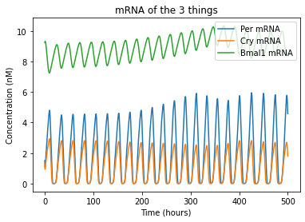

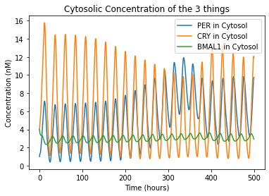

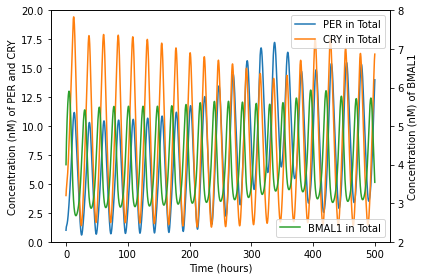

Jet Lag Simulation
------------------

Now that you have the circadian rhythm code working, you decide to begin your objective of modelling jet lag. Thinking about this challenge, you come up with a list of ways that the code must be modified:

* Light needs to be able to be switched on or off at arbitrary intervals
* The user should be able to see when the light is on or off in the output
* The light timing should be able to be changed in an intuitive way
* The circadian rhythm should be well-established prior to shifting the light cycle.
* Thorough testing shows that the oscillatory system does not fully stabilize until the model runs >500 hours, so all light manipulations should be done at t > 500 hours. To be safe, let’s say that light manipulations should occur at or around t = 1000 hours.
* The periods during which light is on should be displayed in some way on the output graphs for visual comparison.

Use the space below to copy and paste your code and modify it to fit these requirements. I’ll provide my code below that space, but note that the same result can be achieved using methods very different from mine.

**[DEVNOTE: INSERT JUPYTERLITE SPACE HERE]**

.. code:: 

    ################################################################################
    # Project Title: Circadian Rhythm Model - Jet Lag
    # Author: Ethan Biggs
    # Description: This code uses the initial conditions, kinetic rates, and the
    # ODEs described by LeLoup and Goldbeter to model the cyclic changes in
    # protein expression that characterize the circadian rhythm.
    ################################################################################
    import numpy as np                  # import data structuring
    from scipy.integrate import odeint  # import ODE integrating function
    import matplotlib.pyplot as plt     # import plotting libraries
    import math as m                    # import math operations
    
    #### Constants ####
    
    ## mRNA maximum accumulation rate constants (s=synthesis)
    vsp = 1.500 # max accumulation rate for Per mRNA in the cytosol
    vsc = 1.100 # max accumulation rate for Cry mRNA in the cytosol
    vsb = 1.000 # max accumulation rate for Bmal1 mRNA in the cytosol
    
    ## mRNA degradation rate constants
    vmp = 1.100 # max degradation rate for Per mRNA in the cytosol
    K_mp = 0.3100 # Michaelis constant of Per mRNA degradation
    vmc = 1.000 # max degradation rate for Cry mRNA in the cytosol
    K_mc = 0.400 # Michaelis constant of Cry mRNA degradation
    vmb = 0.800 # max degradation rate for Bmal1 mRNA in the cytosol
    K_mb = 0.400 # Michaelis constant of BMal1 mRNA degradation
    
    ## Non-specific mRNA degradation (1st order) rate constants
    k_dmp = 0.0100 # nonspecific degradation of Per mRNA
    k_dmc = 0.0100 # nonspecific degradation of Cry mRNA
    k_dmb = 0.0100 # nonspecific degradation of Bmal1 mRNA
    
    ## 1st order rate constants for translation of mRNA to respective proteins
    k_sP = 0.6000 # translation of Per mRNA to PER protein
    k_sC = 1.6000 # translation of Cry mRNA to CRY protein
    k_sB = 0.1200 # translation of Bmal1 mRNA to BMAL1 protein
    
    ## Phosphorylation rate constants
    V_per = 1.000 # max rate of phosphorylation of PER; "v1p" originally
    V_cry = 0.600 # max rate of phosphorylation of CRY; "v1c" originally
    V_bmal_cyto = 0.500 # max rate of phosphorylation of BMAL1 in cytosol; "v1b" originally
    V_pc_cyto = 1.000 # max rate of phosphorylation of PER-CRY complex in cytosol; "v1pc"
    V_bmal_nuc = 0.500 # max rate of phosphorylation of BMAL1 in nucleus; "v3b"
    V_pc_nuc = 1.000 # max rate of phosphorylation of PER-CRY complex in nucleus; "v3pc"
    K_p = 0.100 # Michaelis constant of phosphorylation
    
    ## Thresholds for activation
    K_AP = 0.700 # activation threshold for positive regulation of BMAL1 on Per transcription
    K_AC = 0.600 # activation threshold for positive regulation of BMAL1 on Cry transcription
    K_IB = 2.200 # activation threshold for negative regulation of CLOCK-BMAL1 on Bmal1 transcription
    vphos = 0.400 # effect of phosphorylation
    
    ## Dephosphorylation rate constants
    R_per = 0.300 # max rate of dephosphorylation of PER; "v2p"
    R_cry = 0.100 # max rate of dephosphorylation of CRY; "v2c"
    R_bmal_cyto = 0.100 # max rate of dephosphorylation of BMAL1 in cytosol; "v2b"
    R_pc_cyto = 0.100 # max rate of dephosphorylation of PER-CRY complex in cytosol; "v2pc"
    R_bmal_nuc = 0.200 # max rate of dephosphorylation of BMAL1 in nucleus; "v4b"
    R_pc_nuc = 0.100 # max rate of dephosphorylation of PER-CRY complex in nucleus; "v4pc"
    K_dp = 0.100 # Michaelis constant of phosphorylation
    
    ## Degradation of phosphorylated proteins
    v_dPc = 0.700 # max degradation rate for cytosolic PER
    v_dCc = 0.700 # max degradation rate for cytosolic CRY
    v_dBc = 0.500 # max degradation rate for cytosolic BMAL1
    v_dBn = 0.600 # max degradation rate for nuclear BMAL1
    v_dPCc = 0.700 # max degradation rate for cytosolic PER-CRY complex
    v_dPCn = 0.700 # max degradation rate for nuclear PER-CRY complex
    v_dBCi = 0.800 # max degradation rate for nuclear complex between PER-CRY and CLOCK-BMAL1
    K_d = 0.300 # Michaelis constant of degradation of phosphorylated proteins
    
    ## Non-specific protein degradation
    k_dn = 0.0100 # 1st order rate constant for degradation of all proteins unless otherwise noted
    k_dnC = 0.1200 # 1st order rate constant for general degradation of cytosolic CRY
    
    ## PER-CRY complex formation and dissociation
    k3 = 0.4000 # association rate constant for PER-CRY complex
    k4 = 0.2000 # dissociation rate constant for PER-CRY complex
    
    ## Transport rate constants
    k1 = 0.4000 # transport of PER-CRY complex into the nucleus
    k2 = 0.2000 # transport of PER-CRY complex into the cytosol
    k5 = 0.4000 # transport of BMAL1 into the nucleus
    k6 = 0.2000 # transport of BMAL1 into the cytosol
    
    ## Formation of an inactive complex in the nucleus by PER-CRY and CLOCK-BMAL1
    k7 = 0.5000 # association rate constant for the inactive complex
    k8 = 0.1000 # dissociation rate constant for the inactive complex
    
    ### Light Parameters ###############################################
    
    ## Set intensity = 0 to remove light from the model
    intensity = 0.300 # intensity of the effect light has on the circadian rhythm
    tau = 24 # 24 hours in a day
    t_on = 12 # 12 h : 12 h light/dark cycle
    t_off = tau - t_on
    settling_time = 1010 # time (hours) to wait before implementing the jetlag 
    jetlag_offset = -5 # hours to rush the next light cycle (negative postpones it)
    
    #### Initial Conditions ####
    m = 2.00 # Cooperativity
    n = 4.00 # Cooperativity
    
    xhigh = 2000
    t = np.linspace(0,xhigh,xhigh*100)
    
    # Estimated from visual analysis of the figures in the paper
    per_mrna0 = 1.5
    cry_mrna0 = 1.25
    bmal_mrna0 = 9.25
    per_cyto0 = 1
    cry_cyto0 = 4
    per_cyto_phos0 = 0
    cry_cyto_phos0 = 0
    pc_cyto0 = 0
    pc_nuc0 = 0
    pc_cyto_phos0 = 0
    pc_nuc_phos0 = 0
    bmal_cyto0 = 4
    bmal_cyto_phos0 = 0
    bmal_nuc0 = 0
    bmal_nuc_phos0 = 0
    inactive_nuc0 = 0
    
    # Make one giant list of the initial conditions
    initial_stuff = [per_mrna0,cry_mrna0,bmal_mrna0,per_cyto0,cry_cyto0,per_cyto_phos0,cry_cyto_phos0,
    	pc_cyto0,pc_nuc0,pc_cyto_phos0,pc_nuc_phos0,bmal_cyto0,bmal_cyto_phos0,bmal_nuc0,bmal_nuc_phos0,inactive_nuc0]
    
    #### Differential Equations ####
    
    def calculate_stuff(y,t):
    
    	## labeling so in the model output y, I can track each thing
    	mP = y[0]  # cytosolic Per mRNA
    	mC = y[1]  # cytosolic Cry mRNA
    	mB = y[2]  # cytosolic BMAL1 mRNA
    	Pc = y[3]  # cytosolic unphosphorylated PER
    	Cc = y[4]  # cytosolic unphosphorylated CRY
    	Pcp = y[5] # cytosolic phosphorylated PER
    	Ccp = y[6] # cytosolic phosphorylated CRY
    	PCc = y[7] # cytosolic unphosphorylated PER-CRY complex
    	PCn = y[8] # nuclear unphosphorylated PER-CRY complex
    	PCcp = y[9] # cytosolic phosphorylated PER-CRY complex
    	PCnp = y[10] # nuclear phosphorylated PER-CRY complex
    	Bc = y[11]  # cytosolic unphosphorylated BMAL1
    	Bcp = y[12] # cytosolic phosphorylated BMAL1
    	Bn = y[13]  # nuclear unphosphorylated BMAL1
    	Bnp = y[14] # nuclear phosphorylated BMAL1
    	BCi = y[15] # nuclear inactive PER-CRY and CLOCK-BMAL1 complex
    
    	## Determine if light is on or off 
    	if t < settling_time: t_m = t % tau
    	else: t_m = (t+jetlag_offset) % tau
    	if t_m >= t_off: tpulse = 1
    	else: tpulse = 0
    	light = tpulse * intensity
    
    	## mRNA concentrations 
    
    	# Change in Per mRNA in the cytosol over time [1]
    	dmP = (vsp+light)*(Bn**n / (Bn**n + K_AP**n)) - vmp * (mP / (K_mp+mP)) - k_dmp*mP
    
    	# Change in Cry mRNA in the cytosol over time [2]
    	dmC = vsc*(Bn**n / (Bn**n + K_AC**n)) - vmc * (mC / (K_mc+mC)) - k_dmc*mC
    
    	# Change in Bmal1 mRNA in the cytosol over time [3]
    	dmB = vsb*(K_IB**m / (Bn**m + K_IB**m)) - vmb * (mB / (K_mb+mB)) - k_dmb*mB
    
    	## Cytosolic PER and CRY concentrations
    
    	# Change in unphosphorylated PER over time [4]
    	dPc = k_sP*mP - (V_per*vphos*(Pc / (K_p+Pc))) + R_per*(Pcp / (K_dp+Pcp)) + k4*PCc - k3*Pc*Cc - k_dn*Pc
    
    	# Change in unphosphorylated CRY over time [5]
    	dCc = k_sC*mC - (V_cry*(Cc / (K_p+Cc))) + R_cry*(Ccp / (K_dp+Ccp)) + k4*PCc - k3*Pc*Cc - k_dnC*Cc
    
    	# Change in phosphorylated PER over time [6]
    	dPcp = V_per*vphos*(Pc / (K_p + Pc)) - (R_per*(Pcp / (K_dp + Pcp))) - v_dPc*(Pcp / (K_d + Pcp)) - k_dn*Pcp
    
    	# Change in phosphorylated CRY over time [7]
    	dCcp = V_cry*(Cc / (K_p + Cc)) - (R_cry*(Ccp / (K_dp + Ccp))) - v_dCc*(Ccp / (K_d + Ccp)) - k_dn*Ccp
    
    	## Cytosolic and nuclear PER-CRY complex concentrations
    
    	# Change in unphosphorylated cytosolic PER-CRY over time [8]
    	dPCc = -(V_pc_cyto*vphos*(PCc / (K_p + PCc))) + R_pc_cyto*(PCcp / (K_dp + PCcp)) - k4*PCc + k3*Pc*Cc + k2*PCn - k1*PCc - k_dn*PCc
    
    	# Change in unphosphorylated nuclear PER-CRY over time [9]
    	dPCn = -(V_pc_nuc*vphos*(PCn / (K_p + PCn))) + R_pc_nuc*(PCnp / (K_dp + PCnp)) - k2*PCn + k1*PCc - k7*Bn*PCn + k8*BCi - k_dn*PCn
    
    	# Change in phosphorylated cytosolic PER-CRY over time [10]
    	dPCcp = V_pc_cyto*vphos*(PCc / (K_p + PCc)) - (R_pc_cyto*(PCcp / (K_dp + PCcp))) - (v_dPCc*(PCcp / (K_d + PCcp))) - k_dn*PCcp
    
    	# Change in phosphorylated nuclear PER-CRY over time [11]
    	dPCnp = V_pc_nuc*vphos*(PCn / (K_p + PCn)) - (R_pc_nuc*(PCnp / (K_dp + PCnp))) - (v_dPCn*(PCnp / (K_d + PCnp))) - k_dn*PCnp
    
    	## Cytosolic and nuclear BMAL1 concentrations
    
    	# Change in unphosphorylated cytosolic BMAL1 over time [12]
    	dBc = k_sB*mB - (V_bmal_cyto*(Bc / (K_p + Bc))) + R_bmal_cyto*(Bcp / (K_dp + Bcp)) - k5*Bc + k6*Bn - k_dn*Bc
    
    	# Change in phosphorylated cytosolic BMAL1 over time [13]
    	dBcp = V_bmal_cyto*(Bc / (K_p + Bc)) - (R_bmal_cyto*(Bcp / (K_dp + Bcp))) - (v_dBc*(Bcp / (K_d + Bcp))) - k_dn*Bcp
    
    	# Change in unphosphorylated nuclear BMAL1 over time [14]
    	dBn = -(V_bmal_nuc*(Bn / (K_p + Bn))) + R_bmal_nuc*(Bnp / (K_dp + Bnp)) + k5*Bc - k6*Bn - k7*Bn*PCn + k8*BCi - k_dn*Bn
    
    	# Change in phosphorylated nuclear BMAL1 over time [15]
    	dBnp = V_bmal_nuc*(Bn / (K_p + Bn)) - (R_bmal_nuc*(Bnp / (K_dp + Bnp))) - (v_dBn*(Bnp / (K_d + Bnp))) - k_dn*Bnp
    
    	### Inactive complex formation 
    
    	# Change in nuclear concentration of complex between PER-CRY and CLOCK-BMAL1 [16]
    	dBCi = -k8*BCi + k7*Bn*PCn - (v_dBCi*(BCi / (K_d + BCi))) - k_dn*BCi
    
    	### Return a list of increment values
    	return [dmP,dmC,dmB,dPc,dCc,dPcp,dCcp,dPCc,dPCn,dPCcp,dPCnp,dBc,dBcp,dBn,dBnp,dBCi]
    
    #### ODE Solution Script using odeint()
    soln = odeint(calculate_stuff,initial_stuff,t)
    
    # Assigns useful names to the output
    per_mrna =       soln[:, 0]
    cry_mrna =       soln[:, 1]
    bmal_mrna =      soln[:, 2]
    per_cyto =       soln[:, 3]
    cry_cyto =       soln[:, 4]
    per_cyto_phos =  soln[:, 5]
    cry_cyto_phos =  soln[:, 6]
    pc_cyto =        soln[:, 7]
    pc_nuc =         soln[:, 8]
    pc_cyto_phos =   soln[:, 9]
    pc_nuc_phos =    soln[:,10]
    bmal_cyto =      soln[:,11]
    bmal_cyto_phos = soln[:,12]
    bmal_nuc =       soln[:,13]
    bmal_nuc_phos =  soln[:,14]
    inactive_nuc =   soln[:,15]
    
    
    ## Determine when the light was on or off
    lighttime = np.empty_like(t)
    for ind,ii in enumerate(t):
        if ii < settling_time: t_m = ii % tau
        else: t_m = (ii + jetlag_offset) % tau
        if t_m >= t_off: lighttime[ind] = 1
        else: lighttime[ind] = 0
    
    
    #### Figures ####
    pretime = 200
    posttime = 300
    
    plt.figure(num=1)
    plt.plot(t,per_mrna, label='Per mRNA')
    plt.plot(t,cry_mrna, label='Cry mRNA')
    plt.plot(t,bmal_mrna, label='Bmal1 mRNA')
    plt.plot(t,2*lighttime,color='black')
    
    plt.xlabel('Time (hours)')
    plt.ylabel('Concentration (nM)')
    plt.title('mRNA of the 3 things')
    plt.legend(loc=1)#,bbox_to_anchor=(1.2,1))
    plt.xlim(settling_time-pretime-10,settling_time+posttime-10)
    plt.show()
    
    plt.figure(num=2)
    plt.plot(t,per_cyto + per_cyto_phos + pc_cyto + pc_cyto_phos, label='PER in Cytosol')
    plt.plot(t,cry_cyto + cry_cyto_phos + pc_cyto + pc_cyto_phos, label='CRY in Cytosol')
    plt.plot(t,bmal_cyto + bmal_cyto_phos, label='BMAL1 in Cytosol')
    plt.plot(t,2*lighttime,color='black')
    
    plt.xlabel('Time (hours)')
    plt.ylabel('Concentration (nM)')
    plt.title('Cytosolic Concentration of the 3 things')
    plt.legend(loc=1)
    plt.xlim(settling_time-pretime-10,settling_time+posttime-10)
    plt.show()
    
    fig, ax1 = plt.subplots()
    ax1.plot(t,per_cyto + per_cyto_phos + pc_cyto + pc_cyto_phos + pc_nuc + pc_nuc_phos, label='PER in Total')
    ax1.plot(t,cry_cyto + cry_cyto_phos + pc_cyto + pc_cyto_phos + pc_nuc + pc_nuc_phos, label='CRY in Total')
    ax1.set_xlabel('Time (hours)')
    ax1.set_ylabel('Concentration (nM) of PER and CRY')
    ax1.set_ylim(0,20)
    ax1.legend(loc=1)
    
    ax2 = ax1.twinx() # instantiate a second axes that shares the x axis
    
    ax2.plot(t,bmal_cyto + bmal_cyto_phos + bmal_nuc + bmal_nuc_phos, label='BMAL1 in Total',color='tab:green')
    ax2.plot(t,3*lighttime,color='black')
    ax2.set_ylabel('Concentration (nM) of BMAL1')
    ax2.set_ylim(2,8)
    
    # plt.xlabel('Time (hours)')
    # plt.ylabel('Concentration (nM)')
    # plt.title('Total Concentration of the 3 things')
    plt.legend(loc=4)
    fig.tight_layout()
    plt.xlim(settling_time-pretime-10,settling_time+posttime-10)
    plt.show()
    
    plt.figure(4)
    plt.plot(t,lighttime)
    plt.xlim(settling_time-pretime-10,settling_time+posttime-10)

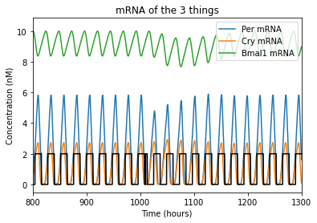

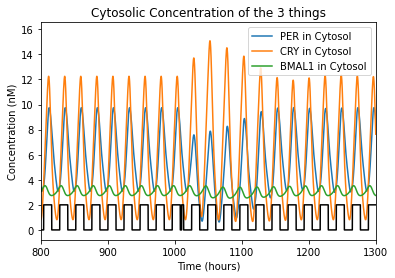

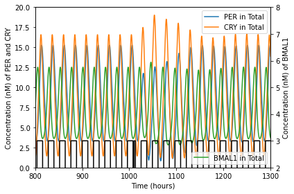

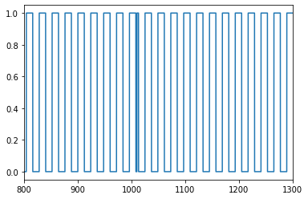

Interpretation Questions
------------------------

Using the output from your code and your understanding of the differential equations above, answer the following questions:

Which protein(s) appear to correlate with wakefulness? Which with sleep?

*Answer: PER and CRY are associated with wakefulness; BMAL1 with sleep.*

Using the “eyeball method,” how many days would it take for a person to adjust to the time change when traveling from Purdue in Lafayette, IN, USA (UTC - 5:00) to London, UK (UTC - 0:00)?

*Answer: 4-5 days*

Using the “eyeball method” again, how many days would it take for a Briton living in London to adjust to the time change when traveling to Purdue? Is this different from the previous answer? If so, why might this be?

*Answer: 5-6 days*

Integration and Expansion Questions
-----------------------------------

This model uses a 12h:12h light:dark cycle. However, most people do not live in such an environment. Especially since the invention of electricity and lightbulbs, many of us would be lucky to get 8 hours of dark per night to keep our circadian rhythms balanced. Indeed, many people report only reliably getting approximately 6 hours of sleep per night [2].

Based upon this information, copy and paste your circadian rhythm code below, then adapt it to have a 16 h : 8 h light:dark cycle *(hint: because of the way that tpulse is calculated, this should only require changing one value)*. Then repeat the two jetlag simulations above (Purdue to London and London to Purdue) with the new model and describe your results in the space provided.

*Answer: The time to recovery from jetlag is increased by 1-2 days for each case.*

.. code:: 

    ### Use this space to adapt your jetlag code to the new light:dark cycle

.. code:: 

    ################################################################################
    # Project Title: Circadian Rhythm Model - Jet Lag
    # Author: Ethan Biggs
    # Description: This code uses the initial conditions, kinetic rates, and the
    # ODEs described by LeLoup and Goldbeter to model the cyclic changes in
    # protein expression that characterize the circadian rhythm.
    ################################################################################
    import numpy as np                  # import data structuring
    from scipy.integrate import odeint  # import ODE integrating function
    import matplotlib.pyplot as plt     # import plotting libraries
    import math as m                    # import math operations
    
    #### Constants ####
    
    ## mRNA maximum accumulation rate constants (s=synthesis)
    vsp = 1.500 # max accumulation rate for Per mRNA in the cytosol
    vsc = 1.100 # max accumulation rate for Cry mRNA in the cytosol
    vsb = 1.000 # max accumulation rate for Bmal1 mRNA in the cytosol
    
    ## mRNA degradation rate constants
    vmp = 1.100 # max degradation rate for Per mRNA in the cytosol
    K_mp = 0.3100 # Michaelis constant of Per mRNA degradation
    vmc = 1.000 # max degradation rate for Cry mRNA in the cytosol
    K_mc = 0.400 # Michaelis constant of Cry mRNA degradation
    vmb = 0.800 # max degradation rate for Bmal1 mRNA in the cytosol
    K_mb = 0.400 # Michaelis constant of BMal1 mRNA degradation
    
    ## Non-specific mRNA degradation (1st order) rate constants
    k_dmp = 0.0100 # nonspecific degradation of Per mRNA
    k_dmc = 0.0100 # nonspecific degradation of Cry mRNA
    k_dmb = 0.0100 # nonspecific degradation of Bmal1 mRNA
    
    ## 1st order rate constants for translation of mRNA to respective proteins
    k_sP = 0.6000 # translation of Per mRNA to PER protein
    k_sC = 1.6000 # translation of Cry mRNA to CRY protein
    k_sB = 0.1200 # translation of Bmal1 mRNA to BMAL1 protein
    
    ## Phosphorylation rate constants
    V_per = 1.000 # max rate of phosphorylation of PER; "v1p" originally
    V_cry = 0.600 # max rate of phosphorylation of CRY; "v1c" originally
    V_bmal_cyto = 0.500 # max rate of phosphorylation of BMAL1 in cytosol; "v1b" originally
    V_pc_cyto = 1.000 # max rate of phosphorylation of PER-CRY complex in cytosol; "v1pc"
    V_bmal_nuc = 0.500 # max rate of phosphorylation of BMAL1 in nucleus; "v3b"
    V_pc_nuc = 1.000 # max rate of phosphorylation of PER-CRY complex in nucleus; "v3pc"
    K_p = 0.100 # Michaelis constant of phosphorylation
    
    ## Thresholds for activation
    K_AP = 0.700 # activation threshold for positive regulation of BMAL1 on Per transcription
    K_AC = 0.600 # activation threshold for positive regulation of BMAL1 on Cry transcription
    K_IB = 2.200 # activation threshold for negative regulation of CLOCK-BMAL1 on Bmal1 transcription
    vphos = 0.400 # effect of phosphorylation
    
    ## Dephosphorylation rate constants
    R_per = 0.300 # max rate of dephosphorylation of PER; "v2p"
    R_cry = 0.100 # max rate of dephosphorylation of CRY; "v2c"
    R_bmal_cyto = 0.100 # max rate of dephosphorylation of BMAL1 in cytosol; "v2b"
    R_pc_cyto = 0.100 # max rate of dephosphorylation of PER-CRY complex in cytosol; "v2pc"
    R_bmal_nuc = 0.200 # max rate of dephosphorylation of BMAL1 in nucleus; "v4b"
    R_pc_nuc = 0.100 # max rate of dephosphorylation of PER-CRY complex in nucleus; "v4pc"
    K_dp = 0.100 # Michaelis constant of phosphorylation
    
    ## Degradation of phosphorylated proteins
    v_dPc = 0.700 # max degradation rate for cytosolic PER
    v_dCc = 0.700 # max degradation rate for cytosolic CRY
    v_dBc = 0.500 # max degradation rate for cytosolic BMAL1
    v_dBn = 0.600 # max degradation rate for nuclear BMAL1
    v_dPCc = 0.700 # max degradation rate for cytosolic PER-CRY complex
    v_dPCn = 0.700 # max degradation rate for nuclear PER-CRY complex
    v_dBCi = 0.800 # max degradation rate for nuclear complex between PER-CRY and CLOCK-BMAL1
    K_d = 0.300 # Michaelis constant of degradation of phosphorylated proteins
    
    ## Non-specific protein degradation
    k_dn = 0.0100 # 1st order rate constant for degradation of all proteins unless otherwise noted
    k_dnC = 0.1200 # 1st order rate constant for general degradation of cytosolic CRY
    
    ## PER-CRY complex formation and dissociation
    k3 = 0.4000 # association rate constant for PER-CRY complex
    k4 = 0.2000 # dissociation rate constant for PER-CRY complex
    
    ## Transport rate constants
    k1 = 0.4000 # transport of PER-CRY complex into the nucleus
    k2 = 0.2000 # transport of PER-CRY complex into the cytosol
    k5 = 0.4000 # transport of BMAL1 into the nucleus
    k6 = 0.2000 # transport of BMAL1 into the cytosol
    
    ## Formation of an inactive complex in the nucleus by PER-CRY and CLOCK-BMAL1
    k7 = 0.5000 # association rate constant for the inactive complex
    k8 = 0.1000 # dissociation rate constant for the inactive complex
    
    ### Light Parameters ###############################################
    
    ## Set intensity = 0 to remove light from the model
    intensity = 0.300 # intensity of the effect light has on the circadian rhythm
    tau = 24 # 24 hours in a day
    t_on = 16 # 16 h : 8 h light/dark cycle
    t_off = tau - t_on
    settling_time = 1010 # time (hours) to wait before implementing the jetlag 
    jetlag_offset = -5 # hours to rush the next light cycle (negative postpones it)
    
    #### Initial Conditions ####
    m = 2.00 # Cooperativity
    n = 4.00 # Cooperativity
    
    xhigh = 2000
    t = np.linspace(0,xhigh,xhigh*100)
    
    # Estimated from visual analysis of the figures in the paper
    per_mrna0 = 1.5
    cry_mrna0 = 1.25
    bmal_mrna0 = 9.25
    per_cyto0 = 1
    cry_cyto0 = 4
    per_cyto_phos0 = 0
    cry_cyto_phos0 = 0
    pc_cyto0 = 0
    pc_nuc0 = 0
    pc_cyto_phos0 = 0
    pc_nuc_phos0 = 0
    bmal_cyto0 = 4
    bmal_cyto_phos0 = 0
    bmal_nuc0 = 0
    bmal_nuc_phos0 = 0
    inactive_nuc0 = 0
    
    # Make one giant list of the initial conditions
    initial_stuff = [per_mrna0,cry_mrna0,bmal_mrna0,per_cyto0,cry_cyto0,per_cyto_phos0,cry_cyto_phos0,
    	pc_cyto0,pc_nuc0,pc_cyto_phos0,pc_nuc_phos0,bmal_cyto0,bmal_cyto_phos0,bmal_nuc0,bmal_nuc_phos0,inactive_nuc0]
    
    #### Differential Equations ####
    
    def calculate_stuff(y,t):
    
    	## labeling so in the model output y, I can track each thing
    	mP = y[0]  # cytosolic Per mRNA
    	mC = y[1]  # cytosolic Cry mRNA
    	mB = y[2]  # cytosolic BMAL1 mRNA
    	Pc = y[3]  # cytosolic unphosphorylated PER
    	Cc = y[4]  # cytosolic unphosphorylated CRY
    	Pcp = y[5] # cytosolic phosphorylated PER
    	Ccp = y[6] # cytosolic phosphorylated CRY
    	PCc = y[7] # cytosolic unphosphorylated PER-CRY complex
    	PCn = y[8] # nuclear unphosphorylated PER-CRY complex
    	PCcp = y[9] # cytosolic phosphorylated PER-CRY complex
    	PCnp = y[10] # nuclear phosphorylated PER-CRY complex
    	Bc = y[11]  # cytosolic unphosphorylated BMAL1
    	Bcp = y[12] # cytosolic phosphorylated BMAL1
    	Bn = y[13]  # nuclear unphosphorylated BMAL1
    	Bnp = y[14] # nuclear phosphorylated BMAL1
    	BCi = y[15] # nuclear inactive PER-CRY and CLOCK-BMAL1 complex
    
    	## Determine if light is on or off 
    	if t < settling_time: t_m = t % tau
    	else: t_m = (t+jetlag_offset) % tau
    	if t_m >= t_off: tpulse = 1
    	else: tpulse = 0
    	light = tpulse * intensity
    
    	## mRNA concentrations 
    
    	# Change in Per mRNA in the cytosol over time [1]
    	dmP = (vsp+light)*(Bn**n / (Bn**n + K_AP**n)) - vmp * (mP / (K_mp+mP)) - k_dmp*mP
    
    	# Change in Cry mRNA in the cytosol over time [2]
    	dmC = vsc*(Bn**n / (Bn**n + K_AC**n)) - vmc * (mC / (K_mc+mC)) - k_dmc*mC
    
    	# Change in Bmal1 mRNA in the cytosol over time [3]
    	dmB = vsb*(K_IB**m / (Bn**m + K_IB**m)) - vmb * (mB / (K_mb+mB)) - k_dmb*mB
    
    	## Cytosolic PER and CRY concentrations
    
    	# Change in unphosphorylated PER over time [4]
    	dPc = k_sP*mP - (V_per*vphos*(Pc / (K_p+Pc))) + R_per*(Pcp / (K_dp+Pcp)) + k4*PCc - k3*Pc*Cc - k_dn*Pc
    
    	# Change in unphosphorylated CRY over time [5]
    	dCc = k_sC*mC - (V_cry*(Cc / (K_p+Cc))) + R_cry*(Ccp / (K_dp+Ccp)) + k4*PCc - k3*Pc*Cc - k_dnC*Cc
    
    	# Change in phosphorylated PER over time [6]
    	dPcp = V_per*vphos*(Pc / (K_p + Pc)) - (R_per*(Pcp / (K_dp + Pcp))) - v_dPc*(Pcp / (K_d + Pcp)) - k_dn*Pcp
    
    	# Change in phosphorylated CRY over time [7]
    	dCcp = V_cry*(Cc / (K_p + Cc)) - (R_cry*(Ccp / (K_dp + Ccp))) - v_dCc*(Ccp / (K_d + Ccp)) - k_dn*Ccp
    
    	## Cytosolic and nuclear PER-CRY complex concentrations
    
    	# Change in unphosphorylated cytosolic PER-CRY over time [8]
    	dPCc = -(V_pc_cyto*vphos*(PCc / (K_p + PCc))) + R_pc_cyto*(PCcp / (K_dp + PCcp)) - k4*PCc + k3*Pc*Cc + k2*PCn - k1*PCc - k_dn*PCc
    
    	# Change in unphosphorylated nuclear PER-CRY over time [9]
    	dPCn = -(V_pc_nuc*vphos*(PCn / (K_p + PCn))) + R_pc_nuc*(PCnp / (K_dp + PCnp)) - k2*PCn + k1*PCc - k7*Bn*PCn + k8*BCi - k_dn*PCn
    
    	# Change in phosphorylated cytosolic PER-CRY over time [10]
    	dPCcp = V_pc_cyto*vphos*(PCc / (K_p + PCc)) - (R_pc_cyto*(PCcp / (K_dp + PCcp))) - (v_dPCc*(PCcp / (K_d + PCcp))) - k_dn*PCcp
    
    	# Change in phosphorylated nuclear PER-CRY over time [11]
    	dPCnp = V_pc_nuc*vphos*(PCn / (K_p + PCn)) - (R_pc_nuc*(PCnp / (K_dp + PCnp))) - (v_dPCn*(PCnp / (K_d + PCnp))) - k_dn*PCnp
    
    	## Cytosolic and nuclear BMAL1 concentrations
    
    	# Change in unphosphorylated cytosolic BMAL1 over time [12]
    	dBc = k_sB*mB - (V_bmal_cyto*(Bc / (K_p + Bc))) + R_bmal_cyto*(Bcp / (K_dp + Bcp)) - k5*Bc + k6*Bn - k_dn*Bc
    
    	# Change in phosphorylated cytosolic BMAL1 over time [13]
    	dBcp = V_bmal_cyto*(Bc / (K_p + Bc)) - (R_bmal_cyto*(Bcp / (K_dp + Bcp))) - (v_dBc*(Bcp / (K_d + Bcp))) - k_dn*Bcp
    
    	# Change in unphosphorylated nuclear BMAL1 over time [14]
    	dBn = -(V_bmal_nuc*(Bn / (K_p + Bn))) + R_bmal_nuc*(Bnp / (K_dp + Bnp)) + k5*Bc - k6*Bn - k7*Bn*PCn + k8*BCi - k_dn*Bn
    
    	# Change in phosphorylated nuclear BMAL1 over time [15]
    	dBnp = V_bmal_nuc*(Bn / (K_p + Bn)) - (R_bmal_nuc*(Bnp / (K_dp + Bnp))) - (v_dBn*(Bnp / (K_d + Bnp))) - k_dn*Bnp
    
    	### Inactive complex formation 
    
    	# Change in nuclear concentration of complex between PER-CRY and CLOCK-BMAL1 [16]
    	dBCi = -k8*BCi + k7*Bn*PCn - (v_dBCi*(BCi / (K_d + BCi))) - k_dn*BCi
    
    	### Return a list of increment values
    	return [dmP,dmC,dmB,dPc,dCc,dPcp,dCcp,dPCc,dPCn,dPCcp,dPCnp,dBc,dBcp,dBn,dBnp,dBCi]
    
    #### ODE Solution Script using odeint()
    soln = odeint(calculate_stuff,initial_stuff,t)
    
    # Assigns useful names to the output
    per_mrna =       soln[:, 0]
    cry_mrna =       soln[:, 1]
    bmal_mrna =      soln[:, 2]
    per_cyto =       soln[:, 3]
    cry_cyto =       soln[:, 4]
    per_cyto_phos =  soln[:, 5]
    cry_cyto_phos =  soln[:, 6]
    pc_cyto =        soln[:, 7]
    pc_nuc =         soln[:, 8]
    pc_cyto_phos =   soln[:, 9]
    pc_nuc_phos =    soln[:,10]
    bmal_cyto =      soln[:,11]
    bmal_cyto_phos = soln[:,12]
    bmal_nuc =       soln[:,13]
    bmal_nuc_phos =  soln[:,14]
    inactive_nuc =   soln[:,15]
    
    
    ## Determine when the light was on or off
    lighttime = np.empty_like(t)
    for ind,ii in enumerate(t):
        if ii < settling_time: t_m = ii % tau
        else: t_m = (ii + jetlag_offset) % tau
        if t_m >= t_off: lighttime[ind] = 1
        else: lighttime[ind] = 0
    
    
    #### Figures ####
    pretime = 200
    posttime = 300
    
    plt.figure(num=1)
    plt.plot(t,per_mrna, label='Per mRNA')
    plt.plot(t,cry_mrna, label='Cry mRNA')
    plt.plot(t,bmal_mrna, label='Bmal1 mRNA')
    plt.plot(t,2*lighttime,color='black')
    
    plt.xlabel('Time (hours)')
    plt.ylabel('Concentration (nM)')
    plt.title('mRNA of the 3 things')
    plt.legend(loc=1)#,bbox_to_anchor=(1.2,1))
    plt.xlim(settling_time-pretime-10,settling_time+posttime-10)
    plt.show()
    
    plt.figure(num=2)
    plt.plot(t,per_cyto + per_cyto_phos + pc_cyto + pc_cyto_phos, label='PER in Cytosol')
    plt.plot(t,cry_cyto + cry_cyto_phos + pc_cyto + pc_cyto_phos, label='CRY in Cytosol')
    plt.plot(t,bmal_cyto + bmal_cyto_phos, label='BMAL1 in Cytosol')
    plt.plot(t,2*lighttime,color='black')
    
    plt.xlabel('Time (hours)')
    plt.ylabel('Concentration (nM)')
    plt.title('Cytosolic Concentration of the 3 things')
    plt.legend(loc=1)
    plt.xlim(settling_time-pretime-10,settling_time+posttime-10)
    plt.show()
    
    fig, ax1 = plt.subplots()
    ax1.plot(t,per_cyto + per_cyto_phos + pc_cyto + pc_cyto_phos + pc_nuc + pc_nuc_phos, label='PER in Total')
    ax1.plot(t,cry_cyto + cry_cyto_phos + pc_cyto + pc_cyto_phos + pc_nuc + pc_nuc_phos, label='CRY in Total')
    ax1.set_xlabel('Time (hours)')
    ax1.set_ylabel('Concentration (nM) of PER and CRY')
    ax1.set_ylim(0,20)
    ax1.legend(loc=1)
    
    ax2 = ax1.twinx() # instantiate a second axes that shares the x axis
    
    ax2.plot(t,bmal_cyto + bmal_cyto_phos + bmal_nuc + bmal_nuc_phos, label='BMAL1 in Total',color='tab:green')
    ax2.plot(t,3*lighttime,color='black')
    ax2.set_ylabel('Concentration (nM) of BMAL1')
    ax2.set_ylim(2,8)
    
    # plt.xlabel('Time (hours)')
    # plt.ylabel('Concentration (nM)')
    # plt.title('Total Concentration of the 3 things')
    plt.legend(loc=4)
    fig.tight_layout()
    plt.xlim(settling_time-pretime-10,settling_time+posttime-10)
    plt.show()
    
    plt.figure(4)
    plt.plot(t,lighttime)
    plt.xlim(settling_time-pretime-10,settling_time+posttime-10)

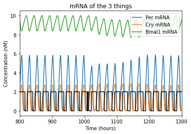

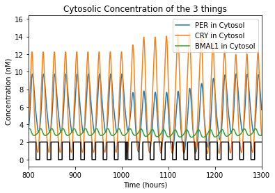

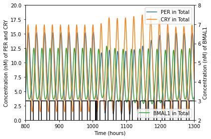

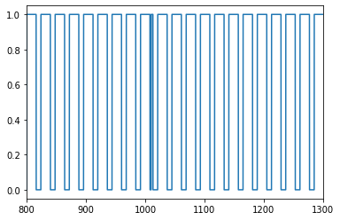

Repeat the above experiment for an 18 h : 6 h light:dark cycle to simulate a person with particularly poor sleep habits. Does this seem healthy? Does it appear that this person would be able to mentally function at their potential? Is our society literally asking people to do things counter to their health, what their biochemistry is capable of doing, and what would allow them to contribute maximally contribute to their communities because treating people as disposable “company assets” is the inevitable result of end-stage capitalism?

What can we do about this? Assuming that this simulated person cannot make substantive changes to their sleep schedule, can you simulate any actions they may be able to take to improve their circadian rhythm?

*Answer: Reduce exposure to light in the evenings, increase exposure to light in the mornings, etc.*

.. code:: 

    ### Use this space to adapt your jetlag code to the new light:dark cycle

.. code:: 

    ################################################################################
    # Project Title: Circadian Rhythm Model - Jet Lag
    # Author: Ethan Biggs
    # Description: This code uses the initial conditions, kinetic rates, and the
    # ODEs described by LeLoup and Goldbeter to model the cyclic changes in
    # protein expression that characterize the circadian rhythm.
    ################################################################################
    import numpy as np                  # import data structuring
    from scipy.integrate import odeint  # import ODE integrating function
    import matplotlib.pyplot as plt     # import plotting libraries
    import math as m                    # import math operations
    
    #### Constants ####
    
    ## mRNA maximum accumulation rate constants (s=synthesis)
    vsp = 1.500 # max accumulation rate for Per mRNA in the cytosol
    vsc = 1.100 # max accumulation rate for Cry mRNA in the cytosol
    vsb = 1.000 # max accumulation rate for Bmal1 mRNA in the cytosol
    
    ## mRNA degradation rate constants
    vmp = 1.100 # max degradation rate for Per mRNA in the cytosol
    K_mp = 0.3100 # Michaelis constant of Per mRNA degradation
    vmc = 1.000 # max degradation rate for Cry mRNA in the cytosol
    K_mc = 0.400 # Michaelis constant of Cry mRNA degradation
    vmb = 0.800 # max degradation rate for Bmal1 mRNA in the cytosol
    K_mb = 0.400 # Michaelis constant of BMal1 mRNA degradation
    
    ## Non-specific mRNA degradation (1st order) rate constants
    k_dmp = 0.0100 # nonspecific degradation of Per mRNA
    k_dmc = 0.0100 # nonspecific degradation of Cry mRNA
    k_dmb = 0.0100 # nonspecific degradation of Bmal1 mRNA
    
    ## 1st order rate constants for translation of mRNA to respective proteins
    k_sP = 0.6000 # translation of Per mRNA to PER protein
    k_sC = 1.6000 # translation of Cry mRNA to CRY protein
    k_sB = 0.1200 # translation of Bmal1 mRNA to BMAL1 protein
    
    ## Phosphorylation rate constants
    V_per = 1.000 # max rate of phosphorylation of PER; "v1p" originally
    V_cry = 0.600 # max rate of phosphorylation of CRY; "v1c" originally
    V_bmal_cyto = 0.500 # max rate of phosphorylation of BMAL1 in cytosol; "v1b" originally
    V_pc_cyto = 1.000 # max rate of phosphorylation of PER-CRY complex in cytosol; "v1pc"
    V_bmal_nuc = 0.500 # max rate of phosphorylation of BMAL1 in nucleus; "v3b"
    V_pc_nuc = 1.000 # max rate of phosphorylation of PER-CRY complex in nucleus; "v3pc"
    K_p = 0.100 # Michaelis constant of phosphorylation
    
    ## Thresholds for activation
    K_AP = 0.700 # activation threshold for positive regulation of BMAL1 on Per transcription
    K_AC = 0.600 # activation threshold for positive regulation of BMAL1 on Cry transcription
    K_IB = 2.200 # activation threshold for negative regulation of CLOCK-BMAL1 on Bmal1 transcription
    vphos = 0.400 # effect of phosphorylation
    
    ## Dephosphorylation rate constants
    R_per = 0.300 # max rate of dephosphorylation of PER; "v2p"
    R_cry = 0.100 # max rate of dephosphorylation of CRY; "v2c"
    R_bmal_cyto = 0.100 # max rate of dephosphorylation of BMAL1 in cytosol; "v2b"
    R_pc_cyto = 0.100 # max rate of dephosphorylation of PER-CRY complex in cytosol; "v2pc"
    R_bmal_nuc = 0.200 # max rate of dephosphorylation of BMAL1 in nucleus; "v4b"
    R_pc_nuc = 0.100 # max rate of dephosphorylation of PER-CRY complex in nucleus; "v4pc"
    K_dp = 0.100 # Michaelis constant of phosphorylation
    
    ## Degradation of phosphorylated proteins
    v_dPc = 0.700 # max degradation rate for cytosolic PER
    v_dCc = 0.700 # max degradation rate for cytosolic CRY
    v_dBc = 0.500 # max degradation rate for cytosolic BMAL1
    v_dBn = 0.600 # max degradation rate for nuclear BMAL1
    v_dPCc = 0.700 # max degradation rate for cytosolic PER-CRY complex
    v_dPCn = 0.700 # max degradation rate for nuclear PER-CRY complex
    v_dBCi = 0.800 # max degradation rate for nuclear complex between PER-CRY and CLOCK-BMAL1
    K_d = 0.300 # Michaelis constant of degradation of phosphorylated proteins
    
    ## Non-specific protein degradation
    k_dn = 0.0100 # 1st order rate constant for degradation of all proteins unless otherwise noted
    k_dnC = 0.1200 # 1st order rate constant for general degradation of cytosolic CRY
    
    ## PER-CRY complex formation and dissociation
    k3 = 0.4000 # association rate constant for PER-CRY complex
    k4 = 0.2000 # dissociation rate constant for PER-CRY complex
    
    ## Transport rate constants
    k1 = 0.4000 # transport of PER-CRY complex into the nucleus
    k2 = 0.2000 # transport of PER-CRY complex into the cytosol
    k5 = 0.4000 # transport of BMAL1 into the nucleus
    k6 = 0.2000 # transport of BMAL1 into the cytosol
    
    ## Formation of an inactive complex in the nucleus by PER-CRY and CLOCK-BMAL1
    k7 = 0.5000 # association rate constant for the inactive complex
    k8 = 0.1000 # dissociation rate constant for the inactive complex
    
    ### Light Parameters ###############################################
    
    ## Set intensity = 0 to remove light from the model
    intensity = 0.300 # intensity of the effect light has on the circadian rhythm
    tau = 24 # 24 hours in a day
    t_on = 18 # 18 h : 6 h light/dark cycle
    t_off = tau - t_on
    settling_time = 1010 # time (hours) to wait before implementing the jetlag 
    jetlag_offset = -5 # hours to rush the next light cycle (negative postpones it)
    
    #### Initial Conditions ####
    m = 2.00 # Cooperativity
    n = 4.00 # Cooperativity
    
    xhigh = 2000
    t = np.linspace(0,xhigh,xhigh*100)
    
    # Estimated from visual analysis of the figures in the paper
    per_mrna0 = 1.5
    cry_mrna0 = 1.25
    bmal_mrna0 = 9.25
    per_cyto0 = 1
    cry_cyto0 = 4
    per_cyto_phos0 = 0
    cry_cyto_phos0 = 0
    pc_cyto0 = 0
    pc_nuc0 = 0
    pc_cyto_phos0 = 0
    pc_nuc_phos0 = 0
    bmal_cyto0 = 4
    bmal_cyto_phos0 = 0
    bmal_nuc0 = 0
    bmal_nuc_phos0 = 0
    inactive_nuc0 = 0
    
    # Make one giant list of the initial conditions
    initial_stuff = [per_mrna0,cry_mrna0,bmal_mrna0,per_cyto0,cry_cyto0,per_cyto_phos0,cry_cyto_phos0,
    	pc_cyto0,pc_nuc0,pc_cyto_phos0,pc_nuc_phos0,bmal_cyto0,bmal_cyto_phos0,bmal_nuc0,bmal_nuc_phos0,inactive_nuc0]
    
    #### Differential Equations ####
    
    def calculate_stuff(y,t):
    
    	## labeling so in the model output y, I can track each thing
    	mP = y[0]  # cytosolic Per mRNA
    	mC = y[1]  # cytosolic Cry mRNA
    	mB = y[2]  # cytosolic BMAL1 mRNA
    	Pc = y[3]  # cytosolic unphosphorylated PER
    	Cc = y[4]  # cytosolic unphosphorylated CRY
    	Pcp = y[5] # cytosolic phosphorylated PER
    	Ccp = y[6] # cytosolic phosphorylated CRY
    	PCc = y[7] # cytosolic unphosphorylated PER-CRY complex
    	PCn = y[8] # nuclear unphosphorylated PER-CRY complex
    	PCcp = y[9] # cytosolic phosphorylated PER-CRY complex
    	PCnp = y[10] # nuclear phosphorylated PER-CRY complex
    	Bc = y[11]  # cytosolic unphosphorylated BMAL1
    	Bcp = y[12] # cytosolic phosphorylated BMAL1
    	Bn = y[13]  # nuclear unphosphorylated BMAL1
    	Bnp = y[14] # nuclear phosphorylated BMAL1
    	BCi = y[15] # nuclear inactive PER-CRY and CLOCK-BMAL1 complex
    
    	## Determine if light is on or off 
    	if t < settling_time: t_m = t % tau
    	else: t_m = (t+jetlag_offset) % tau
    	if t_m >= t_off: tpulse = 1
    	else: tpulse = 0
    	light = tpulse * intensity
    
    	## mRNA concentrations 
    
    	# Change in Per mRNA in the cytosol over time [1]
    	dmP = (vsp+light)*(Bn**n / (Bn**n + K_AP**n)) - vmp * (mP / (K_mp+mP)) - k_dmp*mP
    
    	# Change in Cry mRNA in the cytosol over time [2]
    	dmC = vsc*(Bn**n / (Bn**n + K_AC**n)) - vmc * (mC / (K_mc+mC)) - k_dmc*mC
    
    	# Change in Bmal1 mRNA in the cytosol over time [3]
    	dmB = vsb*(K_IB**m / (Bn**m + K_IB**m)) - vmb * (mB / (K_mb+mB)) - k_dmb*mB
    
    	## Cytosolic PER and CRY concentrations
    
    	# Change in unphosphorylated PER over time [4]
    	dPc = k_sP*mP - (V_per*vphos*(Pc / (K_p+Pc))) + R_per*(Pcp / (K_dp+Pcp)) + k4*PCc - k3*Pc*Cc - k_dn*Pc
    
    	# Change in unphosphorylated CRY over time [5]
    	dCc = k_sC*mC - (V_cry*(Cc / (K_p+Cc))) + R_cry*(Ccp / (K_dp+Ccp)) + k4*PCc - k3*Pc*Cc - k_dnC*Cc
    
    	# Change in phosphorylated PER over time [6]
    	dPcp = V_per*vphos*(Pc / (K_p + Pc)) - (R_per*(Pcp / (K_dp + Pcp))) - v_dPc*(Pcp / (K_d + Pcp)) - k_dn*Pcp
    
    	# Change in phosphorylated CRY over time [7]
    	dCcp = V_cry*(Cc / (K_p + Cc)) - (R_cry*(Ccp / (K_dp + Ccp))) - v_dCc*(Ccp / (K_d + Ccp)) - k_dn*Ccp
    
    	## Cytosolic and nuclear PER-CRY complex concentrations
    
    	# Change in unphosphorylated cytosolic PER-CRY over time [8]
    	dPCc = -(V_pc_cyto*vphos*(PCc / (K_p + PCc))) + R_pc_cyto*(PCcp / (K_dp + PCcp)) - k4*PCc + k3*Pc*Cc + k2*PCn - k1*PCc - k_dn*PCc
    
    	# Change in unphosphorylated nuclear PER-CRY over time [9]
    	dPCn = -(V_pc_nuc*vphos*(PCn / (K_p + PCn))) + R_pc_nuc*(PCnp / (K_dp + PCnp)) - k2*PCn + k1*PCc - k7*Bn*PCn + k8*BCi - k_dn*PCn
    
    	# Change in phosphorylated cytosolic PER-CRY over time [10]
    	dPCcp = V_pc_cyto*vphos*(PCc / (K_p + PCc)) - (R_pc_cyto*(PCcp / (K_dp + PCcp))) - (v_dPCc*(PCcp / (K_d + PCcp))) - k_dn*PCcp
    
    	# Change in phosphorylated nuclear PER-CRY over time [11]
    	dPCnp = V_pc_nuc*vphos*(PCn / (K_p + PCn)) - (R_pc_nuc*(PCnp / (K_dp + PCnp))) - (v_dPCn*(PCnp / (K_d + PCnp))) - k_dn*PCnp
    
    	## Cytosolic and nuclear BMAL1 concentrations
    
    	# Change in unphosphorylated cytosolic BMAL1 over time [12]
    	dBc = k_sB*mB - (V_bmal_cyto*(Bc / (K_p + Bc))) + R_bmal_cyto*(Bcp / (K_dp + Bcp)) - k5*Bc + k6*Bn - k_dn*Bc
    
    	# Change in phosphorylated cytosolic BMAL1 over time [13]
    	dBcp = V_bmal_cyto*(Bc / (K_p + Bc)) - (R_bmal_cyto*(Bcp / (K_dp + Bcp))) - (v_dBc*(Bcp / (K_d + Bcp))) - k_dn*Bcp
    
    	# Change in unphosphorylated nuclear BMAL1 over time [14]
    	dBn = -(V_bmal_nuc*(Bn / (K_p + Bn))) + R_bmal_nuc*(Bnp / (K_dp + Bnp)) + k5*Bc - k6*Bn - k7*Bn*PCn + k8*BCi - k_dn*Bn
    
    	# Change in phosphorylated nuclear BMAL1 over time [15]
    	dBnp = V_bmal_nuc*(Bn / (K_p + Bn)) - (R_bmal_nuc*(Bnp / (K_dp + Bnp))) - (v_dBn*(Bnp / (K_d + Bnp))) - k_dn*Bnp
    
    	### Inactive complex formation 
    
    	# Change in nuclear concentration of complex between PER-CRY and CLOCK-BMAL1 [16]
    	dBCi = -k8*BCi + k7*Bn*PCn - (v_dBCi*(BCi / (K_d + BCi))) - k_dn*BCi
    
    	### Return a list of increment values
    	return [dmP,dmC,dmB,dPc,dCc,dPcp,dCcp,dPCc,dPCn,dPCcp,dPCnp,dBc,dBcp,dBn,dBnp,dBCi]
    
    #### ODE Solution Script using odeint()
    soln = odeint(calculate_stuff,initial_stuff,t)
    
    # Assigns useful names to the output
    per_mrna =       soln[:, 0]
    cry_mrna =       soln[:, 1]
    bmal_mrna =      soln[:, 2]
    per_cyto =       soln[:, 3]
    cry_cyto =       soln[:, 4]
    per_cyto_phos =  soln[:, 5]
    cry_cyto_phos =  soln[:, 6]
    pc_cyto =        soln[:, 7]
    pc_nuc =         soln[:, 8]
    pc_cyto_phos =   soln[:, 9]
    pc_nuc_phos =    soln[:,10]
    bmal_cyto =      soln[:,11]
    bmal_cyto_phos = soln[:,12]
    bmal_nuc =       soln[:,13]
    bmal_nuc_phos =  soln[:,14]
    inactive_nuc =   soln[:,15]
    
    
    ## Determine when the light was on or off
    lighttime = np.empty_like(t)
    for ind,ii in enumerate(t):
        if ii < settling_time: t_m = ii % tau
        else: t_m = (ii + jetlag_offset) % tau
        if t_m >= t_off: lighttime[ind] = 1
        else: lighttime[ind] = 0
    
    
    #### Figures ####
    pretime = 100
    posttime = 400
    
    plt.figure(num=1)
    plt.plot(t,per_mrna, label='Per mRNA')
    plt.plot(t,cry_mrna, label='Cry mRNA')
    plt.plot(t,bmal_mrna, label='Bmal1 mRNA')
    plt.plot(t,2*lighttime,color='black')
    
    plt.xlabel('Time (hours)')
    plt.ylabel('Concentration (nM)')
    plt.title('mRNA of the 3 things')
    plt.legend(loc=1)#,bbox_to_anchor=(1.2,1))
    plt.xlim(settling_time-pretime-10,settling_time+posttime-10)
    plt.show()
    
    plt.figure(num=2)
    plt.plot(t,per_cyto + per_cyto_phos + pc_cyto + pc_cyto_phos, label='PER in Cytosol')
    plt.plot(t,cry_cyto + cry_cyto_phos + pc_cyto + pc_cyto_phos, label='CRY in Cytosol')
    plt.plot(t,bmal_cyto + bmal_cyto_phos, label='BMAL1 in Cytosol')
    plt.plot(t,2*lighttime,color='black')
    
    plt.xlabel('Time (hours)')
    plt.ylabel('Concentration (nM)')
    plt.title('Cytosolic Concentration of the 3 things')
    plt.legend(loc=1)
    plt.xlim(settling_time-pretime-10,settling_time+posttime-10)
    plt.show()
    
    fig, ax1 = plt.subplots()
    ax1.plot(t,per_cyto + per_cyto_phos + pc_cyto + pc_cyto_phos + pc_nuc + pc_nuc_phos, label='PER in Total')
    ax1.plot(t,cry_cyto + cry_cyto_phos + pc_cyto + pc_cyto_phos + pc_nuc + pc_nuc_phos, label='CRY in Total')
    ax1.set_xlabel('Time (hours)')
    ax1.set_ylabel('Concentration (nM) of PER and CRY')
    ax1.set_ylim(0,20)
    ax1.legend(loc=1)
    
    ax2 = ax1.twinx() # instantiate a second axes that shares the x axis
    
    ax2.plot(t,bmal_cyto + bmal_cyto_phos + bmal_nuc + bmal_nuc_phos, label='BMAL1 in Total',color='tab:green')
    ax2.plot(t,3*lighttime,color='black')
    ax2.set_ylabel('Concentration (nM) of BMAL1')
    ax2.set_ylim(2,8)
    
    # plt.xlabel('Time (hours)')
    # plt.ylabel('Concentration (nM)')
    # plt.title('Total Concentration of the 3 things')
    plt.legend(loc=4)
    fig.tight_layout()
    plt.xlim(settling_time-pretime-10,settling_time+posttime-10)
    plt.show()
    
    plt.figure(4)
    plt.plot(t,lighttime)
    plt.xlim(settling_time-pretime-10,settling_time+posttime-10)

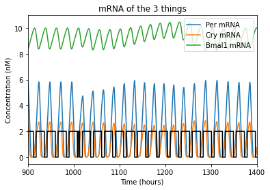

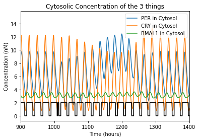

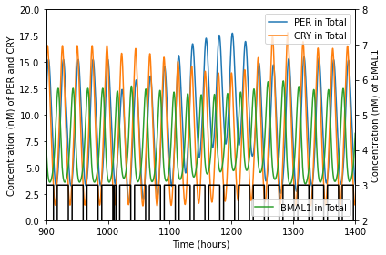

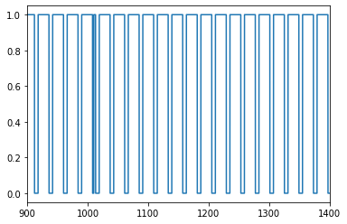

Atypical Circadian Rhythms
--------------------------

So far, this model has dealt with a “normal” 24-hour circadian rhythm. However, many people do not have perfect 24-hour circadian rhythms. The nature of the differential equations makes this a particular challenge to incorporate into the code; this phenomenon is more easily simulated by adjusting the length of the day in the code (e.g. setting the day to 25 or 23 hours in length). This will come with the additional challenge of tracking the actual 24-hour day *in addition to* the day with modified duration.

Use the space below to modify your code to accomplish this, then answer the following questions.

**[DEVNOTE: INSERT JUPYTERLITE SPACE HERE]**

.. code:: 

    ################################################################################
    # Project Title: Circadian Rhythm Model - Atypical Circadian Rhythms
    # Author: Ethan Biggs
    # Description: This code uses the initial conditions, kinetic rates, and the
    # ODEs described by LeLoup and Goldbeter to model the cyclic changes in
    # protein expression that characterize the circadian rhythm.
    ################################################################################
    import numpy as np                  # import data structuring
    from scipy.integrate import odeint  # import ODE integrating function
    import matplotlib.pyplot as plt     # import plotting libraries
    import math as m                    # import math operations
    
    #### Constants ####
    
    ## mRNA maximum accumulation rate constants (s=synthesis)
    vsp = 1.500 # max accumulation rate for Per mRNA in the cytosol
    vsc = 1.100 # max accumulation rate for Cry mRNA in the cytosol
    vsb = 1.000 # max accumulation rate for Bmal1 mRNA in the cytosol
    
    ## mRNA degradation rate constants
    vmp = 1.100 # max degradation rate for Per mRNA in the cytosol
    K_mp = 0.3100 # Michaelis constant of Per mRNA degradation
    vmc = 1.000 # max degradation rate for Cry mRNA in the cytosol
    K_mc = 0.400 # Michaelis constant of Cry mRNA degradation
    vmb = 0.800 # max degradation rate for Bmal1 mRNA in the cytosol
    K_mb = 0.400 # Michaelis constant of BMal1 mRNA degradation
    
    ## Non-specific mRNA degradation (1st order) rate constants
    k_dmp = 0.0100 # nonspecific degradation of Per mRNA
    k_dmc = 0.0100 # nonspecific degradation of Cry mRNA
    k_dmb = 0.0100 # nonspecific degradation of Bmal1 mRNA
    
    ## 1st order rate constants for translation of mRNA to respective proteins
    k_sP = 0.6000 # translation of Per mRNA to PER protein
    k_sC = 1.6000 # translation of Cry mRNA to CRY protein
    k_sB = 0.1200 # translation of Bmal1 mRNA to BMAL1 protein
    
    ## Phosphorylation rate constants
    V_per = 1.000 # max rate of phosphorylation of PER; "v1p" originally
    V_cry = 0.600 # max rate of phosphorylation of CRY; "v1c" originally
    V_bmal_cyto = 0.500 # max rate of phosphorylation of BMAL1 in cytosol; "v1b" originally
    V_pc_cyto = 1.000 # max rate of phosphorylation of PER-CRY complex in cytosol; "v1pc"
    V_bmal_nuc = 0.500 # max rate of phosphorylation of BMAL1 in nucleus; "v3b"
    V_pc_nuc = 1.000 # max rate of phosphorylation of PER-CRY complex in nucleus; "v3pc"
    K_p = 0.100 # Michaelis constant of phosphorylation
    
    ## Thresholds for activation
    K_AP = 0.700 # activation threshold for positive regulation of BMAL1 on Per transcription
    K_AC = 0.600 # activation threshold for positive regulation of BMAL1 on Cry transcription
    K_IB = 2.200 # activation threshold for negative regulation of CLOCK-BMAL1 on Bmal1 transcription
    vphos = 0.400 # effect of phosphorylation
    
    ## Dephosphorylation rate constants
    R_per = 0.300 # max rate of dephosphorylation of PER; "v2p"
    R_cry = 0.100 # max rate of dephosphorylation of CRY; "v2c"
    R_bmal_cyto = 0.100 # max rate of dephosphorylation of BMAL1 in cytosol; "v2b"
    R_pc_cyto = 0.100 # max rate of dephosphorylation of PER-CRY complex in cytosol; "v2pc"
    R_bmal_nuc = 0.200 # max rate of dephosphorylation of BMAL1 in nucleus; "v4b"
    R_pc_nuc = 0.100 # max rate of dephosphorylation of PER-CRY complex in nucleus; "v4pc"
    K_dp = 0.100 # Michaelis constant of phosphorylation
    
    ## Degradation of phosphorylated proteins
    v_dPc = 0.700 # max degradation rate for cytosolic PER
    v_dCc = 0.700 # max degradation rate for cytosolic CRY
    v_dBc = 0.500 # max degradation rate for cytosolic BMAL1
    v_dBn = 0.600 # max degradation rate for nuclear BMAL1
    v_dPCc = 0.700 # max degradation rate for cytosolic PER-CRY complex
    v_dPCn = 0.700 # max degradation rate for nuclear PER-CRY complex
    v_dBCi = 0.800 # max degradation rate for nuclear complex between PER-CRY and CLOCK-BMAL1
    K_d = 0.300 # Michaelis constant of degradation of phosphorylated proteins
    
    ## Non-specific protein degradation
    k_dn = 0.0100 # 1st order rate constant for degradation of all proteins unless otherwise noted
    k_dnC = 0.1200 # 1st order rate constant for general degradation of cytosolic CRY
    
    ## PER-CRY complex formation and dissociation
    k3 = 0.4000 # association rate constant for PER-CRY complex
    k4 = 0.2000 # dissociation rate constant for PER-CRY complex
    
    ## Transport rate constants
    k1 = 0.4000 # transport of PER-CRY complex into the nucleus
    k2 = 0.2000 # transport of PER-CRY complex into the cytosol
    k5 = 0.4000 # transport of BMAL1 into the nucleus
    k6 = 0.2000 # transport of BMAL1 into the cytosol
    
    ## Formation of an inactive complex in the nucleus by PER-CRY and CLOCK-BMAL1
    k7 = 0.5000 # association rate constant for the inactive complex
    k8 = 0.1000 # dissociation rate constant for the inactive complex
    
    ### Light Parameters ###############################################
    
    ## Set intensity = 0 to remove light from the model
    intensity = 0.300 # intensity of the effect light has on the circadian rhythm
    tau = 23 # 24 hours in a day
    t_on = 12.5 # 12 h : 12 h light/dark cycle
    t_off = tau - t_on
    settling_time = 1010 # time (hours) to wait before implementing the jetlag 
    jetlag_offset = 0 # hours to rush the next light cycle (negative postpones it)
    
    #### Initial Conditions ####
    m = 2.00 # Cooperativity
    n = 4.00 # Cooperativity
    
    xhigh = 2000
    t = np.linspace(0,xhigh,xhigh*100)
    
    # Estimated from visual analysis of the figures in the paper
    per_mrna0 = 1.5
    cry_mrna0 = 1.25
    bmal_mrna0 = 9.25
    per_cyto0 = 1
    cry_cyto0 = 4
    per_cyto_phos0 = 0
    cry_cyto_phos0 = 0
    pc_cyto0 = 0
    pc_nuc0 = 0
    pc_cyto_phos0 = 0
    pc_nuc_phos0 = 0
    bmal_cyto0 = 4
    bmal_cyto_phos0 = 0
    bmal_nuc0 = 0
    bmal_nuc_phos0 = 0
    inactive_nuc0 = 0
    
    # Make one giant list of the initial conditions
    initial_stuff = [per_mrna0,cry_mrna0,bmal_mrna0,per_cyto0,cry_cyto0,per_cyto_phos0,cry_cyto_phos0,
    	pc_cyto0,pc_nuc0,pc_cyto_phos0,pc_nuc_phos0,bmal_cyto0,bmal_cyto_phos0,bmal_nuc0,bmal_nuc_phos0,inactive_nuc0]
    
    #### Differential Equations ####
    
    def calculate_stuff(y,t):
    
    	## labeling so in the model output y, I can track each thing
    	mP = y[0]  # cytosolic Per mRNA
    	mC = y[1]  # cytosolic Cry mRNA
    	mB = y[2]  # cytosolic BMAL1 mRNA
    	Pc = y[3]  # cytosolic unphosphorylated PER
    	Cc = y[4]  # cytosolic unphosphorylated CRY
    	Pcp = y[5] # cytosolic phosphorylated PER
    	Ccp = y[6] # cytosolic phosphorylated CRY
    	PCc = y[7] # cytosolic unphosphorylated PER-CRY complex
    	PCn = y[8] # nuclear unphosphorylated PER-CRY complex
    	PCcp = y[9] # cytosolic phosphorylated PER-CRY complex
    	PCnp = y[10] # nuclear phosphorylated PER-CRY complex
    	Bc = y[11]  # cytosolic unphosphorylated BMAL1
    	Bcp = y[12] # cytosolic phosphorylated BMAL1
    	Bn = y[13]  # nuclear unphosphorylated BMAL1
    	Bnp = y[14] # nuclear phosphorylated BMAL1
    	BCi = y[15] # nuclear inactive PER-CRY and CLOCK-BMAL1 complex
    
    	## Determine if light is on or off 
    	if t < settling_time: t_m = t % tau
    	else: t_m = (t+jetlag_offset) % tau
    	if t_m >= t_off: tpulse = 1
    	else: tpulse = 0
    	light = tpulse * intensity
    
    	## mRNA concentrations 
    
    	# Change in Per mRNA in the cytosol over time [1]
    	dmP = (vsp+light)*(Bn**n / (Bn**n + K_AP**n)) - vmp * (mP / (K_mp+mP)) - k_dmp*mP
    
    	# Change in Cry mRNA in the cytosol over time [2]
    	dmC = vsc*(Bn**n / (Bn**n + K_AC**n)) - vmc * (mC / (K_mc+mC)) - k_dmc*mC
    
    	# Change in Bmal1 mRNA in the cytosol over time [3]
    	dmB = vsb*(K_IB**m / (Bn**m + K_IB**m)) - vmb * (mB / (K_mb+mB)) - k_dmb*mB
    
    	## Cytosolic PER and CRY concentrations
    
    	# Change in unphosphorylated PER over time [4]
    	dPc = k_sP*mP - (V_per*vphos*(Pc / (K_p+Pc))) + R_per*(Pcp / (K_dp+Pcp)) + k4*PCc - k3*Pc*Cc - k_dn*Pc
    
    	# Change in unphosphorylated CRY over time [5]
    	dCc = k_sC*mC - (V_cry*(Cc / (K_p+Cc))) + R_cry*(Ccp / (K_dp+Ccp)) + k4*PCc - k3*Pc*Cc - k_dnC*Cc
    
    	# Change in phosphorylated PER over time [6]
    	dPcp = V_per*vphos*(Pc / (K_p + Pc)) - (R_per*(Pcp / (K_dp + Pcp))) - v_dPc*(Pcp / (K_d + Pcp)) - k_dn*Pcp
    
    	# Change in phosphorylated CRY over time [7]
    	dCcp = V_cry*(Cc / (K_p + Cc)) - (R_cry*(Ccp / (K_dp + Ccp))) - v_dCc*(Ccp / (K_d + Ccp)) - k_dn*Ccp
    
    	## Cytosolic and nuclear PER-CRY complex concentrations
    
    	# Change in unphosphorylated cytosolic PER-CRY over time [8]
    	dPCc = -(V_pc_cyto*vphos*(PCc / (K_p + PCc))) + R_pc_cyto*(PCcp / (K_dp + PCcp)) - k4*PCc + k3*Pc*Cc + k2*PCn - k1*PCc - k_dn*PCc
    
    	# Change in unphosphorylated nuclear PER-CRY over time [9]
    	dPCn = -(V_pc_nuc*vphos*(PCn / (K_p + PCn))) + R_pc_nuc*(PCnp / (K_dp + PCnp)) - k2*PCn + k1*PCc - k7*Bn*PCn + k8*BCi - k_dn*PCn
    
    	# Change in phosphorylated cytosolic PER-CRY over time [10]
    	dPCcp = V_pc_cyto*vphos*(PCc / (K_p + PCc)) - (R_pc_cyto*(PCcp / (K_dp + PCcp))) - (v_dPCc*(PCcp / (K_d + PCcp))) - k_dn*PCcp
    
    	# Change in phosphorylated nuclear PER-CRY over time [11]
    	dPCnp = V_pc_nuc*vphos*(PCn / (K_p + PCn)) - (R_pc_nuc*(PCnp / (K_dp + PCnp))) - (v_dPCn*(PCnp / (K_d + PCnp))) - k_dn*PCnp
    
    	## Cytosolic and nuclear BMAL1 concentrations
    
    	# Change in unphosphorylated cytosolic BMAL1 over time [12]
    	dBc = k_sB*mB - (V_bmal_cyto*(Bc / (K_p + Bc))) + R_bmal_cyto*(Bcp / (K_dp + Bcp)) - k5*Bc + k6*Bn - k_dn*Bc
    
    	# Change in phosphorylated cytosolic BMAL1 over time [13]
    	dBcp = V_bmal_cyto*(Bc / (K_p + Bc)) - (R_bmal_cyto*(Bcp / (K_dp + Bcp))) - (v_dBc*(Bcp / (K_d + Bcp))) - k_dn*Bcp
    
    	# Change in unphosphorylated nuclear BMAL1 over time [14]
    	dBn = -(V_bmal_nuc*(Bn / (K_p + Bn))) + R_bmal_nuc*(Bnp / (K_dp + Bnp)) + k5*Bc - k6*Bn - k7*Bn*PCn + k8*BCi - k_dn*Bn
    
    	# Change in phosphorylated nuclear BMAL1 over time [15]
    	dBnp = V_bmal_nuc*(Bn / (K_p + Bn)) - (R_bmal_nuc*(Bnp / (K_dp + Bnp))) - (v_dBn*(Bnp / (K_d + Bnp))) - k_dn*Bnp
    
    	### Inactive complex formation 
    
    	# Change in nuclear concentration of complex between PER-CRY and CLOCK-BMAL1 [16]
    	dBCi = -k8*BCi + k7*Bn*PCn - (v_dBCi*(BCi / (K_d + BCi))) - k_dn*BCi
    
    	### Return a list of increment values
    	return [dmP,dmC,dmB,dPc,dCc,dPcp,dCcp,dPCc,dPCn,dPCcp,dPCnp,dBc,dBcp,dBn,dBnp,dBCi]
    
    #### ODE Solution Script using odeint()
    soln = odeint(calculate_stuff,initial_stuff,t)
    
    # Assigns useful names to the output
    per_mrna =       soln[:, 0]
    cry_mrna =       soln[:, 1]
    bmal_mrna =      soln[:, 2]
    per_cyto =       soln[:, 3]
    cry_cyto =       soln[:, 4]
    per_cyto_phos =  soln[:, 5]
    cry_cyto_phos =  soln[:, 6]
    pc_cyto =        soln[:, 7]
    pc_nuc =         soln[:, 8]
    pc_cyto_phos =   soln[:, 9]
    pc_nuc_phos =    soln[:,10]
    bmal_cyto =      soln[:,11]
    bmal_cyto_phos = soln[:,12]
    bmal_nuc =       soln[:,13]
    bmal_nuc_phos =  soln[:,14]
    inactive_nuc =   soln[:,15]
    
    
    ## Determine when the light was on or off
    lighttime = np.empty_like(t)
    for ind,ii in enumerate(t):
        if ii < settling_time: t_m = ii % tau
        else: t_m = (ii + jetlag_offset) % tau
        if t_m >= t_off: lighttime[ind] = 1
        else: lighttime[ind] = 0
    
    
    #### Figures ####
    pretime = 100
    posttime = 200
    
    plt.figure(num=1)
    plt.plot(t,per_mrna, label='Per mRNA')
    plt.plot(t,cry_mrna, label='Cry mRNA')
    plt.plot(t,bmal_mrna, label='Bmal1 mRNA')
    plt.plot(t,2*lighttime,color='black')
    
    plt.xlabel('Time (hours)')
    plt.ylabel('Concentration (nM)')
    plt.title('mRNA of the 3 things')
    plt.legend(loc=1)#,bbox_to_anchor=(1.2,1))
    plt.xlim(settling_time-pretime-10,settling_time+posttime-10)
    plt.show()
    
    plt.figure(num=2)
    plt.plot(t,per_cyto + per_cyto_phos + pc_cyto + pc_cyto_phos, label='PER in Cytosol')
    plt.plot(t,cry_cyto + cry_cyto_phos + pc_cyto + pc_cyto_phos, label='CRY in Cytosol')
    plt.plot(t,bmal_cyto + bmal_cyto_phos, label='BMAL1 in Cytosol')
    plt.plot(t,2*lighttime,color='black')
    
    plt.xlabel('Time (hours)')
    plt.ylabel('Concentration (nM)')
    plt.title('Cytosolic Concentration of the 3 things')
    plt.legend(loc=1)
    plt.xlim(settling_time-pretime-10,settling_time+posttime-10)
    plt.show()
    
    fig, ax1 = plt.subplots()
    ax1.plot(t,per_cyto + per_cyto_phos + pc_cyto + pc_cyto_phos + pc_nuc + pc_nuc_phos, label='PER in Total')
    ax1.plot(t,cry_cyto + cry_cyto_phos + pc_cyto + pc_cyto_phos + pc_nuc + pc_nuc_phos, label='CRY in Total')
    ax1.set_xlabel('Time (hours)')
    ax1.set_ylabel('Concentration (nM) of PER and CRY')
    ax1.set_ylim(0,20)
    ax1.legend(loc=1)
    
    ax2 = ax1.twinx() # instantiate a second axes that shares the x axis
    
    ax2.plot(t,bmal_cyto + bmal_cyto_phos + bmal_nuc + bmal_nuc_phos, label='BMAL1 in Total',color='tab:green')
    ax2.plot(t,3*lighttime,color='black')
    ax2.set_ylabel('Concentration (nM) of BMAL1')
    ax2.set_ylim(2,8)
    
    # plt.xlabel('Time (hours)')
    # plt.ylabel('Concentration (nM)')
    # plt.title('Total Concentration of the 3 things')
    plt.legend(loc=4)
    fig.tight_layout()
    plt.xlim(settling_time-pretime-10,settling_time+posttime-10)
    plt.show()
    
    plt.figure(4)
    plt.plot(t,lighttime)
    plt.xlim(settling_time-pretime-10,settling_time+posttime-10)

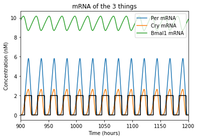

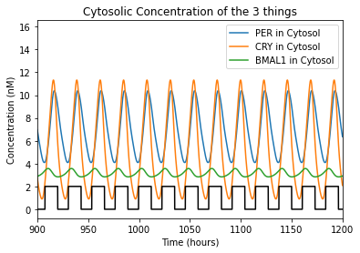

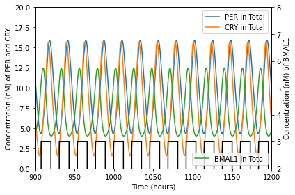

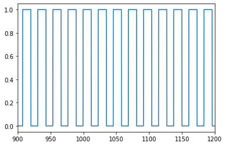

Which hypothetical person would more easily tolerate their imprecise circadian rhythm? Why?

*Answer: The person with the slightly fast circadian rhythm. Their PER and CRY reach higher peaks during the day, and their BMAL1 is lower over the course of the “light” part of the day than the person whose rhythm is slower.*

Is there a way that these hypothetical people could “reset” their circadian rhythm, perhaps through light therapy (exposure to bright light for ~15 minutes at a given time, usually in the morning)? Which would be likely to see more benefit from this treatment?

*Answer: Adjusting the light exposure by any reasonable amount of time (< 30 minutes) has little observable effect on either of the people.*

**References**

#. J.-C. Leloup and A. Goldbeter, “Toward a detailed computational model for the mammalian circadian clock,” PNAS, vol. 100, no. 12, pp. 7051–7056, Jun. 2003, doi: 10.1073/pnas.1132112100. 
#. N. Zisapel, “New perspectives on the role of melatonin in human sleep, circadian rhythms and their regulation,” Br J Pharmacol, vol. 175, no. 16, pp. 3190–3199, Aug. 2018, doi: 10.1111/bph.14116. 
#. N. G. Harpsøe, L. P. H. Andersen, I. Gögenur, and J. Rosenberg, “Clinical pharmacokinetics of melatonin: a systematic review,” Eur J Clin Pharmacol, vol. 71, no. 8, pp. 901–909, Aug. 2015, doi: 10.1007/s00228-015-1873-4. 
#. E. R. Breslow, A. J. K. Phillips, J. M. Huang, M. A. St. Hilaire, and E. B. Klerman, “A Mathematical Model of the Circadian Phase-Shifting Effects of Exogenous Melatonin,” J Biol Rhythms, vol. 28, no. 1, pp. 79–89, Feb. 2013, doi: 10.1177/0748730412468081.
