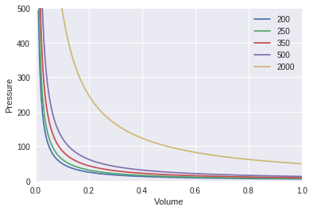
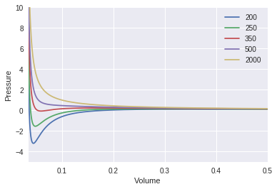

Equations of State
==================

* View this page as a fully interactive Jupyter Notebook: `<https://goo.gl/ZVGVqt)>`_

This lecture will cover:

1. The Fundamentals of Fugacity
2. Gibbs Free Energy and Ideal Gas Law
3. Van Der Waals Equation of State
4. Peng-Robinson Equation of State

What is fugacity?
-----------------

Fugacity is a measure of chemical potential in the form of ‘adjusted
pressure.’ It directly relates to the tendency of a substance to prefer
one phase (liquid, solid, gas) over another. Below is a short
introduction into fugacity.

.. raw:: html

    <iframe width="560" height="315" src="https://www.youtube.com/embed/nQncSHGAdBA?rel=0&amp;controls=0&amp;showinfo=0" frameborder="0" allowfullscreen></iframe>

Gibbs Free Energy and Ideal Gas Law
-----------------------------------

For phases we have one tool for the primary equation of state. In the
beginning of chapter 6 we saw:

:math:`ds` -> T, V, P

:math:`du` -> T, V, P

:math:`dh` -> T, V, P

:math:`dg` -> T, V, P

So therefore we have

:math:`PV = RT`

However, the ideal gas law is not a perfectly accurate representation of
physical reality. Let’s explore where it falls short.

We begin by graphing what are known as isotherms using the Ideal Gas
Law. Note we are not using Euler Method for this.

.. code:: 

    %matplotlib inline 
    import numpy as np
    import matplotlib.pyplot as plt
    V = np.linspace(.01, 1, 200)
    R = 0.08206
    n = 0.3
    
    
    
    for T in [200, 250, 350, 500, 2000]:
      plt.plot(V, n*R*T/V, label = str(T))#plotting the line 
      plt.xlabel('Volume')
      plt.ylabel('Pressure')
      #plt.plot((R*T/V), marker='.', linestyle='-', label=str(T))
    plt.legend(loc='upper right')
    plt.axis([0,1, 0, 500])
    plt.show() #show the graph 

Notice that each color represents a different temperature. These lines
are called isotherms. Under the ideal gas law all gases are supposed to
act the same way at any given temperature.

Now lets look at a real non-ideal gas: $ CO_2$

.. code:: 

    %matplotlib inline 
    import numpy as np
    import matplotlib.pyplot as plt
    V = np.linspace(.01, 1, 2000)
    R = .0821 # this is the constant for ((L*atm / (K*mol))
    n = 1
    
    a = 3.59
    b = 0.0305
    
    
    
    for T in [200, 250, 350, 500, 2000]:
      plt.plot(V, (((n*R)/(V-n*b)) -((1/T)*((a*n*n)/(V*V)))), label = str(T))#plotting the line 
      plt.xlabel('Volume')
      plt.ylabel('Pressure')
      #plt.plot((R*T/V), marker='.', linestyle='-', label=str(T))
    plt.legend(loc='upper right')
    plt.axis([0.035,.5, -5, 10])
    plt.show() #show the graph

**Reflection Questions:**

Notice that these two graphs have very different shapes. What do you
observe about how the Van Der Waal’s graph and the Ideal Gas Graph
change as temperature chagnes.

Try the following constants in the Van Der Waal’s code.

+-----------------------+-----------------------+-----------------------+
| Gas                   | a (:math:`L^2`        | b (L/mol)             |
|                       | atm/:math:`mol^2`)    |                       |
+=======================+=======================+=======================+
| :math:`N_2`           | 1.39                  | 0.0391                |
+-----------------------+-----------------------+-----------------------+
| :math:`O_2`           | 1.36                  | 0.0318                |
+-----------------------+-----------------------+-----------------------+
| :math:`CO_2`          | 3.59                  | 0.0427                |
+-----------------------+-----------------------+-----------------------+
| :math:`H_2O`          | 5.46                  | 0.0305                |
+-----------------------+-----------------------+-----------------------+
| :math:`He`            | 0.0342                | 0.0237                |
+-----------------------+-----------------------+-----------------------+
| :math:`CCl_4`         | 20.4                  | 0.1383                |
+-----------------------+-----------------------+-----------------------+

Based on what you know about the properties of those gasses can you guess
what role :math:`a` and :math:`b` play in the Van Der Waals Equation of
State?

Van Der Waals Equation of State
-------------------------------

The simplest and most important way we model the curves is by utilizing
Van Der Waals’ Equation of State. Van Der Waals developed this equation
of state in 1873 and it won the Nobel Prize in 1910. The equation can be
modeled as such:

:math:`P = \frac{RT}{V-b} - \frac{a}{V^{2}}`, where

:math:`a = \frac{27R^2T_c^2}{64P_c}`, and

:math:`b = \frac{RT_c}{8P_c}`

From this equation we can model the curve shown in the graph below:

.. image:: images/equationsOfStateFiles/PVgraph1.png
   :width: 500
   :align: center

As you can see the graph is much more in depth than the ideal gas law. You can see the different inflections and crtical points and how the graphs curves change as it becomes more ideal and less ideal. :math:`T_c` is the critical temperature isotherm (isotherms are a line on a map connecting points having the same temperature at a given time or on average over a given period.) which is the particular curve generated by the Van Der Waals equation of state. As the isotherms move from blue to red, the model becomes more “ideal”. As you can see from the resemblence to the first graph in the code.

.. image:: images/equationsOfStateFiles/PVgraph2.png
   :width: 500
   :align: center
   
As explained before, this graph shows the different isotherms for the Van Der Waals equation of state. The red isotherm or the one furthest to the right represents the vapor state. The purple isotherm or the critical temperature isotherm shows the critical point. The blue isotherm or the one furthest left represents the liquid-vapor state. Now looking at the graph see the points C, E, I, F, and G that are connected by a curve. This area within the curve represents the unstable region. These points are determined by the critical point I, and the inflection points on the other curves. Within this region the fluid becomes unstable. So the fluid can not stay within the unstable region. Next, take note of the points A, D, I, H, and B which are connected by another curve. The area within this curve but not within the unstable region is the metastable region. Unlike the unstable region, fluids can enter metastable region, but they still do not tend to stay in the metastable region as it requires energy to move either to a liquid state or a vapor state. Next there are two isobars drawn on the graph, one connecting from point D to point H, and one from point A to point B. For each isobar the shaded areas in gray are equal to each other. This represents the idea that:

:math:`f^I(T,P) = f^{II}(T,P)`, 

and

:math:`\phi^I = \phi^{II}`

The first points D and A represent the liquid state and the second points B and H represent the vapor state. So this means that the vapor fugacity is equal to the liquid fugacity. These equations above will be explained further in the videos below.

Peng-Robinson Equation of State
-------------------------------

Around 100 years later, another equation of state became prevalent. This one is more accurate and is known as the Peng-Robinson equation of state. The Peng-Robinson equation of state was used to calculate the volume of 100% methane gas as a function of pressure and temperature. This equation expresses fluid properties in terms of the critical properties and acentric factor of each species involved. Although methane was the only gas used in the report, this equation can apply to many different gases. The equation is shown as the following:

:math:`P = \frac{RT}{V-b} - \frac{a(T)}{V(V+b)+b(V-b)}`

Here :math:`b` is a series-specific parameter representing :math:`\textbf{volume-per-molecule}` and :math:`a(T)` is a series specific function of temperature representing :math:`\textbf{intermolecular interactions}`. For most useful engineering calculations the :math:`PR` equation is cast in the form of a cubic equation in the :math:`\textbf{compressibility factor Z}`:

.. math:: f(z) = Z^3 + \alpha Z^2 + \beta Z + \gamma = 0 

where:

.. mathLL
	
	Z = \frac{PV}{RT},
	
	\alpha = -1 + B,

	\beta = A - 3B^2 -2b,

	\gamma = -AB + B^2 +B^3,

	k = 0.37464 + 1.5422 \omega - 0.26992 \omega ^2,

	A = 0.45724 \frac{P}{P_c} (\frac{T_c}{T})^2(1 + k(1-\sqrt{\frac{T}{T_c}}))^2`,

	and

	B = 0.07780 \frac{T_c}{T} \frac{P}{P_c}

This may look complicated but it only has four parameters: :math:`T_c` the critical temperature, :math:`P_c` the critical pressure, the acentricity factor :math:`\omega`, and the gas constant :math:`R`. The temperature and pressure are considered variables, not parameters. In the cubic form it becomes clear that the :math:`P`-:math:`R` equation can have three roots. For the certain values of the coefficients, :math:`\alpha`, :math:`\beta`, :math:`\gamma` there might exist :math:`\textbf{three real roots}`, while for the other values, there might exist only one real root. In the case that only one real root is found, there is only one phase (either liquid or vapor) at the specified :math:`T` and :math:`P`. However, in the case that :math:`\textbf{three}` real roots are found, then the :math:`\textbf{lowest}` one is associated with a :math:`\textbf{liquid}` and the :math:`\textbf{highest}` one is associated with :math:`\textbf{vapor}`.

So it is understood that the Peng-Robinson equation and the Van Der
Waals equation are both special cases of the equation:

:math:`P = \frac{RT}{V - b} - \frac{(V - \xi)\theta }{(V-b)(V^2+\delta V+\varepsilon )}`

and in this equation :math:`b`, :math:`\theta`, :math:`\delta`,
:math:`\varepsilon`, :math:`\xi` are all dependent on :math:`T`

The existence of both a liquit root and a vapor root implies liquid vapor coexistence, but it does not gaurantee that :math:`P` is the vapor pressure at :math:`T`. To descide whether the liquid and vapor phases signified by the two roots of :math:`P`-:math:`R` are in fact in equillibrium with each other, one has to confirm that their fugacities are equal. For substances obeying the :math:`P`-:math:`R` equation of state, one can compute the fugacity :math:`f` at a specific :math:`Z` using the equation below:

:math:`f(T,P) = Pexp(Z-1-ln(Z-B)-\frac{A}{2\sqrt{2}B}ln(\frac{Z+(1+\sqrt{2})B}{Z+(1-\sqrt{2})B}))`

Below is a more in depth introduction to fugacity and the equations that
relate to fugacity.

.. raw:: html

    <iframe width="560" height="315" src="https://www.youtube.com/embed/aU1sjlhzazE?rel=0&amp;controls=0&amp;showinfo=0" frameborder="0" allowfullscreen></iframe>

In order to model the Peng-Robingson equation of state we will be writing a python code. In the end we will be graphing the Peng-Robinson equation to see the difference between this model, the Ideal Gas Law, and the Van Der Waals equation. Use the pseudocode provided in the flow chart below and the information from the youtube video to solve the relationship between vapor pressure and temperature for methane. 

.. image:: images/equationsOfStateFiles/flowchart.png
   :width: 500
   :align: center

Example 1
---------

Consider a solution of two species :math:`S1/S2` at 25 degrees celsius such that :math:`x_1 = 0.4`. If :math:`\bar{V_1} = 40` x :math:`10^{-6} m^3/mol`, find :math:`\bar{V_2}`. The solution specific gravity is :math:`= 0.90` and the molecular weights of the species are 32 and 18 respectively.

Since the molar mass of a solution is equal to :math:`x_1M_1 + x_2M_2`
for :math:`(M=MW)`, then

:math:`= 0.4 * 32 + 0.6 * 18`

:math:`= 23.6 * 10^{-3} kg/mol`, and

:math:`Solution` :math:`Molar`
:math:`Volume = \frac{Molar Mass}{Density}`

:math:`= \frac{23.6 * 10^{-3} kg/mol}{900 kg/m^3} = 26.2 * 10^{-6} m^3/mol`

Now, since :math:`V = x_1\bar{V_1} + x_2\bar{V_2}`

:math:`\bar{V_2} = \frac{(26.2 - 0.4 * 40) * 10^{-6}}{0.6} = 17 * 10^{-6} m^3/mol`

Example 2
---------

Using Van Der Waals EOS estimate the fugacity of propane for each of the following conditions where propanes values are :math:`T_c (K) = 369.83`, :math:`P_c (Bar) = 42.48`, :math:`\omega = 0.152`:

A. T = 200 K, P = 0.5 bar (vapor)

B. T = 400 K, P = 5 bar (gas)

A. First calculate the Van Der Waals parameter a using

:math:`a = \frac{27R^2T_c^2}{64P_c}`, using
:math:`R = 8.314 * 10^{-5}m^3bar/Kmol`

Using the parameters given in the question and the equation above we
find

:math:`a = 9.38 * 10^{-6}m^6bar/Kmol^2`

Find the molar volume (:math:`\bar{V}`) from the equation of state,

:math:`\bar{V} = \frac{RT}{P} + aTP^2`

:math:`\frac{\bar{V}P}{RT} = 1 + \frac{aP^3}{R}`

:math:`\frac{Z-1}{P} = \frac{aP^2}{R}`

Now, using the expression for fugacity:

:math:`ln\frac{f}{P}=\int_{P=0}^{P=P}\frac{Z-1}{P}dP` so,

:math:`ln\frac{f}{P}=\int_{P=0}^{P=P}\frac{aP^2}{R}dP`, therefore

:math:`f = Pexp(\frac{aP^3}{3R})`

Then subsituting in for the known vairable we get:

:math:`f^V = (0.5bar)(exp(\frac{9.38 * 10^{-6}m^6bar/Kmol^2 * (0.5bar)^3}{3( 8.314 * 10^{-5}m^3bar/Kmol)})) = (0.5bar)(1.004)`

:math:`= 0.502bar`

So the fugacity in the vapor phase is 0.502 bar.

B. Since this takes place in the gas state we have to derive the formula
again. Lets take,

:math:`ln\frac{f}{P}=\int_{T=T,P=0}^{T=T,P=P}\frac{Z-1}{P}dP`

Express the equation of state in terms of the compressability factor (Z)
again,

:math:`\bar{V} = \frac{RT}{P} + aTP^2`

:math:`\frac{P\bar{V}}{RT} = \frac{R}{RT}\frac{RT}{P} + aP^2`

:math:`Z= 1+\frac{aP^3}{RT}`

Substitute Z into the previous formula:

:math:`ln\frac{f}{P}=\int_{T=T,P=0}^{T=T,P=P}\frac{1+\frac{aP^3}{RT}-1}{P}dP`

:math:`=\int_{T=T,P=0}^{T=T,P=P}\frac{aP^2}{RT}dP`

:math:`=\frac{aP^3}{3RT}`

Now substituting in values:

:math:`ln(\frac{f}{5bar})=\frac{(9.38 * 10^{-6}m^6bar/Kmol^2)(5bar)^3}{3(8.314 * 10^{-5}m^3bar/Kmol)(400K)} = 0.011`

:math:`\frac{f}{5bar} = exp(0.011)`

:math:`f = (5bar)(1.011) = 5.05 bar`

So the fugacity in the gas phase is 5.05 bar.

An extra introductory video on fugacity that some may find to be helpful
is also given below:

.. raw:: html

    <iframe width="560" height="315" src="https://www.youtube.com/embed/fkqmf_QR4Yg?rel=0&amp;controls=0&amp;showinfo=0" frameborder="0" allowfullscreen></iframe>

Citations
---------

* http://www.che.ncku.edu.tw/FacultyWeb/ChenBH/E340100%20Thermodynamics/Supplementary/Fugacity.pdf
* https://pubs.usgs.gov/of/2005/1451/equation.html
* https://en.wikipedia.org/wiki/Van_der_Waals_equation
* https://dasl.datadescription.com/datafile/boyle/
* https://python-forum.io/Thread-6-24-LAB-Vapor-Pressure-Calculation-using-the-Peng-Robinson-Equation-of-State
* https://nptel.ac.in/courses/103101004/downloads/example-ch-6.pdf
* https://www.et.byu.edu/~rowley/ChEn273/Topics/Mass_Balances/Single_Phase_Systems/Van_der_Waals_Equation_of_State.htm
