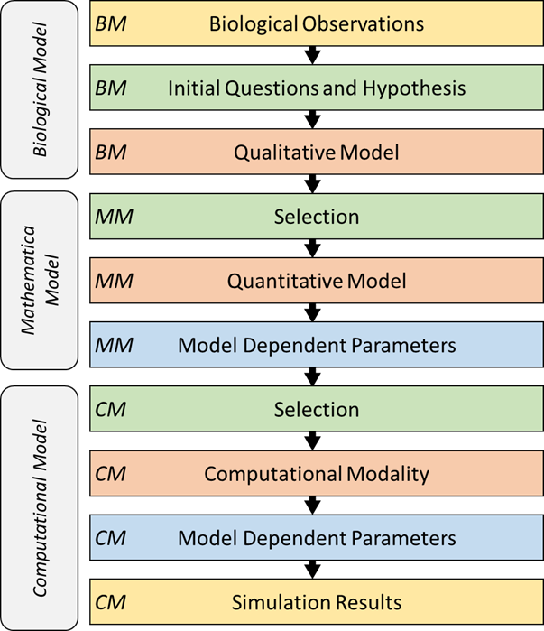
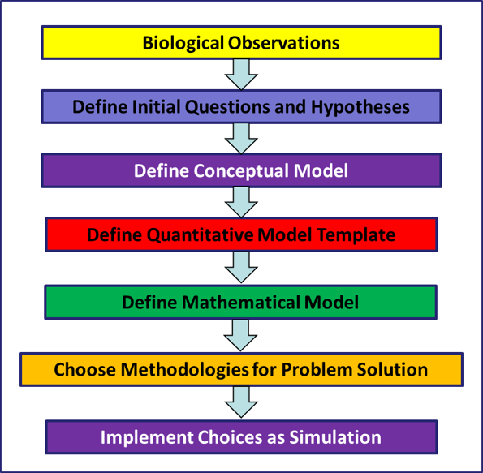

Introduction to Biological Modeling
===================================

This Module will provide an introduction to the process of biological modeling, from identifying a problem of study to creating a model of the system that can be simulated computationally.

The Biological Modeling Workflow
--------------------------------

Developing useful mechanism-based computational biology models requires discipline and progression through a series of logical steps. Typically, one starts from biological observations and gradually develop mechanism-based understanding that explain the biological system in a way that provides new insights in the normal and abnormal operation of the biological system. 

By necessity, computational biology models leave out a great deal of complexity and therefore represent simplifications of reality. However, if a model includes the key components of the biological system, it can be both predictive and useful. Furthermore, identifying the key elements that govern the system greatly simplifies the knowledge needed to construct a model and provides critical insight into the controlling mechanisms in a biological process.

A critical aspect of developing useful computational biology models is to use a well-defined process that progresses from biological observation and understanding, through the development of physical and mathematical definitions of the key components and processes in the system, leading finally to a computational instantiation of that conceptualization. Many of the problems encountered in developing useful computational biology models arise from trying to short circuit these steps. In addition, to apply a computational modeling in, for example, a clinical domain requires that the model is credible in terms of both the biology represented and the computational implementation. What is often overlooked (or undervalued) is the need to document the entire trajectory of the model development process.
 
People often devote a great deal of effort to building mathematical models and implementing them in computer code without spending enough effort in defining what biological concepts and processes those equations or code represent or what the end goal of the simulation is. It is critically important that sufficient time is spent in defining and understanding the biology and goals of the modeling project. Only after that understanding and scoping has been completed should the modeler move on writing computer code and running and analyzing the simulations. As a rough rule of thumb: 50% of your effort should be directed to understanding the biology and what you are trying to model and identifying the model elements, 15% to defining the quantitative relationships among the model elements, 10% to writing computer code and 25% to running the code, analyzing and interpreting results.

We will present this model development workflow as a linear process, but in practice modelers will iteratively refine their models, revisiting, revising and improving their descriptions at each level of abstraction as they proceed.

Our basic workflow is outlined in Figure 1, below. The workflow develops three levels of model; a biological model, a mathematical model and a computational model. Within each of these model levels there is a recommended set of steps for developing the model at that level. We start with a description of the three model levels.

   
   Figure 1: The modeling workflow for developing the biological, mathematical, and computational model of a given system.
   
Each of these steps requires significant consideration in the planning of a model. We will delve into each of these three categories of model development later in this module. As a brief overview, here are three quick descriptions of each model type:

* **The Biological Model:** This model, also known as a “conceptual model”, is often created with the help of a domain expert such as a biologist or a clinician. This model is an attempt to explain an observable reality. It should include the parts of the reality that we know about filtered by what we (and the domain expert) believe are relevant to a particular question. This description will include physical objects (cells, enzymes, tissues, …) and processes (cell proliferation, enzyme reaction, …). In addition, this description may include spatial and temporal information. Besides this list of objects and processes the biological model should also include a list of measurables and outcomes. For example, which of the physical objects are measurable in terms of count, or volume or concentration? Which of the processes are measurable such as in a time course? Finally, the biological model should identify outcomes of interest.
* **The Mathematical Model:** The mathematical model is a mathematical description of the biological model. Here we create mathematical definitions, based on physics, chemical, or other physical models, of the objects and processes. Often the creation of the mathematical model requires making significant assumptions about the underlying mechanisms of the biological system. For example, when modeling transfer of a small molecule into a cell is the process simple diffusion (that can be modelled as a reversible first order ordinary differential equation (ODE)) or is the process transporter mediated that may become saturated at high small molecule concentration? This process of converting a biological model into a computational model is the first point where the modeling process adds value to our understanding of the biological system. The mathematical model requires a level of understanding and specification that is rarely present in biological models. The modeler, often with the help of the domain expert, must coerce the available biological knowledge into a numeric framework and in that process decide how the available data can be used to select from a multitude of possible mathematical instantiations. At this stage it often becomes clear that certain aspects of the biological system that are measurable have indeed never been measured. Often, at this stage the modeler also encounters the problem that quantities required in the mathematical model are not directly measurable in the biological assays. This situation may require reformulating the mathematical model to avoid dependence on intrinsically unmeasurable quantities. On the other hand, at this point the mathematical model can also begin to offer new insights into the biological model. Quantities that are not directly measurable may instead by calculable by the model. This capability is one of the most attractive aspects of a mathematical model. A key aspect of the creation of the mathematical models is that it is the point where the model moves from a biological point of view to a chemical or physics-based description. This allows the modeler to use standard mathematical forms developed in those domains to define the model for the biological domain.
* **The Computational Model:** The computational model is an instantiation of the mathematical model in a computing system. In some cases, this instantiation can introduce implementation dependent parameters in a model. For example, if time or space is discretized in the computer simulation then that adds implementation-specific parameters that are not part of the biological system being modelled. At his point in the model development process the model, which has already moved from the biological to the mathematical/chemical/physics domains, moves again into the computational domain. Issues such as computability, simulation run time, memory and disk storage requirements become practical issues that must be considered.

For now, we can simplify the modeling process from Figure 1 down into a more simplified workflow of key steps for the overall modeling process. This will allow us to get some practice with the broader abstraction and implementation process first before focusing in on the details.

   
[More content coming soon]

Worked Example: Cell Sorting (?)
--------------------------------

[Coming soon]

Notes on Scoping a Modeling Project
-----------------------------------

[Coming soon]

Model Abstraction Exercises
---------------------------

[Coming soon]