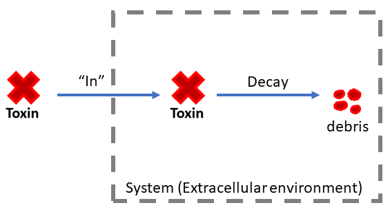
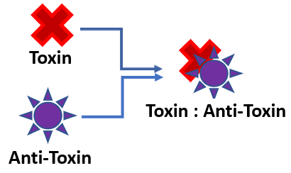
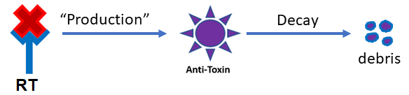

Project: MAXTox Manufacturing
=============================

* View this page as an interactive Jupyter Notebook: `Click here <https://tinyurl.com/r5t66do>`_

For this project, there are **FIVE** tasks that you need to complete. These tasks are integrated throughout this page. You can use the navigation bar on the right to navigate through each task. 

Introduction
------------

You are a member of a five person engineering startup that specializes in consulting other engineering firms on how to apply thermodynamics principles to improve their existing processes.

Your group has been approached by a synthetic biology company, *MAKTox*, that uses a cell-based manufacturing system. This company has found that a **toxin** is produced as a byproduct of their manufacturing process.

The company has attempted to solve this problem internally and have met a dead-end. They are hiring you and your team to develop a regulatory gene module that will efficiently clear both high and low levels of toxin.

They have provided you schematics and models of their previous attempts.

Manufacturing System Requirements:
~~~~~~~~~~~~~~~~~~~~~~~~~~~~~~~~~~

* The toxin levels must be suppressed to levels **below 1** for the manufacturing system to remain viable.
* The proposed solution should be able to suppress toxin with production rates **between 0 and 8**.

*See deliverables at the bottom of this page for a full hiring statement.*

MAKTox Solution Attempt: Antitoxin
----------------------------------

Their first solution uses a simple gene regulatory module which has **no feedback mechanisms**.

The gene regulatory module they constructed encodes an anti-toxin. When this anti-toxin is expressed it will bind the toxin, thereby neutralizing it. They designed the anti-toxin gene to be **activated** by the toxin-receptor complex. Therefore, when the toxin is present in their manufactoring system, it will bind its receptor, activating expression of the anti-toxin, which should then neutralize the toxin.

[NOTE: Missing image (https://drive.google.com/open?id=1gN_S8DC7MrMdm-Zdqs17p75Xz8SD27zr)]

Figure 1: A schematic of the regulatory mechanisms first employed by MAKTox to neutralize the toxic byproduct.

**NOTE:** \* “:math:`\leftrightarrow`” means reversible reaction \* arrows that join together refer to binding events \* endocytosis and recycling is both decay.

Task 1
~~~~~~

Derive a system of differential equations that describe the dynamics of the biological system shown in Figure 1.

To help you write these equations, images are provided below that break down the system in Figure 1 into smaller parts (reactions or interactions). These will help you derive the terms that will go into your differential equations.

**These are the differential equations you will need to derive:**

Toxin (T):

.. math:: \frac{dT}{dt} = ?

Receptor (R):

.. math:: \frac{dR}{dt} = ?

Anti-toxin (AT):

.. math:: \frac{dAT}{dt} = ?

Receptor-Toxin complex (RT):

.. math:: \frac{dRT}{dt} = ?

Toxin production and decay:

Irreversible Toxin - AntiToxin binding:

Reversible Toxin - Receptor binding, with receptor and toxin-receptor complex decay:

**[NOTE: Image broken; need new link]**

Antitoxin gene activation (by toxin-receptor complexes), with antitoxin decay:

Task 2
~~~~~~

Next, you need to numerically solve and plot solutions for your equations. This will help you understand why this approach failed when MAKTox tried it. The code cell below contains a starting point for this task.

Enter your equations in the appropriate place in the code cell below and plot your solutions.

Hint: carefully look through the existing code before you jump in. Try to match parameters and variables in the code to interactions and components that you see in the diagram in Figure 1.

.. code:: 

    ################################################################################
    # Project Title: Calculate System Toxicity
    # Author: MAKTox
    # Description: This code uses the initial conditions, kinetic rates, and
    #gene regulatory network description to calculate the toxin levels in the system
    ################################################################################
    
    import numpy as np                  # import data structuring
    from scipy.integrate import odeint  # import ODE integrating function
    import matplotlib.pyplot as plt     # import plotting libraries
    import math as m                    # import math operations
    
    # Kinetic Rates - declare parameter values
     
    Toxin_in          = 0.5       # Parameter for the input rate of toxin
    Toxin_decay       = 0.001     # Decay rate of toxin by itself is slow.
    Toxin_neutralize  = 1.0       # Rate at which toxin is neutralized.
     
    k_on  = 1.0   # toxin + receptor binding parameter
    k_off = 1.0   # toxin + receptor unbinding parameter
     
    kAT = 1.0   # decay rate of anti-toxin
    kE  = 1.0   # endocytosis (decay) rate of receptors and toxin/receptor complexes
    
    beta_R = 1.0    # constitutively active receptor production rate
    
    # Parameters influencing anti-toxin gene activation by RT complexes
    beta_1 = 12.0   # rate of antitoxin gene activation by RT
    K1 = 1.0    # concentration of RT where anti-toxin production is half-max 
    n1 = 10.0   # cooperativity parameter (hill function exponent) for antitoxin gene activation by RT
    
    # Iniital Conditions - declare initial concentrations
    Toxin0            = 1.0   # initial toxin level
    ReceptorToxin0    = 0.0   # initial toxin-bound receptor level
    Receptor0         = 4.0   # initial receptor level
    Antitoxin0        = 0.0   # initial antitoxin levels 
    
    # Create a list of all the initial conditions.
    y0  = [Toxin0, ReceptorToxin0, Receptor0, Antitoxin0]
    
    z   = 500                       # Declare the number of timesteps
    t   = np.linspace(0, 50.0, z)   # Create time array
    
    # Create function to solve a set of ODEs.
    def model(y, t):
      # labeling where in the model output y, you will track each species.
      T       = y[0]
      RT      = y[1]
      R       = y[2]
      AT      = y[3]
    
      # GENERAL MASS BALANCE EQUATION: 
      ## d_ProteinX / dt = [In] + [Generation] - [Consumption] - [Out]
      # Create the differential equations that relate these species
      dTdt  = Toxin_in - Toxin_decay*T - k_on*R*T + k_off*RT + kE*RT- Toxin_neutralize*AT*T
    
      dRTdt = -(beta_1*(RT**n1))/((RT**n1)+(K1**n1)) + (k_on*R*T) - (k_off*RT) - (kE*RT)
      
      dRdt  = (beta_R) - (kE*R) - (k_on*R*T) + (k_off*RT)
    
      dATdt = (beta_1*(RT**n1))/((RT**n1)+(K1**n1)) - (Toxin_neutralize*AT*T) - (kAT*AT) 
    
      # Return a list of the increment values
      return [dTdt, dRTdt, dRdt, dATdt]
    
    # ODE Solution Script using odeint()
    # This function does the Euler integration that you coded on your own in previous classes and returns a solution
    soln  = odeint(model, y0, t)
    
    # Assigns variable names to solution matrix
    Toxin             = soln[:, 0]
    ReceptorToxin     = soln[:, 1]
    Receptor          = soln[:, 2]
    Antitoxin         = soln[:, 3]
    
    # Create array to visualize toxicity limit
    MaxAllowableToxicity = [1]*z
    
    # Figure 1: Plot all species concentration timeseries
    plt.figure(num=1)
    plt.plot(t, Toxin,            label='Toxin')
    plt.plot(t, ReceptorToxin,    label='RT')
    plt.plot(t, Receptor,         label='Receptor')
    plt.plot(t, Antitoxin,        label='Antitoxin')
    plt.plot(t, MaxAllowableToxicity, label='MaxToxin')
    
    # Define plot attributes
    plt.xlabel('Time from Toxin Outbreak (s)')
    plt.ylabel('Species Concentration (nM)')
    plt.title('System Timeseries')
    plt.legend(loc=1, bbox_to_anchor=(1.2, 1))
    
    # Figure 2: Plot results
    plt.figure(num=2)
    plt.plot(ReceptorToxin, Toxin, 'bo')
    plt.xlabel('RT')
    plt.ylabel('Toxin')
    plt.title('System Timeseries')

.. parsed-literal::

    Text(0.5, 1.0, 'System Timeseries')

.. image:: images/ToxinProject_files/ToxinProject_3_1.png

.. image:: images/ToxinProject_files/ToxinProject_3_2.png

Task 3
~~~~~~

**Failure Report**

Based on the results of your simulations, write a short report to be returned to MAKTox. In this report you should describe why their attempted system correction failed.

Report specifications: approximately 150 words & including at least 1 graph.

Engineering Viable Solutions
----------------------------

Based on your insightful analysis, the MAKTox team is scrambling to respond to the crisis! Their molecular biologists checked the inventory of available **gene regulatory modules** and they provide you with the tables below. These are all the gene regulatory modules at your disposal to engineer a solution to this toxin problem.

In storage, they found 6 genes that differentially activate anti-toxin production in response to toxin-receptor complex levels. The genes and their activation parameters are given in Table 1.

Based on the capacity of their system they tell you that you can add **1 or 2 regulatory modules for activation of anti-toxin production** (chosen from Table 1). These modules have **summative** effects when combined.

**Table 1: Activation of AntiToxin:**

+--------+--------+--------+--------+
|Gene    |Beta_1  |K1      |n1      |
+--------+--------+--------+--------+
|1AT1    |12      |1       |10      |
+--------+--------+--------+--------+
|1AT2    |24      |1       |10      |
+--------+--------+--------+--------+
|1AT3    |6       |4       |1       |
+--------+--------+--------+--------+
|1AT4    |12      |1       |1       |
+--------+--------+--------+--------+
|1AT5    |6       |2       |2       |
+--------+--------+--------+--------+
|1AT6    |12      |2       |5       |
+--------+--------+--------+--------+

In addition, they also identified 6 genes that activate production of the receptor in response to toxin-receptor complex levels. These genes are listed in Table 2.

Based on the capacity of their system they tell you that you can add **only 1 regulatory module for activation of receptor production** (chosen from Table 2).

**Table 2: Activation of Receptor:**

+--------+--------+--------+--------+
|Gene    |Beta_2  |K2      |n2      |
+--------+--------+--------+--------+
|2AT1    |12      |1       |10      |
+--------+--------+--------+--------+
|2AT2    |24      |1       |10      |
+--------+--------+--------+--------+
|2AT3    |6       |4       |1       |
+--------+--------+--------+--------+
|2AT4    |6       |1       |10      |
+--------+--------+--------+--------+
|2AT5    |12      |1       |5       |
+--------+--------+--------+--------+
|2AT6    |24      |4       |10      |
+--------+--------+--------+--------+

In summary, MAKTox wants you to identify a combination of gene regulatory modules from Tables 1 and 2 that can meet the system requirements listed at the start. Your combination of modules can contain - 1 or 2 modules activating antitoxin production AND/OR - 1 module activating receptor production

Task 4
~~~~~~

Copy and paste the previous code and use that as a starting point. Within this code framework add parameters and equation terms for your new modules. Use this code to simulate and test your proposed solutions.

Hints: - what did you learn from your failure report that can help inform your solution design? Answering this question could help narrow down the number of combinations you have to try. - consider the effect of the gene parameters on the shape of their Hill curve as you design your solution.

.. code:: 

    ################################################################################
    # Project Title: Calculate System Toxicity
    # Author: MAKTox
    # Description: This code uses the initial conditions, kinetic rates, and
    #gene regulatory network description to calculate the toxin levels in the system
    ################################################################################
    
    import numpy as np                  # import data structuring
    from scipy.integrate import odeint  # import ODE integrating function
    import matplotlib.pyplot as plt     # import plotting libraries
    import math as m                    # import math operations
    
    # Kinetic Rates - declare parameter values
     
    Toxin_in          = 0.5       # Parameter for the input rate of toxin
    Toxin_decay       = 0.001     # Decay rate of toxin by itself is slow.
    Toxin_neutralize  = 1.0       # Rate at which toxin is neutralized.
     
    k_on  = 1.0   # toxin + receptor binding parameter
    k_off = 1.0   # toxin + receptor unbinding parameter
     
    kAT = 1.0   # decay rate of anti-toxin
    kE  = 1.0   # endocytosis (decay) rate of receptors and toxin/receptor complexes
    
    beta_R = 1.0    # constitutively active receptor production rate
    
    # Parameters influencing anti-toxin gene activation by RT complexes
    beta_1 = 12.0   # rate of antitoxin gene activation by RT
    K1 = 1.0    # concentration of RT where anti-toxin production is half-max 
    n1 = 10.0   # cooperativity parameter (hill function exponent) for antitoxin gene activation by RT
    
    # Iniital Conditions - declare initial concentrations
    Toxin0            = 1.0   # initial toxin level
    ReceptorToxin0    = 0.0   # initial toxin-bound receptor level
    Receptor0         = 4.0   # initial receptor level
    Antitoxin0        = 0.0   # initial antitoxin levels 
    
    # Create a list of all the initial conditions.
    y0  = [Toxin0, ReceptorToxin0, Receptor0, Antitoxin0]
    
    z   = 500                       # Declare the number of timesteps
    t   = np.linspace(0, 50.0, z)   # Create time array
    
    # Create function to solve a set of ODEs.
    def model(y, t):
      # labeling where in the model output y, you will track each species.
      T       = y[0]
      RT      = y[1]
      R       = y[2]
      AT      = y[3]
    
      # GENERAL MASS BALANCE EQUATION: 
      ## d_ProteinX / dt = [In] + [Generation] - [Consumption] - [Out]
      # Create the differential equations that relate these species
      dTdt  = Toxin_in - Toxin_decay*T - k_on*R*T + k_off*RT + kE*RT- Toxin_neutralize*AT*T
    
      dRTdt = -(beta_1*(RT**n1))/((RT**n1)+(K1**n1)) + (k_on*R*T) - (k_off*RT) - (kE*RT)
      
      dRdt  = (beta_R) - (kE*R) - (k_on*R*T) + (k_off*RT)
    
      dATdt = (beta_1*(RT**n1))/((RT**n1)+(K1**n1)) - (Toxin_neutralize*AT*T) - (kAT*AT) 
    
      # Return a list of the increment values
      return [dTdt, dRTdt, dRdt, dATdt]
    
    # ODE Solution Script using odeint()
    # This function does the Euler integration that you coded on your own in previous classes and returns a solution
    soln  = odeint(model, y0, t)
    
    # Assigns variable names to solution matrix
    Toxin             = soln[:, 0]
    ReceptorToxin     = soln[:, 1]
    Receptor          = soln[:, 2]
    Antitoxin         = soln[:, 3]
    
    # Create array to visualize toxicity limit
    MaxAllowableToxicity = [1]*z
    
    # Figure 1: Plot all species concentration timeseries
    plt.figure(num=1)
    plt.plot(t, Toxin,            label='Toxin')
    plt.plot(t, ReceptorToxin,    label='RT')
    plt.plot(t, Receptor,         label='Receptor')
    plt.plot(t, Antitoxin,        label='Antitoxin')
    plt.plot(t, MaxAllowableToxicity, label='MaxToxin')
    
    # Define plot attributes
    plt.xlabel('Time from Toxin Outbreak (s)')
    plt.ylabel('Species Concentration (nM)')
    plt.title('System Timeseries')
    plt.legend(loc=1, bbox_to_anchor=(1.2, 1))
    
    # Figure 2: Plot results
    plt.figure(num=2)
    plt.plot(ReceptorToxin, Toxin, 'bo')
    plt.xlabel('RT')
    plt.ylabel('Toxin')
    plt.title('System Timeseries')

.. parsed-literal::

    Text(0.5, 1.0, 'System Timeseries')

.. image:: images/ToxinProject_files/ToxinProject_7_1.png

.. image:: images/ToxinProject_files/ToxinProject_7_2.png

Task 5
~~~~~~

Once you have identified a viable solution write a Solution Report. In approximately 500 words briefly outline: 

* Your approach to identifying solutions.
* Your final solution recommendation to MAKTox.

Include in the report 2 graphs that demonstrate that you meet the system requirements (toxin levels below 1) for both low and high toxin production levels (up to 8).

